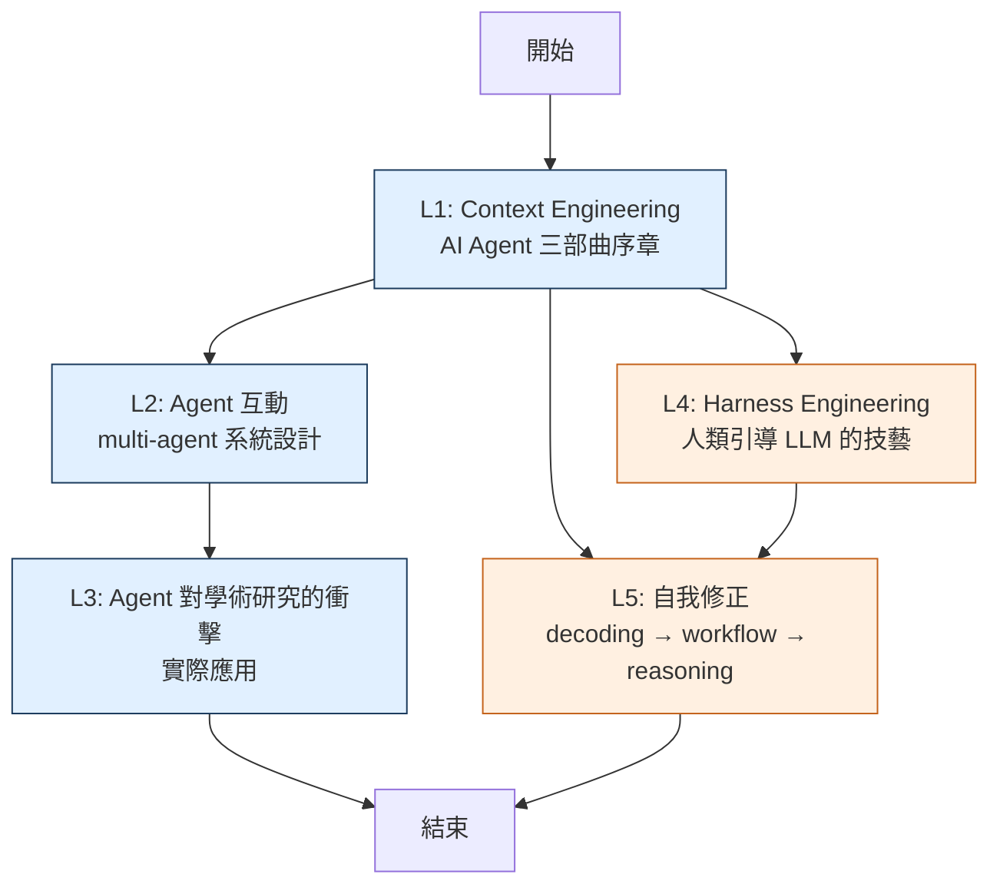

# 李宏毅 AI Agent + Harness Engineering + 自我修正 — 中文教科書級講義

> 改編自李宏毅教授（國立台灣大學電機系）2024-2025 年發布的 5 支 YouTube lecture。
> 本講義以**台灣醫學生**為讀者 persona 撰寫；技術術語以英文為主，醫院／臨床流程作為類比。

## 來源影片

| # | 標題 | 長度 | YouTube |
|---|---|---|---|
| 1 | AI Agent (1/3)：核心技術 Context Engineering 基本概念解說 | 53:05 | [urwDLyNa9FU](https://www.youtube.com/watch?v=urwDLyNa9FU) |
| 2 | AI Agent (2/3): AI Agent 之間可以有什麼樣的互動 | 22:28 | [mmPmNezjCi0](https://www.youtube.com/watch?v=mmPmNezjCi0) |
| 3 | AI Agent (3/3): AI Agent 對於工作帶來的衝擊 - 以學術研究為例 | 23:55 | [VqB8zMujdjM](https://www.youtube.com/watch?v=VqB8zMujdjM) |
| 4 | Harness Engineering：有時候語言模型不是不夠聰明，只是沒有人類好好引導 | 1:32:21 | [R6fZR_9kmIw](https://www.youtube.com/watch?v=R6fZR_9kmIw) |
| 5 | AI 能自我修正嗎？從 decoding、workflow 到 reasoning 的技術發展整理 | 1:27:42 | [m3i2mk5hs8U](https://www.youtube.com/watch?v=m3i2mk5hs8U) |

總長：約 5 小時。

---

## 學習路徑

**閱讀順序建議**：
- **AI Agent 三部曲（L1→L2→L3）必須循序讀**，L1 建立基礎概念、L2 拓展到多 agent、L3 落地應用。
- **L4（Harness）與 L5（自我修正）是延伸主題**，可在讀完 L1 之後跳讀，跟 AI Agent 系列互相補強而非銜接。

---

## 三種讀法

### 模式 A：一次讀完（5–7 小時）

按 1→2→3→4→5 順序讀。每集約 1 小時（含思考自測題），共 5–7 小時可完整吸收。

### 模式 B：分散式（一週 5 天）

每天 1 集，安排在通勤／空堂。週末做自測題回顧。

### 模式 C：類比優先（適合醫學生快速建立直覺）

跳過 §0–§4，先讀每集的 **§5 醫學類比**（住院醫師 ↔ AI Agent、handoff ↔ context、會診 ↔ tool use 等），有興趣再回頭補技術細節。

---

## Lecture 索引

| # | Lecture | 重點關鍵字 |
|---|---|---|
| 1 | [Context Engineering 基本概念](lectures/01_ai_agent_1_3_context_engineering.md) | context window、memory、tool use、agent loop |
| 2 | [AI Agent 之間的互動](lectures/02_ai_agent_2_3_ai_agent.md) | multi-agent、cooperation、negotiation、debate |
| 3 | [Agent 對工作的衝擊（學術研究）](lectures/03_ai_agent_3_3_ai_agent.md) | research agent、AI scientist、自動化研究 |
| 4 | [Harness Engineering（駕馭工程）](lectures/04_harness_engineering.md) | 馬具比喻、agents.md、planner/generator/evaluator、OpenCloud、Claude Code |
| 5 | [AI 能自我修正嗎](lectures/05_ai_decoding_workflow_reasoning.md) | self-correction、decoding、workflow、reasoning |

每集講義都包含：TL;DR、為什麼學、prerequisites、核心術語辭典、deep dive、**醫學類比**、Q&A、常見陷阱、10 題自測題、延伸資源。

---

## 製作流程

本講義透過自動化 pipeline 產出：

1. `gemini-2.5-pro` 直接觀看 YouTube 影片（不依賴 transcript）
2. 每集 2-pass：Part A（§0–§4，3500-5000 字）+ Part B（§5–§9，3500-5000 字）
3. `NotebookLM mega-notebook` 對每集抽 4 個事實做 cross-check（Phase F）
4. `pandoc + Chrome headless` 組成 PDF（含 mermaid 渲染）

完整 pipeline 設計見 `~/.claude/skills/youtube-playlist-to-textbook/SKILL.md`。本專案在通用 skill 之上加入 **gemini 直接讀影片** 的變體，跳過 yt-dlp transcript 環節。

---

## 授權與出處

- 影片內容版權屬李宏毅教授本人。本講義為**個人學習筆記**，非商業用途。
- 請勿轉載；如需引用，請直接附上原影片 YouTube 連結。
- 若任何技術描述有誤，以原影片為準。
