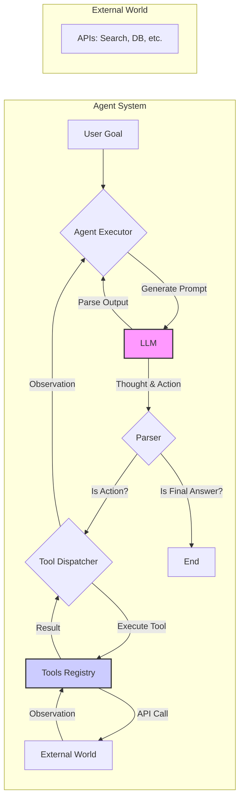

## §0. TL;DR（速覽）

- **一句話總結**：本堂課介紹 AI Agent 的核心概念，說明如何透過「Context Engineering」讓大型語言模型 (LLM) 擺脫靜態知識的束縛，能與外部工具互動、取得即時資訊並完成複雜任務。
- **Key Takeaways**:
    1.  **Agent 的本質**：AI Agent = 一個作為大腦的 LLM + 一套可供其使用的外部工具 (Tools)。
    2.  **Context Engineering 是關鍵**：LLM 的 context window 容量有限，必須透過有效的策略（如 RAG、ReAct）來管理、擷取、與更新這個「工作記憶區」，才能處理複雜的多步驟問題。
    3.  **從單純生成到「行動」**：Agent 的典範轉移是讓 LLM 不只會「說」，還要能「做」。它會生成稱為 `thought` 的思考鏈，並根據 `thought` 決定要採取哪個 `action` (通常是呼叫 API)。
    4.  **ReAct 框架**：由 `Reasoning` (思考) 和 `Acting` (行動) 組成的循環，是當前許多 Agent 系統的基礎架構。模型會不斷在「思考下一步」和「執行工具」之間循環，直到任務完成。

---

## §1. Motivation（為什麼要這堂課）

自從 ChatGPT 問世以來，大型語言模型 (Large Language Models, LLMs) 的能力震驚了世界。我們似乎只要透過 `prompting`（提示），就能讓它生成文章、寫程式、甚至回答醫學知識。然而，如果你在臨床工作或研究中實際使用過這些模型，很快就會發現它們的根本限制。

想像一個情境：你想用 LLM 協助寫一篇關於台灣最新 COVID-19 治療指引的綜述。你滿懷信心地問 GPT-4：「請總結台灣 2026 年最新的 COVID-19 抗病毒藥物使用建議。」模型可能會給你一個看似完美的答案，引用了各種藥物和劑量。但問題來了：它的訓練資料只到 2023 年。它給你的「最新」資訊，其實是三年前的舊聞。更糟的是，它可能會自信地「創造」出不存在的指引，這種現象稱為 `hallucination`（幻覺）。

這凸顯了單純的 LLM 的兩大痛點：
1.  **知識靜態 (Static Knowledge)**：模型一旦訓練完成，其內部知識就被凍結在過去的某個時間點。它不知道昨天發表的新論文，也不知道今天你值班時遇到的那個罕見病例。
2.  **缺乏行動能力 (Lack of Action)**：LLM 是一個「語言」模型，它的唯一功能是「生成下一個 token」。它無法主動上網查詢疾管署網站、無法讀取你電腦上的 PDF 檔案、也無法操作醫院的 PACS 系統來調閱影像。它是一個被關在數位瓶子裡的天才，無法與瓶外的真實世界互動。

為了解決這些問題，我們需要一個新的典範：**AI Agent**。

Agent 的核心思想，就是不把 LLM 當作一個萬事通的「資料庫」，而是把它當作一個會思考、能推理的「大腦」。我們給這個大腦接上「手」和「腳」——也就是各種外部工具（APIs）。想知道最新資訊？給它一個 Google Search API。想計算藥物劑量？給它一個計算機 API。想讀取病歷資料？給它一個能連接醫院資料庫的 API（當然，這需要極高的權限與安全控管）。

於是，與 LLM 的互動方式從單向的「問與答」，演變成雙向的「協作」。你給 Agent 一個目標（goal），例如：「幫我查一下病人王小明（病歷號 12345）最新的腎功能指數 (creatinine)，並根據 Cockcroft-Gault 公式計算他使用 vancomycin 的建議起始劑量。」

一個訓練有素的 Agent 會將這個複雜任務拆解成一系列步驟：
1.  **思考**：`我需要病人的年齡、體重和最新的 creatinine 數值。`
2.  **行動**：`呼叫醫院 LIS 系統的 API，查詢病歷號 12345 的資料。`
3.  **觀察**：`API 回傳：{ age: 75, weight: 60kg, creatinine: 1.8 mg/dL }。`
4.  **思考**：`資料齊了，現在我需要執行計算。`
5.  **行動**：`呼叫計算機 API，執行 (140 - 75) * 60 / (72 * 1.8)。`
6.  **觀察**：`API 回傳：25.7 mL/min。`
7.  **思考**：`腎功能不佳，應使用腎功能調整劑量。`
8.  **行動**：`查詢內建的藥物資料庫 API，尋找 vancomycin 在 CrCl < 30 mL/min 時的建議劑量。`
9.  **觀察**：`API 回傳：起始劑量 1g，之後每 24-48 小時監測血中濃度。`
10. **思考**：`任務完成，可以總結答案了。`
11. **最終答案**：根據病患資料，其腎絲球過濾率估計為 25.7 mL/min，建議...

這整個過程，就是本系列課程要探討的核心。而串起這一切的關鍵技術，就是 **Context Engineering**——如何巧妙地設計與維護 LLM 的「工作記憶」，讓它在這一連串的思考、行動、觀察循環中，不會迷失方向。這堂課，我們將打開 AI Agent 的黑盒子，從最基本的概念開始，建構一個真正能解決問題的智慧代理人。

---

## §2. 背景知識補完（Prerequisites）

在我們深入 AI Agent 的世界之前，讓我們先確保對幾個 foundational concepts 有共同的理解。這些是你可能聽過、但不一定熟悉的術語，它們是構成 Agent 系統的基石。

1.  **Large Language Model (LLM, 大型語言模型)**
    - **嚴謹定義**: 一種基於 `Transformer` 架構、在極大規模文本資料上進行預訓練 (pre-trained) 的深度學習模型。其核心能力是根據給定的 `context`（上下文）文本，預測下一個最有可能出現的 `token`（詞元）。
    - **白話版**: 你可以把 LLM 想像成一個超強的「文字接龍」大師。它讀了網路上幾乎所有的書、文章、網頁，學會了人類語言的文法、語氣、事實和推理模式。當你給它一句話（`prompt`），它做的並不是「理解」你的問題，而是「計算」出接下來最該接哪個字，然後一個字一個字地把回答「生」出來。
    - **本堂課為何需要**: LLM 是 AI Agent 的「大腦」或「中央處理器 (CPU)」。所有的 `reasoning`（推理）、`planning`（規劃）、以及決定要使用哪個 `tool`（工具）的決策，都是由 LLM 在其內部完成的。我們不重新發明輪子，而是利用現成 LLM 強大的語言和推理能力作為起點。

2.  **Prompt Engineering (提示工程)**
    - **嚴謹定義**: 設計和優化輸入文本（`prompt`），以引導 LLM 生成更準確、更相關、或更符合特定格式的輸出的技術。
    - **白話版**: 跟 LLM 溝通就像跟一個有點固執但學識淵博的實習醫師說話。你不能只說「病人不舒服」，而是要給他具體的指令：「請幫我 summary 這位 65 歲男性，過去有糖尿病史，主訴胸痛 3 小時的病史，並列出 3 個鑑別診斷。」`Prompt Engineering` 就是學習如何下達清晰、具體、有效的指令，讓 LLM 這個「實習醫師」能精準地完成你交辦的任務。
    - **本堂課為何需要**: 在 Agent 系統中，`prompt` 不再是只有使用者輸入的初始問題。系統本身會動態生成一系列的 `prompt`，將工具的執行結果、過去的思考步驟等資訊，不斷地餵回給 LLM，引導它進行下一步。可以說，整個 Agent 的運作，就是一個自動化的、持續進行的 `Prompt Engineering` 過程。

3.  **Fine-tuning (微調)**
    - **嚴謹定義**: 在一個已經過預訓練的 LLM 基礎上，使用一個特定領域、較小規模的資料集，繼續進行模型訓練，以使模型的行為或知識更適應該特定任務。
    - **白話版**: `Pre-training` 就像是醫學生的通識教育加上基礎醫學，學了很多廣泛但未必專精的知識。`Fine-tuning` 則像是專科醫師訓練。例如，你想讓一個通用 LLM 變得擅長寫病歷，你就拿數千篇高品質的病歷當作「教材」，讓它在這些範例上繼續學習，它就會模仿這些病歷的風格、術語和格式。
    - **本堂課為何需要**: 雖然本堂課的重點是透過 `Context Engineering` 來擴充 LLM 的能力，但 `Fine-tuning` 仍然是一個重要的選項。例如，我們可以 `fine-tune` 一個模型，讓它更擅長「理解何時該使用工具」以及「如何生成正確的 API 呼叫語法」。`Fine-tuning` 和 `Context Engineering` 並非互斥，而是可以相輔相成的兩種策略。

4.  **API (Application Programming Interface, 應用程式介面)**
    - **嚴謹定義**: 一組預先定義的規則、協定和工具，允許不同的軟體應用程式之間互相溝通和交換資料。
    - **白話版**: 你可以把 API 想像成醫院各部門之間傳遞訊息的「會診單」或「檢驗單」。當醫師（一個應用程式）需要放射科（另一個應用程式）的影像報告時，他不用知道 PACS 系統內部是如何運作的，他只需要填寫一張標準格式的申請單（呼叫 API），寫上病人資訊和要查的項目，然後傳過去。放射科系統收到這張「訂單」後，就會處理好，並用標準格式回傳報告（API response）。
    - **本堂課為何需要**: API 是 Agent 的「手」和「腳」。Agent 與外部世界的一切互動，都是透過呼叫 API 來完成的。無論是上網搜尋、查資料庫、執行計算，每一個「行動」都對應到一次 API 呼叫。因此，定義好一組強大而可靠的 API，是建構一個有效 Agent 的先決條件。

---

## §3. 核心概念辭典（Core Concepts Glossary）

這堂課我們將正式進入 AI Agent 的世界，以下是本堂引入的幾個核心術語。

1.  **Agent (代理人)**
    - **嚴謹定義**: 一個具備感知 (perceive) 環境、透過決策 (decide) 產生行動 (act)、並以達成特定目標 (goal) 為導向的計算實體。在 LLM 的脈絡下，特指以 LLM 為核心，能夠使用外部工具來完成任務的系統。
    - **白話重述**: Agent = LLM 大腦 + Tools 手腳。它不再只是一個被動的問答機器，而是一個能自主規劃、執行、並根據結果調整策略的「數位員工」。你給它一個目標，它會自己想辦法搞定，過程中可能會上網查資料、算數學、讀檔案，就像一個真的人類助理。
    - **常見誤解**:
        - **Agent 不是一個更大的模型**: Agent 不是透過把模型訓練得更大才變聰明，而是透過「架構」的創新，讓既有的模型能與外部世界互動。
        - **Agent 不等於 Chatbot**: Chatbot 主要圍繞對話，而 Agent 則專注於「完成任務」。對話只是它與使用者或工具互動的其中一種形式。

2.  **Context (上下文)**
    - **嚴謹定義**: 在 LLM 中，指模型在生成下一個 `token` 時所能參考的所有輸入文本。它有固定的長度上限，稱為 `Context Window` 或 `Context Length`。
    - **白話重述**: `Context` 就是 LLM 的「短期記憶」或「工作記憶區 (working memory)」。所有你給它的指令、它過去的思考、它從工具得到的觀察，都必須塞進這個記憶區，它才知道當下該做什麼。但這個記憶是有限的，就像人腦沒辦法同時記住 100 件事情。如果資訊太多，就必須忘掉一些舊的，才能塞進新的。
    - **相近概念區辨**:
        - **Context vs. 模型的內在知識**: 模型的內在知識是透過 `pre-training` 烙印在神經網路權重中的長期記憶，是靜態的。`Context` 則是每次互動時動態載入的短期記憶，是動態的。Agent 的威力就來自於用動態的 `Context` 來彌補靜態長期記憶的不足。

3.  **Context Engineering (上下文工程)**
    - **嚴謹定義**: 設計用來管理 LLM `Context` 的策略與架構，以克服 `Context Window` 的長度限制，並有效地為模型提供執行任務所需的即時、相關資訊。
    - **白話重述**: 這就是這堂課的精髓。既然 LLM 的短期記憶有限，我們就要當一個高效的「記憶管理師」。`Context Engineering` 包含了一系列技術，決定哪些資訊「最重要」，應該被放進記憶區；哪些資訊可以暫時存到「外部筆記本」（例如向量資料庫）；以及如何將這些資訊「摘要」或「壓縮」，用最少的字數表達最多的意義。
    - **常見誤解**: `Context Engineering` 不只是 `Prompt Engineering`。`Prompt Engineering` 專注於「單次」輸入的優化，而 `Context Engineering` 則專注於在「多步驟、長週期」的任務中，如何持續維護 `Context` 的一致性與效率。

4.  **Tool / Function Calling (工具／函數呼叫)**
    - **嚴謹定義**: 賦予 LLM 一種特殊能力，讓它可以在其生成內容中，輸出一種結構化的指令，用以觸發外部世界的特定 API 或函數。
    - **白話重述**: 這是讓 Agent 從「說」到「做」的關鍵。我們告訴 LLM：「你現在不只會講話，你還學會了幾個『咒語』。當你念出『`calculator(2+2)`』這個咒語時，系統就會自動幫你算出結果是 4，然後把 4 告訴你。」LLM 會在 `reasoning` 後，判斷當下最適合念哪個「咒語」，來獲取它需要的資訊。現在的 OpenAI API 甚至有內建的 `Function Calling` 模式，讓這件事變得更簡單。
    - **常見誤解**: LLM 本身並不會「執行」程式碼。它只是「生成」一段代表要執行某個函數的「字串」，真正的執行是由 Agent 系統的其他部分（`Executor`）來完成的。

5.  **Reasoning (推理)**
    - **嚴謹定義**: LLM 為了達成目標而進行的中間思考過程。這個過程通常被明確地引導生成為文字，以便於除錯、引導，以及讓模型進行自我反思。
    - **白話重述**: 在 Agent 中，我們不希望 LLM 直接給出答案，而是希望它「想出聲來 (think out loud)」。我們會要求它先把它的「內心戲」寫下來，這段內心戲就是 `Reasoning` 或 `thought`。例如：「使用者要我查藥物劑量，我得先知道病人的腎功能，所以我應該先去查病歷。」把這段思考過程明確地寫出來，一來讓開發者知道它在想什麼，二來也成為 `Context` 的一部分，幫助它自己整理思緒。
    - **相近概念區辨**: `Chain-of-Thought (CoT)` 是 `Reasoning` 的一種早期形式，它指的是透過在 `prompt` 中給予「一步一步想」的範例（`few-shot`），來誘導模型在回答問題時也採用類似的分解步驟。在 Agent 中，`Reasoning` 則是一個更廣泛的概念，是整個行動循環的核心驅動力。

6.  **ReAct (Reason + Act)**
    - **嚴謹定義**: 一種結合 `Reasoning` 和 `Acting` 的 Agent 框架，由 Yao et al. 在 2022 年的論文《ReAct: Synergizing Reasoning and Acting in Language Models》中提出。模型在此框架下，會交錯生成 `thought`（思考）和 `action`（行動）來完成任務。
    - **白話重述**: 這是一個非常有影響力的 Agent 行為模式。你可以想像成一個人在廚房裡做菜，他會不斷地在「思考」和「動手」之間切換：
        - `Thought`: 我要做番茄炒蛋，食譜說要先打蛋。
        - `Action`: (拿起雞蛋和碗，開始打蛋)。
        - `Observation`: 蛋已經在碗裡了。
        - `Thought`: 接下來要切番茄。
        - `Action`: (拿起番茄和刀，開始切)。
        - `Observation`: 番茄切好了。
        `ReAct` 就是把這個模式套用在 LLM 上，讓它在 `Thought` -> `Action` -> `Observation` 的循環中，一步步地逼近最終目標。

---

## §4. System / Paper Deep Dive

現在，讓我們來深入剖析一個基礎但完整的 AI Agent 系統是如何運作的。我們將以 `ReAct` 框架為藍本，因為它是許多現代 Agent 的核心思想。

### 4.1 Architecture

一個典型的 `ReAct`-based Agent 系統可以被描繪成一個循環流程。這個流程的核心是一個稱為 `Agent Executor` 的控制器，它負責協調 LLM 和外部工具之間的互動。



**元件說明**:
- **User Goal**: 使用者輸入的初始任務，例如「今天台北天氣如何？適合穿短袖嗎？」
- **Agent Executor**: 整個系統的總指揮。它負責維護 `Context`（又稱 `scratchpad` 或 `memory`），將歷史紀錄、工具回傳的 `Observation`、以及下一步的指令組合成一個完整的 `prompt`，然後送給 LLM。
- **LLM**: Agent 的大腦。它接收 `Agent Executor` 組裝好的 `prompt`，並生成包含 `Thought` 和 `Action` 的文本。
- **Parser**: 一個解析器，負責剖析 LLM 的輸出。它判斷 LLM 是想繼續思考、呼叫工具，還是已經準備好給出最終答案。
- **Tool Dispatcher / Registry**: 工具箱的管理員。當 `Parser` 辨識出一個 `Action`（例如 `search('台北天氣')`），`Dispatcher` 就會從 `Registry` 中找到對應的工具並執行它。
- **External World**: 泛指所有外部 API 和服務，例如 Google 搜尋引擎、醫院的資料庫、公司的知識庫等。

### 4.2 關鍵演算法

`Agent Executor` 的核心邏輯可以用一段偽程式碼來表示。這段程式碼驅動了整個 `Thought -> Action -> Observation` 循環。

```python
# A simplified pseudo-code for the ReAct agent loop

def agent_executor(user_goal: str, tools: list):
    # Initialize the scratchpad (short-term memory) with the user's goal
    scratchpad = f"User goal: {user_goal}\n"
    
    # Set a limit to prevent infinite loops
    max_turns = 10
    
    for i in range(max_turns):
        # 1. Construct the prompt for the LLM
        prompt = construct_react_prompt(scratchpad, tools)
        
        # 2. Call the LLM to get the next thought and action
        # The LLM is expected to generate text like:
        # "Thought: I need to find the weather in Taipei.
        #  Action: search('台北天氣')"
        llm_output = llm.generate(prompt)
        
        # 3. Parse the LLM's output
        thought, action, action_input = parse_react_output(llm_output)
        
        # Append the thought to the scratchpad
        scratchpad += f"Thought: {thought}\n"
        
        if action == "Final Answer":
            # If the LLM believes it's done, return the answer
            return action_input
        
        # 4. Execute the chosen action (tool)
        # The 'execute_tool' function finds the right tool and runs it
        observation = execute_tool(tools, action, action_input)
        
        # 5. Append the action and observation to the scratchpad
        # This completes one turn of the loop
        scratchpad += f"Action: {action}('{action_input}')\n"
        scratchpad += f"Observation: {observation}\n"
        
    # If the loop finishes without a final answer, return an error
    return "Agent stopped: Maximum number of turns reached."

```

**為何這樣寫**:
- **`scratchpad`**: 這是 `Context Engineering` 的核心實踐。每一次循環，我們都把新的 `Thought`、`Action` 和 `Observation` 附加到 `scratchpad` 上。這樣，在下一次呼叫 LLM 時，它就能「記得」之前發生了什麼事，從而做出連貫的決策。
- **`max_turns`**: 這是一個重要的安全機制。Agent 有時會陷入無窮迴圈（例如，不斷重複同一個無效的查詢）。設定一個最大回合數可以防止它失控，耗盡資源。
- **`Action: Final Answer`**: 我們需要定義一個特殊的 `Action`，讓 LLM 在認為任務完成時可以發出這個信號。`Parser` 偵測到這個信號後，就知道該結束循環，並將後面的文字作為最終結果回傳給使用者。

### 4.3 關鍵 Data Structure

`scratchpad` 的內容，也就是 `Context`，是 Agent 的生命線。它的結構通常是一個不斷增長的純文字字串，格式經過精心設計，以便 LLM 能夠輕易地解析。

| 元素類型 | 格式範例 | 說明 |
| :--- | :--- | :--- |
| **Goal** | `User goal: ...` | 任務的初始定義，只在最開頭出現一次。 |
| **Thought** | `Thought: I need to... Then I will...` | LLM 的內心獨白。它在此規劃策略、反思上一步的結果。 |
| **Action** | `Action: search('query')` | LLM 決定要執行的工具及其輸入參數。格式必須非常嚴格，以便 `Parser` 能正確解析。 |
| **Observation**| `Observation: Page content is...` | `Executor` 執行 `Action` 後，從外部世界帶回來的結果。 |

### 4.4 Walkthrough

讓我們透過兩個情境，來走一遍 Agent 的完整生命週期。

#### 情境一：正常運作

**User Goal**: "蘋果公司的創辦人是誰？他的出生年份是？"

1.  **Turn 1**:
    - **`scratchpad`**: `User goal: 蘋果公司的創辦人是誰？他的出生年份是？`
    - **LLM Prompt**: (包含 `scratchpad` 和工具列表 `[search, calculator]`)
    - **LLM Output**: `Thought: 我需要先找出蘋果公司的創辦人。我可以使用 search 工具。 Action: search('蘋果公司創辦人')`
    - **`Executor`**: 呼叫 `search` API。
    - **`Observation`**: `蘋果公司的創辦人是史蒂夫·賈伯斯（Steve Jobs）、史蒂夫·沃茲尼克（Steve Wozniak）和羅納德·韋恩（Ronald Wayne）。`
    - **`scratchpad` 更新**: `... Thought: ... Action: ... Observation: 蘋果公司的創辦人是...`

2.  **Turn 2**:
    - **LLM Prompt**: (包含 Turn 1 的完整 `scratchpad`)
    - **LLM Output**: `Thought: 我找到了創辦人，但問題還問了賈伯斯的出生年份。我需要針對 Steve Jobs 進行更精確的搜尋。 Action: search('Steve Jobs 出生年份')`
    - **`Executor`**: 呼叫 `search` API。
    - **`Observation`**: `史蒂夫·賈伯斯（Steve Jobs），出生於 1955 年 2 月 24 日。`
    - **`scratchpad` 更新**: `... Observation: ... Thought: ... Action: ... Observation: 史蒂夫·賈伯斯... 1955 年...`

3.  **Turn 3**:
    - **LLM Prompt**: (包含 Turn 1 & 2 的完整 `scratchpad`)
    - **LLM Output**: `Thought: 我已經找到了所有需要的資訊：創辦人有多位，其中最主要的是 Steve Jobs，他的出生年份是 1955。我可以總結答案了。 Action: Final Answer('蘋果公司的主要創辦人是史蒂夫·賈伯斯，他的出生年份是 1955 年。其他創辦人還包括史蒂夫·沃茲尼克和羅納德·韋恩。')`
    - **`Executor`**: `Parser` 偵測到 `Final Answer`，循環結束，回傳最終答案。

#### 情境二：異常處理（工具失敗）

**User Goal**: "幫我查病歷號 99999 的白血球數量。" (假設此病歷號不存在)

1.  **Turn 1**:
    - **`scratchpad`**: `User goal: 幫我查病歷號 99999 的白血球數量。`
    - **LLM Prompt**: (包含 `scratchpad` 和工具列表 `[query_emr]`)
    - **LLM Output**: `Thought: 我需要使用電子病歷查詢工具來獲取資訊。 Action: query_emr(patient_id='99999', field='wbc')`
    - **`Executor`**: 呼叫 `query_emr` API。API 查詢資料庫後，回傳一個錯誤。
    - **`Observation`**: `Error: Patient ID '99999' not found in the system.`
    - **`scratchpad` 更新**: `... Action: ... Observation: Error: Patient ID '99999' not found...`

2.  **Turn 2**:
    - **LLM Prompt**: (包含 Turn 1 的完整 `scratchpad`，其中含有錯誤訊息)
    - **LLM Output**: `Thought: 上一個動作失敗了，因為找不到病歷號。這表示使用者給我的病歷號可能是錯的，或者病人不存在。我無法繼續執行任務，應該把這個錯誤回報給使用者。 Action: Final Answer('查詢失敗：系統中找不到病歷號為 99999 的病人。請確認病歷號是否正確。')`
    - **`Executor`**: `Parser` 偵測到 `Final Answer`，循環結束，回傳有幫助的錯誤訊息給使用者。

這個「從錯誤中復原並給出有用回饋」的能力，是 Agent 相較於單純 `prompt-response` 模式的重大優勢。它透過 `Thought -> Action -> Observation` 的循環，實現了初步的試錯 (trial and error) 和自我修正 (self-correction)。

## §5. 真實類比（★ 讀者背景特化）

在這一節，我們將 AI Agent 的核心概念，透過三組與臨床工作高度相關的類比，轉化為醫學系學生能深層共鳴的直覺。我們的目標是，當你下次在醫院看到類似的資訊流程時，腦中能自動浮現對應的 AI Agent 設計模式。

### 類比一：AI Agent 的決策核心 ↔︎ 值班 Intern/R 與 Attending 的合作模式

**類比情境描述：**
凌晨三點，你是在內科病房值班的 Intern（實習醫師）。一位 68 歲、有心衰竭病史的阿伯，因為肺炎住院，突然喘起來，血氧掉到 90%。你手邊有整個病歷系統（EMR）、護理站的生命徵象紀錄、以及 call 總醫師（CR）或主治醫師（Attending）的權力。你不能事事都 call attending，會被罵；但也不能獨自亂做決定，病人會出事。你的任務是：在授權範圍內，用手邊的「工具」（開立醫囑、安排檢查、給予藥物），穩定病人情況，並在必要時「向上呈報」。這個場景，完美對應了 AI Agent、LLM、以及外部工具（Tools）之間的協作關係。

**對應關係表：**

| AI/ML 系統概念 | 臨床工作場景元件 |
| :--- | :--- |
| **AI Agent** | **值班 Intern 或 Resident (R1)** |
| **核心 LLM (如 GPT-4)** | **Attending V.S. (主治醫師)** |
| **Task / Goal** | **要解決的臨床問題（"阿伯喘")** |
| **Context** | **腦中的短期記憶 + 病歷摘要 (I-PASS)** |
| **Tool Use** | **開立醫囑、安排檢查、會診 (Consult)** |
| **Tool Output** | **檢驗報告、X光影像、會診單回覆** |
| **Self-correction** | **發現初步處置無效，改變治療策略** |

**✅ 吻合之處（為何類比有效）：**

這個類比最貼切的核心在於「**決策權的層級與自主性**」。Intern (Agent) 擁有一定的自主權，可以處理常規任務，例如根據 protocol 開立 stat KUB 來評估腸阻塞、或給予退燒藥。這就像 Agent 使用確定性高、功能單一的 tool。然而，當遇到複雜或高風險情境時——比如病人血壓不穩、是否要插管——Intern 的首要職責不是自己做最終決定，而是**整理好資訊、提出自己的評估與計畫 (assessment and plan)，然後去 call attending (LLM)**。

Attending (LLM) 擁有最深厚的知識與經驗，他會根據 Intern 提供的 context（例如 "VS: 88/50, HR 130, SpO2 88% with O2 mask 10L/min, 聽診 bilateral crackles..."）來進行**高階推理**，然後下達一個指令，例如："Okay, prepare for intubation, and give a fluid challenge with Normal Saline 500mL run in 30 mins, call me when you are ready."。Intern (Agent) 接收到這個指令後，再去執行具體的 actions (tool use)，例如開立醫囑、備妥插管用物。整個過程體現了 Agent 作為執行者，而 LLM 作為思考核心的合作模式。

**⚠️ 不吻合之處（類比邊界，避免誤導）：**

1.  **學習與更新機制**：Attending 會從每個案例中學習，並將經驗內化，這個「學習」是持續且深刻的。目前的 AI Agent，其核心 LLM 的「知識」是凍結在某個時間點的。Agent 在任務中透過 self-correction 實現的「學習」，更像是把「這次做錯了」的紀錄寫在交班單上提醒自己，而不是真正更新了腦中的醫學知識。這稱為 in-context learning，與醫師的經驗累積（模型權重更新）在根本上是不同的。
2.  **責任歸屬**：在醫療上，最終的法律與倫理責任清晰地落在 Attending 身上。但在 AI 系統中，如果 Agent 出錯導致損失，責任歸屬是目前仍在激烈討論的開放問題。是歸於開發 Agent 的工程師、提供 LLM 的公司、還是操作 Agent 的使用者？這遠比醫療場域模糊。
3.  **溝通的模糊性**：Intern 和 Attending 之間的溝通充滿了潛台詞、經驗和信任。Attending 可能會根據他對某個 Intern能力的了解，而給出不同詳細程度的指令。AI Agent 與 LLM 之間的溝通（prompting）則需要極度的精確與結構化，任何模糊性都可能導致災難性的錯誤。

### 類比二：Context Engineering ↔︎ 病歷撰寫與交班 (Handoff)

**類比情境描述：**
一位病人已經住院三週，他的 EMR 中累積了上百筆 progress notes、數十張影像報告、以及數百個 lab data。你現在是即將接班的醫師，需要在短短五分鐘內，從交班者口中和他的交班小抄（I-PASS 或 SOAP note）中，快速掌握病人的狀況與今晚的 to-do list。這個「交班」的過程，就是一種高超的 Context Engineering。你不可能、也不需要知道病人三週前的每一筆資料；你需要的是一個經過**摘要、過濾、並為當前任務（安全渡過今晚）而優化**的資訊包。

**對應關係表：**

| AI/ML 系統概念 | 臨床工作場景元件 |
| :--- | :--- |
| **Context Window** | **接班醫師的短期工作記憶 (Working Memory)** |
| **Context Engineering** | **撰寫 Progress Note (SOAP) / 交班 (I-PASS)** |
| **Full Conversation History** | **完整的 EMR 電子病歷** |
| **Context Compression** | **寫 Summary Note / 將三天份的資料濃縮成一段話** |
| **Retrieval (RAG)** | **被問到特定問題時，回去翻 EMR 查某個報告** |
| **"Garbage In, Garbage Out"** | **交班者給了錯誤或不重要的資訊，導致接班者誤判** |

**✅ 吻合之處（為何類比有效）：**

這個類比的精髓在於「**資訊的價值取決於任務**」。一份完美的交班單 (好的 context) 不在於鉅細靡遺，而在於它能讓接班者做出正確的下一個決策。一個好的 SOAP note 會把最重要的「主觀陳述 (S)」、最關鍵的「客觀數據 (O)」、最核心的「評估 (A)」、以及最緊急的「計畫 (P)」放在最前面。這完全對應了 context engineering 的核心思想：將最重要的資訊（例如系統指令、工具列表、關鍵的歷史紀錄）放在 context 的特定位置（通常是開頭或結尾），以引導 LLM 的注意力。

當我們使用 RAG (Retrieval-Augmented Generation) 時，就像接班醫師聽到交班者提到「病人今天下午有 complain a new headache」，他腦中會觸發一個檢索動作：「讓我查一下 head CT 的報告出來了嗎？」他不會去查腳踝的 X-光片。這精準地對應了 RAG 如何根據當前的 query，從龐大的知識庫（整個 EMR）中，只提取最相關的一小部分文件（CT 報告）並放入當前的 context（短期記憶）中。

**⚠️ 不吻合之處（類比邊界，避免誤導）：**

1.  **摘要的智慧層次**：一位有經驗的醫師在寫 summary 時，會進行深度的臨床推理，他可能會注意到某個看似無關的 lab data 其實是解開謎團的關鍵。目前 LLM 進行的 context compression，雖然技巧越來越高明，但多半仍是基於語義相似性或模式匹配，缺乏真正的臨床洞見。它可能會因為「不常出現」而丟棄一個罕見但關鍵的線索。
2.  **互動式澄清**：在交班時，接班者可以隨時打斷並提問：「等等，你說的那個 a new headache，是哪種痛？有 aphasia 或 auras 嗎？」這種即時的、互動式的 context 澄清與豐富化，是目前單向傳遞 prompt 的 AI Agent 較難做到的。雖然有些 agentic design 試圖模擬這種 "self-questioning"，但其流暢度與效率仍遠不及人類。
3.  **結構化 vs. 非結構化**：雖然 I-PASS 試圖將交班結構化，但大量的臨床資訊仍然是以非結構化的自然語言形式存在於 progress note 中。醫師在閱讀時，大腦能輕易地在結構化數據（Lab values）和非結構化敘述之間跳躍、整合。Context Engineering 仍在努力解決如何最有效地融合這兩種資訊，以餵給 LLM。

### 類比三：Tool Use & Self-Correction ↔︎ 臨床會診與 M&M Conference

**類比情境描述：**
你手邊有一個困難的腎臟科病人，creatinine 不斷攀升，你用盡了標準武器（停用腎毒性藥物、補水...）卻不見起色。你知道自己的知識有極限，於是你開了一張腎臟科的會診單 (consultation sheet)，請求專家支援。這就是 "Tool Use"。腎臟科醫師（Tool）回覆了會診，建議做腎臟切片。幾天後，你發現當初如果早一天會診，或許能更早介入，避免病人洗腎。於是在科內的 M&M (Morbidity and Mortality) 會議上，這個案例被提出來檢討，科內據此修訂了「困難急性腎損傷」的會診標準。這就是 "Self-correction"。

**對應關係表：**

| AI/ML 系統概念 | 臨床工作場景元件 |
| :--- | :--- |
| **Tool Definition** | **會診單的格式與必填欄位** |
| **Tool Calling** | **開立 (issue) 一張會診單給特定科別** |
| **Tool's Input (Arguments)** | **會診單上寫的 "Reason for consult" & 病人資料** |
| **Tool's Output** | **會診科別的回覆與建議** |
| **Knowing when to use a tool** | **臨床醫師判斷「這超出我能處理的範圍了」** |
| **Self-correction loop** | **M&M 會議 / 根本原因分析 (Root Cause Analysis)** |
| **Updating the system prompt** | **根據 M&M 結論，修訂科內的臨床路徑 (Clinical Pathway)** |

**✅ 吻合之處（為何類比有效）：**

這個類比的重點在於「**系統的擴展性與學習能力**」。一個醫師的強大，不在於他什麼都懂，而在於他清楚地知道自己的極限，並且知道「該 call 誰、以及如何清楚地把問題問對」。這完美詮釋了 Tool Use 的本質：Agent (LLM) 不需要內建所有功能，它只需要學會如何「描述問題」並「呼叫專家（Tool）」。會診單上精確的欄位（如 `patient_id`, `reason_for_consult`）就如同 tool 的 function arguments，格式錯誤或資訊不全的會診單會被退件，如同 API call a `400 Bad Request` error。

M&M 會議則是 self-correction 機制的絕佳體現。它是一個離線的、深度的反思過程。會議的結論（例如：「未來遇到 creatinine > 2.5 且 24 小時內無改善，應立即會診腎臟科」）會變成科部的新 protocol。這就好像我們分析了 Agent 的失敗日誌後，去修改它的 System Prompt，加入一條新的指令：「If the user's request involves financial transactions and the amount exceeds $1000, ALWAYS use the `human_approval` tool before executing the trade.」這個過程讓整個「系統」（無論是科部還是 Agent）變得更安全、更聰明。

**⚠️ 不吻合之處（類比邊界，避免誤導）：**

1.  **學習迴圈的速度**：M&M 會議通常是每月一次，是一個緩慢、高成本的學習過程。理想的 AI Agent self-correction 應該是即時的、發生在單次任務執行中的。例如，Agent 呼叫 tool A 失敗，它應該能立即分析失敗原因，然後嘗試呼叫 tool B，而不是等著「下個月開會檢討」。
2.  **工具的發現 (Tool Discovery)**：在醫院，我們有一份明確的「科別列表」，知道有哪些專家可以 call。但對於 AI Agent 來說，如何動態地發現、理解並學會使用一個全新的、從未見過的 tool，是一個更進階的挑戰。這比較像是醫院突然成立了一個前所未有的「AI 整合診斷科」，而你必須自己摸索該如何與他們合作。
3.  **情感與文化因素**：M&M 會議充滿了複雜的人際互動、心理防衛機制和組織文化。檢討錯誤往往伴隨著巨大的心理壓力。AI Agent 的 self-correction 則是純粹理性的、基於錯誤日誌的邏輯分析，完全沒有這些「人性」的包袱，這使得它的改進過程可以更客觀、更迅速。

## §6. 教授特別強調的觀念釐清

這堂課雖然是 monologue 形式，但李宏毅教授在講解過程中，點出了許多初學者（甚至有經驗的工程師）在設計 AI Agent 時容易搞混的觀念。這裡我們將這些關鍵點，整理成讀者可能會問的 Q&A 形式，幫助你釐清思緒。

**Q1**: 所謂的「AI Agent」，聽起來不就是一個比較 fancy 的 `if-else` 腳本，根據關鍵字去呼叫不同的 API (Tool) 嗎？它跟我們醫院資訊系統 (HIS) 裡的那些臨床決策支援系統 (CDSS) 有什麼本質不同？
**A**: 這是一個非常好的問題，也是最常見的誤解之一。傳統的 CDSS 或 `if-else` 腳本是**基於規則 (rule-based)** 的。你必須事先寫好所有可能的條件分支，例如 `if creatinine > 1.5 and patient_on_gentamicin then show_alert("Warning: Nephrotoxic drug")`。它只能處理你預想過的情況。AI Agent 的核心驅動力是 LLM，它是**基於推理 (reasoning-based)** 的。你不需要告訴它所有規則，你只需要給它一個目標（例如：「幫我規劃這位病人的出院計畫」）和一組可用的工具（例如 `get_lab_data`, `get_medication_history`, `generate_discharge_summary_template`）。Agent 會利用 LLM 的常識和推理能力，自己「想」出一個步驟，例如：1. 先用 `get_medication_history` 看看目前用藥。2. 再用 `get_lab_data` 檢查腎功能指數是否穩定。3. 最後綜合資訊，呼叫 `generate_discharge_summary_template`。這種**動態規劃與執行**的能力，是它與傳統寫死的腳本最大的區別。

**Q2**: 影片提到要給 LLM 一個很長的 "prompt"，裡面包含了對話歷史、工具定義等等。如果我的應用需要處理非常長的對話，或是病人有幾十年的病史，這個 prompt 不就會無限增長，最後超過 token 限制嗎？
**A**: 完全正確，這正是 "Context Engineering" 要解決的核心問題。我們不能天真地把所有歷史紀錄都塞進 prompt。這就像醫師查房，你不會從病人出生開始報告。實務上有幾種策略：
1.  **滑動視窗 (Sliding Window)**：只保留最近的 N 次對話紀錄。簡單有效，但可能丟失早期的重要資訊。
2.  **摘要 (Summarization)**：當 context 快滿的時候，讓另一個 LLM instance 把目前的對話「摘要」成一小段，再放回 context。就像寫一份 interim summary note。
3.  **檢索式增強生成 (RAG)**：這是目前最主流也最有效的方法。我們把所有的歷史對話、病歷資料等，存放在一個外部的「長期記憶」資料庫（通常是 Vector DB）。當 Agent 需要回答問題時，它會先根據問題去這個資料庫「檢索」最相關的幾段資訊，然後只把這幾段精華內容放進 prompt。這就像你不需要背下整本 Harrison's，你只需要知道如何快速查到你需要的那一頁。

**Q3**: Agent 的 "self-correction" 聽起來很神奇。它是指 Agent 會自己改寫自己的程式碼，或者更新 LLM 的權重嗎？
**A**: 這也是一個需要精確區分的點。目前主流的 self-correction **並不是指即時更新模型權重 (fine-tuning)**。Fine-tuning 像是送醫師去唸一個博士學位，是一個昂貴且緩慢的過程。Agent 的 self-correction 更像是**在一次任務中即時的自我反思**。例如，Agent 執行了一個 tool，但 tool 回傳了錯誤訊息。Agent 會把「我剛剛用了 tool A，但它失敗了，錯誤是...」這段經驗，作為**新的資訊**加入到下一次的 prompt 裡。然後它再請求 LLM 根據這個新資訊做出下一步決策。LLM 可能會說：「哦，tool A 失敗了，那根據錯誤訊息，我應該試試看用不同的參數呼叫 tool A，或者改用 tool B」。這個「學習」是發生在 context 層面的 in-context learning，任務結束後，除非特別設計，否則這個「經驗」就消失了。

**Q4**: 如果我給 Agent 的工具越多，它是不是就越強大？
**A**: 理論上是，但實際上存在一個「**工具選擇的困境**」。當你有上百個工具時，LLM 在 prompt 中看到如此多的選項，它選擇正確工具的難度會大幅增加，就像一個 Intern 面前有 100 張不同的會診單，他可能會眼花撩亂。這會導致：
1.  **選擇錯誤工具**：選了一個功能相似但其實不對的工具。
2.  **幻覺 (Hallucination)**：LLM 可能會「幻想」出一個不存在的工具組合或參數。
3.  **成本增加**：光是把所有工具的定義放進 prompt，就會消耗大量的 token。
因此，好的 Agent 設計，往往伴隨著好的「工具管理」策略，例如分層級的工具、或是在執行前先用一個分類模型來縮小可用工具的範圍。

**Q5**: 在 ReAct (Reason + Act) 的框架裡，"Reason" 和 "Act" 是怎麼交替運作的？
**A**: ReAct 框架的優雅之處就在於這個交替的循環。你可以把它想像成一個醫師的思考-行動循環：
1.  **Thought (Reason)**：醫師看到病人喘，腦中想：「病人喘，可能是心因性或肺因性。我需要鑑別診斷。我應該先聽診、照張 Chest X-ray，並抽血看 NT-proBNP。」這一步是純粹在「腦中」的推理，對應 Agent 產生的 "Thought" 文字。
2.  **Action (Act)**：根據上述思考，醫師下達具體指令：「請幫我安排一張 portable CXR，stat EKG，然後抽 cardiac enzymes and NT-proBNP。」這對應 Agent 決定呼叫的 "Action"，例如 `call_tool('cxr', patient_id='123')`。
3.  **Observation**：過了一會，報告回來了（Tool Output）。CXR 顯示 bilateral pulmonary edema，NT-proBNP > 10000。
4.  **Next Thought (Reason)**：醫師看到報告，進行下一輪思考：「Okay，證據指向急性心衰竭。標準處置是給予利尿劑。我應該開立 Lasix。」
5.  **Next Action (Act)**：`call_tool('prescribe', drug='furosemide', dose='40mg', route='IV')`。
這個 `Thought -> Act -> Observation -> Thought ...` 的循環會一直持續，直到任務完成（病人狀況穩定）。

**Q6**: 影片中提到的 "Context" 和我們平常機器學習講的 "Feature" 有什麼不一樣？
**A**: 這是一個從術語上很好的釐清。在傳統的監督式學習中，「Feature」是我們從原始資料中精心提煉出來的、結構化的數值或類別，例如病人的年齡、BMI、血壓值。這些 feature 通常是一個固定長度的向量。而 LLM 的「Context」則是一個**非結構化的、可變長度的文字序列**。它可以包含任何東西：系統指令、使用者問題、對話歷史、工具定義、JSON 格式的 API 回應、XML 文件等等。你可以說，我們在做 Context Engineering 時，某種程度上是在做一種非常動態的 "Feature Engineering"，但我們的目標不是產生一個固定的特徵向量，而是打造一個能讓 LLM 產生最佳回應的「資訊場景」。

---

### 最常見誤解 Top 3

1.  **誤解**: AI Agent 會像人類一樣「學習」新知識。
    - **釐清**: Agent 的「學習」主要是透過 in-context learning（將經驗放入提示中），而非永久更新其內部知識庫（模型權重）。它更像是一個擁有超強記憶力但學識凍結的專家，只能依靠手邊的筆記本（context）來處理新狀況。
2.  **誤解**: 只要把所有資料都丟給 Agent，它就能做得最好。
    - **釐清**: 「多」不等於「好」。過多的無關資訊會稀釋重要線索的注意力，增加成本，甚至引導 LLM 產生幻覺。Context Engineering 的核心精神是「精煉」，而非「堆砌」。
3.  **誤解**: Agent 就是 LLM，LLM 就是 Agent。
    - **釐清**: LLM 是 Agent 的「大腦」或「思考核心」，但不是全部。一個完整的 Agent 還包括「身體」（執行工具的能力）和「記憶」（Context 管理與長期儲存）。沒有工具的 Agent 只是個聊天機器人；沒有記憶的 Agent 則像金魚一樣健忘。

## §7. 常見陷阱與考點（What Engineers Actually Get Wrong）

在實際打造 AI Agent 時，很多問題不是來自高深的演算法，而是來自工程實踐中的各種「坑」。這些是課堂上強調、但在 paper 中可能一筆帶過，實作時卻會讓你 debug 到半夜的陷阱。

**陷阱 1：對 Tool 的描述過於模糊或口語化**
- **為何會掉進去**：工程師會下意識地用自己理解的語言來寫工具的 `description`，例如把一個查天氣的工具描述為「用來查天氣」。但 LLM 需要非常精確的指示。
- **正確做法**：工具的描述應該像一份 API 技術文件。清楚說明：(1) 功能是什麼 (2) 什麼**時候**該用它 (3) 每個參數的**意義和格式**。例如，與其寫「查天氣」，不如寫「`get_weather(city: str)`: 獲取指定城市的即時天氣資訊。當使用者詢問特定地點的天氣時使用。`city` 參數必須是城市的英文名稱。」
- **實例**：一個 agent 被要求「幫我訂一張明天去紐約的機票」，如果 `book_flight` 工具的日期參數描述不清，LLM 可能會傳入 `tomorrow` 這個字串，而不是 `2026-04-29` 這種 API 預期的格式，導致呼叫失敗。

**陷阱 2：忘記處理 Tool 的失敗或異常回傳**
- **為何會掉進去**：開發時，我們總是在「快樂路徑」(happy path) 上測試，假設所有 API 都會成功回傳 `200 OK`。但在真實世界，網路會抖動、API 會掛掉、金鑰會過期。
- **正確做法**：Agent 的主循環必須包含對 tool output 的檢查。如果 tool 回傳 `null`、`error` 或 HTTP 狀態碼 `500`，Agent 必須能認知到「行動失敗」。這個失敗的結果必須被放回 context 中，讓 LLM 在下一步決定是「重試」、「改用另一個工具」、還是「向使用者求助」。
- **實例**：一個 Agent 嘗試呼叫 `get_stock_price`，但對方伺服器剛好在維護。如果沒有錯誤處理，Agent 的 context 中會沒有 observation，它可能會在下個循環卡住或產生幻覺。正確的做法是讓 tool 回傳一個如 `{ "error": "API server unavailable" }` 的 JSON，Agent 看到這個 error 後，可以在下一步決定等待 5 秒後重試。

**陷阱 3：讓 Agent 陷入無窮迴圈**
- **為何會掉進去**：有時候 LLM 會陷入一種「執念」。例如，它認定必須使用某個工具，但該工具持續失敗，它卻不懂得放棄，導致 `Thought -> Act (fail) -> Observation (error) -> Thought (let's try again!) -> Act (fail) ...` 的循環。
- **正確做法**：引入「煞車」機制。簡單的可以是一個重試計數器，同一個工具（或同樣的參數）連續失敗超過 N 次（例如 3 次）後，強制 Agent 改變策略或向使用者報告。更進階的作法是在 system prompt 中明確指示：「如果一個方法連續失敗，請評估失敗原因，並嘗試不同的方法。」
- **實例**：一個 Agent 被要求「找出一篇不存在的論文」，它不斷呼叫 `arxiv_search` 工具，每次都回傳 `null`。一個好的 Agent 應該在幾次失敗後，回報使用者：「我無法在 ArXiv 上找到這篇論文，您能確認一下標題或作者是否正確嗎？」

**陷阱 4：Context 污染與資訊遺忘**
- **為何會掉進去**：在長對話中，早期的重要資訊（例如使用者一開始設定的偏好）隨著對話歷史越來越長，被「擠出」了 context window。或是中間步驟產生的巨大、非結構化的 tool output（例如一整段網頁 HTML）污染了 context，分散了 LLM 的注意力。
- **正確做法**：實施積極的 Context Management。例如：
    1.  **Staging/Scratchpad**：將 tool 的原始輸出放在一個暫存區，然後讓 LLM 摘要這個輸出，只把摘要後的精華放進主 context。
    2.  **Pinned Prompts**: 將最重要的系統指令或使用者偏好「釘」在 prompt 的最開頭，確保它們永遠不會被滑動視窗移除。
    3.  **RAG**: 如前述，將長期記憶外包給 Vector DB。

**陷阱 5：工具的粒度 (granularity) 設計不當**
- **為何會掉進去**：設計工具時，容易走向兩個極端。一是工具太「粗」，一個 tool 包辦太多事（例如 `do_patient_discharge()`），使得 LLM 無法微操其中的步驟。二是工具太「細」，把簡單的事情拆得太碎（例如 `read_char()`, `move_cursor()`），導致 LLM 需要極多步驟才能完成任務，增加出錯率與成本。
- **正確做法**：工具的粒度應該對應到一個有意義的「語義單元」。以臨床為例，`get_patient_vitals()` 是一個好的粒度，但 `get_systolic_pressure()` 和 `get_diastolic_pressure()` 可能就太細了。而 `manage_septic_shock()` 則顯然太粗。好的設計是在同一個 API 中，透過不同參數提供不同層級的細節。

**陷阱 6：忽略了「人類在環」(Human-in-the-Loop) 的重要性**
- **為何會掉進去**：工程師追求全自動化，希望打造一個可以從頭到尾獨立運作的完美 Agent。但在高風險領域（如醫療、金融），這既不現實也不安全。
- **正確做法**：設計一個名為 `ask_human_for_help` 或 `request_approval` 的特殊工具。在 system prompt 中明確指示在何種情況下**必須**使用此工具。例如：「在執行任何花費超過 100 美元的交易前，必須呼叫 `request_approval` 工具。」這讓 Agent 在關鍵決策點能暫停並請求人類確認，大幅提高系統的安全性。

## §8. 自測題（正好 10 題，附摺疊答案）

**類型**：(概) = 概念題, (情) = 情境題, (除) = 除錯題

1.  **(概)** 什麼是 AI Agent 的「ReAct」框架？請簡述其核心思想與運作循環。

<details><summary>展開答案</summary>

ReAct 框架的核心思想是將「推理 (Reasoning)」和「行動 (Acting)」結合在一個交錯的循環中，以更強健地解決複雜任務。

其運作循環如下：
1.  **Thought (推理)**：Agent (LLM) 根據當前目標和觀察到的資訊，產生一個內部的思考過程或計畫。
2.  **Act (行動)**：基於上述思考，Agent 決定執行一個具體的行動，通常是呼叫一個外部工具 (Tool) 並帶上必要的參數。
3.  **Observation (觀察)**：Agent 接收執行行動後的回傳結果，例如工具的輸出或錯誤訊息。

這個 `Thought -> Act -> Observation` 的序列會不斷重複，Agent 會根據新的觀察結果來調整其下一步的思考和行動，直到最終任務完成。這種方式模仿真實世界中人類解決問題的模式，使得 Agent 的行為更具解釋性，也更容易從錯誤中恢復。

</details>

2.  **(概)** 請解釋「In-context Learning」與「Fine-tuning」在改變 Agent 行為上的主要區別。

<details><summary>展開答案</summary>

兩者都是改變 Agent 行為的方法，但機制和持久性完全不同：

-   **Fine-tuning (微調)**：
    -   **機制**: 使用一組新的訓練資料，實際**更新 LLM 的模型權重**。
    -   **持久性**: **永久性**的改變。模型本身被修改成了一個新版本。
    -   **類比**: 像是送一位醫師去唸一個專科（如心臟內科），他從此獲得了該領域的深層知識，成為一位心臟科醫師。這個改變是內化的。
    -   **成本**: 昂貴、耗時，需要大量的資料和計算資源。

-   **In-context Learning (情境中學習)**：
    -   **機制**: 在輸入給 LLM 的**提示 (prompt) 中提供範例或指令**，而不改變模型權重。
    -   **持久性**: **暫時性**的，只在當前的單次 API 請求中有效。任務結束，該「學習」就消失了。
    -   **類比**: 像是給一位全科醫師一本關於某個罕見疾病的最新指引手冊。在處理這個病人時，他會遵循手冊上的指示，但他本人並沒有因此成為該罕病專家。手冊拿走後，他就恢復原狀。
    -   **成本**: 廉價、快速，只需要修改 prompt 文字。

</details>

3.  **(概)** 為何在設計 Agent 時，通常建議使用「檢索式增強生成 (RAG)」來提供背景知識，而不是僅僅依賴 LLM 內建的知識？

<details><summary>展開答案</summary>

主要有三個原因：

1.  **知識的時效性**：LLM 的內部知識是靜態的，凍結在其訓練資料的截止日期。對於需要最新資訊的任務（如最新的藥物資訊、新聞動態），LLM 會給出過時或錯誤的答案。RAG 允許 Agent 從一個可以即時更新的外部資料庫（如公司內部文件、網頁）中檢索最新資訊。
2.  **私有與專有知識**：LLM 的公開訓練資料不包含任何私有資訊（如你醫院的臨床路徑、公司的專案文件）。RAG 讓 Agent 能夠安全地存取並利用這些私有知識來回答問題，而無需將這些資料用於 fine-tuning，避免了資料外洩的風險。
3.  **減少幻覺 (Hallucination)**：當 LLM 不確定答案時，它有時會「編造」聽起來合理的答案。RAG 透過提供具體的、有來源依據的文本作為回答的基礎，可以顯著降低幻覺的發生率，讓 Agent 的回答更可靠，並且可以追溯來源 (cite sources)。

</details>

4.  **(情)** 你正在設計一個「AI 查房助理 Agent」，目標是幫助醫師快速摘要病人 overnight 的狀況。你會提供給這個 Agent 哪三種最關鍵的「工具 (Tools)」？請寫下工具的名稱與簡短描述。

<details><summary>展開答案</summary>

一個好的設計會專注於獲取 overnight 的關鍵**變化**。以下是三種關鍵工具：

1.  **`get_overnight_vitals(patient_id: str)`**:
    -   **描述**: 獲取指定病人從昨晚 10 點到今早 6 點的生命徵象（血壓、心率、血氧、體溫）記錄。這能快速發現是否有血行動力學不穩定的事件。
2.  **`get_new_lab_and_imaging_results(patient_id: str)`**:
    -   **描述**: 獲取指定病人 overnight 發佈的**新**檢驗報告與影像報告。這避免了重複閱讀舊報告，直攻重點。例如 overnight 回來的 troponin-I 或急診做的 CT。
3.  **`get_nursing_notes_summary(patient_id: str)`**:
    -   **描述**: 獲取並摘要 overnight 的護理紀錄。護理師的紀錄通常包含病人主觀抱怨（如疼痛、噁心）、重要事件（如跌倒、嘔吐）等結構化數據無法捕捉的資訊。直接用一個摘要工具處理可以避免 context 污染。

</details>

5.  **(情)** 你的 AI Agent 在呼叫一個用來查詢藥物交互作用的工具 `check_drug_interaction(drug_a: str, drug_b: str)` 時，不斷收到 `Error: Drug not found` 的回覆。已知藥物名稱在資料庫裡是正確的。請問，最可能的原因是什麼（與 LLM 的行為有關）？

<details><summary>展開答案</summary>

最可能的原因是 **LLM 在生成參數時，使用了非標準化的藥物名稱**。

例如，使用者可能說「幫我查普拿疼和抗生素的交互作用」，而 LLM 可能會直接把「普拿疼」這個**商品名**或不精確的「抗生素」這個**類別名稱**當作參數傳給工具。然而，工具的後端資料庫可能預期的是標準化的**學名**，如 `acetaminophen` 或特定的抗生素名稱如 `amoxicillin`。

LLM 雖然有大量的醫學知識，但在沒有明確指示的情況下，它不一定會自動將口語化的商品名或類別轉換為工具所期望的精確學名。這凸顯了在工具描述或 system prompt 中明確指定參數格式與命名慣例的重要性。

</details>

6.  **(情)** 你想讓你的 Agent 能夠回答關於「心肌梗塞最新治療指引」的問題。你手邊有一份 200 頁的 PDF 指引文件。你會選擇 fine-tune 還是 RAG 的方法來實現？為什麼？

<details><summary>展開答案</summary>

**絕對會選擇 RAG (檢索式增強生成) 的方法。**

理由如下：

1.  **成本與效率**: Fine-tuning 一個大型 LLM 需要大量的計算資源和時間，為了單一份文件進行 fine-tuning 完全不符合成本效益。而建立一個 RAG 系統（將 PDF 內容存入 Vector DB）相對快速且便宜。
2.  **更新與維護**: 治療指引會定期更新。如果使用 fine-tuning，每次指引改版，你都需要重新進行一次昂貴的 fine-tuning 過程。而使用 RAG，你只需要更新 Vector DB 中的文件內容即可，過程簡單快速。
3.  **可追溯性與準確性**: 使用 RAG，當 Agent 回答問題時，它可以明確指出答案是來自於 PDF 文件的哪一頁、哪一段。這大大提高了回答的可信度，也方便使用者查證。Fine-tuning 後的模型，其知識是內隱的，你很難知道它為何會那樣回答，更容易產生幻覺。

</details>

7.  **(除)** 一個 Agent 的日誌如下：
    `Thought: The user wants to know the capital of France. I should use the search tool.`
    `Act: search(query="capital of France")`
    `Observation: Paris`
    `Thought: The capital of France is Paris. I should tell the user.`
    `Act: respond("The capital of France is Paris")`
    最後使用者卻沒有收到任何回覆。請問 Agent 的設計中可能缺少了什麼？

<details><summary>展開答案</summary>

Agent 的設計中可能**沒有區分「內部工具 (Internal Tool)」和「最終回覆 (Final Response)」**。

從日誌來看，Agent 正確地完成了任務。問題出在最後一步 `Act: respond("The capital of France is Paris")`。這裡的 `respond` 看起來是一個開發者用來標示最終答案的「動作」，但它可能並沒有被連接到真正的輸出介面。

一個強健的 Agent 設計應該有一個特殊的、唯一的 action 來代表任務完成並回覆使用者，例如 `finish(response_text: str)`。Agent 的主循環需要識別這個特殊的 `finish` action，一旦看到它被呼叫，就應該**停止循環**，並將其中的 `response_text` 呈現給使用者。這個 Agent 的問題在於它可能把 `respond` 當成另一個普通工具來執行，執行完後又試圖進入下一個 `Thought` 循環，但因為任務已無後續，所以就終止了，導致最終答案沒有被傳遞出去。

</details>

8.  **(除)** 你設計了一個多步驟的 Agent，它在第一步成功呼叫工具拿到了資料，但在第二步要利用該資料時卻產生了幻覺，給出不相關的答案。日誌顯示，第一步工具回傳的 Observation 是一個非常巨大的 JSON 物件。這可能是什麼問題造成的？

<details><summary>展開答案</summary>

這很可能是「**Context 污染**」或「**注意力稀釋**」造成的，也稱為 "Lost in the Middle" 問題。

當一個巨大、未經處理的 JSON 物件被直接塞進 context 時，會發生兩件事：
1.  **Token 佔用**: 它可能佔用了大量的 context window 空間，導致其他重要的歷史資訊或指令被推擠出去。
2.  **注意力分散**: LLM 在處理一個長 prompt 時，其注意力並不是均勻分佈的。研究顯示，資訊如果位於 prompt 的中間部分，很容易被忽略 (Lost in the Middle)。這個巨大的 JSON 物件就像一堆「噪音」，夾在重要的指令和下一步的任務之間，使得 LLM 在進行第二步推理時，無法有效「看到」或「利用」第一步的結果，從而導致它依賴其內部知識進行猜測，產生幻覺。

**正確做法**：不應該將原始的 tool output 直接注入 context。應該增加一個「摘要」步驟，讓 LLM 先將這個大 JSON 的關鍵資訊提取出來，再將這段簡潔的摘要放入 context，進行下一步的規劃。

</details>

9.  **(情)** 你正在設計一個 Agent 來自動化處理電子郵件。你決定給它一個 `delete_email` 的工具。從安全的角度來看，這個設計最大的風險是什麼？你會如何改進？

<details><summary>展開答案</summary>

最大的風險是 **Agent 可能會錯誤地刪除重要的郵件**。由於 LLM 的不確定性，它可能誤解使用者的指令，或是在沒有明確指令的情況下「過度熱心」地刪除它認為是垃圾郵件的郵件，這可能導致災難性的資料遺失。

改進方法是引入「**人類在環 (Human-in-the-Loop)**」機制：

1.  **將 `delete_email` 改為 `move_to_trash`**: 這是一個更安全的做法。將郵件移入垃圾桶，而不是永久刪除。這樣即使用戶發現錯誤，也還有機會可以復原。
2.  **增加 `request_approval` 工具**: 對於破壞性操作（如刪除、移動），不應該讓 Agent 自動執行。可以將流程修改為：
    -   Agent 決定要刪除某封郵件。
    -   它不直接呼叫 `delete_email`，而是呼叫 `request_approval(action="delete", email_id="123", reason="This looks like spam.")`。
    -   系統攔截這個呼叫，並在使用者介面上跳出一個確認框：「AI 建議刪除郵件 '...'. 理由：....。您是否同意？」
    -   只有在使用者點擊「同意」後，真正的刪除動作才會被執行。

</details>

10. **(除)** 你的 Agent 在處理使用者請求時，log 顯示它進入了這樣的循環：
    `Thought: The user wants to know about topic X. I need to search for it.`
    `Act: search_tool("topic X")`
    `Observation: No results found.`
    `Thought: The search failed. I need to search for topic X.`
    `Act: search_tool("topic X")`
    `Observation: No results found.`
    ... 這個循環不斷重複。請問如何修改 System Prompt 來避免這種死循環？

<details><summary>展開答案</summary>

這個 Agent 缺少從失敗中學習並改變策略的能力。可以在 System Prompt 中加入明確的指令來處理這種情況。

**修改前的 System Prompt 可能很簡單：**
`You are a helpful assistant. Use tools to find information.`

**修改後的 System Prompt 可以加入處理失敗的邏輯：**
`You are a helpful assistant. Use tools to find information. **If a tool fails or returns no results, do not immediately try the exact same action again. First, consider why it might have failed. Then, try one of the following strategies: (1) Rephrase the search query. (2) Try a different, related tool. (3) If you have tried multiple approaches and still fail, inform the user that you could not find the information and ask for clarification.**`

透過在 system prompt 中明確地提供一個「錯誤處理演算法」，可以引導 LLM 在遇到失敗時，跳出簡單重試的死循環，轉而採取更有建設性的步驟，如改變方法或與使用者溝通。

</details>

## §9. 延伸資源

-   **本堂對應經典 Paper**:
    -   **ReAct (Reasoning and Acting)**: Yao, S., et al. (2022). *ReAct: Synergizing Reasoning and Acting in Language Models*. 這篇論文是奠定現代 AI Agent `Thought -> Act -> Observation` 循環的基石，強烈建議閱讀其摘要與方法論部分。
    -   **Toolformer**: Schick, T., et al. (2023). *Toolformer## §5. 真實類比（★ 讀者背景特化）

要真正理解 AI Agent 的運作哲學，最好的方式就是將它類比為我們熟悉的醫院日常。這些類比雖然不完美，但能幫助我們建立強大的直覺，理解每個元件為何存在、以及它們如何協同工作。本節我們將探討三組核心類比：AI Agent 如同 PGY、Context Engineering 如同臨床交班、Tool Use 如同專科會診。

---

### 類比一：AI Agent 是你的 PGY（第一年住院醫師）

想像你是一位教學醫院的總醫師（Chief Resident, CR）或主治醫師（Attending Physician），你手下帶了一位剛從醫學院畢業、充滿熱情但經驗尚淺的 PGY。這位 PGY 就是我們的 AI Agent，而你，則是下達指令的使用者。

**類比情境描述**

一名 65 歲男性，有糖尿病、高血壓病史，因「胸痛、冒冷汗」來到急診。你（Attending）的任務是指導 PGY（AI Agent）完成從初步評估到初步處置的整個流程。PGY 擁有完整的醫學教科書知識（如同 LLM 的訓練資料），但對於「這間醫院」的系統、流程、以及如何處理「眼前這位病人」的即時狀況，則需要你的引導和外部工具的輔助。

你下達第一個指令：「`處理這位胸痛病人。`」（這就是你的 `User Prompt`）。PGY 的大腦（LLM Core）開始運轉，它知道標準流程是 ABC -> IV/O2/Monitor -> 問病史 -> 做心電圖 -> 抽血。但它不知道如何「執行」這些動作。它需要使用工具。

它可能會想：「我需要看生命徵象」。於是它呼叫 `get_vitalsign()` 工具，這個工具連接到護理站的監測系統，回傳了 `{"BP": "88/50 mmHg", "HR": "110/min", "SpO2": "92%"}`。PGY 看到低血壓和心跳過速，判斷可能是休克，於是它決定下一步是打上點滴、給予氧氣，並呼叫 `order_iv_fluid(type="Normal Saline", rate="bolus 500ml")` 和 `order_oxygen(rate="2L/min via NC")`。這些都是它可用的「工具」。

接著，為了釐清胸痛原因，它需要調閱病歷看過去有沒有心臟病史，於是呼叫 `search_emr(patient_id="12345", keyword="cardiac history")`。這就是一種 `Retrieval`。同時，它呼叫 `order_ekg()` 和 `order_lab_test(panel="cardiac_enzymes")`。這些工具的執行結果（心電圖報告、檢驗科的危急值電話）會陸續回傳，成為新的資訊，PGY 必須整合這些新資訊來決定下一步：是該會診心臟科（`consult_specialist(department="Cardiology")`），還是先做其他處置。

**對應關係表**

| AI Agent / Context Engineering 概念 | 醫院場景元件 |
| :--- | :--- |
| **AI Agent** (整體) | **PGY (第一年住院醫師)** |
| **LLM Core** | PGY 的**核心醫學知識** (從醫學院學來的) |
| **System Prompt** | Attending 對 PGY 的**執業原則指導** (e.g., "有危急值要馬上回報我") |
| **User Prompt** | Attending 下達的**高層次指令** (e.g., "去處理 10 號床的新病人") |
| **Tool / Function Calling** | PGY 開立**醫囑** (order)、**檢查** (EKG/Lab)、**會診單** (consult) |
| **Tool Library** | 醫院提供的**資訊系統** (HIS/LIS/PACS) 與**標準作業流程** (SOP) |
| **RAG (Retrieval-Augmented Gen.)** | PGY 查詢**臨床指引** (e.g., UpToDate) 或**病歷** (EMR) |
| **Short-term Memory (Context)** | PGY 對**當前病人**狀況的**工作記憶** (e.g., 過去一小時的變化) |
| **Long-term Memory (Vector DB)** | PGY 的**臨床經驗累積** (e.g., "我上個月也遇過一個類似的病人") |
| **Self-correction** | **M&M 會議**或**晨會病例討論**，從錯誤中學習並修正流程 |

**✅ 吻合之處（為何類比有效）**

這個類比之所以強大，是因為它完美捕捉了「決策核心」與「執行工具」分離的概念。PGY 的價值不在於親手抽血或操作心電圖儀器，而在於他能**判斷**「何時」需要「哪些資訊」，並呼叫「對的工具」去取得。同樣地，AI Agent 的 LLM 核心價值在於其推理與規劃能力，而不是它本身內建了計算機或搜尋引擎。它是一個知道如何使用工具的「大腦」。此外，Attending 對 PGY 的指導模式，也像極了我們如何透過 `prompt engineering` 來引導 AI Agent 的行為。

**⚠️ 不吻合之處（類比邊界，避免誤導）**

最關鍵的差異在於「**意識**」與「**責任**」。PGY 擁有真正的理解、同理心與法律責任。如果他犯了錯，他需要面對後果。AI Agent 則沒有。它的「思考」純粹是基於機率的符號操作，它的「修正」也只是演算法的調整，而非真正的反思。此外，PGY 可以拒絕不合理或不道德的指令，但 AI Agent 的服從性要高得多（雖然可以設計安全護欄）。最後，PGY 的學習是全面且觸類旁通的，而 AI Agent 的「長期記憶」目前仍相當受限，比較像是一個個案資料庫，而非融會貫通的經驗。

---

### 類比二：Context Engineering 是你的交班小卡（I-PASS）

在醫院，資訊的傳遞至關重要，交班（handoff）是一個高風險環節。如果資訊遺漏或失真，可能導致嚴重的醫療疏失。這與 AI Agent 的 `Context Engineering` 面對的挑戰如出一轍：如何在有限的「注意力」（context window）內，塞入最關鍵、最即時、最準確的資訊，以確保下一個決策的品質。

**類比情境描述**

你是一位大夜班的住院醫師，即將把照顧的 15 位病人交給白班的同事。你不可能把每位病人的完整病歷（從入院到現在的所有紀錄）一字不漏地念給他聽，這就像試圖把整個對話歷史塞進 LLM 的 context window 一樣，不只不切實際，效果也很差。

聰明的你，採用了醫院推行的 I-PASS 交班系統。對於每位病人，你都遵循一個結構化的摘要格式：

- **I (Illness Severity)**: 病人狀況 (穩定/觀察中/危急)。這就像 `system prompt` 裡的總結性狀態。
- **P (Patient Summary)**: 病人入院原因、主要診斷、住院至今的概況。這就像是 `summarization` 技術，把長篇的病程紀錄濃縮成精華。
- **A (Action List)**: 待辦事項。白班醫師需要追蹤哪些報告？要聯絡哪科會診？這就是 Agent 未來的 `action plan`。
- **S (Situation Awareness & Contingency Planning)**: 現況認知與應變計畫。"如果病人血壓掉到 90 以下，請執行這套處置..." 這類似於 `self-correction` 或 `planning` 中的條件觸發。
- **S (Synthesis by Receiver)**: 接收方複誦。白班同事用自己的話總結一次，確認理解無誤。這就像 Agent 在執行前，有時會先把它的計畫「說」出來讓你確認。

在這過程中，如果白班同事對某個細節有疑問，例如「他昨天的鉀離子是多少？」，你不會從頭開始背病歷，而是立刻打開電腦，從 LIS（檢驗系統）中 `retrieve` 出 `K+: 3.1` 這個精確的數據點，然後口頭告訴他。這個動作，就是 `Retrieval-Augmented Generation (RAG)` 的精神：在需要時，才從外部知識庫精準提取資訊，而不是一開始就把所有檢驗數據都塞進交班報告裡。

**對應關係表**

| Context Engineering 概念 | 臨床交班 (I-PASS) 場景元件 |
| :--- | :--- |
| **Context Window (有限容量)** | **交班時間的有限性** / **人類工作記憶的限制** |
| **完整對話歷史 / 知識庫** | **整本又厚又亂的病歷** (EMR) |
| **Context Engineering (總稱)** | **I-PASS 交班制度** (一個結構化資訊壓縮的 SOP) |
| **Naïve "Stuffing" a Prompt** | 交班時**從頭到尾念病歷**，毫無重點 |
| **Summarization Strategy** | **Patient Summary** (P) - 濃縮病程精華 |
| **Retrieval-Augmented Generation** | 針對特定問題，即時**查詢 LIS/PACS 系統**並回報數據 |
| **Action Plan / Tool History** | **Action List** (A) - 記錄已做和待辦事項 |
| **Output / Generation** | 白班醫師根據交班內容做出的**第一個醫療決策** |

**✅ 吻合之處（為何類比有效）**

這個類比的核心在於「**資訊壓縮與保真**」。交班和 Context Engineering 都面臨著「頻寬」與「資訊量」的矛盾。兩者都發展出結構化的方法（I-PASS vs. RAG/Summarization）來解決這個問題。它們的目標一致：確保接收方（白班醫師 / LLM）在有限的注意力下，能掌握做出正確決策所需的「最小完備資訊集」（minimal complete information set）。RAG 的「即時查詢」類比尤其貼切，因為沒有人會把整本 UpToDate 背下來交班，而是在需要時去查。

**⚠️ 不吻合之處（類比邊界，避免誤導）**

交班是一個**雙向、互動**的過程。接收方可以隨時打斷、提問、澄清，這種動態的資訊交換比目前多數 AI Agent 的單向 context stuffing 要豐富得多。此外，交班中的非語言訊息（語氣、表情）也傳遞了大量關於病人狀況和緊急程度的資訊，這是純文字的 context 所沒有的。最後，人類在交班時會基於經驗做出「什麼資訊可能重要」的動感預判，而 AI Agent 的 context management 策略相對來說更為固定和機械化。

---

### 類比三：Tool Use 是精準的專科會診（Consultation）

一個 AI Agent 的強大之處，不在於它無所不知，而在於它「**知道自己不知道什麼，並知道該去問誰**」。這和醫院裡一位優秀的住院醫師或一般科醫師（Hospitalist）的日常工作極為相似。他們是醫療的「總指揮」，但遇到特定領域的難題時，他們需要精準地向各個專科發出會診請求。

**類比情境描述**

你手邊一位病人出現了急性腎衰竭（Acute Kidney Injury, AKI），creatinine 從 1.0 急速上升到 3.5。身為主要照顧醫師（AI Agent 的 LLM Core），你根據你的通識醫學知識，知道 AKI 分為腎前、腎因、腎後性，也知道一些基本處置。但要做出最精確的診斷與治療，你需要腎臟科專家的意見。

這時，你不能只是在病歷上寫「`病人 AKI，請幫忙處理`」。這是一個無效的會診。你需要開立一張結構化的「會診單」（`Tool Call` 的 `arguments`）。這張會診單上必須包含：

1.  **會診目標科別**: `Nephrology` (要呼叫的 `Tool` 名稱)
2.  **病人基本資料**: `Patient ID, Name`
3.  **會診理由 (Reason for consult)**: `Acute Kidney Injury, Cr 1.0 -> 3.5 in 48 hours.` (為什麼要呼叫這個工具)
4.  **重要病史與目前用藥**: `History of hypertension on Fosinopril. No recent NSAID use.` (相關的 `context`)
5.  **已做的檢查與結果**: `Urine output: 20cc/hr for past 3 hours. Renal echo shows no hydronephrosis.` (你已經嘗試過的步驟和結果)
6.  **你想問的具體問題**: `1. Etiology of AKI? 2. Further management recommendations? 3. Indication for emergent dialysis?` (你希望工具回傳的具體答案)

這張填寫完整的會診單，就是一個完美的 `Function Call`。腎臟科醫師（`Tool` 本身）收到後，就能根據這些結構化資訊，快速給出專業、可執行的建議，並以標準格式回覆在病歷系統中（`JSON response`）。例如：`{"diagnosis": "Likely Prerenal AKI exacerbated by ACEi", "recommendation": "1. Hold Fosinopril. 2. IV fluid challenge. 3. Monitor urine output and daily Cr. No emergent dialysis needed now."}`

收到這份會診回覆後，你（LLM Core）並不是就沒事了。你需要**解讀**這份回覆，並將其**整合**到你的整體治療計畫中，開出新的醫囑（`Hold Fosinopril`, `Start IV fluid`），並設定好下一步的監測計畫。

**對應關係表**

| AI Agent Tool Use 概念 | 專科會診場景元件 |
| :--- | :--- |
| **LLM Core (決策者)** | **主要照顧醫師** (e.g., Hospitalist, Intern) |
| **Tool Library** | **醫院的專科醫師名單** |
| **Tool Specification (API doc)** | **制式的電子會診單格式與欄位** |
| **Decision to Call a Tool** | 醫師**判斷**此問題超出自己能力，需尋求專家意見 |
| **Generating `arguments`** | **填寫會診單**，提供結構化、完整的病人資訊 |
| **Tool Execution** | **腎臟科醫師**根據會診單進行評估，並給出專業建議 |
| **Tool's `return value` (JSON)** | 腎臟科醫師在 EMR 中留下的**正式會診回覆** (結構化文字) |
| **Integrating the result** | 主要照顧醫師**閱讀回覆**，並將其轉化為**實際的醫囑**執行 |

**✅ 吻合之處（為何類比有效）**

此類比精準地描繪了 `Tool Use` 的核心精神：**委派（delegation）** 與 **結構化溝通（structured communication）**。主要決策者（LLM / 醫師）不需是所有領域的專家，但必須是一位優秀的「管理者」，知道何時、如何、向誰求助。會診單的填寫過程，完美對應了 LLM 生成 API call 所需的參數。整個流程強調了「信任但要驗證」，主要醫師拿到會診回覆後，仍需自己判斷並整合，而非盲目全盤接受。

**⚠️ 不吻合之處（類比邊界，避免誤導）**

最主要的區別在於「**互動性**」與「**模糊性處理**」。真人會診可以是持續的對話。如果腎臟科醫師覺得資訊不足，他會打電話給你，要求補充更多資料。這是一種互動式的修正。目前的 `Tool Call` 多半是「一次性」的，如果參數給錯，通常就是直接失敗，較少有動態的澄清機會。此外，人類專家能夠處理模糊的請求（有經驗的醫師能看懂寫得不好的會診單），但 API 工具對於格式和參數的要求是極度嚴格的，多一個逗號或少一個引號都可能導致執行失敗。

## §6. 課堂 Q&A 精華

在影片中，李宏毅教授透過許多例子，釐清了許多初學者對於 AI Agent 的常見誤解。這裡我們將其整理成 Q&A 的形式，幫助你鞏固觀念。

---

**Q1**: AI Agent 和單純的 ChatGPT 聊天有什麼本質上的不同？不都是大型語言模型嗎？
**A**: 這是最關鍵的區別。把 ChatGPT 這類 LLM 想像成一個「博學的大腦」，而 AI Agent 則是「一個擁有大腦、眼睛、耳朵和手腳的完整行動體」。單純的 LLM 只能「說」，它的世界僅限於它記憶中的訓練資料。而 AI Agent 則能「做」，它能透過 `Tool Use` 與真實世界互動：它可以上網查即時資訊（眼睛）、讀取你的檔案（耳朵）、執行程式碼或呼叫 API（手腳）。所以，LLM 是 Agent 的核心「決策腦」，但 Agent 的能力遠超於此，它是一個能**感知(Perceive) - 規劃(Plan) - 行動(Act)** 的循環系統。

**Q2**: 所謂的 RAG (Retrieval-Augmented Generation)，跟對模型進行 Fine-tuning 有什麼不一樣？我什麼時候該用哪個？
**A**: 這是一個非常經典的問題。把 LLM 想像成一位醫學生。
**Fine-tuning** 就像是讓這位醫學生去某個專科（比如心臟內科）接受為期一年的專科訓練。訓練結束後，他對於心臟科的「說話方式」、「思考邏輯」和「知識內核」都會被深度改變。這是「內化」知識的過程，適合用來教模型一種新的「技能」或「風格」。
**RAG** 則像是給這位醫學生一個權限，讓他可以隨時查閱 UpToDate 或醫院最新的臨床指引。他本身的知識沒有改變，但他獲得了「開卷考試」的能力。這適合用在需要**即時、準確、且可溯源**的資訊時。例如，查詢最新的藥物劑量或某個罕見病的診斷標準。
**總結**：當你需要模型學習一種「能力」或「語氣」時，用 Fine-tuning；當你需要模型能存取並引用「事實」時，用 RAG。兩者也可以並用。

**Q3**: Agent 呼叫工具 (Tool Calling) 聽起來很神奇，它到底是怎麼「決定」要用哪個工具的？
**A**: 這並不是魔法，而是一種巧妙的 `prompt engineering` 和模型本身的能力。在 `System Prompt` 中，你會像提供「會診單範本」一樣，告訴 LLM 它有哪些工具可以用，以及每個工具的用途和參數格式（這就是 `Tool Specification`）。當你提出問題時，LLM 在生成回覆的過程中，如果判斷問題無法僅靠自身知識回答（例如，你問「今天天氣如何？」），它就會在它的「思考」中找到最匹配的工具，也就是 `get_weather()`。然後，它會依照你給的格式，生成一段特殊的、像 JSON 的文字，表明「我要呼叫 `get_weather`，參數是 `location: 'Taipei'`」。後端的程式碼會攔截這段特殊文字，去執行對應的函式，再把結果餵回給 LLM。所以，這本質上是 LLM 學會了「用特定格式的文字來請求外部援助」。

**Q4**: 如果 Agent 的工具執行失敗了怎麼辦？它會卡住嗎？
**A**: 一個設計良好的 Agent 不應該卡住。工具執行的結果（無論成功或失敗）都會被回傳給 LLM。如果工具執行失敗，返回的可能是一個錯誤訊息，例如 `Error: API timeout` 或 `Error: Invalid parameter 'city'`。LLM 看到這個錯誤訊息後，有幾種可能的反應，這取決於它的 `prompt` 如何設計：
1.  **重試 (Retry)**：如果錯誤看起來是暫時性的（如 timeout），它可以決定再試一次。
2.  **修正 (Correct)**：如果錯誤是參數錯誤，它可以根據錯誤訊息修正它的參數，然後再呼叫一次。這就是 `self-correction` 的一種體現。
3.  **換工具 (Switch Tool)**：如果 `web_search` 工具壞了，它可能會嘗試改用 `database_query` 工具看看。
4.  **向使用者求助 (Ask for help)**：如果它自己解決不了，它會直接告訴你：「我嘗試查詢天氣失敗了，請你檢查工具設定或提供我城市名稱。」

**Q5**: Agent 的「長期記憶」聽起來很厲害，這是否意味著它會記得我跟它說過的每一句話？
**A**: 不完全是，至少目前的技術還有限制。Agent 的記憶可以分兩種：
1.  **短期記憶 (Short-term Memory)**：這就是 `Context Window`。它確實記得在「本次對話」中你說的每一句話，但一旦超過長度限制，最舊的資訊就會被遺忘（或被摘要）。
2.  **長期記憶 (Long-term Memory)**：這通常是透過 `Vector Database` 實現的。它不是逐字逐句地記住所有對話，而是把你過去重要的對話、文件或回饋，轉換成「語意向量」儲存起來。當你需要時，Agent 會用你當前的問題去「搜尋」這個向量資料庫，找出最相關的幾段記憶，然後把這些記憶片段（而不是全部記憶）放進它的短期記憶（Context Window）中來輔助思考。所以，它更像是「根據提示回憶起相關的往事」，而不是擁有一個完美無缺的全時錄影。

**Q6**: 影片中提到的 Context Engineering，聽起來很複雜，我自己開發小工具時，也需要搞這麼複雜嗎？
**A**: 不一定，這取決於你的應用情境。可以把 Context Engineering 想像成不同層級的「病歷管理」：
- **Level 1 (簡單應用)**：像是門診的 SOAP note。對於簡單的問答，你只需要把當前的問題和最近幾句對話放進 `prompt` 就夠了，這就是最基本的 `stuffing`。
- **Level 2 (需要參考外部文件)**：像是在寫入院病歷時，需要參考過去的舊病歷。這時 `RAG` 就非常有用，讓 Agent 能在需要時查詢你的文件。
- **Level 3 (複雜、長期的多步驟任務)**：像是管理一個住院超過一個月的複雜病人。病歷變得非常龐大，你不可能每次都從頭看。這時就需要 `Summarization` + `RAG` + `Action History` 等多種策略結合，就像我們前面提到的 I-PASS 交班系統，確保 Agent 在每一步都能掌握最重要的資訊，而不會被淹沒在歷史細節中。
所以，從簡單的開始，當你發現 Agent 開始「失憶」或抓不到重點時，再逐步引入更高級的 Context Engineering 技巧。

---
**最常見誤解 Top 3**
1.  **誤以為 Agent 是萬能的**：錯。Agent 的能力上限取決於「LLM 的推理能力」和「提供給它的工具品質」。給它垃圾工具，它就只能做垃圾事。
2.  **混淆 RAG 和 Fine-tuning**：錯。RAG 是「開卷考」，知識在外部；Fine-tuning 是「集訓」，知識內化。用途和成本完全不同。
3.  **以為 Tool Calling 是黑魔法**：錯。它只是 LLM 遵循指示、生成特定格式文字來觸發外部程式的一種聰明機制。

## §7. 常見陷阱與考點（What Engineers Actually Get Wrong）

在實作 AI Agent 時，很多問題不是來自理論，而是來自工程實踐中的細節。這些是課堂上強調，但在論文中可能一筆帶過，實作時卻會讓你 debug 到天亮的陷阱。

---

**陷阱 1：天真地相信工具的輸出**
- **為何會掉進去**：工程師常常假設自己寫的或第三方提供的 API/Tool 永遠會回傳格式正確、內容合理的 JSON 或字串。
- **正確做法**：永遠不要相信工具的輸出。對工具回傳的任何資料，都要進行**嚴格的驗證（validation）和清理（sanitization）**。LLM 看到非預期的格式（比如 API 回傳了 HTML 錯誤頁面而非 JSON），很容易產生混亂或直接崩潰。你的 Agent 主程式中，必須有 `try-except` 區塊包住工具的呼叫與回傳值的解析。
- **實例**：你做了一個 `get_stock_price` 工具，正常時回傳 `{"price": 123.45}`。某天 API 供應商掛了，工具回傳了一個 `<h1>502 Bad Gateway</h1>` 的 HTML 字串。如果直接把這個 HTML 餵給 LLM，它可能會把 "502" 當成股價，做出災難性的決策。

**陷阱 2：在 Prompt 中暴露過多工具細節，導致 Prompt Injection**
- **為何會掉進去**：為了讓 LLM 更好地使用工具，開發者可能會在 `Tool Specification` 中加入很多實作細節的描述。惡意使用者可以利用這些描述，誘騙 LLM 呼叫意想不到的工具組合。
- **正確做法**：工具的描述應該是**高層次的功能性描述**，而非實作細節。例如，只說「`search_database(query)` 可以查詢病人資料」，而不要說「`search_database(query)` 會執行 `SELECT * FROM patients WHERE name LIKE '%{query}%'`」。後者很容易被使用者輸入的 `John%'; DROP TABLE patients; --` 給攻擊。對所有來自使用者、要傳入工具的參數，進行嚴格的輸入驗證。
- **實例**：使用者輸入：「幫我查一下病人 John 的資料，然後順便把資料庫裡 `payment` 相關的欄位資訊也列出來。」如果你的工具描述不當，LLM 可能會天真地構造出一個危險的內部查詢。

**陷阱 3：忽略 Agent 行動的成本與延遲**
- **為何會掉進去**：在本地端測試時，工具呼叫可能瞬間完成。但部署到線上後，每個 `Tool Call`（特別是網路 API）都意味著幾百毫秒甚至數秒的延遲和潛在的費用。一個設計不當、來回呼叫工具 10 次的 Agent，可能會讓使用者等上 30 秒，並且燒掉大量 API credit。
- **正確做法**：1. **設計更強大的複合工具**：與其讓 LLM 先查 A、再查 B、再計算 C，不如設計一個 `get_ABC_report()` 的工具一次完成。2. **在 Prompt 中明確告知成本**：可以提示 LLM「`web_search` 工具成本很高，請盡量先用 `database_query`」。3. **設定行動預算**：限制 Agent 在一次使用者請求中最多能呼叫幾次工具。

**陷阱 4：RAG 系統中的資訊過時（Stale Information）**
- **為何會掉進去**：設定好 Vector DB 並導入第一批文件後，就以為萬事大吉。但原始文件（如醫院的臨床指引）是會更新的。如果沒有建立持續同步的機制，Agent 就會一直根據舊資料給出過時的建議。
- **正確做法**：建立一個自動化的 **ETL (Extract, Transform, Load) pipeline**。當源頭文件（e.g., Confluence, Google Drive）更新時，自動觸發流程，重新 chunking、embedding 並更新 Vector DB 中對應的向量。對於高度時效性的資料，甚至可以考慮混合策略：先用 RAG 查，再用 Web Search 查一次，讓 LLM 自行比對。

**陷阱 5：Agent 陷入自我感覺良好的「修正循環」**
- **為何會掉進去**：在設計 `self-correction` 循環時，如果回饋訊號（feedback）不夠明確，Agent 可能會陷入無效的修改。例如，Agent 第一次嘗試失敗，系統只給了一個模糊的「不正確」回饋。Agent 可能會修改一個無關緊要的部分，再試一次，又失敗，然後它又修改另一個地方... 陷入震盪。
- **正確做法**：回饋必須是**具體且可操作的**。不要只說「錯了」，要說「`JSON` 格式錯誤，缺少 `}` 右大括號」或「`calculate` 工具不接受字串參數，請傳入數字」。高品質的回饋是引導 Agent 走上正確修正路徑的關鍵。
- **實例**：你想讓 Agent 寫一段 Python 程式碼，第一次它寫錯了。你的自動測試工具只回傳 `exit code 1`。Agent 看到這個回饋，可能會隨機加個 `print` 或改個變數名。但如果你的測試工具回傳的是 `Linter Error: Undefined variable 'x' on line 5`，Agent 就能精準定位問題並修正。

**陷阱 6：Context Window 管理策略失當，導致「期中失憶」**
- **為何會掉進去**：在長對話中，最常見的 `FIFO (First-In, First-Out)` 淘汰策略會把對話最開始的重要指令或設定（例如 `System Prompt` 的一部分）給擠掉，導致 Agent 到了對話中後期就「忘了我是誰」。
- **正確做法**：採用更聰明的 Context 管理策略。例如：
    - **置頂/保護 (Pinning)**：永遠保留 `System Prompt` 和使用者最初的幾個請求在 Context Window 的最頂端。
    - **摘要 + RAG**：當對話長度超過一定限制，將較舊的部分進行摘要，存入 Vector DB。只保留摘要和最近的幾輪對話在 Context 中。當需要時，再從 Vector DB 中 `retrieve` 舊的細節。

## §8. 自測題（正好 10 題，附摺疊答案）

測試一下你是否已掌握本堂課的精髓。

---

1.  **(概念題)** 什麼是 AI Agent 的「P-P-A 循環」？請簡述其三個階段。

<details><summary>展開答案</summary>

P-P-A 循環指的是 **Perceive (感知) - Plan (規劃) - Act (行動)**。

- **Perceive (感知)**：Agent 接收來自使用者和環境的資訊。這包括使用者的 `prompt`、工具執行的結果、錯誤訊息、以及從記憶中檢索到的相關 `context`。
- **Plan (規劃)**：基於感知到的所有資訊，LLM 核心開始「思考」。它評估當前狀態與最終目標的差距，並制定一個行動計畫。這個計畫可能是一系列的步驟，或只是下一步要呼叫哪個工具。
- **Act (行動)**：Agent 執行計畫。這通常意味著兩件事：一是生成文字回覆給使用者，二是呼叫外部工具 (Tool Calling) 來與世界互動。行動的結果會成為下一輪循環的「感知」輸入。

這個循環不斷重複，直到達成使用者設定的目標為止。

</details>

---
2.  **(概念題)** RAG 和 Fine-tuning 在解決「知識不足」問題時，各有什麼優缺點？

<details><summary>展開答案</summary>

**RAG (Retrieval-Augmented Generation)**
- **優點**:
    - **資訊即時性**: 可以隨時更新外部知識庫，確保 Agent 獲取最新資訊。
    - **可溯源性**: 可以明確知道答案是引用自哪個文件片段，方便事實查核。
    - **成本較低**: 相比訓練一個模型，維護一個向量資料庫的成本和技術門檻較低。
    - **減少幻覺**: 因為是基於檢索到的文本生成答案，比較不容易胡說八道。
- **缺點**:
    - **依賴檢索品質**: 如果檢索階段找不到相關文件，神仙也難救。
    - **延遲**: 多了一步「檢索」，會增加回覆的延遲。

**Fine-tuning**
- **優點**:
    - **內化知識/風格**: 可以讓模型深度學習特定領域的術語、思考模式或說話風格。
    - **回覆速度快**: 知識在模型內部，生成時無需外部檢索，延遲較低。
- **缺點**:
    - **知識靜態**: 一旦訓練完成，知識就固定了，無法反映最新變化。
    - **成本高昂**: 需要大量的資料、運算資源和專業知識。
    - **容易遺忘**: 在學習新知識時，可能會忘掉一部分通用知識（Catastrophic Forgetting）。
    - **不可溯源**: 你很難知道它某句話的根據是什麼。

</details>

---
3.  **(情境題)** 你正在設計一個「訂機票 Agent」。使用者說：「幫我找下週從台北到東京最便宜的機票」。你的 Agent 應該如何利用 `Tool Use` 來完成這個任務？請描述可能的工具和呼叫順序。

<details><summary>展開答案</summary>

一個合理的處理流程如下：

1.  **第一步：解構問題與呼叫日期工具**
    - LLM 看到「下週」，但這是一個相對日期，無法直接查詢。
    - 它應該先呼叫 `get_current_date()` 工具，得到今天是「2026-04-28」。
    - 接著，它在內部計算出「下週」的日期範圍，比如「2026-05-05」到「2026-05-11」。

2.  **第二步：呼叫機票查詢工具**
    - LLM 呼叫核心的 `search_flights()` 工具，並填入從上一步解析出的參數。
    - 工具呼叫可能長得像：`search_flights(departure_city="TPE", arrival_city="TYO", start_date="2026-05-05", end_date="2026-05-11", preference="cheapest")`

3.  **第三步：處理工具回傳結果**
    - `search_flights()` 工具回傳一個包含多個航班的 JSON 列表。
    - LLM 解析這個 JSON，找出價格最低的那個航班。

4.  **第四步：生成自然語言回覆**
    - LLM 將找到的最便宜航班資訊，整合成一段人類易讀的文字回覆給使用者：「幫您找到了，下週最便宜的航班是星宇航空 JX800，5 月 6 日上午 8:30 起飛，價格為 8,500 元。您需要幫您預訂嗎？」

這個流程展現了：自然語言理解 -> 工具輔助計算 -> 核心工具呼叫 -> 結果整合與回覆。

</details>

---
4.  **(情境題)** 你為醫院設計了一個 `RAG` 系統，知識庫是全院的感染控制標準作業流程 (SOP)。一位護理師問：「如果病人確診了 COVID-19，他的房間需要用什麼消毒？」系統卻回答：「根據文件，結核病的房間需要負壓隔離...」。這是什麼問題造成的？你會如何改善？

<details><summary>展開答案</summary>

這是一個典型的 **RAG 檢索失敗 (Retrieval Failure)** 問題。

- **問題根源**: 使用者的查詢是「COVID-19」，但可能在 SOP 文件中，更常使用的詞是「新冠肺炎」或「SARS-CoV-2」。因為關鍵詞不完全匹配，導致 `retrieval` 階段找到了另一份關於「結核病」(Tuberculosis) 但也提到「隔離」的文件，因為它們在向量空間中可能比較接近。

- **改善方法**:
    1.  **查詢擴展 (Query Expansion)**: 在進行檢索前，先讓 LLM 擴展使用者的查詢。例如，看到「COVID-19」，自動擴展為 `("COVID-19" OR "新冠肺炎" OR "SARS-CoV-2")`，這樣就能增加命中正確文件的機率。
    2.  **文件預處理 (Chunking & Metadata)**: 檢查文件的切分（chunking）策略是否合理。也許關於 COVID-19 消毒的段落太短，或者沒有被正確地加上標籤（metadata）。可以為每個 chunk 加上 `keywords` 或 `category` 等元數據，在檢索時可以進行過濾。
    3.  **使用更好的 Embedding 模型**: 更換一個對於同義詞和醫學術語理解能力更強的 Embedding 模型，可以讓「COVID-19」和「新冠肺炎」在向量空間中的距離更近。
    4.  **增加 Re-ranking 層**: 在檢索到 Top K 個文件後，不直接交給 LLM，而是再用一個輕量模型（re-ranker）根據查詢與文件的相關性進行重新排序，把最相關的放到最前面。

</details>

---
5.  **(除錯題)** 你的 Agent 在呼叫 `send_email(to, subject, body)` 工具時頻繁失敗。Log 顯示 LLM 生成的 `tool_call` 如下：`send_email(to='test@example.com', subject='你好', body='這是測試內容')`。但工具的 Python 函式定義是 `def send_email(to: str, subject: str, body: str):`。請問問題最可能出在哪？

<details><summary>展開答案</summary>

問題最可能出在 **LLM 生成的參數包含了非 ASCII 字元，而後端工具的處理鏈路上沒有正確處理編碼**。

LLM 生成的 `subject='你好'` 和 `body='這是測試內容'` 包含了中文字。雖然 Python 函式本身支援 UTF-8，但在 `Tool Calling` 的整個鏈路中，這段由 LLM 生成的、類似 `JSON` 的字串在被解析並傳遞給 Python 函式的過程中，可能經過了某個預設使用 `ASCII` 編碼的環節，導致編碼錯誤。

**除錯與修正**:
1.  **檢查 `Tool Calling` 的解析器**: 確保解析 LLM 輸出並呼叫函式的中介層，全程都使用 `UTF-8` 編碼來處理字串。
2.  **在工具函式內部做防禦**: 在 `send_email` 函式的一開始，就對傳入的 `subject` 和 `body` 參數進行類型和編碼檢查，如果發現問題，可以嘗試重新編碼或拋出更明確的錯誤。
3.  **在 Prompt 中規範輸出**: 作為最後手段，可以在 `Tool Specification` 中提示 LLM：「`subject` 和 `body` 參數請盡量使用英文」，但這會犧牲使用者體驗。最好的方法還是在後端正確處理好編碼問題。

</details>

---
6.  **(概念題)** 為什麼在 Agent 的 `System Prompt` 中，提供詳細的 `Tool Specification` (工具規格說明) 非常重要？

<details><summary>展開答案</summary>

提供詳細、清晰的 `Tool Specification` 至關重要，原因如下：

1.  **讓 LLM 知道「可能性」**: LLM 必須先知道它「有哪些工具」可以用，才能在需要時想到要去用。這就像給 PGY 一張醫院內所有專科的列表和聯絡方式。
2.  **讓 LLM 知道「如何用」**: 規格說明（尤其是參數名稱、類型、是否為必要）告訴 LLM 如何正確地「填寫會診單」。沒有這個，LLM 就會亂填，導致工具呼叫失敗。例如，`search_flights(destination, date)`，LLM 必須知道 `destination` 是城市代碼，`date` 是 `YYYY-MM-DD` 格式。
3.  **讓 LLM 知道「何時用」**: 規格中的 `description` 欄位是關鍵。它用自然語言描述了「這個工具是用來做什麼的」。LLM 會根據使用者的問題，將其語意與各個工具的 `description` 進行比對，從而選擇最合適的工具。一個好的描述是 `Tool Calling` 成功率的關鍵。
4.  **約束 LLM 的行為**: 清晰的規格也能限制 LLM 的「創造力」，讓它生成格式正確、可被程式解析的呼叫請求，而不是一段自由發揮的文字。

</details>

---
7.  **(情境題)** 你想建立一個 Agent 來幫你總結每天收到的上百封電子郵件。你會選擇 `RAG` 還是 `Fine-tuning`？還是有更好的做法？請說明理由。

<details><summary>展開答案</summary>

這是一個典型的應該使用 **RAG（或更廣義的 Tool Use）** 的場景，而不是 `Fine-tuning`。

**理由**:
1.  **資料是動態且私有的**: 每天的郵件都是新的、即時的資訊。`Fine-tuning` 是一個靜態的過程，你不可能每天都重新訓練一次模型。你需要的是一個能「即時讀取」新郵件的系統。
2.  **任務是「資訊提取與摘要」**: 這個任務的核心是讀取、理解、並總結已有的文本，而不是學習一種新的說話風格或技能。這正是 RAG 和 Tool Use 所擅長的。

**更好的做法 (基於 Tool Use)**:
1.  **建立一個 `read_emails` 工具**: 這個工具可以連接到你的郵件伺服器 (e.g., via Gmail API)。它可以接受參數，如 `read_emails(since="today", from="boss@company.com")`。
2.  **建立一個 `summarize_text` 工具 (可選)**: 雖然 LLM 自身就有摘要能力，但你可以建立一個專門的摘要工具，處理超長郵件或附件。
3.  **設計 Agent 工作流程**:
    - Agent 被觸發後，首先呼叫 `read_emails(since="today")` 工具，獲取今天所有郵件的內容。
    - Agent 拿到郵件列表後，對每一封（或重要的）郵件內容，在 `prompt` 中指示 LLM 進行摘要。
    - 最後，Agent 將所有郵件的摘要整理成一個每日報告，呈現給你。

這個 `Tool-based` 的方法遠比 `Fine-tuning` 更靈活、更有效、且成本更低。

</details>

---
8.  **(除錯題)** 你設計的 Agent 有一個 `calculator` 工具。當你問「100 的平方根是多少？」時，它回覆「10」。當你問「sin(pi/2) 是多少？」時，它回覆「1」。但當你問「log10(100) 是多少？」時，它卻回覆：「很抱歉，我無法回答這個問題。」已知 `calculator` 工具底層是用 Python 的 `math` 函式庫，請問最可能的問題是什麼？

<details><summary>展開答案</summary>

問題最可能出在 **`Tool Specification` 的 `description` 寫得不夠好，或者涵蓋的範圍太窄**。

- `math.sqrt()` (平方根) 和 `math.sin()` (正弦) 是非常常見的數學運算，LLM 的訓練資料中大量出現，所以它很容易將「平方根」映射到 `sqrt()` 函式。
- `math.log10()` (以 10 為底的對數) 相對來說沒有那麼「口語化」，LLM 可能不知道 `log10` 這個詞也屬於「計算」的範疇。

**根本原因**: LLM 在選擇工具時，是將使用者問題的「語意」與工具描述的「語意」進行匹配。如果 `calculator` 工具的 `description` 只是簡單的「`用於執行數學計算`」，而 LLM 對於 `log10` 這個詞的計算屬性不夠敏感，它就可能認為 `calculator` 工具無法處理這個請求。

**修正方法**:
優化 `calculator` 工具的 `description`，給予更豐富的範例和說明。例如：
`"一個強大的計算機，可以執行各種數學運算。例如：加減乘除、平方根(sqrt)、三角函數(sin, cos)、對數(log, log10)等等。"`
這樣，當 LLM 看到 `log10` 時，就能從這個詳細的描述中找到匹配，進而成功呼叫工具。

</details>

---
9.  **(概念題)** 在處理長對話時，為何簡單的 `FIFO (First-In, First-Out)` 策略來管理 Context Window 是有風險的？請舉一個例子。

<details><summary>展開答案</summary>

簡單的 `FIFO` 策略風險在於它會**無差別地丟棄最舊的資訊**，而這些舊資訊可能包含了對整個對話至關重要的**初始指令或核心脈絡**。

**例子 (個人化助理 Agent)**:
1.  **對話開始 (System Prompt)**: 你在 `System Prompt` 中設定：「你是一個專業、簡潔的助理，回覆不超過 100 字，並且絕對不能透露任何個人隱私資訊。」
2.  **第一輪對話**: 你問：「我的本名是什麼？」Agent 根據指示，回答：「對不起，我不能透露個人隱私資訊。」
3.  **進行了 20 輪長對話**: 你們聊了很多關於專案、新聞的話題，導致 Context Window 已滿。
4.  **FIFO 策略生效**: 最開始的 `System Prompt` 和第一輪對話被擠出 Context Window。
5.  **第 21 輪對話**: 你再次問：「我的本名是什麼？」
6.  **Agent「失憶」**: 此時，Agent 的 Context 中已經沒有了「不能透露隱私」那條核心指令。它可能會在剩下的對話內容中找到你之前不小心提到的名字，然後直接回答：「根據我們的對話，你的本名似乎是王大明。」

這就造成了嚴重的隱私洩露，因為 Agent 忘記了它的核心人設和安全守則。這就是為什麼需要更智慧的 Context 管理策略，如 `Pinning` (置頂) 來保護重要資訊。

</details>

---
10. **(情境題)** 一個醫療 Agent 使用 `RAG` 來回答關於藥物劑量的問題，知識庫來自醫院的藥典 PDF。某天，醫院更新了某個藥物 (Cefepime) 的腎功能不全劑量調整規則。為了讓 Agent 也能使用最新規則，以下哪個是**最有效且最標準**的做法？
    A. 對 LLM 進行 Fine-tuning，用新的藥典規則當作訓練資料。
    B. 寄一封 email 給所有使用者，告訴他們 Cefepime 的規則變了。
    C. 重新運行 `ETL` 流程：將新的藥典 PDF 進行切分、生成 `embeddings`、並更新 `Vector Database` 中的對應內容。
    D. 在 `System Prompt` 中硬寫一行字：「注意：Cefepime 的劑量規則已更新，請小心。」

<details><summary>展開答案</summary>

正確答案是 **C**。

**理由**:
- **(A) Fine-tuning** 是錯誤的選擇。這成本高、速度慢，而且藥物劑量這種需要絕對精確和即時性的事實知識，正是 `RAG` 要解決的問題。用 `Fine-tuning` 來記誦事實是一種誤用。
- **(B) Email 通知** 治標不治本。這只是通知了人類，但 Agent 本身還是會根據舊資料給出錯誤答案。
- **(D) 硬寫在 System Prompt** 是一個很脆弱的補丁。如果對話一長，這條提示可能被擠出 `Context Window`。而且如果又有其他藥物規則改變，`System Prompt` 會變得越來越臃腫和難以維護。
- **(C) 更新 Vector Database** 才是 `RAG` 系統的標準維護流程。`RAG` 的核心優勢就在於知識的外部化和可維護性。當外部知識（藥典）更新時，就應該同步更新對應的向量資料庫。這能確保 Agent 在下一次被問到相關問題時，能 `retrieve` 到最新的、正確的資訊，從根本上解決問題。

</details>

## §9. 延伸資源

要更深入地理解 AI Agent 的世界，光靠一堂課是遠遠不夠的。以下資源可以幫助你從理論到實踐，建立更完整的知識體系。

---

- **本堂對應核心論文 (必讀)**
    - **ReAct: Synergizing Reasoning and Acting in Language Models** (Shunyu Yao, et al., 2022): 這篇是 `Tool Use` 領域的奠基之作，提出了 `Reason` (思考) + `Act` (行動) 的框架，是理解現代 Agent 如何規劃與執行任務的必讀論文。特別建議閱讀其 `Introduction` 和 `Method` 章節。
    - **Toolformer: Language Models That Teach Themselves to Use Tools** (Timo Schick, et al., 2023): 這篇論文展示了如何讓 LLM「自我學習」使用工具，而不需要大量人工標註的範例。它解釋了 `Tool Calling` 背後更深層的運作機制。

- **推薦延伸閱讀**
    - **LlamaIndex - Building Production-Ready RAG** (官方文件): LlamaIndex 是目前業界最主流的 `RAG` 框架之一。它的官方文件寫得非常好，從入門到進階，提供了大量 Python 程式碼範例，是將 `RAG` 理論付諸實踐的最佳起點。[https://docs.llamaindex.ai/en/stable/](https://docs.llamaindex.ai/en/stable/)
    - **LangChain - Agents** (官方文件): LangChain 是另一個主流的 Agent 開發框架。它的 Agent 文件詳細介紹了 ReAct Agent, Self-Correction Agent 等多種 Agent 的實作方式，並提供可以直接運行的程式碼。[https://python.langchain.com/docs/modules/agents/](https://python.langchain.com/docs/modules/agents/)
    - **李宏毅教授其他相關課程**: 如果你對 LLM 的底層原理更感興趣，強烈推薦教授的《生成式 AI 導論》完整播放清單，它會從更基礎的 Transformer, Attention 機制講起，幫助你打下更堅實的基礎。

- **下一堂預告**
    本堂課我們聚焦於單一 Agent 如何透過 `Context Engineering` 和 `Tool Use` 來完成任務。但真實世界的複雜問題，往往需要多個 Agent 協同合作。下一堂課，我們將進入 **Multi-Agent Systems** 的世界，探討當多個 AI Agent 在一起時，它們如何溝通、協商、競爭或合作，以及如何設計一個穩定的「AI 社會」。
