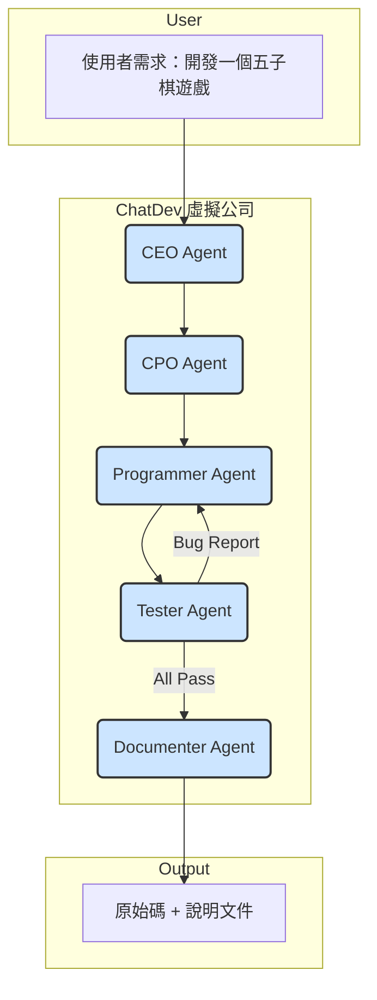

## §0. TL;DR（速覽）

- **一句話總結**：單一 AI Agent 的能力有其極限，本堂課探索如何組織多個 Agents，讓它們分工合作、辯論或競爭，以完成更複雜的任務。
- **Key Takeaways**:
    1.  **代理人社會 (Agent Society)**：AI Agent 可以像人類組織（如軟體公司）一樣，被賦予不同角色（CEO, Coder, Tester），並遵循預設的溝g通流程來協作。
    2.  **協作模式 (Cooperation)**：最常見的互動模式，多個 Agents 共享一個總目標，各自貢獻專長。代表性框架有 ChatDev 和 MetaGPT。
    3.  **競爭模式 (Competition)**：Agents 之間可以有對立目標，透過互相競爭、辯論來提升最終產出的品質或探索更多可能性。
    4.  **溝通是核心**：無論協作或競爭，Agents 之間如何有效傳遞資訊、記憶、與狀態，是整個系統成敗的關鍵。
    5.  **複雜任務的分解**：面對一個龐大的任務（例如「開發一個 App」），核心精神是將其分解為多個子任務，並指派給最適任的 specialist agent。

---

## §1. Motivation（為什麼要這堂課）

在上一堂課中，我們見識了單一 AI Agent 的強大潛力。透過 ReAct 等框架，一個 Agent 就能夠進行思考、使用工具、並與外部世界互動來完成我們交付的任務。然而，當任務的複雜度遽增時，單一 Agent 的瓶頸很快就會浮現。這就像在醫院裡，一位主治醫師雖然能力很強，但他不可能同時處理刀房的所有事務、判讀每一張影像、執行每一項檢驗，還要兼顧文書工作。一個複雜的手術需要外科醫師、麻醉科醫師、刷手護理師、巡迴護理師的精密配合；一個病人的成功治療，仰賴跨科別的會診與團隊合作。

同樣的道理也適用於 AI。想像一下，我們要 AI Agent 開發一個完整的軟體專案，例如一個手機 App。這個任務涉及多個階段：需求分析、UI/UX 設計、前端開發、後端開發、資料庫管理、功能測試、壓力測試、以及最終的部署與文件撰寫。如果只用一個通才型 (generalist) 的 AI Agent 來處理，它或許每個環節都能做一點，但很難在每個環節都達到專家的水準。它寫的程式碼可能充滿 bug，設計的介面可能不符合使用者習慣，最終產出的品質自然難以令人滿意。這就是單一 Agent 模式的極限。

為了解決這個問題，學術界與業界開始探索**多代理人系統 (Multi-Agent System, MAS)** 的概念。這個想法的直覺非常簡單：**如果一個 Agent 不夠，那就用一群 Agent**。我們可以創建一個「AI 軟體公司」，裡面有擔任執行長 (CEO) 的 Agent 負責規劃，擔任程式設計師 (Programmer) 的 Agent 負責寫程式，擔任測試工程師 (Tester) 的 Agent 負責除錯，還有擔任設計師 (Designer) 的 Agent 負責使用者介面。這些各司其職的 specialist agents 組成一個團隊，共同完成開發 App 的宏大目標。

本堂課的核心，就是要探討這個「代理人社會 (Agent Society)」是如何運作的。我們會深入了解，這些 Agents 之間可以有哪些互動模式？它們如何溝通？如何解決衝突？我們將剖析兩個重要的研究框架：**ChatDev** 和 **MetaGPT**。前者展示了如何透過一個「瀑布式」的聊天鏈 (chat chain) 來組織 agents 的軟體開發流程；後者則引入了「標準作業流程 (Standard Operating Procedures, SOPs)」的概念，讓整個團隊的協作更有條理、更有效率。透過理解這些多代理人系統的設計哲學與架構，我們將能跳脫單打獨鬥的思維，學會如何組織一支 AI 大軍，去攻克那些過去認為遙不可及的複雜任務。

---

## §2. 背景知識補完（Prerequisites）

在我們深入多代理人系統的複雜世界之前，讓我們先確保對幾個 foundational 的概念有扎實的理解。這些概念是建構與理解 Agent 之間互動的基石。

1.  **AI Agent（人工智慧代理人）**
    -   **嚴謹定義**：一個能夠透過感測器 (sensors) 感知其環境 (environment)，並透過致動器 (actuators) 對環境採取行動 (actions)，以達成特定目標 (goals) 的計算實體。
    -   **白話版**：你可以把 AI Agent 想像成一個被賦予了「大腦」（通常是個 LLM）和「手腳」（通常是各種 API 工具）的智慧體。它不像傳統程式那樣只會執行寫死的指令，而是能自己「想」下一步該做什麼，並「動手」去執行。例如，你給它「幫我規劃一趟去東京的五日遊」這個目標，它會自己上網查機票、訂飯店、規劃行程。
    -   **為何本堂會用到**：本堂課的一切都建立在「Agent」這個基本單位之上。我們討論的不再是單一 Agent 的行為，而是多個 Agents 如何集結成群，它們之間的互動、溝通與組織結構，構成了我們即將探討的 Multi-Agent System。

2.  **Prompt Engineering（提示工程）**
    -   **嚴謹定義**：設計與優化輸入文本（即 prompt），以引導大型語言模型 (LLM) 產生期望輸出的技術與實踐。
    -   **白話版**：跟 LLM 溝通就像「許願」，Prompt Engineering 就是學習如何把願望說得更精準、更有效的「許願的藝術」。你給的指令越清晰、上下文越豐富、角色扮演越明確，LLM 就越能給你想要的答案。例如，與其說「寫個故事」，不如說「你是一位經驗豐富的科幻小說家，請用懸疑的筆觸，寫一個關於 AI 在火星上發現古文明遺跡的短篇故事」。
    -   **為何本堂會用到**：在多代理人系統中，Prompt Engineering 是定義每個 Agent **角色**和**職責**的核心工具。我們會透過精心設計的 prompts，告訴一個 Agent「你現在是 CEO，你的任務是規劃產品藍圖」、「你現在是 Python 工程師，你的任務是根據規格書寫程式碼」。Prompt 的品質直接決定了每個 Agent 的專業程度與團隊的協作效率。

3.  **API (Application Programming Interface)（應用程式介面）**
    -   **嚴謹定義**：一組定義了不同軟體元件之間如何互動的規則、協定和工具。它允許一個程式使用另一個程式的功能或資料，而無需了解其內部實作細節。
    -   **白話版**：API 就像是餐廳的「菜單」。作為顧客，你不需要知道廚房內部如何運作，只要照著菜單點菜（呼叫 API），服務生（API 的傳輸機制）就會把你的訂單送進廚房，然後把做好的菜（API 回傳的資料或結果）端給你。你點了「宮保雞丁」，拿到就是宮保雞丁，中間的複雜過程都被封裝起來了。
    -   **為何本堂會用到**：API 在 Agent 系統中有兩種關鍵用途。第一，它是 Agent 的「手腳」，讓 Agent 能夠使用外部世界的工具，例如呼叫 Google Search API 來查資料，或呼叫 Twilio API 來發送簡訊。第二，在多代理人系統中，API 也可以是 Agents **之間溝通的橋樑**。一個 Agent 可以透過呼叫另一個 Agent 提供的 API 來請求服務或交換資訊，實現更結構化的互動。

4.  **State Management（狀態管理）**
    -   **嚴謹定義**：在一個計算系統中，追蹤、儲存及更新其隨時間變化的資料（即「狀態」）的過程。
    -   **白話版**：想像你在玩一個 RPG 遊戲，你的角色等級、經驗值、身上的裝備、背包裡的道具，這些資訊合起來就是遊戲的「狀態」。當你打倒一隻怪物，經驗值增加，這就是一次「狀態更新」。狀態管理就是確保這些資訊被正確地記錄和修改，不會因為存檔錯誤而回到 1 級。
    -   **為何本堂會用到**：當多個 Agents 協作時，它們需要一個共享的「記憶」或「工作區」來追蹤專案的進度。例如，目前程式碼寫到哪個版本？測試發現了哪些 bugs？需求文件有沒有更新？這些共享的資訊就是整個系統的「狀態」。如何有效地管理這個共享狀態，確保所有 Agents 看到的資訊是一致的 (consistent)，是設計多代理人系統時必須面對的關鍵挑戰。

---

## §3. 核心概念辭典（Core Concepts Glossary）

本堂課將介紹多個關於組織 AI Agent 的新術語。理解這些概念，是掌握多代理人系統設計模式的鑰匙。

1.  **Multi-Agent System (MAS)（多代理人系統）**
    -   **嚴謹定義**：由多個自主的、互動的代理人（Agents）組成的計算系統。這些代理人共同處於一個環境中，並透過互相溝通與協調來解決單一代理人難以或無法解決的複雜問題。
    -   **白話重述**：這就是我們這堂課的總主題。與其訓練一個無所不能的「通才」Agent，我們不如創建一個由多個「專才」Agents 組成的團隊。這個團隊，連同它們之間的溝通規則與組織架構，就構成了一個 MAS。
    -   **常見誤解**：誤以為 MAS 就只是把一堆 Agents 丟進同一個聊天室。一個有效的 MAS 需要精心設計的**組織結構 (organization)**、**溝通協定 (communication protocol)** 和**協調機制 (coordination mechanism)**，否則只會造成混亂與無效溝通。

2.  **Agent Society / Organization（代理人社會／組織）**
    -   **嚴謹定義**：在多代理人系統中，為代理人之間的角色、關係和互動模式所設定的結構性框架。這個框架定義了指揮鏈、權責劃分和資訊流動的路徑。
    -   **白話重述**：這就像為你的 AI 團隊建立一個「組織圖」。誰是老闆（CEO Agent）？誰是員工（Worker Agents）？員工之間是平級合作，還是有上下隸屬關係？例如，影片中提到的「軟體公司」就是一種 Agent Society 的比喻，其中包含了 CEO、CPO、Programmer、Tester 等明確的角色。
    -   **相近概念區辨**：`Agent Society` 是一個更廣泛、更社會學的比喻，強調 Agents 如同人類社會般有互動與文化。`Agent Organization` 則更側重於具體的結構、流程與權力關係，是一個更工程學的術語。

3.  **Role-Playing（角色扮演）**
    -   **嚴謹定義**：透過在 prompt 中賦予 AI Agent 一個特定的身份、性格、專業背景和目標，以引導其行為和回應風格的技術。
    -   **白話重述**：這是實現 Agent 專業分工最直接的手段。我們在系統的初始 prompt 中就對每個 Agent 下達指令，例如：「你是一個資深的 Python 開發者，你追求程式碼的優雅與效率，你的任務是根據產品規格撰寫高品質的程式碼。」這個「人設」會讓 Agent 在後續的互動中，行為更像一個真正的專家。
    -   **常見誤解**：角色扮演不只是為了好玩或讓對話更有趣。在 MAS 中，這是一種**行為約束 (behavioral constraint)** 的機制。透過明確的角色定義，可以防止 Agent 做出超出其職責範圍的行為（例如，Tester Agent 不應該去修改程式碼），從而讓整個系統的運作更有序、更可預測。

4.  **Cooperative Agents（協作式代理人）**
    -   **嚴謹定義**：在多代理人系統中，擁有一致的總體目標、並透過分享資訊與協調行動來共同最大化團隊總體效益的代理人。
    -   **白話重述**：團隊裡的成員都是「自己人」，大家朝著同一個方向努力。例如，在 ChatDev 框架中，CEO、Programmer、Tester 的共同目標是「成功開發出指定的軟體」，他們之間是純粹的合作關係。Programmer 寫出程式，Tester 幫忙找錯，目標都是讓最終產品變得更好。
    -   **相近概念區辨**：與 `Competitive Agents`（競爭式代理人）相對。競爭式代理人的目標是衝突的，一個的成功可能意味著另一個的失敗。協作式代理人則是 `win-win` 的關係。

5.  **ChatDev**
    -   **嚴謹定義**：一個以「聊天」為基礎的、模擬瀑布式軟體開發流程的多代理人框架。它將軟體開發過程分解為設計、編碼、測試、文檔等階段，並在每個階段由特定角色的 Agents 透過對話鏈 (chat chain) 接力完成任務。
    -   **白話重述**：ChatDev 把「開一家軟體公司」這個想法用最直接的方式實現了。它建立了一個虛擬公司，裡面有 CEO, CPO, Programmer, Tester 等員工（都是 AI Agents）。當接到一個開發任務時，CEO 會先跟 CPO 討論需求，然後 CPO 寫出規格交給 Programmer，Programmer 寫完程式交給 Tester 測試，最後由 Documenter 撰寫文件。整個過程就像一條生產線，每個 Agent 完成自己的部分後再交給下一棒。
    -   **影片中的例子**：影片中提到，ChatDev 可以在幾分鐘內、花費不到一美元的成本，就開發出一個功能完整的小遊戲或應用程式，展示了這種模式的驚人效率。

6.  **MetaGPT**
    -   **嚴謹定義**：一個受真實世界企業標準作業流程 (SOPs) 啟發的多代理人協作框架。它將高階目標分解為一系列結構化的產出（文件、圖表），並指派不同角色的 Agents 根據 SOPs 來生成和審核這些產出，強調了結構化工作流程和可複用元件的重要性。
    -   **白話重述**：如果說 ChatDev 像一個草創時期的小公司，大家靠聊天來推進工作，那 MetaGPT 就像一間已經制度化的大公司。它不只定義了「誰做什麼」，更重要的是定義了「**如何做**」和「**產出標準是什麼**」。它引入了 SOP 的概念，要求 Agents 的產出必須是標準化的文件，例如產品需求文件 (PRD)、架構設計圖、API 序列圖等。
    -   **與 ChatDev 的區別**：MetaGPT 更強調**結構化 (structure)** 和**標準化 (standardization)**。它的溝通不是自由的聊天，而是基於標準範本的「填表」。這樣做的好處是讓整個開發過程更穩定、可預測，且產出的中間文件（如設計圖）可以被複用，減少了 Agents 之間來回溝通的模糊地帶。

---

## §4. System / Paper Deep Dive: ChatDev

ChatDev 是將「AI 代理人社會」這個概念付諸實踐的典範之作。它巧妙地模擬了一家軟體公司的運作流程，讓我們得以一窺如何組織 AI 勞動力來自動化完成複雜的開發任務。本節我們將深入剖析其架構與核心機制。

### 4.1 Architecture

ChatDev 的核心架構是一個被稱為 **「聊天鏈 (Chat Chain)」** 的瀑布式模型。整個軟體開發生命週期被劃分為四個主要階段 (Phase)，每個階段內部又可能包含多個原子步驟 (Atomic Step)。



**元件說明**：

-   **使用者 (User)**：提出一個高階的開發需求，例如「做一個貪食蛇遊戲」。
-   **CEO Agent (Chief Executive Officer)**：系統的總指揮。它負責接收使用者需求，並將其轉化為一個更明確的產品概念和任務目標。
-   **CPO Agent (Chief Product Officer)**：產品經理。它從 CEO 手中接過任務，負責設計產品的功能規格、UI/UX 草案，並產出給工程師看的規格文件。
-   **Programmer Agent (程式設計師)**：軟體開發的核心。它根據 CPO 提供的規格文件，負責撰寫實際的程式碼。
-   **Tester Agent (測試工程師)**：品質的守門員。它接收 Programmer 產出的程式碼，設計並執行測試案例，找出潛在的 bugs。
-   **Documenter Agent (文件工程師)**：開發流程的最後一棒。在程式碼通過所有測試後，它會負責撰寫使用手冊、API 文件等。

這個流程是一個線性的接力賽。前一個 Agent 的輸出，會成為下一個 Agent 的輸入。唯一的迴圈 (loop) 發生在 **Coding ⟷ Testing** 之間，形成一個「除錯循環 (Debugging Loop)」。

### 4.2 關鍵演算法：Chat Chain 與 Debugging Loop

ChatDev 的靈魂在於其「聊天鏈」機制。這不僅僅是讓 Agents 隨意對話，而是一個結構化的、任務導向的溝通流程。我們可以透過一段偽程式碼來理解其核心邏輯：

```python
# Pseudocode for the main ChatDev process
def run_chat_dev(initial_prompt: str):
    # Phase 1: Designing
    ceo_agent = Agent(role="CEO")
    cpo_agent = Agent(role="CPO")
    task_idea = ceo_agent.clarify_task(initial_prompt)
    product_spec = cpo_agent.design_spec(task_idea)

    # Phase 2: Coding & Testing (Debugging Loop)
    programmer_agent = Agent(role="Programmer")
    tester_agent = Agent(role="Tester")
    
    code = ""
    test_report = "Initial test needed"
    max_retries = 3  # Avoid infinite loops

    for i in range(max_retries):
        # The programmer receives the spec and the latest test report
        code = programmer_agent.write_code(spec=product_spec, feedback=test_report)
        
        # The tester receives the new code
        test_report = tester_agent.run_tests(code)
        
        if test_report.is_successful():
            print("All tests passed!")
            break  # Exit the debugging loop
        else:
            print(f"Bugs found, attempt {i+1}/{max_retries}. Sending back to programmer.")
            # The loop continues, with the bug report as new feedback

    # Phase 3 & 4: Documentation & Finalization
    if test_report.is_successful():
        documenter_agent = Agent(role="Documenter")
        documentation = documenter_agent.write_docs(code)
        return {"code": code, "docs": documentation}
    else:
        return {"error": "Failed to fix bugs within max retries."}

```

**中文旁白解釋**：
這段偽程式碼展示了 ChatDev 的核心流程。首先是設計階段，CEO 和 CPO 將使用者模糊的需求，轉化為一份清晰的產品規格 (`product_spec`)。

接著進入最關鍵的「除錯循環」。`Programmer` Agent 根據規格書和上一次的測試回饋 (`test_report`) 來寫程式。寫完後，`Tester` Agent 會對新產出的程式碼進行測試。如果測試通過，迴圈就結束，專案進入最後的文件階段。如果測試失敗，`test_report` 會包含詳細的錯誤訊息，這個報告會連同原始規格書一起，在下一次迴圈中重新傳回給 `Programmer` Agent，作為它修改程式的依據。這個「寫碼 -> 測試 -> 反饋 -> 修改」的循環，就是 ChatDev 能夠自我修正、提升程式品質的關鍵。為了避免無限卡關，我們設定了一個最大重試次數 (`max_retries`)。

### 4.3 關鍵 Data Structure: 對話歷史 (Chat History)

在 ChatDev 中，資訊的傳遞是透過結構化的對話歷史來完成的。每個 Agent 不僅看到前一個 Agent 的發言，而是能看到從任務開始到現在的完整對話脈絡。這份歷史紀錄就是整個團隊的共享記憶。

| 欄位 (Field)    | 型別 (Type) | 描述 (Description)                               | 範例                                               |
| :-------------- | :---------- | :----------------------------------------------- | :------------------------------------------------- |
| `agent_role`    | `String`    | 發言 Agent 的角色。                              | "Programmer"                                       |
| `timestamp`     | `DateTime`  | 發言的時間戳。                                   | "2024-10-27T10:00:05Z"                             |
| `content`       | `String`    | 發言的具體內容，可能是文字、程式碼或規格。       | "`def hello_world():\n    print('Hello, World!')`" |
| `task_id`       | `UUID`      | 標示這次對話屬於哪個開發任務。                   | "abc-123-def-456"                                  |
| `recipient_role`| `String`    | 訊息預期要給哪個角色看，用於引導對話流。         | "Tester"                                           |

### 4.4 Walkthrough

**情境一：正常流程 (Happy Path)**

1.  **使用者**：輸入「請幫我寫一個 Python 的終端機井字遊戲 (tic-tac-toe)」。
2.  **CEO**：接收到需求，輸出：「任務確認：開發一個基於文字介面的雙人井字遊戲。目標平台：Python 3。」
3.  **CPO**：根據 CEO 的指令，設計遊戲規則：「設計規格：需要一個 3x3 的棋盤，玩家 X 和 O 輪流下棋，能判斷輸贏、平手，並有基本的防呆機制（不能下在已下過的位置）。」
4.  **Programmer**：接收到規格，產出第一版 `tictactoe.py` 的完整程式碼。
5.  **Tester**：執行程式碼，並進行自動化測試。測試案例包含：正常下棋直到 X 獲勝、正常下棋直到平手、嘗試下在非法位置。所有測試均通過。Tester 輸出：「所有測試案例通過，程式碼符合規格。」
6.  **Documenter**：接收到最終程式碼，撰寫 `README.md`，內容包含如何執行遊戲 (`python tictactoe.py`) 和基本玩法說明。
7.  **系統**：輸出 `tictactoe.py` 和 `README.md` 給使用者。任務成功。

**情境二：異常流程 (Debugging Loop)**

1.  ... (同上，直到 Programmer 產出程式碼) ...
2.  **Programmer**：接收到 CPO 的規格，但在判斷勝利條件的邏輯中寫錯了一個索引，導致只有橫向和縱向能判斷勝利，斜向的勝利條件判斷失效。
3.  **Tester**：執行自動化測試。其中一個測試案例是專門測試「斜向獲勝」的情境。這個測試失敗了。Tester 輸出：「測試失敗！錯誤報告：在 `check_winner()` 函數中，當玩家從 `(0,0)` 到 `(2,2)` 連成一線時，函數未回傳 `True`。請修復此 bug。」
4.  **Programmer (第二次嘗試)**：接收到**原始規格**和 Tester 的**錯誤報告**。它理解到問題出在 `check_winner()`，於是修正了斜向判斷的邏輯。它產出了第二版的 `tictactoe.py`。
5.  **Tester**：再次執行所有測試案例，這次包含了「斜向獲勝」的案例。所有測試均通過。Tester 輸出：「所有測試案例通過。」
6.  ... (同正常流程，由 Documenter 接手完成後續工作) ...

這個 walkthrough 清楚地展示了 ChatDev 如何透過內建的**回饋機制**，從失敗中學習並自我修正，最終達成開發目標。

## §5. 真實類比（★ 讀者背景特化）

在這一節，我們將借鏡你最熟悉的臨床場景，深入理解 AI Agent 之間複雜的互動模式。這些類比旨在建立直觀的理解，但務必留意它們的邊界與侷限。本節至少 1,500 中文字。

---

### 類比一：多 Agent 辯論協作 ↔ 晨會的跨專科團隊會議 (Interdisciplinary Team Meeting)

影片中提到的 `CAMEL` (Communicative Agent for "Mind" Exploration of Large Scale Language Model Society) 或 `Debate` 模式，讓多個 Agent 扮演不同角色（例如，一個扮演 Python 程式設計師，一個扮演人類使用者），透過對話和辯論來完成任務。這與晨會上處理複雜病人的跨專科團隊會議（Interdisciplinary Team Meeting）有驚人的相似之處。

**類比情境描述 (150+ 字)**：
想像一位入住加護病房（ICU）的 70 歲男性，他有多重共病：糖尿病、慢性腎臟病（CKD）第四期、以及心臟衰竭。今天，他出現了新的發燒與呼吸窘迫。主治醫師（Attending V.S.）在晨會上提出這個案例，一場為了擬定最佳治療策略的腦力激盪就此展開。胸腔科醫師從呼吸器設定和感染角度切入，心臟科醫師擔心血壓不穩和心臟負荷，腎臟科醫師則聚焦於藥物劑量和腎功能保護，感染科醫師則在思考抗生素的選擇與抗藥性。每位專家都從自己的專業出發，提出觀點、質疑他人、並最終達成共識——這就是一個高度專業化的「多 Agent 協作系統」。

**對應關係表**：
| AI Agent 系統概念 | 臨床團隊會議類比 |
| :--- | :--- |
| **任務目標 (Overall Goal)** | 解決病人的新問題（發燒與呼吸窘迫） |
| **AI Agent (e.g., Coder)** | 胸腔科醫師 (Pulmonologist) |
| **AI Agent (e.g., User Proxy)** | 心臟科醫師 (Cardiologist) |
| **AI Agent (e.g., Critic)** | 腎臟科醫師 (Nephrologist) / 感染科醫師 |
| **對話紀錄 (Chat History)** | 會議記錄 / EMR 上的 Progress Note |
| **角色扮演提示 (Role-playing Prompt)** | 每位醫師的專科訓練與臨床經驗 |
| **任務拆解 (Task Decomposition)** | 將複雜病情分解為：呼吸、循環、感染等子問題 |
| **共識決策 (Consensus Decision)** | 最終擬定的綜合治療計畫（如：調整呼吸器、給予特定抗生素、利尿劑劑量） |

**✅ 吻合之處（為何類比有效）**：
- **角色專業化**：如同 CAMEL 中指定 Agent 扮演「程式設計師」或「心理學家」，臨床團隊中的每位醫師都擁有深度的專科知識。這種分工讓系統能從多個專業角度分析問題，避免單一視角的盲點。
- **對抗性合作 (Adversarial Collaboration)**：會議中，心臟科醫師可能會反對使用某種對血壓影響劇烈的抗生素，而感染科醫師則會解釋其必要性。這種看似對抗的討論，實則是為了找出對病人最有利的平衡點，與 AI Agent 辯論中透過挑戰與修正來優化解決方案的過程如出一轍。
- **共同的上下文 (Shared Context)**：所有醫師都共享同一份病歷（EMR）、檢驗數據（LIS）、和影像（PACS）。這份共享的資訊，相當於 AI Agent 協作時共享的 `Chat History`，確保了所有人都在同一個基礎上進行討論，避免資訊不對等。

**⚠️ 不吻合之處（類比邊界，避免誤導）**：
- **決策權重**：在醫院，主治醫師（Attending）通常擁有最終決策權，即使有爭議。但在許多 AI Agent 辯論模型中，各 Agent 的權重可能是平等的，決策是基於投票或直到達成一致。權力結構是關鍵差異。
- **溝通的模糊性**：人類醫師的溝通充滿了非語言訊息、經驗直覺和模糊地帶。而 AI Agent 之間的溝通是高度結構化的文字，缺乏這種「弦外之音」。AI 還無法理解一位資深醫師皺著眉頭說「這個盤尼西林...我感覺不太好」背後的豐富意涵。
- **責任歸屬**：如果治療失敗，最終的法律和倫理責任會落在主治醫師和醫療團隊身上。而 AI Agent 系統如果出錯，責任歸屬是一個仍在激烈討論中的開放問題，是開發者、使用者、還是 AI 本身的責任？

---

### 類比二：階層式 Agent 系統 ↔ 醫院的臨床指令與執行鏈

影片中介紹的 `MetaGPT` 或 `ChatDev` 系統，建立了一個模擬軟體公司的階層結構：`CEO` Agent 設定目標，`Product Manager` Agent 規劃功能，`Engineer` Agent 撰寫程式碼，`QA` Agent 負責測試。這完美對應了醫院從主治醫師下達醫囑（Order）到護理師執行的那條清晰的指令鏈。

**類比情境描述 (150+ 字)**：
一位病人因社區型肺炎（Community-Acquired Pneumonia, CAP）入院。主治醫師（Attending V.S.）在查房後，根據臨床指引和病人狀況，做出了核心決策：「經驗性抗生素治療，並監控生命徵象」。這個高階指令被輸入到醫院資訊系統（HIS）。接下來，住院醫師（Resident）將這個抽象指令具體化，開立出明確的醫囑：`Ceftriaxone 1g IV q12h`、`TID check Vital Signs`、`N/S 500ml keep vein open`。護理師（Nurse）看到醫囑後，從藥局領取藥物，準時為病人施打，並定期量測體溫、血壓、心跳，將數據記錄回護理紀錄中。最後，主治醫師會根據這些執行後的數據，評估治療效果，決定下一步是維持、升級還是降級治療。

**對應關係表**：
| AI Agent 系統概念 | 醫院臨床指令鏈類比 |
| :--- | :--- |
| **CEO Agent** | 主治醫師 (Attending V.S.) |
| **Product Manager Agent** | 住院醫師 (Resident) / 總醫師 (Chief Resident) |
| **Engineer Agent** | 病房護理師 (Ward Nurse) / 專科護理師 (NP) |
| **QA (Quality Assurance) Agent** | 主治醫師 (在下次回診或查房時評估成效) |
| **Standard Operating Procedures (SOPs)** | 臨床治療指引 (Clinical Practice Guidelines) |
| **程式碼 (Code)** | 具體的醫療行為 (如：靜脈注射、生命徵象監測) |
| **測試報告 (Test Report)** | 護理紀錄上的生命徵象數據 / 後續的檢驗報告 |
| **Code Review / Bug Fixing** | 晨會案例討論 / M&M 會議 (Morbidity & Mortality) |

**✅ 吻合之處（為何類比有效）**：
- **指令的逐級細化 (Hierarchical Decomposition)**：從主治醫師的一個高層次治療目標，到住院醫師的具體藥物、劑量、頻次，再到護理師的執行動作，這是一個典型的階層式任務拆解過程。這與 MetaGPT 中從一個模糊想法到具體程式碼的產生過程完全一致。
- **角色職責分明**：醫師負責「診斷」與「決策」（What to do），護理師負責「執行」與「監測」（How to do it & What happened）。這種清晰的職責劃分（Separation of Concerns）確保了效率與安全，就像 `Engineer` Agent 專注寫碼，而 `QA` Agent 專注測試一樣。
- **反饋迴圈 (Feedback Loop)**：護理師執行的結果（生命徵象數據）會反饋給醫師，醫師根據這些「測試結果」來決定下一步的「程式修改」（調整治療方案）。這形成了一個完整的 `Plan-Do-Check-Act` (PDCA) 循環。

**⚠️ 不吻合之處（類比邊界，避免誤導）**：
- **SOP 的彈性**：雖然有臨床指引（SOPs），但人類醫師和護理師在面對緊急情況或非典型病人時，可以基於經驗和判斷力「破格」處理。例如，病人對藥物過敏，護理師會立即停止給藥並回報，而不是盲目執行。目前的 AI Agent 階層系統在這種動態應變能力上還很欠缺。
- **溝通的豐富度**：住院醫師在將主治醫師的指令轉化為醫囑時，會融入自己對病人的觀察。護理師在執行時，也會口頭與醫師溝通病人的感受。這種「in-band」和「out-of-band」的混合溝通，比 `ChatDev` 嚴格的文件驅動（document-driven）流程要豐富得多。
- **失敗的成本**：在 `ChatDev` 中，一次「編譯失敗」或「測試未通過」的成本很低，可以無限次重試。在臨床上，一次錯誤的給藥或處置可能導致嚴重的後果甚至死亡，失敗的成本極高，因此有層層的防錯機制（如三讀五對）。

---

### 類比三：與環境互動的 Agent ↔ 醫師開立醫囑與檢驗單 (Consultation & Ordering)

影片中提到，Agent 不僅可以互相溝通，還可以與「環境」互動。這個環境可以是一個作業系統、一個檔案、或是一個特定的工具（Tool）。這就像臨床醫師不是萬能的，他們需要借助各種檢驗、影像學檢查和會診（Consultation）來獲取資訊和執行特定任務。

**類比情境描述 (150+ 字)**：
一位急診醫師面對腹痛的病人，初步懷疑是闌尾炎（Appendicitis），但需要更多證據。他無法「透視」病人的肚子，於是他「呼叫」了幾個外部工具：他開了一張抽血檢驗單（呼叫檢驗科 `LIS` 工具），取得 `WBC count` 和 `CRP` 數據；他開了一張腹部超音波或電腦斷層（CT）的申請單（呼叫影像科 `PACS` 工具），讓放射科醫師判讀影像。如果病情複雜，他可能還會開一張會診單（呼叫一般外科 `General Surgery` 這個「真人專家工具」）。這些「工具」各自處理請求，並回傳結構化的報告（檢驗數值、影像報告、會診建議），幫助急診醫師做出最終診斷和處置。

**對應關係表**：
| AI Agent 系統概念 | 臨床工作流程類比 |
| :--- | :--- |
| **主 Agent (Main Agent)** | 急診醫師 (ER Physician) |
| **環境 / 工具 (Environment / Tool)** | 檢驗科 / 影像科 / 會診的專科醫師 |
| **工具呼叫 (Tool Calling)** | 開立檢驗單 / 影像申請單 / 會診單 |
| **API 請求 (API Request)** | 申請單上寫明的檢查項目 (e.g., CBC/DC, Abdominal CT) |
| **API 回應 (API Response)** | 檢驗報告 / 影像報告 / 會診回覆單 |
| **結構化輸出 (Structured Output)** | 報告上的標準化格式 (e.g., 數值+單位+參考區間) |
| **工具選擇 (Tool Selection)** | 醫師根據鑑別診斷列表，決定需要哪種檢查 |

**✅ 吻合之處（為何類比有效）**：
- **黑盒子抽象化 (Black-box Abstraction)**：急診醫師不需要知道 CT 機器如何運作或血液分析儀的內部原理。他只需要知道如何正確地「呼叫」這個工具（開立申請單），以及如何解讀它回傳的「結構化結果」（報告）。這與 AI Agent 使用 API 完全相同，Agent 不需要知道 `Google Search` API 的內部實作。
- **任務的委派 (Task Delegation)**：面對超出自身能力範圍的任務（如判讀影像或進行手術），Agent/醫師會將任務委派給專門的工具/專家。這體現了現代複雜系統（無論是軟體或醫療）的核心原則：分工與合作。
- **輸入輸出的標準化**：醫囑和報告都有極其嚴格的格式要求，以確保資訊傳遞的準確性。這對應了 API 的規格（Specification），Agent 必須以指定的格式發出請求，並預期收到指定格式的回應。一個格式錯誤的 API call 就如同醫師開了一張寫錯的醫囑單，會被系統（藥師或護理師）拒絕。

**⚠️ 不吻合之處（類比邊界，避免誤導）**：
- **同步 vs. 非同步**：AI Agent 呼叫許多 API (如計算機) 是同步的（Synchronous），能立刻得到結果。但醫院的檢查大多是非同步的（Asynchronous）：CT 可能要排隊幾小時，病理報告可能要等幾天。主治醫師需要管理這種等待和不確定性，這對 AI Agent 來說是一個更進階的挑戰（需要 `callback` 或 `polling` 機制）。
- **工具的可靠性與錯誤處理**：API 通常是可靠的，要麼成功回傳，要麼回傳定義好的錯誤碼。但臨床「工具」的變數更多：檢體可能溶血需要重抽，病人可能對顯影劑過敏無法做 CT，會診醫師可能正在開刀無法立即回應。人類醫師需要處理這些真實世界中的各種混亂與例外狀況。
- **成本與資源限制**：AI Agent 在模擬中可以無限制地呼叫工具。但在醫院，每一項檢查都有金錢成本、時間成本和潛在風險（如輻射暴露）。醫師的決策是在有限資源和風險效益分析下的最佳化，而不僅僅是為了獲取資訊。

---

## §6. 課堂 Q&A 精華

李宏毅教授的影片雖然是獨白形式，但其中針對許多關鍵觀念進行了深入的剖析與澄清。這裡我們將這些精華部分，轉化為讀者心中可能浮現的問題與教授的回答。

**Q1: 既然大型語言模型 (LLM) 越來越強大，我們為什麼不直接用一個超強的 LLM 來解決所有問題，而要費心去建構這麼多 Agent 協作的複雜系統呢？**
**A**: 這是一個非常核心的問題。教授給出的觀點是，這涉及到「分工」與「專注」的力量。單一 LLM 就像一個全科醫師（General Practitioner），知識廣泛但對每個專科的深度有限。而一個多 Agent 系統，就像一個由心臟科、腎臟科、神經科專家組成的醫療團隊。你可以讓每個 Agent 都使用同樣的底層 LLM (例如 GPT-4)，但透過給予它們不同的「角色提示 (Role Prompt)」和「專業工具 (Tools)」，讓它們「扮演」特定領域的專家。例如，一個扮演「資深軟體工程師」的 Agent，它的 prompt 會充滿軟體開發的最佳實踐；而一個扮演「市場分析師」的 Agent，它的 prompt 則會引導它關注商業指標。這種「後天調教」比從頭訓練一個專科 LLM 要便宜且高效得多，本質上是**「專業分工 VS. 單一通才」**的取捨。

**Q2: 在像 `ChatDev` 這樣的階層式 Agent 系統中，如果「工程師 Agent」寫的程式碼一直有問題，「QA Agent」一直退件，會不會陷入無限迴圈，導致專案卡住？**
**A**: 會的，這的確是實作上的一大挑戰。教授提到，為了避免這種僵局，系統需要設計一些「中斷機制 (Termination Condition)」。例如，在 `ChatDev` 的設定中，可以設定一個「最大互動輪次 (Maximum Interaction Rounds)」。如果工程師和 QA 之間的來回溝通超過了，比如說，5 輪，CEO Agent 就會介入，判定任務失敗，或者嘗試更換指令、甚至更換「工程師 Agent」。另一個機制是成本限制，每次互動都會消耗 token 和運算資源，可以設定一個預算上限。這就像在醫院裡，如果一個治療方案持續無效，不可能無限期地嘗試下去，主治醫師最終會介入，重新評估診斷並更改治療策略。

**Q3: 影片提到的「環境 (Environment)」到底是什麼？它和「工具 (Tool)」有什麼不同？**
**A**: 教授釐清了這兩者的關係。你可以把「環境」想像成一個 Agent 所處在的**整個工作平台或作業系統**，而「工具」則是這個環境中**提供給 Agent 使用的特定應用程式或 API**。例如，「環境」可以是你的電腦終端機 (Terminal)，而 `ls` (列出檔案)、`cat` (讀取檔案)、`python` (執行 Python 腳本) 就是這個環境中的「工具」。在更抽象的層次上，「環境」也可以是一個模擬器，比如一個模擬股市交易的平台，而「買進」和「賣出」就是 Agent 可以使用的工具。所以，工具是環境的一部分，是 Agent 與環境互動的具體手段。

**Q4: 讓 Agent 互相辯論聽起來很酷，但怎麼保證它們不是在「各說各話」，最終能達成有意義的共識，而不是產生更多混亂？**
**A**: 這取決於系統的設計。關鍵在於**「共同的目標」**和**「明確的評分機制」**。在 `CAMEL` 這類的系統中，雖然有兩個對立角色的 Agent（如程式設計師和使用者），但它們的對話是由一個「指導員 Agent (Instructor Agent)」來協調的，這個指導員會確保對話始終圍繞著最初設定的任務目標。在辯論系統中，可能會有一個「裁判 Agent (Judge Agent)」，它會根據解決方案的品質、完整性和效率來給出評分，並最終裁定哪個方案勝出，或者要求雙方整合出一個更好的方案。如果沒有這種協調和裁判機制，多 Agent 系統確實很容易發散甚至崩潰。

**Q5: 在 `MetaGPT` 的例子中，SOPs (標準作業流程) 是怎麼產生的？是人類預先寫死的嗎？**
**A**: 在目前 `MetaGPT` 的實作中，這些 SOPs 確實是人類專家預先定義好的。它們就像是公司內部的「最佳實踐手冊」，將軟體開發的流程（需求分析 -> 架構設計 -> 實作 -> 測試）給範本化了。每個角色的 Agent 都會被指示遵循這些 SOPs 來產生標準化的文件（例如，`Product Manager` 必須產出 `Product Requirement Document, PRD`）。這確保了不同 Agent 之間的溝通有共同的格式和預期。然而，教授也暗示了未來的可能性：更進階的系統或許能夠讓 Agent 們自己學習和演化出更有效率的 SOPs，就像人類組織會隨著時間不斷優化其工作流程一樣。

**Q6: 這些多 Agent 系統的成本是不是非常高？每多一個 Agent，API 呼叫的費用不就跟著翻倍嗎？**
**A**: 是的，成本是目前多 Agent 系統落地的一大障礙。影片中雖然沒有深入討論成本，但這是一個非常實際的問題。每一次 Agent 之間的對話、每一次工具的呼叫，背後都是 LLM 的 token 消耗。一個包含 5 個 Agent 的團隊，互動 10 輪，其 token 消耗量可能遠大於讓一個 Agent 獨立工作。因此，業界在設計這類系統時，會非常注重效率。例如，盡量使用較小、較便宜的模型來執行簡單的任務；設計更簡潔的溝通協定來減少對話的長度；以及實作更聰明的中斷機制，避免無效的溝通浪費資源。

---
**最常見誤解 Top 3**
1.  **誤解**：Agent 越多，系統就越聰明、能力越強。
    **澄清**：並非如此。增加 Agent 數量會指數級增加溝通的複雜度和成本。關鍵在於**有效的組織結構**和**清晰的溝通協定**，而不是 Agent 的數量。一個組織混亂的百人團隊，效率可能遠低於一個分工明確的五人小組。
2.  **誤解**：Agent 之間的「溝通」，就是像人類一樣自由地聊天。
    **澄清**：目前絕大多數系統的「溝通」是高度結構化的，通常是透過交換 JSON 或 XML 等格式的「文件」來進行。`ChatDev` 就是一個典型的例子，Agent 之間不直接對話，而是修改共享的專案文件。自由聊天很容易導致誤解和任務偏離。
3.  **誤解**：AI Agent 能完全自主運作，不需要人類介入。
    **澄清**：在可預見的未來，幾乎所有實用的 Agent 系統都會是**「人機迴圈 (Human-in-the-loop)」**的模式。人類扮演著設定目標（CEO）、監督過程（Manager）、以及在 Agent 卡住時提供指導（Senior Consultant）的關鍵角色。完全放任的自主系統風險太高，且容易偏離初衷。

---

## §7. 常見陷阱與考點（What Engineers Actually Get Wrong）

實作多 Agent 系統時，許多坑是學術論文中不會細講，但工程師會一踩再踩的。以下是從影片內容延伸出的 6 個關鍵陷阱。

**陷阱 1：角色定義過於模糊，導致 Agent 職責重疊或產生缺口**
-   **為何會掉進去**：工程師在設計初期，可能會用過於人類化、充滿形容詞的語言來定義 Agent 的角色，例如「一個有創意的設計師」或「一個謹慎的測試員」。這種模糊的描述會讓 LLM 的行為充滿不確定性。
-   **正確做法**：角色的 Prompt 必須極度明確、具體，並以動詞為導向。例如，與其說「有創意的設計師」，不如定義「你的任務是：1. 產生三種不同的 UI 佈局方案；2. 為每種方案提供配色建議；3. 你的輸出必須是 JSON 格式...」。明確的輸入輸出格式和職責邊界至關重要。
-   **實例**：在 `ChatDev` 中，如果 `Programmer` 和 `Designer` 的職責沒有劃清，可能會出現 `Programmer` 直接寫死 UI 顏色，而 `Designer` 的建議完全被忽略的情況。

**陷阱 2：低估了溝通協定 (Communication Protocol) 的重要性**
-   **為何會掉進去**：很多人認為只要讓 Agent 互相傳送自然語言訊息，它們就能「神奇地」理解彼此。但自然語言的歧義性是系統崩潰的主要來源。
-   **正確做法**：必須設計嚴格的、機器可解析的溝通格式。例如，Agent 之間的所有溝通都必須是 `{"sender": "agent_A", "receiver": "agent_B", "task_id": "123", "content": {...}}` 這樣的 JSON 物件。這讓狀態追蹤、錯誤處理和任務路由變得可能。這就是影片中 `ChatDev` 強調「文件驅動」而非「聊天驅動」的核心原因。

**陷阱 3：缺乏有效的「世界狀態 (World State)」管理者**
-   **為何會掉進去**：在一個多 Agent 系統中，如果每個 Agent 都維護自己對「世界」的看法，很快就會出現狀態不一致的問題（類似分布式系統的挑戰）。例如，Agent A 認為檔案 X 已經被刪除，但 Agent B 的認知中還存在。
-   **正確做法**：需要有一個「環境 (Environment)」或「狀態管理器 (State Manager)」作為單一事實來源 (Single Source of Truth)。所有 Agent 對共享資源（如檔案系統、資料庫）的修改都必須透過這個管理器來進行。管理器負責處理並發請求、鎖定資源，並將狀態的變更廣播給所有相關的 Agent。

**陷阱 4：無限迴圈或任務僵局，沒有設計終止條件**
-   **為何會掉進去**：一個常見的循環是「產生-批評」循環：一個 Agent 產生解決方案，另一個 Agent 批評它，然後第一個 Agent 再產生一個略有不同的方案，又被批評...這個過程可能永不收斂。
-   **正確做法**：必須設定明確的終止條件。常見的策略包括：
    1.  **輪次上限**：例如，一個任務最多只能有 10 輪溝通。
    2.  **預算上限**：監控 token 使用量或 API call 次數，達到上限即終止。
    3.  **進度停滯檢測**：如果連續 3 輪溝通後，解決方案的評分都沒有顯著提升，則判定為停滯並終止。

**陷阱 5：對 Agent 的輸出盲目信任，沒有驗證機制**
-   **為何會掉進去**：工程師有時會假設一個「工程師 Agent」產生的程式碼就一定是語法正確、可以執行的。
-   **正確做法**：Agent 的任何輸出，尤其是程式碼或結構化數據，都必須經過一個自動化的驗證層。例如，「工程師 Agent」提交程式碼後，系統必須自動在一個沙箱環境中嘗試編譯和執行它。如果失敗，則直接將錯誤訊息回傳給該 Agent，要求其修正，而不是將有問題的程式碼傳遞給下一個「QA Agent」，浪費資源。這就是所謂的「Fail Fast」原則。

**陷阱 6：忽略了「人類在環」(Human-in-the-Loop) 的必要性**
-   **為何會掉進去**：追求全自動化的理想，容易讓人們試圖設計一個能處理所有異常的完美系統，這在現實中是不可能的。
-   **正確做法**：從一開始就應該設計好「求助」機制。當系統偵測到任務僵局、連續失敗、或遇到從未見過的錯誤類型時，它應該能自動暫停，並向人類操作員發出請求，請求指導或決策。人類的常識和經驗是處理長尾問題 (long-tail problems) 的最終保障。

---

## §8. 自測題（正好 10 題，附摺疊答案）

1.  **(概念題)** 在 `CAMEL` (Communicative Agent) 模型中，`AI User Agent` 和 `AI Assistant Agent` 的主要作用是什麼？它們如何協作完成任務？
<details><summary>展開答案</summary>

在 `CAMEL` 中，`AI User Agent` 扮演提出需求和想法的「使用者」角色，而 `AI Assistant Agent` 則扮演實現這些需求的「執行者」（例如程式設計師）。它們在一個由 `Task-Specifying Agent` 給定的特定任務框架下進行對話。`AI User Agent` 會不斷提出指令或修正意見，`AI Assistant Agent` 則根據這些指令來產生解決方案。這種角色扮演的對話模式，旨在引導 LLM 產生更完整、更符合需求的輸出，模擬了真實世界中使用者與開發者的協作過程。

</details>

2.  **(情境題)** 你正在設計一個自動生成研究論文摘要的 AI 系統。你決定採用一個三 Agent 團隊的模式。你會如何設計這三個 Agent 的角色和它們之間的協作流程？
<details><summary>展開答案</summary>

一個可能的設計是階層式協作流程：
1.  **`Researcher Agent` (研究員)**：這是第一層。它的任務是接收論文全文，閱讀並提取核心的 `背景 (Background)`、`方法 (Methods)`、`結果 (Results)` 和 `結論 (Conclusion)`。它的輸出是一個結構化的 JSON 物件，包含了這四個部分的關鍵句。
2.  **`Writer Agent` (寫手)**：這是第二層。它接收 `Researcher Agent` 產生的 JSON 物件，任務是將這些要點流暢地串寫成一段通順的摘要初稿，確保語法和邏輯正確。
3.  **`Polisher Agent` (潤飾員)**：這是第三層。它接收 `Writer Agent` 的初稿，任務是從學術寫作的風格角度進行優化，例如替換更精確的學術詞彙、調整句式使其更簡潔有力、並確保摘要符合特定期刊的字數限制。
協作流程：`全文 -> Researcher -> 結構化要點 -> Writer -> 摘要初稿 -> Polisher -> 最終摘要`。這個流程確保了職責分離和逐步優化。

</details>

3.  **(概念題)** `MetaGPT` 中的 `Standard Operating Procedures (SOPs)` 扮演了什麼關鍵角色？如果沒有 SOPs，系統可能會出現什麼問題？
<details><summary>展開答案</summary>

SOPs 在 `MetaGPT` 中扮演著「標準化溝通協定」和「最佳實踐範本」的關鍵角色。它們為每個角色的 Agent（如 Product Manager, Architect）定義了其產出物（如 PRD, System Design）的標準格式和必要內容。
如果沒有 SOPs，系統可能會出現以下問題：
1.  **溝通混亂**：每個 Agent 可能會以自己獨特的、非結構化的方式輸出資訊，導致下游的 Agent 無法理解或解析，使得協作鏈中斷。
2.  **品質不一**：產出物的品質將變得非常不穩定，因為沒有一個共同的標準來約束 Agent 的行為。
3.  **流程僵化**：Agent 之間的協作會缺乏明確的流程，容易陷入混亂的來回討論，而不是沿著一條清晰的路徑前進。

</details>

4.  **(Debug 題)** 一個用於編寫 Python 程式的雙 Agent 系統（`Coder` 和 `Tester`）陷入了無限迴圈。`Coder` 產生的程式碼是 `print("Hello World!)`，`Tester` Agent 的 prompt 是「請驗證程式碼是否符合 Python 3 語法並且可以成功執行」。`Tester` 總是回覆「測試失敗」。問題最可能出在哪裡？
<details><summary>展開答案</summary>

問題最可能出在 `Coder` 產生的程式碼存在語法錯誤。仔細看程式碼 `print("Hello World!)`，右邊的引號是 `!)`，而不是 `")`，這是一個 `SyntaxError`。`Tester` Agent 忠實地執行了它的任務，在一個 Python 環境中運行這段程式碼，捕獲到了 `SyntaxError`，因此回報「測試失敗」。這個例子凸顯了對 Agent 輸出進行自動化驗證的重要性，即使是看似微小的錯誤也可能導致系統失敗。

</details>

5.  **(情境題)** 影片中提到，Agent 可以與「環境」互動。請以「自動預訂機票」為例，說明主 Agent、環境、以及至少兩種工具（Tool）如何互動。
<details><summary>展開答案</summary>

-   **主 Agent (Master Agent)**：負責與使用者溝通、理解預訂需求的 Agent。例如，使用者說：「幫我訂一張下週五從台北到東京最便宜的經濟艙機票」。
-   **環境 (Environment)**：可以是一個整合了多家航空公司和旅行社 API 的「旅遊預訂平台」。
-   **工具 1: `search_flights(origin, destination, date, class)`**：主 Agent 根據使用者需求，呼叫這個工具：`search_flights("TPE", "NRT", "2026-05-08", "Economy")`。
-   **工具 2: `book_flight(flight_id, passenger_info)`**：當 `search_flights` 工具回傳了航班列表後，主 Agent 會將選項呈現給使用者（或根據「最便宜」的指令自動選擇），然後呼叫這個工具來完成預訂，例如 `book_flight("JL096", {"name": "Lin", "passport": "..."})`。

整個流程是：`使用者需求 -> 主 Agent 拆解任務 -> 呼叫 search_flights 工具 -> 環境執行搜尋並回傳結果 -> 主 Agent 處理結果 -> 呼叫 book_flight 工具 -> 環境執行預訂並回傳確認訊息 -> 主 Agent 回報給使用者`。

</details>

6.  **(概念題)** 多 Agent 辯論（Debate）和階層式（Hierarchical）協作兩種模式，各自更適合解決哪種類型的問題？
<details><summary>展開答案</summary>

-   **多 Agent 辯論模式**：更適合解決**開放性、探索性、沒有唯一正確答案**的問題。例如：`"為一家新創公司發想 5 個可能的產品方向"` 或 `"分析一項政策的潛在利弊"`。在這種模式下，不同視角的 Agent 透過辯論可以激發出更多創意，並從多個角度審視問題，使得最終方案考慮得更周全。
-   **階層式協作模式**：更適合解決**目標明確、流程清晰、可以被拆解為多個步驟**的任務。例如：`"開發一個使用者登入系統"` 或 `"撰寫一份市場分析報告"`。這種模式下，如同 `MetaGPT`，任務從高層次的目標被一步步分解給專職的 Agent，每個 Agent 完成自己的一小部分，最終組合成完整的產出，效率高且流程可控。

</details>

7.  **(Debug 題)** 你設計了一個「新聞寫作」Agent，它會使用 `google_web_search` 這個工具。你發現它經常產生事實錯誤的新聞。在檢查 Log 後，你看到 Agent 的內心獨白 (thought) 是：「使用者想知道 A 事件的最新進展。我應該搜尋 A 事件。」然後它呼叫了 `google_web_search(query="A 事件")`，接著就直接根據搜尋結果的第一個摘要開始寫作。這個流程在哪個環節最可能有問題？
<details><summary>展開答案</summary>

問題最可能出在**「輕信單一資訊來源，缺乏交叉驗證 (Cross-validation)」**。LLM 目前存在「懶惰」的傾向，拿到第一個看似合理的答案後就可能停止進一步的探索。一個更可靠的流程應該是：
1.  搜尋 `A 事件`，得到一個初步結果。
2.  產生批判性思考：`"這個來源可靠嗎？有沒有其他觀點？"`
3.  進行第二次或第三次搜尋，例如 `google_web_search(query="A 事件 官方聲明")` 或 `google_web_search(query="B 媒體對 A 事件的報導")`。
4.  綜合多個來源的資訊，找出共同點和矛盾點，然後再開始寫作。
僅僅依賴單一搜尋結果就直接寫作，是導致 Agent 產生幻覺或事實錯誤的主要原因之一。

</details>

8.  **(概念題)** 影片提到的「Inception Prompt」在多 Agent 系統中的作用是什麼？它與普通的角色 Prompt 有何不同？
<details><summary>展開答案</summary>

`Inception Prompt` (啟動提示) 是用來**啟動整個多 Agent 協作過程的最高層級指令**。它通常定義了最終的、宏大的任務目標。例如，在 `CAMEL` 的例子中，Inception Prompt 可能是 `"設計一個 Python 小遊戲"`。

它與單個 Agent 的角色 Prompt (Role Prompt) 的區別在於：
-   **層級不同**：Inception Prompt 是給整個「系統」的，而 Role Prompt 是給系統內某個「個體」的。
-   **作用不同**：Inception Prompt 用來「初始化任務」，而 Role Prompt 用來「定義行為和專業」。`Task-Specifying Agent` 會根據 Inception Prompt 來生成更具體的任務描述，以及 `AI User` 和 `AI Assistant` 的角色 Prompt。所以，Inception Prompt 是所有後續 Prompt 的「源頭」。

</details>

9.  **(情境題)** 假設你想建立一個 AI Agent 來管理你的個人待辦事項清單，這個清單儲存在一個名為 `tasks.md` 的 Markdown 檔案中。為了讓 Agent 能管理這個檔案，你至少需要為它提供哪三種基本的「環境工具」？
<details><summary>展開答案</summary>

為了管理一個 `tasks.md` 檔案，Agent 至少需要以下三種對應檔案系統操作的工具：
1.  **`read_file(path)`**：讓 Agent 能夠讀取 `tasks.md` 的當前內容，了解有哪些待辦事項。
2.  **`write_file(path, content)`**：讓 Agent 能夠覆蓋整個檔案。例如，在重新排序或刪除多個任務後，將新的完整清單寫回 `tasks.md`。
3.  **`append_file(path, content)`**：讓 Agent 能夠在檔案末尾追加內容。這對於快速新增一條新的待辦事項非常有用，比讀取整個檔案再重寫要高效。
這三種工具提供了對單一檔案最基本的 CRUD (Create/Read/Update/Delete) 操作能力（這裡的 `write` 和 `append` 覆蓋了 Update 和 Create，而 Delete 可以通過讀取後重寫不含特定行的內容來實現）。

</details>

10. **(概念題)** 為什麼在 `ChatDev` 這樣的系統中，Agent 之間的溝通是「文件驅動」而不是「對話驅動」？這樣做有什麼優缺點？
<details><summary>展開答案</summary>

`ChatDev` 採用文件驅動（Document-driven）溝通，意味著 Agent 不直接對話，而是通過修改共享的專案文件（如需求文件、設計文件、原始碼檔案）來進行協作。

**優點**：
1.  **結構化與明確性**：文件有固定的格式 (SOPs)，這使得溝通內容非常明確，減少了自然語言對話的模糊性。
2.  **狀態持久化**：所有的溝通和決策都記錄在文件中，成為系統的持久化狀態。這便於追蹤歷史、版本控制和除錯。
3.  **非同步協作**：Agent 不需要即時等待對方回應，只需關注自己負責的文件是否被上游更新，以及自己是否需要更新下游所需的文件即可，有利於並行工作。

**缺點**：
1.  **靈活性較差**：對於需要快速腦力激盪或解決突發問題的場景，文件驅動的流程可能過於僵化和緩慢。
2.  **溝通開銷大**：有時一句話就能說清的修改意見，卻需要走完 `修改文件 -> 提交 -> 通知 -> 下游讀取` 的完整流程，開銷較大。
3.  **缺乏即時反饋**：無法像對話一樣進行快速的澄清和確認，可能導致 Agent 基於錯誤的理解工作了很久才被發現。

</details>

---

## §9. 延伸資源

-   **本堂對應 Paper**:
    -   **CAMEL**: Li, G., et al. (2023). "Communicative Agents for Software Development". *arXiv preprint arXiv:2307.07924*. 這篇論文詳細介紹了 `ChatDev`，一個基於角色的多 Agent 協作框架，模擬軟體開發流程。
    -   **MetaGPT**: Hong, S., et al. (2023). "MetaGPT: Meta Programming for Multi-Agent Collaborative Framework". *arXiv preprint arXiv:2308.00352*. 這篇論文提出了將 SOPs（標準作業流程）編碼到 Agent 系統中的概念，是階層式協作的重要參考。
    -   **Agent Societies**: Li, G., et al. (2023). "CAMEL: Communicative Agents for "Mind" Exploration of Large Scale Language Model Society". *NeurIPS 2023*. 這篇是角色扮演辯論式 Agent 的開創性工作之一。

-   **推薦延伸閱讀**:
    -   **Andrew Karpathy 的 "State of GPT" 演講**: 在 OpenAI/Microsoft Build 2023 大會上，Karpathy 深入淺出地介紹了 LLM 作為新興作業系統的潛力，其中也提到了 Agent 的概念，有助於建立宏觀的理解。
    -   **LangChain & LlamaIndex 官方文件**: 這兩個是目前最主流的 Agent 開發框架。直接閱讀它們關於 Agents、Tools 和 Chains 的文件，是將理論付諸實踐的最佳途徑。特別是它們關於如何自定義工具和實現 ReAct (Reason + Act) 模式的章節。

-   **下一堂預告**: 我們已經探討了單一 Agent 的內部構造，以及多個 Agent 之間的互動模式。但這些 Agent 執行任務的「記憶」是短暫的。下一堂課，我們將深入探討 AI Agent 最關鍵的挑戰之一：**如何打造長期記憶 (Long-term Memory)**，讓 Agent 能夠記住過去的經驗，並從中學習。
