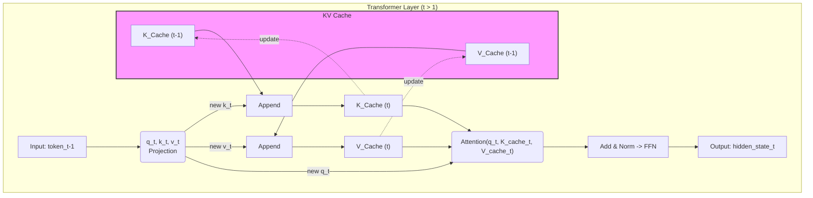

## §0. TL;DR（速覽）

- **一句話總結**：KV Cache 透過快取（cache）並重複使用先前計算過的 Attention 關鍵值（Key）與價值（Value），將語言模型生成下一詞的運算成本從二次方級別降低到線性級別，實現了數量級的加速。
- **Key Takeaways**:
    1.  **問題核心**：傳統的 Autoregressive 生成方式，每生成一個新的 token，都需要重新計算包含新 token 在內的整個序列的 Attention，造成了巨大的運算浪費。
    2.  **解決方案**：KV Cache 的精神是「不要重複計算」。它將每個 token 在每一層 Transformer 計算出的 Key (K) 和 Value (V) 向量儲存起來。
    3.  **兩階段工作**：生成過程分為兩階段。第一是 **Prefill**，一次性處理輸入的 prompt，並將其 K, V 值填滿快取；第二是 **Decoding**，每一步只為「前一個剛生成的 token」計算新的 Q, K, V，並結合快取中「所有過去的 K, V」來預測下一個 token。
    4.  **效益與代價**：KV Cache 大幅提升了生成速度（throughput）並降低了延遲（latency），但代價是需要額外的 GPU 記憶體來儲存這些快取的 K, V 值。這個記憶體佔用量與序列長度成正比，是長文本生成的主要瓶頸。

## §1. Motivation（為什麼要這堂課）

在前面的課程中，我們已經了解了 Transformer 架構如何透過 Self-Attention 機制捕捉序列中的依賴關係，成為當代語言模型的基石。然而，當我們將這個強大的模型應用於「生成」任務時，一個嚴峻的效能問題便浮出水面。這個問題，正是我們今天要探討的核心動機。

語言模型的生成過程，本質上是一個 **Autoregressive（自迴歸）** 的過程。這就像一位醫師在寫病程紀錄（progress note）：他會先寫下主訴（chief complaint），然後根據主訴寫下現在病史（present illness），再根據這兩者去寫理學檢查（physical examination）的發現。每一個新寫的句子，都基於前面已經寫下的所有內容。語言模型也是如此，它一次生成一個 token（可以理解為一個詞或一個字元），並將剛生成的 token 附加到現有序列的末尾，作為下一步生成的輸入。

想像一下這個過程的 naïve（樸素）實現方式。假設我們的輸入 prompt 是「病人主訴發燒」，模型生成了第一個 token「三天」。現在序列變成了「病人主訴發燒三天」。為了生成下一個 token，模型需要將這整個新序列重新丟入 Transformer 計算一次。接著，假設它生成了「，」，序列變成「病人主訴發燒三天，」，模型又要再把這更長的序列整個重新計算一次。

問題在哪裡？在於 Transformer 的核心——Self-Attention 的計算複雜度是 O(n²)，其中 n 是序列長度。這意味著，序列長度每增加一個 token，Attention 的計算量不僅會增加，而且是以平方等級增加。更糟糕的是，在每一步生成中，我們都在重複計算那些「從未改變過」的舊 token 的 Attention 資訊。當我們要為「病人主訴發燒三天」生成下一個 token 時，我們其實又把「病人主訴發燒」這部分的 Attention 從頭到尾算了一遍。這就像是一位外科醫師，每次進入開刀房前，都要把這位病患從出生到現在的「所有」病歷，包含他三歲時的感冒紀錄，全部重新讀一遍。這顯然是極大的浪費。

這種樸素的生成方式，使得序列越長，生成下一個 token 的時間就越久。當我們要生成一篇數千字的長文，或是在寫一個數百行的程式碼時，這種延遲會變得無法忍受。整個生成過程的總複雜度會達到 O(n³)，這在實務上是不可行的。

因此，產業與學術界都迫切需要一個機制，來打破這個效能瓶頸。我們需要一個方法，能夠讓我們「記得」那些已經計算過的資訊，避免在每一步都從頭來過。這個方法，必須將每一步生成的成本，從與整個序列長度相關，降低到只與「新增加的那一個 token」相關。這，就是 KV Cache 誕生的理由。它徹底改變了語言模型生成的工作流程，是所有現代大型語言模型（LLMs）能夠實現快速、長文本生成的關鍵技術。

## §2. 背景知識補完（Prerequisites）

在深入 KV Cache 的機制之前，讓我們先補完幾個你會需要的核心背景知識。這些概念是理解 KV Cache 為何有效、以及它如何運作的基礎。

1.  **Autoregressive Generation（自迴歸生成）**
    -   **嚴謹定義**：在機率模型中，一個變數的預測值，僅由其自身過去的值所決定。在語言模型中，下一個 token 的機率分佈，是由所有在它之前已經生成的 token 序列來決定的，亦即 `P(token_t | token_1, ..., token_{t-1})`。
    -   **白話版**：這就是「一個字一個字（或一個詞一個詞）往後接龍」的過程。模型吐出一個字，看著包含這個新字的整句話，再決定下一個字要吐什麼，不斷重複。就像你打字時，輸入法會根據你已經打的字，來預測你下一個可能想打的詞。
    -   **為何本堂會用到**：KV Cache 正是為了解決 Autoregressive 生成過程中，因序列不斷變長而導致的重複計算問題。理解這個「序列在每一步都會增長」的特性，是理解 KV Cache 動機的關鍵。

2.  **Transformer Self-Attention（Transformer 自我注意力機制）**
    -   **嚴謹定義**：一種計算序列中每個位置的「表示（representation）」的機制。它透過將每個 token 的 `query (Q)` 向量，與序列中「所有」token 的 `key (K)` 向量進行點積運算，得到一組 attention scores，再用這組分數去加權「所有」token 的 `value (V)` 向量，最終得到該 token 的新表示。公式為 `Attention(Q, K, V) = softmax(QK^T / sqrt(d_k))V`。
    -   **白話版**：想像你在看一份病歷，要判斷「metformin」這個藥物在這份病歷中的意義（新的 V）。你會先產生一個關於它的問題（Q），例如「這個 metformin 是用來治療什麼病的？」。然後你掃描整份病歷（所有的 K），找到相關的關鍵字，如「diabetes mellitus」、「type 2 DM」等。這些關鍵字與你的問題越相關（Q·K 的分數越高），你就越會「注意」這些地方對應的上下文資訊（對應的 V），最後綜合這些資訊，得出你對「metformin」這個詞的最終理解。
    -   **為何本堂會用到**：KV Cache 的名字就直接告訴我們了——它快取的就是 Self-Attention 計算中用到的 Key (K) 和 Value (V) 向量。Attention 的計算可以被拆解，KV Cache 的核心洞見是，對於序列中那些位置不變的舊 token 來說，它們的 K 和 V 向量在後續的生成步驟中是**不會改變的**，因此可以被快取並重複使用。

3.  **Computational Complexity / Big O Notation（計算複雜度 / 大 O 符號）**
    -   **嚴謹定義**：一種用來描述演算法執行時間或所需空間，如何隨著輸入資料大小增長而變化的數學符號。它關注的是當輸入規模趨近於無窮大時的增長率。
    -   **白話版**：這是衡量一個程式跑得「快」或「慢」的通用語言，但它衡量的不是絕對秒數，而是「效率的成長趨勢」。O(n) 表示處理 n 個資料需要 n 個單位的時間，效率很穩定；O(n²) 表示處理 n 個資料需要 n*n 個單位的時間，資料一多，執行時間就會急遽爆炸。
    -   **為何本堂會用到**：我們將用 Big O 符號來量化 KV Cache 帶來的效能提升。樸素的 Autoregressive 生成，每一步 Attention 計算是 O(n²)，總共是 O(n³)。而使用 KV Cache 後，每一步解碼的計算量被降至 O(n)，使得總複雜度降為 O(n²)。這是從「不可行」到「可行」的巨大飛躍。

4.  **GPU Memory（GPU 記憶體）**
    -   **嚴謹定義**：專門為圖形處理器（Graphics Processing Unit, GPU）設計的高頻寬記憶體，也稱為 VRAM。在深度學習中，模型權重、輸入資料、中間計算結果（activations）以及像 KV Cache 這樣的快取，都必須載入到 GPU Memory 中才能進行高速運算。
    -   **白話版**：你可以把 GPU Memory 想像成手術台上那塊無菌的器械盤。所有手術中會用到的器械（模型權重）、病人的組織（輸入資料）、以及過程中切下來的檢體（中間結果），都必須先放在這塊盤子上，主刀醫師（GPU 核心）才能快速取用。如果盤子不夠大，就得頻繁地跟台下的流動護理師交換器械，速度就會慢下來。
    -   **為何本堂會用到**：KV Cache 雖然大幅提升了「計算速度」，但它的代價是「空間」。快取的 K 和 V 向量會佔用大量的 GPU Memory。這個記憶體佔用量與序列長度成正比，往往比模型本身的權重還要大。因此，KV Cache 的大小是決定一個模型能處理多長上下文（context window）的關鍵瓶頸。

## §3. 核心概念辭典（Core Concepts Glossary）

本章節專門介紹 KV Cache 這一技術本身引入的核心術語。

1.  **KV Cache**
    -   **嚴謹定義**：在 Autoregressive 生成 Transformer 模型的過程中，用於儲存先前所有 token 在每一個解碼器層（decoder layer）所產生的 Key (K) 和 Value (V) 向量的快取。
    -   **白話重述**：這是一個存在 GPU 記憶體中的「記憶筆記本」。當模型處理完一個 token 後，就把這個 token 的 K 和 V 值（可以想像成它的「身份標籤」和「攜帶的資訊」）記在筆記本上。下一輪，當新 token 進來時，模型只需要計算新 token 的 Q、K、V，然後翻開這本筆記本，就能看到所有前面 token 的 K 和 V，無需重新計算它們。
    -   **常見誤解**：KV Cache 不是只存一組 K 和 V。它存在於 Transformer 的「每一層」解碼器中。如果一個模型有 96 層，那麼就會有 96 組獨立的 KV Cache。此外，如果使用了 Multi-Head Attention，每個頭（head）都會有自己的 K 和 V，所以快取的大小是 `(層數) x (批次大小) x (頭數) x (序列長度) x (頭維度)`。

2.  **Prefill Phase（預填階段）**
    -   **嚴謹定義**：在 Autoregressive 生成開始時，對使用者提供的輸入 prompt（即 context）進行的單次、平行的前向傳播（forward pass）計算。此階段的目的是計算並填充（populate）所有 prompt token 的 KV Cache。
    -   **白話重述**：這是生成過程的第一步，也是計算量最大的一步。想像你給 ChatGPT 一長串背景資料，然後問一個問題。在你看到任何回答之前，模型會先把你的背景資料「讀進去」並「消化」一遍。這個「消化」的過程就是 Prefill。它會一次性地、並行地計算出你輸入的所有 token 的 K 和 V 值，把它們塞進 KV Cache 這個「筆記本」裡，為接下來的逐字生成做好準備。
    -   **相近概念區辨**：Prefill 階段的計算模式與模型的「訓練（training）」或「批次推論（batch inference）」非常相似，因為它一次處理一個較長的序列。這與下一步的 Decoding 階段有本質的不同。

3.  **Decoding Phase / Generation Phase（解碼階段 / 生成階段）**
    -   **嚴謹定義**：在 Prefill 階段之後，模型逐一生成新 token 的迭代過程。在每一步 `t`，模型僅對剛生成的 `t-1` 時刻的 token 進行前向傳播，計算其 Q, K, V 向量，然後將新的 K, V 向量追加（append）到 KV Cache 中，並用新的 Q 向量與「整個」KV Cache（包含所有歷史 K, V）進行 Attention 計算，以預測 `t` 時刻的 token。
    -   **白話重述**：這是你實際看到模型一個字一個字「打字」出來的過程。每打一個新字，它做的運算其實非常少：只處理剛剛打出來的那個字，算出它的 Q, K, V。然後，它拿著這個新 Q，去跟「筆記本」裡記錄的所有歷史 K 進行比對，得到注意力分數，再用這些分數去加權「筆記本」裡的所有歷史 V，最後得出下一個字。
    -   **相近概念區辨**：Decoding 階段的特點是序列長度只增加 1，批次大小通常也很大（因為同時為很多使用者服務）。它的計算瓶頸通常不在於浮點數運算（FLOPs），而在於從 GPU Memory 讀取龐大的 KV Cache 的速度，我們稱之為「記憶體頻寬瓶頸（memory bandwidth bound）」。

4.  **Attention with KV Cache（使用 KV Cache 的注意力機制）**
    -   **嚴謹定義**：在解碼階段第 `t` 步，一個 token 的 Attention 輸出是透過其自身的 `query` 向量 `q_t`，與「整個序列歷史」的 `key` 向量 `[k_1, ..., k_t]` 和 `value` 向量 `[v_1, ..., v_t]` 計算得出的。其中，`k_1...k_{t-1}` 和 `v_1...v_{t-1}` 來自於快取，而 `q_t, k_t, v_t` 是當前步驟新計算的。
    -   **白話重述**：這改變了 Attention 的「視角」。在沒有快取的樸素方法中，每一步我們都重新計算 `Attention(Q_full, K_full, V_full)`。有了快取後，在解碼的第 `t` 步，我們只計算 `q_t, k_t, v_t`，然後把 `k_t, v_t` 加到快取後面，變成 `K_cache_new`, `V_cache_new`。接著，計算 `Attention(q_t, K_cache_new, V_cache_new)`。關鍵在於，Query 只有一個向量 `q_t`，而 Key 和 Value 則是完整的歷史。
    -   **常見誤解**：很多人誤以為用了 KV Cache 後，Attention 就只看得到最近的幾個 token。這是不對的。KV Cache **完全**保留了原始 Attention 的數學等價性，只要快取沒有被清除或截斷，模型在生成第 1000 個 token 時，依然能直接 attend to 第 1 個 token，看到完整的上下文。

5.  **Cache Eviction / Windowed Attention（快取驅逐 / 窗口化注意力）**
    -   **嚴謹定義**：當生成的序列長度超過 KV Cache 的預設容量，或超過模型的上下文窗口限制時，需要用一種策略來捨棄部分舊的 K, V 向量，以騰出空間給新的 K, V 向量。最常見的策略是 Sliding Window Attention，即只保留最近的 `W` 個 token 的快取。
    -   **白話重述**：當你的「記憶筆記本」寫滿了怎麼辦？最簡單的方法就是把最前面、最舊的幾頁撕掉，騰出空位寫新的筆記。這就是快取驅逐。例如，一個有 4096 token 上下文窗口的模型，當要生成第 4097 個 token 時，它可能會把第 1 個 token 的 KV 快取丟掉。
    -   **相近概念區辨**：Sliding Window 是一種簡單的驅逐策略，但它有個問題：可能會丟掉一些像「系統指令」或「角色設定」這樣位於開頭但非常重要的資訊。因此，更進階的策略如 StreamingLLM 提出了「注意力沉降（Attention Sink）」的概念，發現保留開頭的幾個 token（sink tokens）和結尾的幾個 token，即使中間有空缺，也能讓模型表現得很好。

6.  **Multi-Query Attention (MQA) & Grouped-Query Attention (GQA)**
    -   **嚴謹定義**：為了解決 KV Cache 記憶體佔用問題而提出的 Attention 機制變體。標準的 Multi-Head Attention (MHA) 中，每個頭都有一組獨立的 K, V 投影權重。在 MQA 中，所有的頭共享同一組 K, V 投影權重。GQA 則是介於 MHA 和 MQA 之間的折衷，將多個頭分組，組內的頭共享 K, V 權重。
    -   **白話重述**：如果說標準 Attention 是每個專家（頭）都自己做一套完整的筆記（K, V），那麼 MQA 就是所有專家共用同一本公開的筆記。GQA 則是幾個關係比較好的專家（一個小組）共用一本筆記。這樣做的好處是，「筆記本」的總頁數（KV Cache 的總大小）大幅減少了，從而節省了大量的 GPU Memory，並加快了讀取速度。
    -   **常見誤解**：MQA/GQA 是一種近似，它在理論上會損失一些模型表達能力，因為不同頭的「筆記」變得一樣或相似了。但在實踐中，研究發現這種性能損失非常小，而它帶來的記憶體和速度收益卻極其顯著，因此 MQA 和 GQA 已經成為現代高效能 LLM（如 Llama 2/3, Mistral）的標準配置。

## §4. System / Paper Deep Dive

現在，讓我們深入 KV Cache 的運作細節。我們將從架構、演算法、資料結構和一個完整的演練來剖析它。

### 4.1 Architecture（架構）

從架構上看，KV Cache 並不是一個獨立的外部系統，而是緊密整合在 Transformer 解碼器內部的一種流程優化。我們可以比較一下沒有和有 KV Cache 的生成流程差異。

**無 KV Cache 的 naïve 生成流程**

在每一步生成 `t`：
1.  將整個序列 `[token_1, ..., token_{t-1}]` 作為輸入。
2.  在每個 Transformer 層中，為序列中的「所有」token 計算 Q, K, V 矩陣。
3.  執行完整的 Self-Attention 計算。
4.  得到下一個 token `token_t` 的 logits。
5.  將 `token_t` 加入序列，進入下一步 `t+1`，重複整個過程。

**有 KV Cache 的生成流程**

這個流程分為兩個階段：

**Stage 1: Prefill**
1.  輸入為完整的 prompt 序列 `[token_1, ..., token_n]`。
2.  在每個 Transformer 層中，為這 `n` 個 token 計算 Q, K, V 矩陣。
3.  執行 Self-Attention。
4.  **關鍵步驟**：將計算出的 `K` 和 `V` 矩陣（`[K_1..n]` 和 `[V_1..n]`）儲存到該層的 KV Cache 中。
5.  得到下一個 token `token_{n+1}` 的 logits。

**Stage 2: Decoding**
在之後的每一步 `t` (t > n+1)：
1.  輸入僅為上一步剛生成的 token `token_{t-1}`。
2.  在每個 Transformer 層中，僅為這「一個」token 計算新的 `q_t`, `k_t`, `v_t` 向量。
3.  **關鍵步驟**：從快取中讀取歷史的 `K_cache = [K_1..t-1]` 和 `V_cache = [V_1..t-1]`。
4.  將新的 `k_t`, `v_t` 追加到快取中，形成 `K_new_cache`, `V_new_cache`。
5.  使用新的 `q_t` 和更新後的 `K_new_cache`, `V_new_cache` 進行 Attention 計算。
6.  得到下一個 token `token_t` 的 logits。

下面的 Mermaid 圖清晰地展示了 Decoding 階段的數據流：



這個架構的核心優勢在於，Decoding 階段的計算量和記憶體讀取量，都只和「一個」新 token 相關，而 Attention 的計算範圍又能涵蓋「整個」歷史，完美地兼顧了效率和效果。

### 4.2 關鍵演算法

我們可以透過偽程式碼更精確地理解這個演算法的差異。

**演算法 1：樸素的自迴歸生成**
```python
def generate_naive(model, prompt_tokens, max_new_tokens):
    # Concatenate prompt and generated tokens
    tokens = list(prompt_tokens)

    for _ in range(max_new_tokens):
        # Input the entire sequence every time
        # This has a computational complexity of O(len(tokens)^2)
        hidden_states = model.forward(tokens)
        
        # Get the logits for the very last token
        next_token_logits = hidden_states[-1]
        next_token_id = argmax(next_token_logits)
        
        # Append the new token and repeat
        tokens.append(next_token_id)
        
    return tokens
```

**演算法 2：使用 KV Cache 的生成**
```python
def generate_with_kv_cache(model, prompt_tokens, max_new_tokens):
    # 1. Prefill Phase
    # Process the whole prompt at once
    # The returned 'past_key_values' is our initial KV Cache
    hidden_states, past_key_values = model.forward(prompt_tokens, use_cache=True)
    
    # Get the next token
    next_token_logits = hidden_states[-1]
    next_token_id = argmax(next_token_logits)
    
    generated_tokens = [next_token_id]

    # 2. Decoding Phase
    for _ in range(max_new_tokens - 1):
        # Input only the single last token
        # Pass the cache from the previous step
        # This step has a complexity of O(len(generated_tokens))
        hidden_states, past_key_values = model.forward(
            tokens=[next_token_id], 
            past_key_values=past_key_values,
            use_cache=True
        )
        
        # Get the new next token
        next_token_logits = hidden_states[-1]
        next_token_id = argmax(next_token_logits)
        
        generated_tokens.append(next_token_id)
        
    return prompt_tokens + generated_tokens
```
對比兩個演算法，關鍵差異在於 `for` 迴圈內部。演算法 1 的 `model.forward` 每次都處理一個增長的序列 `tokens`，而演算法 2 的 `model.forward` 始終只處理一個單一的 `next_token_id`，並透過傳遞 `past_key_values` 來維持上下文歷史。

### 4.3 關鍵資料結構

KV Cache 的資料結構在 Hugging Face Transformers 函式庫中有一個標準的實現。它通常是一個元組（tuple），長度等於模型的層數。元組中的每個元素，又是另一個包含 Key 快取和 Value 快取的元組。

`kv_cache = (layer_1_cache, layer_2_cache, ..., layer_L_cache)`

其中，每一層的快取 `layer_i_cache` 是：

`layer_i_cache = (key_cache_tensor, value_cache_tensor)`

而 `key_cache_tensor` 和 `value_cache_tensor` 的維度（shape）通常是：

`[batch_size, num_heads, sequence_length, head_dim]`

讓我們用一個表格來拆解這個資料結構：

| 維度 (

## 5. 真實世界類比（Real-World Analogies）

KV Cache 的核心思想——「重複使用過去的計算結果以加速未來」——在我們的日常，尤其是在高壓、高資訊量的醫療環境中，其實無處不在。為了讓這個抽象的計算機科學概念更具體，我們來看看三個來自臨床工作流程的類比。

### 5.1 類比一：晨會交班與病程紀錄 (Morning Meeting Handoff & Progress Notes)

**情境描述：**
想像你是外科的住院醫師，每天早上 7 點晨會，你需要向主治醫師報告你負責的 15 床病人。對於一個剛開完大刀、住在加護病房的病人，你昨天的報告內容可能長達 10 分鐘，鉅細靡遺地描述了從入院、術前評估、手術過程、到術後第一天所有生命徵象、引流管、實驗室數據的細節。今天早上，當你再次報告同一個病人時，你會怎麼做？你絕對不會從「這位 65 歲男性，因為腹痛來到急診...」這句開場白再講一次。你會說：「報告王醫師，床號 23 號的陳先生，昨天開完 Whipple 수술的 POD#1 (Post-Operative Day 1)，昨晚 I/O (Intake/Output) 是 +1500mL，vitals (生命徵象) a-a-s (awake and alert, afebrile, stable)，今天早上 data...」。你只花了 30 秒就進入重點。你預設了主治醫師腦中已經有了這個病人的「上下文」，你只需要提供「新的資訊」來讓他做出「下一個決策」。

**對應關係表：**

| Transformer 概念 | 臨床類比 |
| :--- | :--- |
| **Prompt (初始輸入)** | 病人第一次入院的完整病歷 (Admission Note) 或首次詳細報告 |
| **Token** | 病歷中的一個字、一個數據、或一句話 |
| **Key (K) Vector** | 病歷中每個資訊片段的「內容摘要」(例如，「WBC: 18000」這個事實) |
| **Value (V) Vector** | 該資訊片段的「重要性/意義」(例如，「WBC: 18000」代表「感染跡象」) |
| **Query (Q) Vector** | 你 (報告者) 為了產生下一個報告重點，當下腦中的「疑問」 (例如，「現在最關鍵的變化是什麼？」) |
| **Attention Score** | 你的大腦在眾多病歷資訊中，為當下的「疑問」分配的「注意力權重」 |
| **Forward Pass (無 Cache)** | 每次報告都從頭背誦一次完整的 Admission Note |
| **KV Cache** | 主治醫師腦中已經建立的病人「病程摘要」(Progress Note) |
| **下一個 Token 的生成** | 你根據腦中病程摘要，加上最新數據，報告出下一句結論 |
| **使用 KV Cache 的 Forward Pass** | 晨會時，直接從昨天的病程進展開始報告，只處理新產生的數據 |

**✅ 吻合之處 (Why this analogy works):**

- **效率提升**：有了病程紀錄（KV Cache），主治醫師（模型）不需要每次都重新閱讀整本病歷（Prompt），極大地節省了時間和認知負擔，讓他能快速針對新狀況做出反應。
- **狀態維持**：病程紀錄忠實地保存了病人「到目前為止」的所有關鍵狀態。這和 KV Cache 保存了所有先前 token 的 Key/Value 資訊是完全一樣的。
- **滾動更新**：每天的病程紀錄都是在前一天的基礎上增加新的內容，而不是重寫。KV Cache 同樣是在每一次生成 token 後，將新的 K 和 V 向量疊加到舊的 cache 上。

**⚠️ 不吻合之處 (Where this analogy breaks):**

- **Cache 的精確性**：醫師對病人的記憶是模糊且可能出錯的，是一種有損壓縮。而 KV Cache 是數學上精確、無損的儲存，它忠實記錄了每一個 token 計算出的 K/V 向量。
- **Query 的來源**：在類比中，報告者的「疑問」（Query）是主觀的。但在 Transformer 中，Query 向量是根據上一個剛生成的 token 精確計算出來的，過程是確定性的。
- **注意力分配**：醫師的注意力可能被無關緊要的細節吸引（例如病人抱怨伙食不好），而忽略關鍵線索。Transformer 的 attention mechanism 是透過嚴格的數學運算（softmax）來決定注意力分配，相對客觀。

### 5.2 類比二：影像判讀與 PACS 系統 (Image Interpretation & PACS)

**情境描述：**
你是一位放射科醫師，正在判讀一位肺癌病人術後追蹤的胸部電腦斷層 (Chest CT)。這位病人三個月前也做過一次 CT。你的工作流程不是只看今天的影像，而是打開 PACS 系統，並排顯示今天和三個月前的影像。你會先快速瀏覽三個月前的報告和關鍵影像 (Key Images)，在你腦中建立一個基準 (baseline)：「嗯，上次的腫瘤在右上肺葉，大小 2.5 公分，邊緣不規則，沒有淋巴結轉移。」然後，你的目光會集中在今天的影像上，尋找與基準的「差異」。你不需要重新測量每一塊正常的肌肉或骨頭，你的大腦利用了「上次的判讀結果」這個快取，把絕大部分的認知資源都用在比較差異、尋找新生病灶或評估治療反應上。

**對應關係表：**

| Transformer 概念 | 臨床類比 |
| :--- | :--- |
| **Prompt** | 完整的醫療影像資訊，包含病人所有歷史影像 |
| **Token** | 影像中的一個像素 (pixel) 或一個體素 (voxel) |
| **Key (K) Vector** | 某個影像區域的「特徵」(例如，「這是一個結節」、「這是一條血管」) |
| **Value (V) Vector** | 該特徵的「臨床意義」(例如，「這個結節可能是惡性的」、「這條血管是正常的」) |
| **Query (Q) Vector** | 你的大腦為了判斷某個新區域，所發出的「探詢」 (例如，「這個新看到的模糊影子，跟舊的腫瘤有關嗎？」) |
| **Attention (無 Cache)** | 把今天和三個月前的所有影像（數百張切片）全部重新、逐片、獨立看完，然後再憑記憶比較 |
| **KV Cache** | 你在 PACS 上調閱的「前次報告」和標示的「Key Images」 |
| **下一個 Token 的生成** | 你在報告上打出下一個關於「變化」的判讀結論 |
| **使用 KV Cache 的 Forward Pass** | 快速掃過舊報告和 Key Images (載入 Cache)，然後專心判讀新影像與舊影像的差異處 |

**✅ 吻合之處 (Why this analogy works):**

- **上下文的重要性**：沒有過去的影像作對比，單次影像判讀的價值大打折扣。同樣，沒有 KV Cache，每次生成 token 都像是獨立事件，無法利用已經存在的上下文。
- **計算資源的聚焦**：就像放射科醫師會把注意力集中在「有變化的區域」，KV Cache 讓模型能將計算資源（矩陣運算）聚焦在如何讓「新的 Query」與「過去所有 Key」互動，而不是重新計算那些已經不變的 Key 和 Value。
- **記憶體與速度的權衡**：PACS 系統需要巨大的儲存空間來存放所有歷史影像 (類似 KV Cache 佔用 VRAM)，但這換來的是無可取代的判讀速度和準確性提升。

**⚠️ 不吻合之處 (Where this analogy breaks):**

- **Cache 的內容**：PACS 存的是原始影像和文字報告，是多模態的。KV Cache 只儲存特定維度的浮點數向量 (K 和 V)，不儲存原始 token 的 embedding。
- **互動性**：醫師可以動態地縮放、調整窗寬、或選擇不同的歷史影像來比較。目前的 KV Cache 基本上是靜態的，一旦 token 的 K/V 被計算出來並存入 cache，它們就不會再改變（除非被 cache eviction 策略移除）。

### 5.3 類比三：會診流程與跨科溝通 (Consultation Workflow)

**情境描述：**
你是心臟內科醫師，接到一封來自骨科的會診單。一位 80 歲的髖關節骨折阿嬤，預計明天要開刀，但術前心電圖顯示 T-wave inversion (T波倒置)，骨科醫師想請你評估手術麻醉風險。你會怎麼做？你會先打開電腦，閱讀骨科醫師寫的會診單和病歷。這份會診單就是一份完美的「上下文快取」，它包含了阿嬤的過去病史（高血壓、糖尿病）、目前狀況（生命徵象穩定、沒有胸痛）、以及最重要的「問題」（Query）：`Assess peri-operative cardiac risk`。你不會從頭開始問阿嬤她幾歲、住哪裡。你會直接利用會診單提供的快取資訊，接著執行你的「新任務」：聽心音、問有沒有喘、安排心臟超音波。最後，你寫下你的會診回覆（Generated Text），這個回覆是基於「骨科提供的上下文」和你「自己新做的檢查」所綜合而成的。

**對應關係表：**

| Transformer 概念 | 臨床類比 |
| :--- | :--- |
| **Prompt** | 整份病歷，包含所有護理紀錄、檢驗報告等 |
| **Token** | 病歷中的一個詞或一個數據 |
| **Key (K) / Value (V) Vectors** | 會診單上，骨科醫師為你精心摘要的「關鍵病史」和其「臨床意義」 |
| **Query (Q) Vector** | 你身為心臟科醫師，為回答會診問題而產生的「專業疑問」(例如，「T-wave 倒置是舊變化還是新變化？」) |
| **Attention (無 Cache)** | 拒絕看會診單，把阿嬤當成一個全新病人，從頭到尾重新問診和檢查一次 |
| **KV Cache** | 骨科醫師寫好、摘要好的那張會診單 |
| **下一個 Token 的生成** | 你在會診回覆單上，寫下下一句評估意見 |
| **使用 KV Cache 的 Forward Pass** | 讀完會診單 (載入 Cache)，直接開始做心臟專科的評估，然後撰寫回覆 |

**✅ 吻合之處 (Why this analogy works):**

- **資訊的提煉與傳遞**：一份好的會診單正是把幾百頁病歷中與該次會診相關的 K/V 提煉出來的過程。這與 KV Cache 儲存了對預測未來最重要的上下文資訊，精神上一致。
- **任務的接力**：會診是一個非同步的接力過程。骨科醫師處理到一半（產生 Prompt），把上下文（KV Cache）交給你，你再繼續處理下去（生成新 token）。這完美詮釋了 autoregressive 生成的本質。
- **角色特異性 (Role-Specific Query)**：骨科醫師的 Query 是「這個病人能不能開刀」，而你的 Query 是「這個心電圖變化有沒有急性風險」。這說明了即使上下文（KV Cache）相同，不同的 Query 會導致不同的注意力權-重和最終輸出。

**⚠️ 不吻合之處 (Where this analogy breaks):**

- **Cache 的更新**：如果你發現會診單上的資訊有誤（例如，血壓寫錯了），你會去更正它。但在標準的 Transformer 中，KV Cache 是不可變的 (immutable)。一旦生成，就不會回頭修改舊的 K/V 向量。如果 Prompt 有錯，唯一的辦法是從頭重新生成。
- **溝通的模糊性**：人類語言寫的會診單充滿模糊地帶，需要醫師的專業解讀。而 K/V 向量是高維空間中精確的數學表示，沒有模糊性。

## 6. 課堂 Q&A 精華

由於本次課程沒有提供逐字稿，這裡我們根據歷來學生對 KV Cache 最常提出的問題，模擬一份 Q&A 精華，並附上教授的回答。

**Q1: KV Cache 會改變模型最終的輸出結果嗎？如果不用 KV Cache，只是慢一點，答案會是一樣的嗎？**
**A**: 這是一個極為關鍵的問題。答案是：**在理想的數學情境下，KV Cache 完全不應該改變模型的任何輸出**。它純粹是一個速度優化 (speed optimization)，而不是一個會影響結果的演算法修改。你可以把它想像成寫程式時，你把一個重複計算的 `for` 迴圈結果存到一個變數裡。這個「快取」動作只會讓程式跑得更快，但最終的計算結果必須完全相同。如果你的 KV Cache 實作導致輸出不一致，那幾乎可以肯定是你的實作中有 bug，例如 cache 的索引算錯、attention mask 沒對上、或是 cache 在不同序列間被錯誤地混用了。

**Q2: 這個 Cache 會無限增長下去嗎？如果我一直讓模型生成新的 token，記憶體不會爆炸嗎？**
**A**: 問得非常好，這直指了 KV Cache 在實務上最大的挑戰：**記憶體管理**。理論上，每生成一個新 token，cache 就會增加一筆 K/V 向量。如果模型的 context window 是 4096，你就必須準備能容納 4096 筆 K/V 向量的記憶體。對於更長的 context window（如 128k），所需的 VRAM 會非常驚人。因此，實務上有多種策略來應對：
1.  **固定大小的 context window**：這是最簡單的，例如 Llama 2 的 4096。一旦生成的 token 數量超過 4096，就無法再生成了。
2.  **滑動窗口 (Sliding Window)**：這是 Mistral 等模型採用的策略。它們可能有一個很大的理論 context（如 32k），但 cache 只保留最近的 N 個 token（例如 N=4096 或 N=8192）。當新的 token 進來時，最舊的 token 就被丟掉。這就像人類的短期記憶，只記得最近發生過的事。
3.  **稀疏注意力 (Sparse Attention)**：更進階的技術，例如 Longformer 或 BigBird，它們不儲存所有 token 的 K/V，而是根據一些規則（例如，全域 attention + 滑動 attention）只儲存一部分。這能大幅降低記憶體需求。

**Q3: 既然 K 和 V 都要被快取，那 Query (Q) 向量為什麼不用快取？**
**A**: 這個問題能幫助你釐清 Q, K, V 在 attention 機制中的角色。`Key` 和 `Value` 是成對出現的，它們代表了過去的每一個 token「是什麼」(Key) 以及它「攜帶什麼資訊」(Value)。一旦一個 token 被處理完，它的 K 和 V 對於後續所有 token 來說是固定的。然而，`Query` 代表的是「我 (當前的 token) 想要尋找什麼樣的資訊」。**每一個新生成的 token 都會產生一個全新的 Query**，這個 Query 會去跟「過去所有」的 Key 做匹配。因為 Query 在每一步都是新的、動態的，所以快取它沒有任何意義。快取的精髓在於儲存那些在未來會被重複利用的、不變的計算結果。

**Q4: 如果我有好幾個使用者同時請求，或者我用一個 batch (批次) 來處理多個序列，KV Cache 要怎麼運作？**
**A**: 這正是工程實作上最複雜的地方。你必須為 batch 中的**每一個獨立序列 (sequence) 維護一份獨立的 KV Cache**。在 GPU 記憶體中，你可能會配置一個形狀類似 `[batch_size, num_heads, sequence_length, head_dim]` 的巨大 tensor 來存放 cache。當你處理這個 batch 時，你需要非常小心地讀取和寫入對應序列的 cache 位置，不能張冠李戴。這也是為什麼很多開源的 LLM 推理框架（如 vLLM, TensorRT-LLM）花費大量精力優化這部分，它們使用一種叫做 PagedAttention 的技術，更有效地管理這些分散的 cache。

**Q5: KV Cache 和一般的程式設計中的 Memoization 有什麼不同？**
**A**: 概念上非常相似，都是「記住過去的計算結果」。但它們應用的層次和內容不同。Memoization 是一個通用概念，通常用在函數層級，快取的 key 是函數的輸入參數，value 是函數的輸出。而 KV Cache 是**專為 Transformer 架構的 attention 機制所設計的**。它快取的不是整個 attention block 的輸出，而是 attention 計算過程中的**中間產物**——Key 和 Value 向量。這是架構特異性 (architecture-specific) 的優化。你可以說 KV Cache 是 Memoization 在 Transformer attention 層的一種高度特化的應用。

**Q6: 如果使用者在輸入框中修改了 Prompt 中間的一個字，是不是整個 KV Cache 就失效了，必須全部重新計算？**
**A**: **是的，完全正確**。這是 KV Cache 最脆弱的地方。因為 attention 機制是「全局」的，任何一個 token 的改變，都會像蝴蝶效應一樣，理論上會影響到它後面所有 token 的 K/V 計算結果。所以只要 Prompt 有任何一個 token 改變、增加或刪除，從那個點開始之後的所有 cache 都必須作廢，重新計算。這也是為什麼你在 ChatGPT 這種介面中編輯中間的文字後，它會從你編輯的地方重新開始生成，而不是只替換那個字。

---

### 最常見誤解 Top 3

1.  **誤解**: KV Cache 是一種壓縮技術，它把過去的資訊壓縮儲存。
    *   **正解**: KV Cache 是**無損的、完整的**儲存，它沒有壓縮任何東西。它只是把先前 token 的 Key 和 Value 向量「原封不動」地保存下來，以供後續步驟直接取用。
2.  **誤解**: KV Cache 會讓模型變得更「聰明」，因為它記得更多東西。
    *   **正解**: KV Cache **不影響模型的智慧或能力**。它只影響速度和效率。模型的智慧完全由它的權重 (weights) 決定。使用 KV Cache 的模型和不使用的模型，在給定相同輸入時，其思考路徑和最終答案是完全一致的。
3.  **誤解**: 只要用了 KV Cache，生成速度就會一直很快。
    *   **正解**: KV Cache 解決的是「處理 Prompt」和「避免重複計算」的效能問題。但當序列變得非常長時，光是讓新的 Query 和長長的 KV Cache (成千上萬的 K/V 向量) 做一次矩陣乘法，這個操作本身也會變得很慢。這時候瓶頸就從「重複計算」轉移到了「記憶體帶寬 (Memory Bandwidth)」，也就是 GPU 把巨大的 cache 從 VRAM 讀取到計算單元的速度。

## 7. 常見陷阱與考點 (What Engineers Actually Get Wrong)

KV Cache 概念簡單，但實作細節繁多，充滿了容易踩進去的坑。許多 bug 都源於對 cache 管理的疏忽。

**陷阱 1：Cache 索引與位置編碼 (Positional Encoding) 不同步**
-   **為何會掉進去**：工程師常常忘記，當你從 cache 中讀取第 `t` 個 token 的 K/V 時，這個 token 在原始序列中的位置仍然是 `t`。在計算 attention 時，你需要確保當前的 Query (在 `t+1` 位置) 和被取出的 Key (在 `t` 位置) 之間的相對位置關係是正確的，特別是對於 Rotary Positional Embedding (RoPE) 這種對位置敏感的編碼方式。如果 cache 的索引和位置編碼的計算錯位，等於是讓模型以為 token 的順序被打亂了。
-   **正確做法**：傳遞給 forward pass 的 `position_ids` 參數必須正確地反映每個 token 的真實位置。例如，當生成第 100 個 token 時，即使你只向模型傳入 1 個新的 token ID，你也要明確告知模型這個 token 的位置是 99 (從 0 開始)。
-   **實例**：一個常見的 bug 是，在生成迴圈中，`position_ids` 總是傳遞 `[0]`，而不是 `[current_length]`。這會導致模型永遠認為自己正在生成第二個 token，從而輸出混亂的結果。

**陷阱 2：Batch 推理時，序列間的 Cache 互相污染**
-   **為何會掉進去**：在處理一個批次 (batch) 的多個序列時，如果共享同一個 cache 空間而沒有做好隔離，序列 A 生成的 K/V 可能會被序列 B 當作自己的上下文，導致災難性的錯誤。
-   **正確做法**：必須為 batch 中的每一個序列分配獨立的 cache 空間。最直接的方法是讓 cache tensor 的第一個維度是 `batch_size` (e.g., `[batch_size, num_heads, seq_len, head_dim]`)。所有針對 cache 的讀寫操作，都必須精確地索引到對應的 `batch_index`。
-   **實例**：vLLM 提出的 PagedAttention 就是為了解決這個問題。它像作業系統管理虛擬記憶體一樣，為每個序列分配非連續的物理記憶體「頁面」來儲存 cache，從而徹底隔離了不同序列的上下文。

**陷阱 3：忘記處理 Attention Mask**
-   **為何會掉進去**：在 autoregressive 生成中，一個 token 只能看到它自己和它之前的 token。這個限制是透過 attention mask 實現的。在使用 KV Cache 時，雖然你只向模型傳入一個新的 token，但這個新 token 必須能看到 cache 中儲存的所有歷史 token。工程師可能只為這個新 token 創建了一個大小為 `[1, 1]` 的 mask，而忘記了它需要一個能覆蓋歷史長度的 mask `[1, 1 + past_sequence_length]`。
-   **正確做法**：Attention mask 的維度必須總是 `(batch_size, query_length, key_length)`。在使用 cache 時，`query_length` 通常是 1，但 `key_length` 必須是 `1 + past_sequence_length`。要確保 mask 正確地允許新的 Query 看到所有舊的 Key。

**陷阱 4：Cache 的資料型態 (dtype) 與模型權重不匹配**
-   **為何會掉進去**：為了節省記憶體，有些人會嘗試用較低的精度（如 `float16` 或 `int8`）來儲存 cache。但如果模型的計算（例如矩陣乘法）期望的是 `float32`，這種不匹配會導致嚴重的精度損失或硬體錯誤。
-   **正確做法**：確保 cache tensor 的 `dtype` 和 `device` (e.g., `cuda:0`) 與模型權重完全一致。任何型態轉換都必須是有意為之且經過驗證的（例如在 Quantization 流程中）。

**陷阱 5：對可變序列長度的處理不當**
-   **為何會掉進去**：在一個 batch 中，不同序列的長度往往不同。例如，序列 A 可能有 100 個 token，序列 B 有 200 個。這意味著它們的 cache 長度也不同。如果 cache tensor 是一個固定大小的矩形（例如 `[batch_size, num_heads, 512, head_dim]`），你需要手動管理每個序列的實際長度，避免它們讀到屬於其他序列、但還在 padding 區域的無效 cache 內容。
-   **正確做法**：除了 cache tensor 本身，還需要一個額外的機制來追蹤每個序列的真實長度。Attention mask 在這裡也扮演了關鍵角色，它可以確保 padding部分的 token（無論是 prompt 還是 cache）的 attention score 被設為負無限大，從而在 softmax 後變為 0。

**陷阱 6：忽略了 Beam Search 等複雜生成策略對 Cache 的要求**
-   **為何會掉進去**：在 `beam search` 中，模型在每一步都會維持 `num_beams` 個最可能的候選序列。這意味著你也必須為**每一個 beam 維護一套獨立的 KV Cache**。當某個 beam 被剪枝，其對應的 cache 也要被丟棄。當 beam 的順序因為分數變化而重新排列時，其對應的 cache 也要跟著重新排列。這是一個極其複雜且容易出錯的管理過程。
-   **正確做法**：Hugging Face `transformers` 函式庫的 `generate` 函數內部有非常複雜的邏輯來處理這個問題。它會根據需要動態地複製、擴展和重新排序 (reorder) cache。如果你要自己實作，必須仔細追蹤每個 beam 和其父節點的關係，確保 cache 的繼承和複制是正確的。

## 8. 自測題

這 10 道題目涵蓋了本堂課的關鍵概念，試著在不回看筆記的情況下回答，然後展開答案核對。

1.  **(概念題)** KV Cache 優化主要解決了大型語言模型在哪個階段的效能瓶頸？它為何能帶來巨大的速度提升？

<details><summary>展開答案</summary>

KV Cache 主要解決的是**自回歸生成 (autoregressive generation) 階段**的效能瓶頸。

在生成第 N+1 個 token 時，如果沒有 cache，模型需要重新處理從第 1 到第 N 個 token 的全部序列，來計算它們的 Key 和 Value 向量。這意味著大量的重複計算。

KV Cache 透過儲存並重複使用第 1 到第 N 個 token 的 Key 和 Value 向量，使得模型在生成第 N+1 個 token 時，只需要計算「新」token 的 Query、Key 和 Value，然後讓這個新的 Query 與「所有歷史」的 Key-Value (來自 cache) 互動即可。這將一個原本時間複雜度為 O(N²) 的過程（每個新 token 都要重新看 N 個舊 token）變成了一個接近 O(N) 的過程（每個新 token 只需和 N 個已算好的 K/V 互動），因此帶來了巨大的速度提升。

</details>

2.  **(概念題)** 在 Transformer 的自注意力機制中，Query, Key, Value 三者，為什麼只有 Key 和 Value 被快取，而 Query 不需要？

<details><summary>展開答案</summary>

- **Key (K) 和 Value (V)**：這兩者代表了序列中一個 token 的**身份**和**內涵**。一個 token (例如「蘋果」) 一旦出現在序列的特定位置，它用來被「查詢」的 Key (例如，代表「這是一個水果」) 和它能「提供」的 Value (例如，代表「紅色、甜的」) 就被計算出來且固定不變了。對於後續所有新生成的 token 來說，這個「蘋果」的 K/V 都是一個可以重複利用的、已知的上下文資訊。

- **Query (Q)**：Query 代表了「當前」要生成新 token 的位置，它所發出的**探詢**或**疑問**。例如，在「我喜歡吃...」這個句子後面，模型要生成下一個字，它會產生一個 Query，這個 Query 可能是在問「前面提到過什麼食物嗎？」。這個 Query 是動態的，取決於剛生成的上一個字。因為每一步的 Query 都不同，所以快取它沒有任何意義。

簡單來說：K 和 V 是**過去的、靜態的**資訊；Q 是**現在的、動態的**提問。我們快取靜態的資訊，來服務動態的提問。

</details>

3.  **(情境題)** 一個擁有 4096 token context window 的模型，在處理一個 1000 token 的 Prompt 後，需要生成第 1001 個 token。在有和沒有 KV Cache 的情況下，模型 attention 層的計算量級分別是什麼？

<details><summary>展開答案</summary>

- **沒有 KV Cache**：
    1.  模型需要接收全部 1000 個 token 作為輸入。
    2.  對這 1000 個 token 進行一次完整的 forward pass，計算出 1000 組 Q, K, V 向量。
    3.  Attention 計算量級約為 `1000 (queries) * 1000 (keys)`。
    4.  最終只使用在第 1000 個位置上的輸出，來預測第 1001 個 token。
    這個過程非常浪費，因為前 999 個位置的計算結果都被丟棄了。

- **有 KV Cache**：
    這個過程分為兩步：
    1.  **處理 Prompt (prefill)**：模型接收 1000 個 token，進行一次完整的 forward pass。計算量級仍是 `1000 * 1000`。但這次，它會將所有 1000 組 K 和 V 向量儲存到 KV Cache 中。
    2.  **生成第 1001 個 token (decoding)**：模型只需要接收第 1000 個 token 的輸出所預測出的第 1001 個 token ID 作為**單一輸入**。它只為這 1 個新 token 計算 1 組 Q, K, V。然後，這個新的 Q 會和 cache 中的 1000 組 K/V 進行 attention 計算。Attention 計算量級約為 `1 (new query) * 1000 (cached keys)`。

**結論**：雖然初次處理 Prompt 的計算量相同，但在生成階段，KV Cache 將計算量從 O(N²) 降低到了 O(N)，N 是序列長度。

</details>

4.  **(Debug 題)** 你實作了 KV Cache，但發現模型生成的文字品質大幅下降，充滿了不連貫的重複語句。你懷疑是 cache 的管理出了問題。你首先會檢查哪個部分？

<details><summary>展開答案</summary>

最可能出問題的地方是**`position_ids` (位置 ID) 的管理**。

充滿不連貫的重複語句，一個典型的症狀是模型「忘記」了自己已經生成了多長的序列，不斷地重複它在初始階段生成的內容。這通常發生在生成迴圈中，你傳遞給模型的 `position_ids` 參數沒有正確地遞增。

例如，正確的做法是，在生成第 `t` 個 token 時，傳入的 `position_ids` 應該是 `[t-1]`。但一個常見的 bug 是，無論生成到哪一步，傳入的 `position_ids` 始終是 `[0]` 或 `[1]`。這等於是欺騙模型，讓它以為自己永遠在處理序列的開頭部分，導致它陷入一個小的迴圈中不斷重複。檢查生成迴圈中 `position_ids` 的更新邏輯是 debug 的首要步驟。

</details>

5.  **(概念題)** 滑動窗口注意力 (Sliding Window Attention) 是如何解決 KV Cache 記憶體無限增長問題的？它有什麼潛在缺點？

<details><summary>展開答案</summary>

- **解決方案**：滑動窗口機制為 KV Cache 設定了一個固定的大小上限，例如 4096 tokens。當序列長度超過這個上限時，每當有一個新的 token (及其 K/V 向量) 要被加入 cache，最老的一個 token (及其 K/V 向量) 就會被從 cache 中丟棄。就像一個先進先出的佇列 (FIFO queue)。這確保了 cache 的大小始終保持在一個可控的範圍內，從而避免了記憶體無限增長。

- **潛在缺點**：最主要的缺點是**資訊丟失**。模型會「忘記」很久以前的上下文。如果 Prompt 的開頭有一個非常重要的指令（例如，「請你扮演一位莎士ビア風格的詩人」），在生成了數千個 token 後，這個指令可能會被滑出 cache 窗口，導致模型後續的生成風格發生「漂移」，忘記了自己最初的角色設定。

</details>

6.  **(情境題)** 你正在使用一個 LLM API，你發現每次請求的收費是根據「輸入 token 數 + 輸出 token 數」來計算的。這和 KV Cache 的運作模式有什麼關聯？

<details><summary>展開答案</summary>

這種計費模式完美地反映了 KV Cache 的運作原理和成本結構。

1.  **輸入 token 數 (Prompt tokens)**：這對應了 KV Cache 的 **prefill / processing 階段**。API 服務商需要為你的整個 Prompt 執行一次完整的 forward pass 來建立初始的 KV Cache。這個計算成本與你的 Prompt 長度成正比，所以他們按輸入 token 數收費。
2.  **輸出 token 數 (Generated tokens)**：這對應了 KV Cache 的 **decoding / generation 階段**。每生成一個新的 token，服務商都需要執行一次 forward pass。雖然 grâce à KV Cache，這一步的計算量比 prefill 要小，但它仍然需要消耗計算資源。這個成本與你生成的 token 數量成正比，所以他們按輸出 token 數收費。

所以，整個 API 的計費模型，可以看作是 `Cost(Prefill) + Cost(Decoding) * Num_Generated_Tokens` 的簡化版。這也解釋了為什麼長的 Prompt（即使只生成一個字）通常比短的 Prompt（生成很多字）的初始費用要高。

</details>

7.  **(Debug 題)** 你在一個 `batch_size > 1` 的推理場景中使用了 KV Cache。你發現，batch 裡的第一個序列輸出正常，但第二個序列的輸出完全是胡言亂語，似乎「串擾」了第一個序列的內容。問題最可能出在哪裡？

<details><summary>展開答案</summary>

問題最可能出在 **KV Cache 的張量 (tensor) 沒有被正確地按 `batch_index` 隔離**。

當 `batch_size > 1` 時，你必須為 batch 中的每一個序列維護一套獨立的 cache。如果你的 cache tensor 的形狀是 `[num_heads, seq_len, head_dim]`，而沒有 `batch_size` 這個維度，或者在讀寫 cache 時沒有使用正確的 `batch_index` 去索引，那麼所有序列就會讀寫到同一個共享的 cache 空間。

在這種情況下，第一個序列執行時，會把它的 K/V 寫入 cache。輪到第二個序列執行時，它錯誤地讀取了第一個序列留下的 cache，把不屬於自己的上下文當作了輸入，自然會生成胡言亂語。正確的 cache tensor 形狀應該至少是 `[batch_size, num_heads, seq_len, head_dim]`，並且所有操作都要確保在正確的 `batch_index` 上進行。

</details>

8.  **(概念題)** KV Cache 是模型權重 (weights) 的一部分嗎？它會隨著模型一起被儲存和載入嗎？

<details><summary>展開答案</summary>

**完全不是。** 這是一個非常重要的區分。

- **模型權重 (Weights)**：是模型透過在大量資料上訓練學習到的參數。它們是靜態的，代表了模型的「知識」。它們被儲存在模型檔案中（例如 `.pth` 或 `.safetensors` 檔），在模型載入時讀入記憶體，並且在整個推理過程中保持不變。
- **KV Cache**：是一個**動態的、運行時的**狀態快取。它是在處理一個「特定」的輸入序列時，**臨時生成**的中間計算結果。它的生命週期僅限於當次請求。當一個新的請求進來時，KV Cache 會被清空並重新建立。它絕對不會被儲存到模型檔案中。

你可以把模型權重比作一本教科書（知識本身），而 KV Cache 是你在解一道特定數學題時，在草稿紙上寫下的中間步驟。解完這道題，草稿紙就沒用了。

</details>

9.  **(情境題)** 如果一個模型宣稱它的 Context Window 是 128k tokens，這對 KV Cache 的 VRAM 佔用意味著什麼？

<details><summary>展開答案</summary>

這意味著極其巨大的 VRAM 佔用。

KV Cache 的大小計算公式約為：
`2 * num_layers * num_heads * head_dim * sequence_length * precision_in_bytes`
(`* 2` 是因為 Key 和 Value 都要儲存)

- `num_layers`：模型的層數 (e.g., 32 for Llama 7B)
- `num_heads`：注意力頭的數量 (e.g., 32 for Llama 7B)
- `head_dim`：每個頭的維度 (e.g., 128 for Llama 7B)
- `sequence_length`: 序列長度 (128 * 1024)
- `precision_in_bytes`: 每個數字佔的位元組 (e.g., 2 for float16)

對於一個 Llama 7B 等級的模型，當序列長度達到 128k 時，光是 KV Cache 本身就可能佔用 `2 * 32 * 32 * 128 * 131072 * 2` bytes ≈ **68.7 GB** 的 VRAM。

這還不包括模型權重本身、梯度快取（如果有的話）、以及其他 forward pass 的中間活化值 (activations) 所需的記憶體。這就是為什麼支援超長上下文的模型需要頂級的、擁有多個 H100/A100（每個都有 80GB VRAM）的伺服器才能運行。

</details>

10. **(Debug 題)** 你將模型的計算精度從 `float32` 改為 `float16` 以加速推理，但 KV Cache 仍然使用 `float32` 創建。這可能會導致什麼問題？

<details><summary>展開答案</summary>

這可能會導致兩種主要問題：

1.  **效能問題**：在 forward pass 的每一步，從 `float32` 的 cache 中讀取 K/V 後，需要將它們轉換 (cast) 為 `float16` 才能與模型其他部分的 `float16` 活化值進行計算。同樣，計算出的新的 `float16` 的 K/V 在寫入 cache 前，也需要被轉換回 `float32`。這些頻繁的資料型態轉換操作會帶來額外的計算開銷，抵消一部分精度降低帶來的好處，甚至在某些硬體上可能會拖慢速度。

2.  **硬體/框架錯誤**：更嚴重的是，很多深度學習框架和底層硬體（如 CUDA kernels）期望在一次操作中的所有輸入張量都具有相同的資料型態。如果 attention 矩陣乘法的一邊是 `float16`（新的 Query），另一邊是 `float32`（來自 cache 的 Key），這可能會直接導致 runtime error，程式崩潰。

**最佳實踐是**：所有參與計算的張量，包括模型權重、輸入、以及像 KV Cache 這樣的狀態快取，都應該保持一致的資料型態 (dtype) 和設備 (device)，以避免不必要的轉換開銷和潛在的執行錯誤。

</details>

## 9. 延伸資源

-   **本堂對應 Paper**:
    KV Cache 這個概念並非來自單一一篇驚天動地的論文，而是隨著 Transformer 模型在實踐中被廣泛應用，逐漸演變和標準化出來的一種工程優化。它的思想根源於原始的 Transformer 論文：
    -   Vaswani, A., et al. (2017). **Attention Is All You Need**. *Advances in neural information processing systems*, 30.
        (雖然文中未明確提出 KV Cache，但自回歸生成和 Q, K, V 的分離是其基礎。)

-   **官方 Lecture Notes**:
    -   李宏毅教授的官方課程網站通常會提供投影片，是這份筆記最好的視覺化補充。請參考課程主頁以獲得最新連結。

-   **推薦延伸閱讀**:
    1.  **Hugging Face Blog: How Transformers Work** - 這系列文章用非常平易近人的方式解釋了 Transformer 的內部機制。雖然不是專門講 KV Cache，但能幫你鞏固 Q, K, V 的基礎概念。
    2.  **The Illustrated Transformer by Jay Alammar**: 這是一篇經典的視覺化部落格文章，用圖解的方式一步步帶你走過 Transformer 的數據流。對於理解數據如何在 Q, K, V 之間流動非常有幫助。
    3.  **Blog Post: "What is KV Caching?" by Anushree Hede**: 一篇專門針對 KV Cache 的簡潔說明，附有 Python 偽程式碼，可以幫助你理解實作細節。

-   **下一堂預告**:
    我們已經了解了如何透過 KV Cache 來加速模型的「生成」過程，但如果模型本身太大，載入和運行都很慢怎麼辦？下一堂課，我們將探討**模型量化 (Model Quantization)**，學習如何「壓縮」模型的權重，讓它變得更小、更快，同時盡可能不損失太多準確度。
