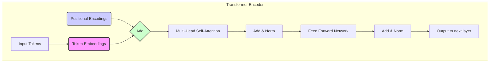

## §0. TL;DR（速覽）

- **一句話總結**：本堂課探討 Transformer 模型如何理解輸入文字的「順序」，這個對語言至關重要的資訊，並介紹從絕對、相對到旋轉式等主流位置編碼技術的演進。
- **Key Takeaways**:
    - Transformer 的核心 Self-Attention 機制本身是「順序不敏感」的，像一個裝滿單字的大袋子，若不額外處理，它無法區分「我開刀」和「刀開我」。
    - **Absolute Positional Encoding** 是最原始的解法，為每個位置（第 1, 2, 3...個字）生成一個固定的「位置向量」，直接加到該位置的文字語意 embedding 上。
    - **Relative Positional Encoding** 認為詞的「相對距離」比「絕對位置」更重要，因此它在計算 attention score 時，動態地考慮兩個詞之間的距離。
    - **Rotary Position Embedding (RoPE)** 是當前主流 LLM (如 Llama) 的基石，它不用加法，而是透過「旋轉」文字的 embedding 向量來注入位置資訊，巧妙地在 attention 計算中同時保留了絕對和相對位置的特性。
    - 最新的研究甚至希望能做到「沒有」固定的 Positional Embedding，讓模型從資料中自己學會順序，或透過其他方式隱含地編碼。

## §1. Motivation（為什麼要這堂課）

在前幾堂課中，我們已經深入拆解了 Transformer 的心臟——Self-Attention 機制。我們理解到，這個機制的核心在於計算輸入序列中，每個 token（你可以想成一個字或一個詞）對其他所有 token 的「關注程度」（attention score）。這個架構帶來了強大的平行計算能力，讓 Transformer 得以處理極長的序列，這是它勝過傳統 RNN 或 LSTM 的關鍵優勢。

然而，這種設計也帶來一個巨大且根本的缺陷。想像一下，Self-Attention 就像一個「文字大袋子」（bag of words）模型。你把「A patient went to the hospital」這句話的所有詞丟進去，它能計算 `patient` 和 `hospital` 之間的關聯。但如果你丟進去的是「A hospital went to the patient」，模型本身是分不出來的！因為在 attention 計算中，每個詞的 query、key、value 向量的初始值只跟這個詞的「語意」有關，跟它在句子中的「位置」完全無關。它只知道袋子裡有這些詞，不知道誰前誰後。

這在真實世界中是致命的。語言的順序決定了語意。「狗咬人」和「人咬狗」天差地遠；「給予這個病人 morphine」和「這個病人給予 morphine」，前者是醫囑，後者是描述一個不可能發生的情境。如果一個強大的語言模型無法區分這兩者，那它就毫無用處。

傳統的 Recurrent Neural Networks (RNNs) 或 Long Short-Term Memory (LSTMs) 模型沒有這個問題，因為它們的結構是序列式的。它們一個一個地處理 token，前一個 token 的輸出會成為後一個 token 的輸入，順序資訊天然地就儲存在模型的隱藏狀態（hidden state）中。但這也正是它們的瓶頸——無法平行化，處理長序列時速度極慢且容易忘記早期的資訊。

因此，Transformer 面臨一個核心挑戰：**如何在一個完全平行、非序列的架構中，有效地告訴模型每個 token 的順序資訊？**

這就是 Positional Encoding（位置編碼）這堂課要解決的問題。我們不能簡單地把位置數字（1, 2, 3...）當成一個特徵直接輸入，因為這樣數字會變得非常大，且模型很難泛化到比訓練時更長的句子。我們需要一種更聰明的編碼方式。本堂課將帶你走過一趟精彩的技術演進之旅：從最初在 "Attention Is All You Need" 論文中提出的、使用 `sin` 和 `cos` 函數的 Absolute Positional Encoding，到更符合直覺的 Relative Positional Encoding，再到當前大語言模型（LLM）廣泛採用的、優雅的 Rotary Position Embedding (RoPE)，甚至我們會探討一些更新的、希望完全擺脫固定位置編碼的研究。理解這些技術，你才能真正掌握現代 LLM 如何理解和生成具有流暢邏輯與正確語法的長篇文字。

## §2. 背景知識補完（Prerequisites）

在我們深入探討各種位置編碼技術之前，讓我們先確保幾個基礎觀念已經穩固。這些是在之前課程提過，但對本堂課至關重要的工具。

- **Token Embedding（詞嵌入）**
    - **嚴謹定義**：一個將離散的 token（如單字、子詞）映射到一個高維連續向量空間的函數。這個向量（embedding）旨在捕捉該 token 的語意特徵。
    - **白話版**：電腦不認得「蘋果」這兩個中文字，但它可以理解一個充滿數字的向量，例如 `[0.12, -0.45, 0.88, ...]`。Token embedding 就是一本「密碼本」，把人類的每個詞彙翻譯成一個獨一無二的、高維度的「語意座標」。在這個座標系裡，語意相近的詞（如「醫生」和「護理師」）它們的向量在空間中的距離會比較近，而無關的詞（如「醫生」和「太空梭」）距離就會很遠。
    - **為何本堂會用到**：Positional Encoding 的核心操作，就是將「位置資訊」以某種方式整合到這個「語意資訊」的 embedding 向量中。最簡單的 Absolute PE 就是直接將位置向量「加」到語意向量上，創造一個同時包含「這是什麼詞」和「它在哪裡」的新向量。

- **Self-Attention Mechanism（自注意力機制）**
    - **嚴謹定義**：一種注意力機制，它通過計算序列中所有 token 對之間的加權分數，來更新序列中每個 token 的表示（representation）。每個 token 會生成一個 Query (Q)、一個 Key (K) 和一個 Value (V) 向量，其 attention score 是由 Q 和 K 的點積（dot product）計算得出的。
    - **白話版**：當模型讀到一句話中的某個詞時（例如「他」），自注意力機制會自動去掃描整句話，看看哪些其他的詞跟理解「他」最相關。它可能會發現「他」指代的是前面提到的「病人」，於是給「病人」這個詞非常高的權重。最終，「他」這個詞的新 embedding 就會大量融入「病人」的資訊，使得模型知道「他」的具體指涉。
    - **為何本堂會用到**：我們必須理解，標準的 self-attention 在計算 Q 和 K 的點積時，完全不在乎這兩個 token 的位置。這正是我們需要 Positional Encoding 的原因。後續的 Relative PE 和 RoPE 等更高級的技術，會直接修改 attention score 的計算公式，將位置資訊動態地注入這個環節。

- **Vector Dot Product（向量內積）**
    - **嚴謹定義**：在歐幾里得空間中，兩個向量的內積是它們的長度與它們之間夾角的餘弦值的乘積。幾何上，它衡量了一個向量在另一個向量方向上的投影長度。`a · b = |a| |b| cos(θ)`。
    - **白話版**：向量內積可以被理解為衡量兩個向量「方向上有多相似」。如果兩個向量指向完全相同的方向，內積結果最大；如果它們互相垂直（完全無關），內積為 0；如果方向完全相反，內積為負最大。
    - **為何本堂會用到**：Self-attention 的核心就是 Q 和 K 向量的內積。這個計算結果決定了 attention score 的高低。RoPE 的天才之處就在於，它透過旋轉 Q 和 K 向量，使得它們的內積結果不僅跟它們的內容有關，還跟它們的「相對位置」有關，而且這種關聯性會隨著距離變遠而自然衰減。

- **Sinusoidal Functions (sin/cos)（正弦/餘弦函數）**
    - **嚴謹定義**：在數學中，正弦和餘弦是描述直角三角形中角度與邊長關係的三角函數，也是描述週期性波動的基本數學工具。
    - **白話版**：你可以把 `sin` 和 `cos` 想像成一種能在 1 和 -1 之間平滑、規律地來回擺動的波。`cos` 從 1 開始，`sin` 從 0 開始。它們最大的特點是「週期性」，即每隔一個固定的間隔，波形就會重複。透過調整波的「頻率」（它擺動得有多快），我們可以創造出各種不同週期的波。
    - **為何本堂會用到**：最初的 Absolute Positional Encoding 正是利用了不同頻率的 `sin` 和 `cos` 波來為每個位置編碼。它的想法是，用一組頻率由快到慢的波，在每個維度上給出一個 unique 的值。低頻波（慢波）可以在很長的距離上保持數值的緩慢變化，編碼了大概位置；高頻波（快波）在相鄰位置上數值劇烈變化，區分了鄰近的詞。這種組合使得每個位置都有一個獨一無二且蘊含了位置關係的向量。

## §3. 核心概念辭典（Core Concepts Glossary）

本堂課我們將圍繞著如何將「順序」這個概念教給 Transformer。以下是我們會遇到的核心術語。

- **Positional Encoding (PE)（位置編碼）**
    - **嚴謹定義**：一種將 token 在序列中的位置資訊注入到模型輸入中的技術。它輸出的位置向量（position vector）會與對應的 token embedding 相結合，使得模型能夠區分順序。
    - **白話重述**：這是一張給每個座位（位置）的「座位牌」。每個座位的牌子都是獨一無二的，上面寫著一些特殊的數字（向量）。當一個詞（token）坐到這個座位上時，它就把這張座位牌上的資訊加到自己的名牌（token embedding）上。這樣一來，模型拿到的就不只是一個個獨立的詞，而是「坐在第 1 個位置的詞 A」、「坐在第 2 個位置的詞 B」...
    - **常見誤解**：PE 並不是一個讓模型「學會」計數的機制。模型不會真的理解「這是第 5 個位置」。相反，PE 提供的是一種可區分的、蘊含了相對距離信號的模式，Attention 機制可以利用這種模式來偏好處理更近或特定關係的 token。

- **Absolute Position Embedding（絕對位置編碼）**
    - **嚴謹定義**：一種為序列中的每個絕對位置（例如，第 0, 1, 2, ...個 token）分配一個固定、可學習或預先計算的 embedding 向量的策略。
    - **白話重述**：這就像電影院的座位號碼：A1, A2, A3...。每個座位的編號都是固定的、絕對的。不管電影演什麼，A1 號座位永遠在那個角落。在模型中，第 5 個 token 的位置向量永遠是同一個，與它前面的 token 是什麼無關。
    - **相近概念區辨**：與 Relative Position Embedding 相反。Absolute 關心的是「你在哪裡」（絕對座標），而 Relative 關心的是「我在你前面/後面多遠」（相對位移）。

- **Relative Position Embedding（相對位置編碼）**
    - **嚴謹定義**：一種在計算 attention 時，不考慮 token 的絕對位置，而是考慮 query token 和 key token 之間相對距離（separation）的策略。
    - **白話重述**：當模型在看第 5 個詞時，它不再關心第 3 個詞的絕對位置是「3」，而是關心「它在我前面 2 個位置」。它會為「-2」這個相對距離學習一個特定的 embedding。這更符合直覺，因為在多數語言情境下，一個詞與它前面第 2 個詞的語法關係，通常比它在整個段落的第 102 個還是第 502 個位置更重要。
    - **常見誤解**：Relative PE 並不是在輸入層加一個新的 embedding。它通常是直接修改 attention 的計算過程，在計算 `q` 和 `k` 的 attention score 時，加入一項與它們相對距離 `j-i` 有關的偏置（bias）項。

- **Rotary Position Embedding (RoPE)（旋轉式位置編碼）**
    - **嚴謹定義**：一種將絕對位置資訊通過向量旋轉的方式整合到 query 和 key 向量中的方法。它利用了複數乘法的性質，使得任意兩個 token `q` 和 `k` 的內積僅取決於它們的內容和相對位置，而與絕對位置無關。
    - **白話重述**：RoPE 是一種極其聰明的混合體。它給每個 token 一個基於其「絕對位置」的「旋轉指令」（例如，第 1 個詞轉 15 度，第 2 個詞轉 30 度...）。當詞的 query 和 key 向量產生後，它們會根據自己所在位置的指令進行旋轉。神奇的是，當計算這兩個「旋轉後」的向量的內積時，那個「絕對位置」的旋轉角度會被抵銷掉，最終結果只跟它們的「相對旋轉角度差」（即相對位置）有關。
    - **相近概念區辨**：與 Absolute PE（用加法）和 Relative PE（在 attention score 加 bias）都不同。RoPE 是用「乘法」（在複數域或其等價形式下）來施加位置資訊，這是一種更深度的融合。

- **Sinusoidal Positional Encoding（正弦式位置編碼）**
    - **嚴謹定義**："Attention Is All You Need" 論文中提出的一種 Absolute PE 實現。它使用不同頻率的 `sin` 和 `cos` 函數來為每個位置 `pos` 和每個維度 `i` 生成一個固定的、非學習性的位置向量。
    - **白話重述**：這是一種用「組合音叉」來代表位置的方法。想像你有一排音叉，頻率從低到高。對於第 1 個位置，你敲響所有音叉，記錄下它們在某一瞬間的震動幅度（相位），這組數字就是它的位置向量。對於第 2 個位置，你過一小段時間再記錄，所有音叉的相位都變了，於是得到一組新的數字。因為每個音叉頻率不同，這種組合確保了每個位置的「和弦」都是獨一無二的。
    - **常見誤解**：很多人認為這只是一種 hack。但它有一個非常優美的數學性質：對於任何固定的位移 `k`，`PE(pos+k)` 可以表示為 `PE(pos)` 的一個線性變換。這意味著，雖然它是絕對位置編碼，但其中隱含了相對位置的資訊，模型是有可能學會利用這一點的。

- **Extrapolation（外推）**
    - **嚴謹定義**：模型在訓練時未見過的、超出其訓練範圍的輸入上進行預測的能力。在 LLM 的脈絡下，特指處理比訓練時所用的最大序列長度更長的序列的能力。
    - **白話重述**：這就像教一個實習醫師看心電圖。如果訓練時給他的所有 EKG 都是 10 秒長，當他第一次在臨床看到一張 30 秒的 EKG 時，他是否還能正確判讀？這就是外推能力。對於位置編碼來說，一個好的 PE 方法應該能讓模型在處理第 8000 個 token 時，依然能理解它的位置，即使訓練時最多只看過 4096 個 token 的句子。Sinusoidal PE 和 RoPE 在這方面表現比可學習的 Absolute PE 要好得多。

## §4. System / Paper Deep Dive

現在，讓我們深入 "Attention Is All You Need" 論文中提出的經典方案：Sinusoidal Absolute Positional Encoding。儘管許多新模型已改用 RoPE，但理解這個最原始的設計，是理解後續所有演進的基石。

### 4.1 Architecture

Positional Encoding 在 Transformer 架構中的位置非常明確：它作用於輸入層，在 token embedding 進入主要的 Encoder/Decoder 堆疊之前。



**流程說明**：
1.  **Input Tokens**: 輸入的句子，例如 `["A", "patient", "is", "here"]`。
2.  **Token Embeddings**: 每個 token 被轉換成其語意向量。假設我們的 embedding 維度 `d_model` 是 512，那麼我們會得到一個 `(4, 512)` 的矩陣。
3.  **Positional Encodings**: 同時，我們生成一個同樣大小 `(4, 512)` 的位置編碼矩陣。這個矩陣的計算是固定的，只跟位置 `pos`（0, 1, 2, 3）和維度 `i`（0 to 511）有關。
4.  **Add**: 將 Token Embeddings 和 Positional Encodings 兩個矩陣**逐元素相加**。這是最關鍵的一步，語意資訊和位置資訊在此融合。
5.  **進入 Encoder**: 這個包含了位置資訊的新 embedding 矩陣，才被送入第一個 Multi-Head Self-Attention 層，開始後續的計算。

### 4.2 關鍵演算法

生成位置編碼矩陣的演算法使用了 `sin` 和 `cos` 函數，其公式如下：

`PE(pos, 2i) = sin(pos / 10000^(2i / d_model))`
`PE(pos, 2i+1) = cos(pos / 10000^(2i / d_model))`

其中：
- `pos` 是 token 在序列中的位置 (0, 1, 2, ...)。
- `i` 是 embedding 向量中的維度索引 (0, 1, 2, ... `d_model`/2)。
- `d_model` 是 embedding 的總維度 (例如 512)。

我們用 embedding 向量中的**偶數位（2i）放 `sin`**，**奇數位（2i+1）放 `cos`**。注意，`sin` 和 `cos` 內部是完全相同的。

**偽程式碼**:

```python
import numpy as np

def get_positional_encoding(max_seq_len: int, d_model: int) -> np.ndarray:
    """
    Generate sinusoidal positional encoding matrix.
    
    Args:
        max_seq_len: Maximum sequence length.
        d_model: Dimension of the model embedding.

    Returns:
        A matrix of shape (max_seq_len, d_model) with positional encodings.
    """
    
    # Initialize the PE matrix with zeros
    pe = np.zeros((max_seq_len, d_model))
    
    # Create a vector for positions [0, 1, ..., max_seq_len-1]
    position = np.arange(0, max_seq_len).reshape(max_seq_len, 1)
    
    # Create a vector for the denominator term in the formula
    # This is 10000^(2i / d_model)
    # The term (2i) is equivalent to [0, 2, 4, ..., d_model-2]
    div_term = np.exp(np.arange(0, d_model, 2) * -(np.log(10000.0) / d_model))
    
    # Calculate the arguments for sin and cos
    angles = position * div_term # Shape: (max_seq_len, d_model/2)
    
    # Apply sin to even indices (0, 2, 4, ...)
    pe[:, 0::2] = np.sin(angles)
    
    # Apply cos to odd indices (1, 3, 5, ...)
    pe[:, 1::2] = np.cos(angles)
    
    return pe

# Example usage:
# pe_matrix = get_positional_encoding(max_seq_len=100, d_model=512)
# print(pe_matrix.shape)  # Output: (100, 512)
```

**為何這樣寫？**
- `div_term` 的計算方式是 `log` 技巧，它等價於 `1 / (10000 ** (np.arange(0, d_model, 2) / d_model))`，但在數值上更穩定。
- 這個公式巧妙地為 embedding 的每個維度分配了一個不同頻率的波。對於 `i` 較小的維度（向量的前半部分），`div_term` 很大，所以波長很長（頻率很低）。對於 `i` 較大的維度（向量的後半部分），`div_term` 很小，波長很短（頻率很高）。
- 這種頻率的組合，確保了每個位置 `pos` 都有一個獨一無二的簽名向量。

### 4.3 關鍵 data structure

Positional Encoding 本身就是一個二維矩陣（或稱張量），其維度與輸入的 token embedding 矩陣完全相同。

| Sequence Length | Embedding Dimension (`d_model`) |
|-----------------|---------------------------------|
| `max_seq_len`   | `d_model`                       |

**單一位置向量 `PE[pos]` 的結構**:

| 維度 0 (sin) | 維度 1 (cos) | 維度 2 (sin) | 維度 3 (cos) | ... | 維度 510 (sin) | 維度 511 (cos) |
|--------------|--------------|--------------|--------------|-----|----------------|----------------|
| `sin(pos/1)`   | `cos(pos/1)`   | `sin(pos/10)`  | `cos(pos/10)`  | ... | `sin(pos/10k^0.99)`| `cos(pos/10k^0.99)`|
*（此處分母為示意，非精確值）*

### 4.4 Walkthrough

讓我們走過兩個情境，來理解 PE 的實際作用。假設 `d_model=4`。

**情境一：正常流程**
1.  **輸入**: `["I", "am"]`
2.  **Token Embeddings**:
    - `E_I` = `[0.1, 0.2, 0.3, 0.4]`
    - `E_am` = `[0.5, 0.6, 0.7, 0.8]`
3.  **Positional Encodings** (假設已算好):
    - `PE_0` (pos=0) = `[sin(0), cos(0), sin(0), cos(0)]` = `[0.0, 1.0, 0.0, 1.0]`
    - `PE_1` (pos=1) = `[sin(1/k1), cos(1/k1), sin(1/k2), cos(1/k2)]` = `[0.84, 0.54, 0.01, 1.00]` (k1,k2是分母)
4.  **加法融合**:
    - `Input_I` = `E_I` + `PE_0` = `[0.1, 1.2, 0.3, 1.4]`
    - `Input_am` = `E_am` + `PE_1` = `[1.34, 1.14, 0.71, 1.8]`
5.  **進入 Attention**: `Input_I` 和 `Input_am` 這兩個新的向量被送入 attention 層。現在，即使 "I" 和 "am" 的原始語意 embedding 很相似，但加入了截然不同的位置向量後，它們在 attention 計算的起點就完全不同了，模型得以區分它們的順序。

**情境二：異常/對比（如果沒有 PE）**
1.  **輸入**: `["I", "am"]` 和 `["am", "I"]`
2.  **Token Embeddings**:
    - **對於 `["I", "am"]`**: 序列 embedding 集合是 `{E_I, E_am}`
    - **對於 `["am", "I"]`**: 序列 embedding 集合是 `{E_am, E_I}`
3.  **進入 Attention**: 在標準 Self-Attention 中，計算所有 token 對的 QK 內積。對於這兩個輸入，模型看到的初始 token 集合是完全一樣的！它會為 `(I, am)` 和 `(am, I)` 計算 attention score，但它無法知道在第一種情況下 `am` 在 `I`「之後」，而在第二種情況下 `I` 在 `am`「之後」。對模型來說，這兩個輸入序列是**不可區分**的 (permutation-invariant)。這會導致模型對這兩個語意完全不同的句子產生混亂的、甚至可能完全相同的輸出。

這個對比清晰地顯示了 PE 的絕對必要性。它透過一個簡單的加法操作，將「順序」這個至關重要的維度強行注入到一個本質上是無序的架構中，為 Transformer 理解語言的邏輯和語法鋪平了道路。

## §5. 真實類比（Real-world Analogies）

這一節是本講義的核心價值所在。我們將用三個醫學場景的類比，深入剖析三種主流的 Positional Embedding 機制：Sinusoidal Absolute PE、T5-style Relative PE，以及 Rotary Positional Embedding (RoPE)。目標是讓你不僅理解其運作，更能建立深刻的臨床直覺。

---

### 類比一：住院病床號碼系統 vs. Absolute Positional Embedding (Sinusoidal)

想像你是台大醫院的總醫師（Chief Resident），負責管理一個擁有 128 張病床的外科病房。為了讓整個醫療團隊（主治醫師、住院醫師、護理師、專科護理師）能高效協作，醫院資訊系統（HIS）為每張病床都設計了一套精密的「病床位置碼」，這就是我們的 Absolute Positional Embedding。

**情境描述：**

這個病房的 128 張床（`max_seq_length=128`），從 0 號編到 127 號。但這個編號不只是一個單純的流水號。HIS 系統為每個床號 `pos` 都生成了一個 512 維的向量 `PE(pos)`。這個向量不是隨機的，而是由一組不同頻率的 `sin` 和 `cos` 函數組合而成。

-   向量的**低維度部分**（例如 `d=0` 到 `d=63`），對應的是變化頻率很慢的 `sin/cos` 函數，就像是區分病床在病房的「**宏觀位置**」，例如「前半區 vs. 後半區」或「靠窗 vs. 靠走道」。這些屬性變化得很慢，可能跨越數十張床才變一次。
-   向量的**高維度部分**（例如 `d=448` 到 `d=511`），對應的是變化頻率極快的 `sin/cos` 函數，就像是區分病床的「**微觀特性**」，例如「這張床是否緊鄰護理站」、「床頭插座是三孔還是兩孔」。這些屬性可能每張床都不一樣。

當一個新病人（Token）入住 `pos=30` 的病床時，他的電子病歷（EMR）資料（Token Embedding）就會被「蓋上」這個 `PE(30)` 的位置碼（向量相加）。現在，當主治醫師帶領團隊進行晨會巡房（Self-Attention）時，他們拿到的不是一疊雜亂的病歷，而是一組已經標好「位置資訊」的病歷。團隊可以「一眼」看出，例如，「所有靠窗的病人（低頻特徵）最近的血糖趨勢」或者「護理站旁邊那兩床（高頻特徵）的病人昨晚的睡眠狀況」。

**對應關係表：**

| Transformer 概念 | 醫學類比 |
| :--- | :--- |
| Token | 一位病人 |
| Token Embedding | 病人的 EMR 病歷摘要（病情、診斷等） |
| Position `pos` | 病床的絕對編號（0 到 127） |
| **Absolute Positional Embedding** | HIS 系統生成的「病床位置碼」向量 |
| `d_model` (512 維) | 位置碼的維度，代表描述位置的 512 種不同特徵 |
| 低頻 `sin/cos` 維度 | 描述宏觀位置的特徵（如：病房區域） |
| 高頻 `sin/cos` 維度 | 描述微觀位置的特徵（如：鄰近護理站） |
| Self-Attention 機制 | 整個醫療團隊的集體巡房或病例討論會 |

**✅ 吻合之處（為何類比有效）：**

1.  **絕對性**：每張病床的位置碼是固定的、唯一的，與入住的病人是誰無關。這完美對應了 Absolute PE 的核心思想。
2.  **資訊疊加**：位置碼（PE）與病歷內容（Token Embedding）是分開的，在使用時才結合（向量相加）。這就像病人的病情與他住在哪張床是兩個獨立資訊，但在做決策時需要整合。
3.  **多尺度描述**：Sinusoidal 函數的多頻率特性，很像我們描述位置時的多尺度方式。從「A 病房」到「靠窗區」再到「左邊數來第三床」，`sin/cos` 組合巧妙地達成了這一點。
4.  **固定容量**：病房總床數固定（`max_seq_length`），這解釋了為何 Absolute PE 通常需要預設一個最大長度。

**⚠️ 不吻合之處（類比邊界，避免誤導）：**

1.  **相對關係的計算**：Sinusoidal PE 的一個數學優勢是，任意兩個位置 `pos` 和 `pos+k` 的 PE 向量可以通過一個線性變換相關聯，這使得模型學習相對位置變得容易。在病床系統中，`床號 30` 和 `床號 32` 的關係（例如，隔壁的隔壁）需要人腦去計算，而無法從它們的位置碼向量直接做矩陣乘法得到。
2.  **向量的意義**：在 Transformer 中，PE 向量的每個維度並沒有像「靠窗」或「靠走道」這樣明確的物理意義。它們是高維空間中的抽象座標。我們的類比是為了建立直覺，但不能將其過度簡化。
3.  **動態性**：在真實醫院中，病人可能會換床。在標準的 Transformer 中，Token 的位置是固定的，不會在處理過程中「移動」。

---

### 類比二：判讀連續心電圖 (ECG) vs. Relative Positional Embedding

想像你是一位心臟科醫師，正在判讀一份 24 小時 Holter 心電圖。這份報告包含了數萬個心跳。對你來說，某個 P 波出現在記錄開始後的「第 3 小時 24 分 15 秒」這個**絕對時間**意義不大。你真正關心的是這個 P 波與前後 QRS 波的**相對關係**，例如：
*   PR interval 是多長？（P 波到 R 波的相對距離）
*   這個 T 波後面隔了多久才出現下一個 P 波？
*   這一段連續 5 個 QRS 波之間的 RR interval 是否規律？

這種只關注「局部相對距離」的判讀思維，正是 Relative Positional Embedding 的精髓。

**情境描述：**

當你（Query）的目光聚焦在某一個 QRS 波上時，你會如何評估它？你會往前看（Key）、往後看（Key），但你的注意力是有偏向的。
*   緊鄰的前一個 P 波和後一個 T 波，對你的判斷**至關重要**（給予極高的 attention "bias"）。
*   3-5 個心跳週期內的波形，**很有參考價值**（bias 較高）。
*   10 分鐘前的波形，除非有特殊考量（例如比較運動前後變化），否則**參考價值不大**（bias 很低）。
*   12 小時前的波形，基本**不影響**你對當前這個 QRS 波形態的判斷（bias 為 0 或一個固定基線值）。

T5-style 的 Relative PE 正是將這個直覺給模型化。它不為每個 Token 計算一個絕對位置向量，而是在計算 Query 和 Key 的 attention score 時，直接加入一個「bias」值。這個 bias 值僅取決於 Query 和 Key 之間的**相對距離** `j-i`。模型學習一個小型的 lookup table，裡面存放著不同相對距離（例如 -7 到 +7）對應的 attention bias。距離超過這個範圍的（例如 `j-i = 100`），就全部共用同一個 bias 值。這完美類比了醫師「遠處的波形都差不多不重要」的判斷模式。

**對應關係表：**

| Transformer 概念 | 醫學類比 |
| :--- | :--- |
| Query Token `i` | 醫師目光當前聚焦的 ECG 波形（如一個 QRS 波） |
| Key Token `j` | 其他前後的 ECG 波形 |
| **Relative Position** `j-i` | 兩個波形之間的時間間隔或心跳個數差距 |
| **Relative Position Bias** | 醫師根據兩個波形的相對距離，給予的主觀重要性權重 |
| Learned Bias Table | 醫師腦中內化的「判讀經驗法則」（如：PR interval 正常範圍）|
| Clipping (e.g., max distance) | 醫師的「注意力範圍」，超過一定距離的波形給予同等的低重要性 |

**✅ 吻合之處（為何類比有效）：**

1.  **相對性**：判讀的核心是波形間的相對時序與形態，而非它們在 24 小時記錄中的絕對位置。
2.  **局部性**：注意力高度集中在當前波形的局部範圍內，與距離成反比，這與 Relative PE 的設計初衷完全一致。
3.  **歸納與泛化**：模型（醫師）學到的是「某個相對距離的重要程度」，這個知識可以應用到心電圖的任何一個片段，無論是記錄的開頭、中間還是結尾。這解釋了 Relative PE 為何在處理長序列時表現更好。
4.  **效率**：醫師不需要記住每個波形的絕對時間戳，只需要判斷「差了幾個心跳」，這就像模型只需要一個小型的 lookup table，而非為每個絕對位置都儲存一個大向量。

**⚠️ 不吻合之處（類比邊界，避免誤導）：**

1.  **Bias 的來源**：在 T5 中，這個 bias 是模型在訓練中學到的、適用於所有 attention head 的參數。而醫師的「bias」則複雜得多，融合了生理學知識、病理學知識和病人具體情況，並且是動態調整的。
2.  **對稱性**：標準的 Relative PE 中，距離 `+k` 和 `-k` 的 bias 是分開學習的，但它們都是固定的純量。在 ECG 判讀中，「之前」和「之後」的意義完全不同（因果關係），醫師的分析不是簡單的對稱或反對稱。
3.  **內容無關**：Relative PE 的 bias 只與位置有關，與內容（Token 是什麼）無關。而醫師在判讀時，一個「異常形態的 P 波」和一個「正常形態的 P 波」，即使處於相同的相對位置，也會引發完全不同的注意力。

---

### 類比三：判讀螺旋 CT 影像 vs. Rotary Positional Embedding (RoPE)

你是一位放射科醫師，正在判讀一組腹部螺旋 CT（Spiral CT）。當你在 PACS 工作站上滾動滑鼠滾輪，從上到下（或從頭到腳）瀏覽連續的切面影像時，你的大腦正在進行一個極其複雜的「RoPE 運算」。

**情境描述：**

CT 的每一張切面影像（slice），就像是一個 Token。這張影像本身包含了豐富的資訊（肝臟的質地、血管的走向等），這就是 Token Embedding。然而，單看一張影像，你很難判斷一個小圓點是腫瘤、血管截面還是偽影。你必須滾動滾輪，觀察這個圓點在**連續切面中的變化**。

*   如果它在連續幾張 slice 中，從一個點變成一個圓，再變成一條線，這可能是一條血管。
*   如果它在 slice `i` 和 `i+1` 之間，形態、大小、位置都發生了**平移和旋轉**，但保持著某種連續性，你的大腦就會將它們「縫合」起來，識別為同一個器官或結構。

RoPE 的核心思想與此驚人地相似。它**不是**在 Token Embedding 上**加上**一個位置向量，而是根據 Token 的絕對位置 `m`，對其 Embedding 向量進行一次**旋轉（Rotation）**。位置為 `m` 的 Query 向量 `q_m` 和位置為 `n` 的 Key 向量 `k_n`，它們的 attention score（內積）計算方式，經過 RoPE 的數學設計後，結果會只跟它們的**相對位置 `m-n`** 以及它們**原始的內容**有關。

這就像你在判讀 CT 時，slice #50 和 slice #52 的關係，與 slice #150 和 slice #152 的關係，在你的大腦裡是以完全相同的方式處理的——都是「相隔 2mm 的兩個切面」。你關注的是這「2mm 的變化」所揭示的解剖結構，而不是它們的絕對 Z 軸座標。RoPE 讓 Transformer 模型也擁有了這種「從絕對座標中，提煉出相對關係」的能力。

**對應關係表：**

| Transformer 概念 | 醫學類比 |
| :--- | :--- |
| Token Embedding `x_m` | 第 `m` 張 CT 切面影像的內容 |
| Absolute Position `m` | CT 切面的 Z 軸絕對座標（或 slice 編號） |
| **RoPE 旋轉操作** | 醫師大腦中，根據切面 `m` 到 `n` 的空間位移，對影像內容進行的「心裡旋轉/對齊」操作 |
| `q_m` (Query at pos `m`) | 醫師以 slice `m` 為參考點，試圖理解其周圍結構 |
| `k_n` (Key at pos `n`) | 另一張被參考的 slice `n` |
| `q_m^T k_n` (內積) | 醫師大腦整合比較 slice `m` 和 `n` 的資訊，以判斷它們是否屬於同一個結構（如腫瘤或血管）的過程 |

**✅ 吻合之處（為何類比有效）：**

1.  **內建相對性**：RoPE 的數學魔法，使得 attention score 自然地只依賴於相對位置 `m-n`，這完美對應了放射科醫師判讀時的核心邏輯——關注結構的相對變化，而非絕對座標。
2.  **不改變內容**：旋轉操作保持了向量的長度（norm），就像 CT 影像的內容本身沒有被改變，只是被「換了個角度看」。這比直接相加一個位置向量更優雅，因為它保留了原始的 Token 資訊。
3.  **長度外推性**：因為 attention score 只依賴相對距離，理論上 RoPE 可以處理比訓練時更長的序列。這就像一個厲害的醫師，無論給他 300 張切面的 CT 還是 600 張切面的 CT，他的判讀邏輯（如何從相對變化推斷結構）是不變的。
4.  **衰減效應**：RoPE 的旋轉特性天然地使得距離越遠的 Token，其內積貢獻會呈現震盪衰減。這也符合直覺：距離太遠的兩個 CT 切面，關聯性自然下降。

**⚠️ 不吻合之處（類比邊界，避免誤導）：**

1.  **旋轉的空間**：醫師的「心裡旋轉」發生在我們熟悉的 3D 歐幾里得空間。而 RoPE 的旋轉發生在 `d_model` 維的抽象特徵空間中，它是在向量的成對維度上進行的複數平面旋轉，沒有直接的物理對應。
2.  **線性操作**：RoPE 是一個固定的、基於位置的線性變換。而醫師的判讀過程是一個高度非線性的、依賴內容的、動態的過程。
3.  **單一變換**：RoPE 對所有 Token 都施加同樣的、只由位置決定的旋轉。醫師在判讀時，對肝臟和對脊椎的「注意力追蹤」方式可能是不同的。

---
## §6. 課堂 Q&A 精華

本節整理了學生們針對 Positional Embedding 提出的常見問題，以及教授的回答。這些問答有助於澄清觀念、加深理解。

**Q**: 為什麼不直接用 1, 2, 3... 這樣的整數來表示位置就好了？為什麼要搞出這麼複雜的 Sinusoidal 函數？
**A**: 這是一個非常好的問題，觸及了核心設計思想。直接用整數有幾個致命缺陷：1) **數值無界**：序列越長，數字越大，會導致 embedding 變得不穩定。2) **模型難以泛化**：如果模型在訓練時只見過 1-512 的位置，當它看到 513 時，它完全不知道這代表什麼。3) **相對關係不清晰**：模型很難從 `5` 和 `6` 這兩個數字中，學到它們是「相鄰」的關係，也很難類推到 `500` 和 `501` 也是「相鄰」的。而 Sinusoidal 函數透過其週期性，不僅將位置編碼在一個固定的 `[-1, 1]` 範圍內，更重要的是，任意兩個相隔 `k` 的位置 `pos` 和 `pos+k`，它們的 Positional Embedding 可以透過一個固定的線性變換來互相表示。這就等於是把「相對位置」的線索，隱含地注入到了絕對位置的編碼中，大大方便了模型學習。

**Q**: 對於 Absolute Positional Embedding，如果輸入的序列比訓練時設定的 `max_seq_length` 還要長，會發生什麼事？
**A**: 這取決於是哪種 Absolute PE。如果是**Learned Absolute PE**（像 BERT 那樣，每個位置的 embedding 都是一個可學習的向量），那模型就徹底癱瘓了。因為它在 lookup table 裡找不到超出範圍的位置（例如 `pos=513`）的 embedding，會直接報錯或產生無意義的輸出。如果是 **Sinusoidal PE**，情況會好一些。因為 `sin` 和 `cos` 函數可以計算任意 `pos` 的值，所以它在理論上可以外推（extrapolate）到任意長度。但問題是，模型在訓練時從未見過這麼遠的位置，它學到的「如何利用位置資訊」的模式可能會失效，導致效能顯著下降。這就像一個只在台北開過車的司機，突然把他丟到紐約，雖然他還會開車，但完全不熟悉路況，表現會很差。

**Q**: Relative Position Embedding 是不是意味著模型需要儲存一個 `[seq_len, seq_len]` 大小的巨大表格來存放所有相對位置的 bias？
**A**: 不用，這正是它設計巧妙的地方。模型並不需要為每一個 `(query_pos, key_pos)` 組合都存一個值。它學習的是一個非常小的 lookup table，其大小只跟一個超參數 `max_relative_position` 有關。例如，在 T5 中，這個值可能是 128。模型只學習從 `-127` 到 `+127` 的相對距離所對應的 bias。任何超過這個範圍的距離（例如 200 或 -300）都會共用同一個學到的 bias 參數。這大大節省了空間，也讓模型能泛化到更長的序列長度上。

**Q**: RoPE 看起來也是在用相對位置，它和 T5 那種直接加 bias 的 Relative PE 有什麼本質區別？
**A**: 關鍵區別在於「如何」引入相對位置資訊。T5 的方法是**加性**的（additive）：`Attention Score = QK^T + Bias`。它是在計算完原始的 attention score 之後，再**疊加**一個跟相對位置有關的偏置項。而 RoPE 是**乘性**的（multiplicative）或者更準確地說是**旋轉性**的（rotational）。它並不是在最後加一個 bias，而是在計算 `QK^T` **之前**，就先將 `Query` 和 `Key` 向量本身根據它們的絕對位置進行「旋轉」。經過數學推導可以證明，旋轉後的 `q_m` 和 `k_n` 做內積，其結果自然地只與相對位置 `m-n` 有關。RoPE 像是把位置資訊「織入」了 Query 和 Key 向量的內部結構中，而 T5 則像是在外部「貼」上一個位置標籤。

**Q**: 如果 RoPE 那麼好，為什麼不所有的模型都用它呢？Absolute PE 和 Relative PE (T5-style) 還有存在的價值嗎？
**A**: 技術的選擇永遠是 trade-off。RoPE 的確非常優雅且高效，尤其在長序列任務上表現突出，所以近年來的大型語言模型（如 Llama、GPT-J）都傾向於使用它。但是：1) **實現複雜度**：RoPE 的實現比簡單的 Absolute PE 或 T5-style Relative PE 要稍微複雜一些，需要處理複數運算或等效的實數運算。2) **任務依賴性**：在某些任務中，知道「這是一個句子的開頭」（絕對位置 `pos=0`）這個資訊本身就非常重要。Absolute PE 能直接提供這個信號，而 RoPE 和 Relative PE 則更強調相對關係。3) **歷史與慣性**：很多成功的模型（如 BERT、T5）是在 RoPE 出現前提出的，它們的架構已經被廣泛使用和研究，圍繞它們的生態也很成熟。除非有壓倒性的效能優勢，否則沒有必要將所有模型都重構成 RoPE。

**Q**: 標題裡提到的「沒有 Positional Embedding」是怎麼回事？沒有位置資訊，模型如何區分 "A leads to B" 和 "B leads to A"？
**A**: 這是一個前沿的研究方向。最著名的例子是 **ALiBi (Attention with Linear Biases)**。它的核心思想和 T5 的 Relative PE 有點像，也是在 attention score 上加一個 bias。但它的 bias **不是學來的**，而是一個固定的、線性衰減的值。具體來說，Query `i` 和 Key `j` 之間的 bias 就是 `-|i-j|` 乘上一個固定的斜率 `m`（每個 attention head 的 `m` 不同）。這個 `m` 是預設好的，不是訓練得到的。所以，它不需要任何可學習的 embedding 參數，也不需要在輸入層疊加任何東西。因為這個 bias 是在 attention 計算過程中動態加上的，所以它也算是一種「隱含」的位置編碼。它的好處是外推能力極強，因為無論序列多長，`-|i-j|` 總是可以計算。所以「沒有 PE」通常指的是「沒有在模型輸入層加入可學習或固定的位置向量」，但位置資訊通常會以其他形式（如 attention bias）在模型內部被引入。

---
### 最常見誤解 Top 3

1.  **誤解**: Positional "Embedding" 總是以向量相加的形式疊加到 Token Embedding 上。
    -   **真相**: 這是 Absolute PE 的做法。Relative PE (T5-style) 和 ALiBi 是在 attention score 上加一個 bias，而 RoPE 則是對 Query/Key 向量本身進行旋轉操作。位置資訊的注入方式是多樣的。

2.  **誤解**: 模型一旦訓練好，它的輸入長度就固定了，無法處理更長的序列。
    -   **真相**: 這主要對 Learned Absolute PE 成立。Sinusoidal PE、Relative PE、RoPE 和 ALiBi 都設計了不同程度的長度外推能力（length extrapolation），讓模型能處理比訓練時更長的輸入，儘管效能可能會有所下降。

3.  **誤解**: Relative PE 一定比 Absolute PE 要好。
    -   **真相**: 這是一個 trade-off。Relative PE 在需要捕捉局部依賴關係和長序列任務上通常表現更好。但在某些任務中，知道 token 的絕對位置（例如，是不是序列的開始或結束）非常關鍵，此時 Absolute PE 可能更有優勢。沒有絕對的優劣，只有是否適合當前的任務。

---
## §7. 常見陷阱與考點（What Engineers Actually Get Wrong）

在工程實踐中，理解理論和正確實現之間總有一道鴻溝。以下是工程師在處理 Positional Embedding 時最常犯的錯誤和忽略的細節。

**陷阱 1**：在 RoPE 的實現中，只對 Key 進行旋轉，而忘記對 Query 進行同樣的旋轉。
-   **為何會掉進去**：直覺上可能會認為位置資訊只需要附加到被「參照」的 Key 上即可。
-   **正確做法**：RoPE 的數學有效性，建立在 Query 和 Key **都被**它們各自位置對應的旋轉矩陣變換過的基礎上。`q'_m = R_m * q`，`k'_n = R_n * k`，然後計算 `q'_m` 和 `k'_n` 的內積。兩者缺一不可，否則相對位置的性質就會被破壞。
-   **實例**：一個常見的 bug 是，模型在短序列上表現正常，但在長序列上輸出混亂。這往往是因為 `q_m^T * (R_n * k_n)` 這樣的錯誤實現，使得 attention score 仍然依賴於絕對位置 `m`，破壞了 RoPE 的設計初衷。

**陷阱 2**：混淆 Sinusoidal PE 公式中的 `pos` 和 `i`。
-   **為何會掉進去**：公式 `PE(pos, 2i) = sin(pos / 10000^(2i/d_model))` 中有兩個變數，很容易在寫巢狀迴圈時搞混。
-   **正確做法**：`pos` 代表 Token 在序列中的位置（從 0 到 `max_len-1`），`i` 代表 Embedding 向量的維度索引（從 0 到 `d_model/2 - 1`）。外層迴圈應該遍歷 `pos`，內層迴圈遍歷 `i`（或維度 `d`）。
-   **實例**：如果誤將 `pos` 和 `i` 的角色對調，產生的 PE 矩陣會是錯誤的。一個簡單的 debug 方法是，打印出 `pos=0` 的 PE 向量，它應該是一個全零向量（因為 `sin(0)=0`），以及 `pos > 0` 時的 PE 向量，確保它不是零向量。

**陷阱 3**：實現 T5-style Relative PE 時，忘記對相對距離進行裁剪（clipping）。
-   **為何會掉進去**：想直接計算 `query_pos - key_pos` 作為 bias table 的索引。
-   **正確做法**：必須設定一個最大相對距離 `max_distance`，然後將計算出的相對距離裁剪到 `[-max_distance, max_distance]` 的範圍內。這不僅能將 bias table 的大小控制在一個很小的範圍 `(2 * max_distance + 1)`，也是模型泛化能力的重要來源。
-   **實例**：不進行裁剪會導致 bias table 變得和輸入序列長度一樣大，在處理長序列時會消耗巨大記憶體，並且由於大部分遠距離的 bias 在訓練時從未被學習過，導致模型效能不穩定。

**陷阱 4**：在 fine-tuning 模型時，使用了與預訓練階段不匹配的 Positional Embedding 方案。
-   **為何會掉進去**：只關心模型主體架構，忽略了 PE 這種「細節」。或者試圖「改進」一個預訓練模型，例如給一個用 Absolute PE 預訓練的 BERT 換上 RoPE。
-   **正確做法**：Positional Embedding 是模型架構不可分割的一部分。模型在預訓練階段已經學會了如何「解讀」特定類型的 PE。更換 PE 方案，相當於改變了模型輸入的「語法」，會導致模型完全無法理解輸入，之前學到的所有知識都作廢了。Fine-tuning 必須沿用和預訓練完全相同的 PE 實現。

**陷阱 5**：認為 RoPE 可以「無限」外推序列長度而沒有任何效能損失。
-   **為何會掉進去**：過度解讀 RoPE「只依賴相對位置」的理論優勢。
-   **正確做法**：RoPE 確實比 Absolute PE 在長度外推上表現得更優雅（gracefully），但效能依然會下降。原因之一是，即使 attention 機制能處理任意相對距離，模型中的其他部分（如 Feed-Forward Network）可能仍然沒有為處理如此長的依賴關係做好準備。此外，RoPE 的內積衰減特性也只是「趨勢」，在未見過的超長距離上，其行為也可能變得不穩定。NTK-aware RoPE 等改進方案就是為了解決這個問題。

**陷阱 6**：在實現 Sinusoidal PE 時，使用整數除法而非浮點數除法。
-   **為何會掉進去**：在某些程式語言中（如 Python 2），兩個整數相除會預設得到整數（地板除）。例如 `5 / 2 = 2`。
-   **正確做法**：公式中的 `2i / d_model` 必須是浮點數運算。在 Python 3 中，`/` 預設就是浮點數除法，但在其他語言或舊版 Python 中，需要確保分子或分母至少有一個是浮點數，例如 `float(2*i) / d_model`。
-   **實例**：使用整數除法會導致 `10000^(2i/d_model)` 的指數部分大部分時間為 0，使得分母恆為 1，所有維度的 `sin/cos` 函數頻率都一樣，完全喪失了多尺度編碼的能力，模型學不到任何東西。

---
## §8. 自測題

這 10 道題將幫助你檢驗是否真正掌握了本堂課的關鍵概念。請嘗試回答，然後展開答案進行核對。

**1. (概念題)** 請解釋相較於「可學習的絕對位置嵌入」(Learned Absolute Positional Embeddings)，「正弦/餘弦位置嵌入」(Sinusoidal Positional Embeddings) 的主要優勢是什麼？

<details><summary>展開答案</summary>

Sinusoidal PE 的主要優勢有兩點：

1.  **長度外推能力 (Length Extrapolation)**：Learned PE 是一個固定大小的查詢表 (lookup table)，如果輸入序列的長度超過了訓練時的最大長度，模型就無法找到對應位置的嵌入向量，從而導致失敗。而 Sinusoidal PE 是由數學公式動態生成的，理論上可以為任何長度的序列計算出位置嵌入，使得模型能夠處理比訓練時更長的輸入（儘管效能可能會下降）。
2.  **隱含相對位置資訊**：Sinusoidal PE 的設計有一個優美的數學特性：對於任何固定的相對位移 `k`，從位置 `pos` 的嵌入 `PE(pos)` 到位置 `pos+k` 的嵌入 `PE(pos+k)`，都可以通過一個固定的線性變換來實現。這意味著絕對位置的編碼中隱含了相對位置的信號，這使得模型更容易學習到 token 之間的相對關係。而 Learned PE 則需要模型從頭在每一對位置之間學習這種關係。

</details>

**2. (概念題)** RoPE (Rotary Positional Embedding) 是如何僅通過對 Query 和 Key 向量進行「旋轉」操作，就讓它們的內積只依賴於相對位置的？請描述其核心數學原理。

<details><summary>展開答案</summary>

RoPE 的核心數學原理是利用了複數乘法的性質。它可以將一個向量視為複數，而旋轉操作相當於乘以一個 `e^(iθ)` 形式的複數。

1.  將 Query 向量 `q` 和 Key 向量 `k` 的特徵維度兩兩一組，視為複數。
2.  對於位置為 `m` 的 Query 向量 `q_m`，將其乘以旋轉因子 `e^(imθ)`。
3.  對於位置為 `n` 的 Key 向量 `k_n`，將其乘以旋轉因子 `e^(inθ)`。
4.  計算旋轉後兩者的內積（在複數域中是共軛相乘後取實部）。根據複數性質，`(q * e^(imθ)) * (k * e^(inθ))^* = (q * k^*) * e^(i(m-n)θ)`。

這個結果表明，旋轉後的內積等於**原始向量的內積**乘以一個只與**相對位置 `m-n`** 有關的旋轉因子。這意味著，兩個 token 的 attention score 只取決於它們的內容 (`q` 和 `k`) 以及它們的相對距離 (`m-n`)，而與它們的絕對位置 `m` 和 `n` 無關。

</details>

**3. (概念題)** 請比較 T5-style 的 Relative Position Bias 和 RoPE 在**推論 (inference)** 階段的計算成本。

<details><summary>展開答案</summary>

在推論階段，兩者的計算成本都很低，但 RoPE 理論上更高效一些。

*   **T5-style Relative Position Bias**：在計算完 `Q * K^T` 得到 `[seq_len, seq_len]` 的 attention score 矩陣後，需要從一個小的 lookup table 中，根據每個 `(i, j)` 對的相對距離 `i-j`，取出對應的 bias 值，加到 score 矩陣上。這一步需要額外的查表和矩陣加法操作。
*   **RoPE**：在計算 `Q * K^T` 之前，需要對 `Q` 和 `K` 矩陣中的每個 token 向量進行旋轉操作。這個操作可以高效地以矩陣元素級別的乘法來實現。之後的 `Q * K^T` 矩陣乘法是標準的 attention 計算。

**結論**：RoPE 將位置計算融入到了 `Q` 和 `K` 的預處理中，沒有增加額外的矩陣級別操作。而 T5-style 則需要在 `Q*K^T` 之後增加一步矩陣加法。因此，RoPE 的計算耦合得更緊密，通常被認為計算效率稍高，尤其是在優化過的 kernel (如 FlashAttention) 中。

</details>

**4. (情境題)** 你正在為一個大型教學醫院建構一個 AI 模型，用於分析病人的完整電子病歷 (EMR)。病歷記錄的時間跨度可能長達數十年，其中事件（如手術、用藥、檢查）的間隔極不規律。你會優先選擇哪種位置編碼方案來開始你的專案？為什麼？

<details><summary>展開答案</summary>

我會優先選擇 **RoPE (Rotary Positional Embedding)** 或 **T5-style Relative Position Bias** 這類基於相對位置的方案。

**理由如下**：

1.  **長序列與可變長度**：EMR 的長度極不固定且可能非常長，遠超典型模型的 `max_seq_length`。基於相對位置的方案（特別是 RoPE 和 ALiBi）在長度外推方面表現得比 Absolute PE 好得多。
2.  **相對時間的重要性**：在臨床判斷中，「手術後第三天」遠比「2015年3月5日」這個絕對時間點更有意義。疾病的發展、治療的反應，都強烈依賴於事件之間的相對時序關係。Relative PE 的設計哲學與這種臨床思維模式高度契合。
3.  **局部性與遠距離依賴**：雖然近期事件更重要（符合 Relative PE 的局部性假設），但 EMR 中也存在遠距離依賴（如10年前的過敏史影響現在的用藥決策）。RoPE 和 T5-style 的 bias table 都可以在一定程度上捕捉這種遠近親疏的關係。

在 RoPE 和 T5-style 之間，我會首先嘗試 RoPE，因為它在近年來的 LLM 中被證明在長序列任務上非常成功且高效。

</details>

**5. (情境題)** 你的模型使用「可學習的絕對位置嵌入」，並且在 512 個 token 的序列長度上進行了預訓練。在推論時，它接收到了一個 1024 個 token 的序列。會發生什麼？如果模型用的是「正弦/餘弦位置嵌入」，情況會有何不同？

<details><summary>展開答案</summary>

*   **使用可學習的絕對位置嵌入 (Learned Absolute PE)**：模型會**失敗或崩潰**。因為它的位置嵌入是一個大小為 `[512, d_model]` 的查詢表。當處理到第 513 個 token (位置索引為 512) 時，它無法在查詢表中找到對應的嵌入向量，會導致索引越界 (index out of bounds) 錯誤。

*   **使用正弦/餘弦位置嵌入 (Sinusoidal PE)**：模型**不會報錯**，並且會產生輸出，但輸出的**品質很可能會嚴重下降**。因為 Sinusoidal PE 是通過公式計算的，它可以為位置 512 到 1023 計算出嵌入向量。然而，模型在訓練期間從未見過這些位置的嵌入，它不知道如何解釋和使用這些來自「未知領域」的位置信號。這就像模型學會了閱讀 512 頁以內的書，你突然給它一本 1024 頁的書，雖然它認識每個字，但它可能無法理解長距離的章節依賴關係。

</detais>

**6. (情境題)** 一位同事建議，在一個蛋白質序列分類任務中，可以嘗試完全移除位置嵌入。你認為在什麼情況下這是一個合理的嘗試？在什麼情況下這會是一個災難性的想法？

<details><summary>展開答案</summary>

*   **合理的嘗試**：如果這個分類任務依賴的是蛋白質序列中**胺基酸的整體構成**，而與它們的**排列順序關係不大**。這類似於一個「詞袋模型」(Bag-of-Words)。例如，如果任務是僅根據胺基酸的總體比例來預測蛋白質的某個物理化學性質（如等電點），那麼順序可能就不那麼重要。在這種情況下，移除 PE 可以簡化模型，防止它在不存在的順序模式上過擬合。

*   **災難性的想法**：如果分類任務依賴的是蛋白質的**三維結構或功能域**，這將會是災難性的。蛋白質的功能由其摺疊後的空間結構決定，而這個結構又極度依賴於胺基酸的線性排列順序。順序的微小改變（如點突變）可能導致結構和功能的巨大變化。在這種情況下，移除位置嵌入等於是丟棄了最關鍵的資訊，模型將完全無法區分功能迥異但胺基酸構成相似的蛋白質。

</detais>

**7. (情境題)** 你需要實現一個 attention 機制，其中 token `i` 對 token `j` 的注意力分數，和 token `j` 對 token `i` 的分數可能是不同的 (即 `score(i, j) != score(j, i)`)，即使它們的內容相同。哪種位置編碼方案天然支持這種不對稱性？

<details><summary>展開答案</summary>

**T5-style 的 Relative Position Bias** 或 **Transformer-XL** 的相對位置編碼方案天然支持這種不對稱性。

在這些方案中，相對位置 `i-j` 和 `j-i` 在 bias lookup table 中是對應到**不同的、獨立學習的** bucket 或 embedding。例如，相對位置 `+1`（`i` 看 `i-1`）和 `-1`（`i` 看 `i+1`）的 bias 值是分開學習的。這就允許模型學到前後方向不同的重要性。

相比之下，標準的 RoPE 實現中，`score(m, n)` 和 `score(n, m)` 的位置部分是共軛對稱的，它們的差異主要來自於 `q` 和 `k` 內容本身。ALiBi 的 bias 是 `m * |i-j|`，是對稱的。

</details>

**8. (Debug 題)** 你實現的 RoPE 模型在短序列上表現良好，但在長序列上輸出混亂。你通過 debug 發現，Query 在 `m` 位置和 Key 在 `n` 位置的內積，似乎同時依賴於 `m` 和 `n` 的絕對值，而不僅僅是相對值 `m-n`。你最有可能在哪個環節犯了 bug？

<details><summary>展開答案</summary>

最有可能的 bug 是**在對 Query 和 Key 進行旋轉時，使用了錯誤的旋轉矩陣或操作**。

一個常見的錯誤是，將 Query `q_m` 錯誤地與 Key 的旋轉矩陣 `R_n` 相關聯，反之亦然。正確的做法是，`q_m` 必須且只能與其自身位置 `m` 對應的旋轉矩陣 `R_m` 作用；`k_n` 必須且只能與其自身位置 `n` 對應的旋轉矩陣 `R_n` 作用。

例如，錯誤地計算了 `(R_m * q_m)^T * (R_m * k_n)` (用同樣的旋轉矩陣)，或者 `q_m^T * (R_{m-n} * k_n)` (試圖直接使用相對位置的旋轉)。這些都會破壞 RoPE 要求的數學結構，使得內積結果重新依賴於絕對位置。

</details>

**9. (Debug 題)** 你正在實現一個 T5-style 的相對注意力模型，但它在處理長序列時佔用了驚人的記憶體。你檢查後發現，模型中的一個 bias 矩陣大小是 `[seq_len, seq_len]`。你很可能忘記了實現哪個關鍵步驟？

<details><summary>展開答案</summary>

你很可能忘記了實現**相對距離的分桶（bucketing）與裁剪（clipping）**。

T5-style 的 Relative PE 並不為每一個可能的相對距離（例如從 -1023 到 +1023）都學習一個獨立的 bias。相反，它會：
1.  **裁剪 (Clip)**：設定一個最大距離 `d`，將所有大於 `d` 或小於 `-d` 的相對距離都視為 `d` 或 `-d`。
2.  **分桶 (Bucket)**：對於在 `[-d, d]` 範圍內的距離，可能會進一步將它們分組（例如，近距離的每個整數一個桶，遠距離的每幾個整數一個桶），以減少總的 bucket 數量。

你遇到的問題表明，你的代碼直接根據 `i-j` 的原始值去創建或查找 bias，導致需要一個 `[seq_len, seq_len]` 的巨大矩陣來儲存所有可能的 bias。正確的做法是先計算 `i-j`，然後通過裁剪和分桶將其對應到一個小的、固定大小的 bias lookup table 的索引上。

</details>

**10. (Debug 題)** 你實現了 Sinusoidal PE，但模型完全無法學習。你打印出嵌入矩陣後發現，對於一個固定的位置 `pos`，其嵌入向量的所有維度值都幾乎一樣。`PE(pos, 2i)` 和 `PE(pos, 2i+1)` 的公式是 `sin(pos / term)` 和 `cos(pos / term)`，其中 `term = 10000^(2i/d_model)`。問題最可能出在哪裡？

<details><summary>展開答案</summary>

問題最可能出在 `term` 的計算上，特別是 `2i / d_model` 這部分。你很可能無意中**使用了整數除法**。

在很多程式語言中，如果 `2*i` 小於 `d_model`，那麼整數除法 `(2*i) // d_model` 的結果將永遠是 `0`。這會導致 `term` 恆等於 `10000^0 = 1`。

因此，對於一個固定的 `pos`，你的公式變成了在所有維度 `i` 上計算 `sin(pos / 1)` 和 `cos(pos / 1)`，這當然會得到完全相同的值。模型失去了區分不同維度的能力，也就無法學習到位置資訊。

**修正方法**：確保除法是浮點數除法，例如 `2.0 * i / d_model` 或 `float(2*i) / d_model`。

</details>

---
## §9. 延伸資源

為了更深入地探索這個主題，推薦以下資源：

-   **本堂對應經典論文**:
    1.  **Attention Is All You Need** (Vaswani et al., 2017): 介紹了 Transformer 架構和 Sinusoidal Positional Embedding 的原始論文。必讀。重點關注 **Section 3.5 "Positional Encoding"**。
    2.  **Transformer-XL: Attentive Language Models Beyond a Fixed-Length Context** (Dai et al., 2019): 引入了相對位置編碼的早期重要工作，是理解 Relative PE 思想演變的關鍵。
    3.  **RoFormer: Enhanced Transformer with Rotary Position Embedding** (Su et al., 2021): 提出 RoPE 的原始論文，詳細闡述了其數學原理和實驗效果。

-   **推薦延伸閱讀**:
    1.  **Blog: The Illustrated Transformer by Jay Alammar**: 這是一篇非常經典的入門文章，用極其直觀的方式解釋了 Transformer 的工作原理，包括 Positional Embedding 的部分。非常適合用來建立初步的視覺化概念。
    2.  **Blog: EleutherAI's post on Rotary Embeddings**: EleutherAI 的博客文章深入淺出地解釋了 RoPE 的工作原理和實現細節，是理解 RoPE 的絕佳補充材料。
    3.  **Paper: ALiBi (Attention with Linear Biases)** (Press et al., 2021): 如果你想了解「沒有」Positional Embedding 的方案，這篇論文是最好的起點，它展示了一種非常簡單卻異常有效的長度外推方法。

-   **下一堂預告**:
    我們已經了解了 Transformer 如何理解 token 的順序。在下一堂課中，我們將探討當模型變得極其巨大時，如何通過 **Mixture-of-Experts (MoE)** 架構，讓模型在保持巨大容量的同時，又能實現高效的訓練與推論。
