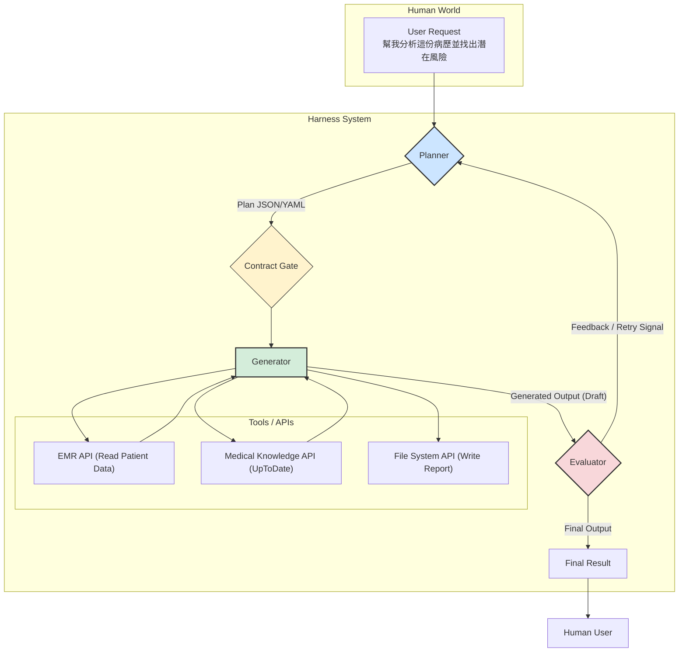

## §0. TL;DR（速覽）

- **一句話總結**：這堂課介紹如何為強大的大型語言模型（LLM）打造周邊系統與工作流程，以駕馭其能力、確保任務能被穩定可靠地完成。
- **3 個 Key Takeaways**：
    1.  **AI 是一匹千里馬，Harness 是駕馭牠的馬具**：`AI Agent = LLM + Harness`。Harness（駕馭工程）是圍繞在 LLM 核心之外、用以引導與控制其行為的所有程式與規則的總稱，包含工具、工作流程、以及寫給 AI 看的說明書。
    2.  **三大駕馭手段**：Harness Engineering 主要透過三種方式控制 AI：(A) **控制認知框架**（在 Prompt 中提供人類撰寫的規則檔案，如 `agents.md`），(B) **控制工具能力邊界**（限制 AI 可用的工具及其權限），(C) **制定標準工作流程 SOP**（導入如 Planner-Generator-Evaluator 的多階段處理模式）。
    3.  **從 Prompt 到 Harness 的演進**：`Prompt Engineering ⊂ Context Engineering ⊂ Harness Engineering`。隨著模型變強，單純的 Prompt 咒語效果遞減，重點轉移到如何自動化地組合情境（Context Engineering），最終發展為更宏觀的、關注長期多步驟任務的系統性方法——Harness Engineering。

---

## §1. Motivation（為什麼要這堂課）

在前幾堂課中，我們探索了如何透過提示（Prompt）與大型語言模型（LLM）互動，甚至見識了能自主執行多步驟任務的 AI Agent。然而，一個殘酷的現實是：一個「裸裝」的 LLM Agent，即使再聰明，也像一位極有天賦但缺乏紀律的實習醫師。他或許能一鳴驚人地解決某些難題，卻也可能在關鍵時刻做出令人費解的決策，例如：在診斷報告中遺漏關鍵數據、陷入重複檢查的迴圈，或是在沒有明確指示下，嘗試存取權限外的病患資料。

單純的 `Prompt Engineering` 就像是口頭交代任務，你告訴實習醫師「去評估一下 3 床的病人」，但你沒說評估的標準是什麼、要看哪些重點、異常值要如何上報。如果這位實習醫師經驗豐富，或許能做得不錯；但如果他經驗尚淺，或對當前科別的 SOP 不熟，產出的品質就會極不穩定。這就是 naïve 方案的缺陷：**高度依賴 LLM 當下的「狀態」與「運氣」，缺乏穩定性與可預測性。**

為了解決這個問題，我們需要一套更系統化的方法。我們不只是要「交代任務」，更要「建立制度」。我們需要為這位聰明的 AI Agent 提供：
1.  一本**工作手冊**，明確定義它的角色、職責、與行為準則。
2.  一套**權限系統**，明確告知它「能做什麼」與「不能做什麼」。
3.  一套**標準作業流程 (SOP)**，將複雜的任務拆解成可驗證的標準步驟。

這三個需求，共同催生了本堂課的主題——`Harness Engineering（駕馭工程）`。這個概念由 Anthropic、OpenAI 等頂尖實驗室在 2024-2026 年間陸續提出並發揚光大，其核心思想是：與其無止盡地優化對 LLM 下的「咒語」，不如將心力放在打造 LLM 周邊的「系統」上。

李宏毅老師在影片中用了一個絕佳的比喻：「**AI 是一匹擁有強大力量的馬，但要駕馭它，你需要馬鞍、需要韁繩。這些馬鞍與韁繩，就是 Harness。**」Harness Engineering 不再只是專注於 Prompt 本身的遣詞用字 (`Prompt Engineering`)，也不僅僅是自動化地為 Prompt 填充最佳情境 (`Context Engineering`)，而是將視野拉高到整個任務流程，思考如何設計一套穩健的系統，讓 LLM 這匹千里馬能跑得又快又穩，始終朝著我們期望的方向前進。這堂課，就是要教你如何打造那一套精良的「馬具」。

---

## §2. 背景知識補完（Prerequisites）

在深入 Harness Engineering 的世界前，讓我們先確保對幾個基礎概念有共同的理解。這些概念雖然你可能聽過，但它們在本堂課中有更精確的意涵。

1.  **API (Application Programming Interface / 應用程式介面)**
    - **嚴謹定義**：一組預先定義的規則、協定和工具，允許不同的軟體應用程式之間互相溝通和交換資料。API 定義了可以發出的請求種類、如何發出請求、應使用的資料格式，以及應遵循的慣例。
    - **白話版**：API 就像是餐廳的「菜單」。身為顧客（一個應用程式），你不需要知道廚房（另一個應用程式）內部的複雜運作，你只需要按照菜單上的格式點菜（呼叫 API），服務生（API 的中介層）就會將你的請求傳達給廚房，並在餐點準備好後送回給你。
    - **為何本堂會用到**：AI Agent 的「工具使用」能力，其本質就是呼叫 API。例如，Agent 需要查詢天氣，它不是自己「感知」天氣，而是呼叫一個天氣資訊網站提供的 API。在 Harness Engineering 中，「控制工具能力邊界」指的就是精確管理 Agent 可以存取哪些 API，以及如何使用它們。這就像是控管一位住院醫師，只讓他開立常規藥物的 API，而暫不開放化療藥物的 API 權限。

2.  **LLM Agent (大型語言模型代理人)**
    - **嚴謹定義**：一個以 LLM 為核心，具備感知（Perception）、規劃（Planning）、記憶（Memory）和工具使用（Tool Use）能力的自主系統。它不僅能生成文本，還能設定目標、拆解任務、並與外部環境（如檔案系統、資料庫、API）互動以達成目標。
    - **白話版**：LLM Agent 不再是只會聊天的 `ChatGPT`。它更像一個數位化的「員工」。你給它一個目標（例如：「整理我下週的行事曆並預訂去台南的高鐵票」），它會自己思考步驟（1. 讀取行事曆 API → 2. 找出空檔 → 3. 查詢高鐵 API → 4. 預訂車票 API → 5. 將結果寫回行事曆 API），並一步步完成。
    - **為何本堂會用到**：Harness Engineering 的主要服務對象就是 LLM Agent。因為 Agent 的行為是多步驟且與外部環境互動的，其不確定性遠高於單純的文本生成，因此才需要一套「駕馭」系統來確保其行為的可靠性與安全性。

3.  **SOP (Standard Operating Procedure / 標準作業流程)**
    - **嚴謹定義**：為重複性任務所制定的一系列詳細的書面指示，旨在確保每次執行任務時都能以一致且高品質的方式完成。SOP 能減少誤解、提高效率與安全性。
    - **白話版**：醫院裡無所不在的 checklist 和 guideline 就是 SOP。例如，手術前的「Time-out」程序、給藥的「三讀五對」、處理檢體的工作流程等，都是為了將高風險、複雜的任務標準化，將人為失誤降到最低。
    - **為何本堂會用到**：Harness Engineering 的核心精神之一，就是將臨床實踐中證明極其有效的 SOP 概念，應用於指導 AI Agent。本堂課將介紹的 `Planner-Generator-Evaluator` 模式，就是一個為 AI Agent 設計的通用 SOP，確保 Agent 在執行複雜任務時，其產出經過規劃、執行與評估三個標準步驟。

4.  **Prompt Engineering (提示工程)**
    - **嚴謹定義**：設計和優化輸入提示（Prompt）的藝術與科學，以引導大型語言模型產生期望的、準確的、或特定風格的輸出。
    - **白話版**：早期與 LLM 互動時，人們發現加上一些「咒語」，如「一步一步想（Think step-by-step）」、「你是一位專業的 X」，能顯著提升輸出品質。這就是最初階的 Prompt Engineering。
    - **為何本堂會用到**：Harness Engineering 是 Prompt Engineering 的超集（superset）。它承認 Prompt 仍然重要，但不再將其視為唯一解。Harness 將手寫的 Prompt 規則（例如，寫在一個 `.md` 檔案裡）制度化，使其成為 AI Agent 啟動時必須載入的「認知框架」的一部分，從而實現了 Prompt 的規模化與系統化管理。

---

## §3. 核心概念辭典（Core Concepts Glossary）

本節將深入探討 Harness Engineering 帶來的全新術語，這些是構成本堂課核心的基石。

1.  **Harness Engineering (駕馭工程)**
    - **嚴謹定義**：一種系統設計方法，專注於建構、配置和維護圍繞在大型語言模型周圍的輔助軟體與工作流程（即 "Harness"），以引導、約束和增強 LLM Agent 在執行複雜、多步驟任務時的性能、可靠性與安全性。
    - **白話重述**：這不僅僅是寫 Prompt。它是指你為了讓 AI Agent 好好工作而做的**所有周邊建設**。把 AI Agent 想像成醫院新來的 PGY（不分科住院醫師），Harness Engineering 就是資深總醫師（Chief Resident）為他設計的整套培訓和監督機制：給他一份科內規則手冊（認知框架）、設定他在 HIS 系統中的權限（工具邊界）、並要求他遵循「先問診、再開檢查、最後由主治醫師 review 報告」的流程（SOP）。
    - **常見誤解**：Harness Engineering **不是** `Fine-tuning`。Fine-tuning 是透過提供大量範例來改變 LLM 模型本身的權重（改變馬的基因）；而 Harness Engineering 則是在不改變模型的前提下，透過外部系統來引導它（給馬配上更好的馬具）。兩者是強化 AI 能力的兩條平行路徑。

2.  **Cognitive Framework (認知框架)**
    - **嚴謹定義**：一組以人類自然語言撰寫的規則、原則、角色扮演指令或行為準則，在 Agent 啟動或執行任務時被置於其 Prompt 的最前端，作為其思考和決策的基礎。
    - **白話重述**：這就是給 AI Agent 看的「**工作手冊**」或「**內部公告**」。通常是一個 `.md` 檔案（如影片中提到的 `agents.md`, `Cloud.md`）。裡面會寫著：「你是 OpenCloud 公司的 AI 助理，代號『小金』。你的目標是幫助使用者完成任務。你必須遵守以下規則：1. 永遠優先考慮安全性。2. 不要執行破壞性指令。3. 在輸出程式碼時，務必加上註解...」等等。這個框架就像人類社會的法律，AI 不一定 100% 遵守，但它為 AI 的行為提供了一個強大的基準線。
    - **相近概念區辨**：與單次的 `System Prompt` 不同，Cognitive Framework 更強調其**持久性**與**通用性**。它不是為單一任務設計的，而是為一個 Agent 在其生命週期內的所有任務提供一個共同的行為底層。

3.  **Tool Boundary Control (工具能力邊界控制)**
    - **嚴謹定義**：透過限制 AI Agent 可用的工具集（Tool sets）以及每個工具的參數和權限，來主動管理其能力範圍與潛在風險的一種安全機制。
    - **白話重述**：這就是設定 AI Agent 的「**權限**」。就算 AI 知道世界上有「刪除檔案」這個 API，但如果 Harness 系統沒有把這個工具註冊給它，它就無法使用。更進一步，即使給了「發送 email」的工具，也可以限制它只能發送給 `*.ntu.edu.tw` 網域的信箱。這就像醫院的資訊系統，實習醫師的帳號可以看到病歷，但沒有權限開立化療藥囑或簽署死亡證明。

4.  **Planner-Generator-Evaluator Pattern (規劃者-生成者-評估者模式)**
    - **嚴謹定義**：一個源於 Anthropic《Harness Design》論文的三階段任務處理架構。人類指令首先由 `Planner` 模組拆解成詳細的、可執行的步驟；接著由 `Generator` 模組根據計畫執行每一步（可能需要使用工具）；最後由 `Evaluator` 模組檢查生成結果是否符合計畫要求與品質標準。
    - **白話重述**：這是一套為 AI 設計的**品管 SOP**。
        - `Planner`：像開晨會的**主治醫師**，看完新病人的狀況後，開出一個 work-up plan：「先抽血看 CBC/DC、生化、心肌酶，再安排一張 Chest X-ray，1 小時後回報結果。」
        - `Generator`：像負責執行的**住院醫師**，根據主治的 plan，去電腦上開立醫囑、安排檢查。
        - `Evaluator`：像下午回來查房的**主治醫師**，檢視所有報告和紀錄，確認計畫是否被忠實執行、結果是否合理、是否需要調整下一步治療方案。這個模式透過職責分離，大大提高了複雜任務的成功率。

5.  **AI Agent Contract (代理人合約)**
    - **嚴謹定義**：在 Planner-Generator-Evaluator 流程中，由 Planner 生成的執行計畫在交付給 Generator 執行前，可以加入一個額外的確認步驟，該計畫被視為一份「合約」，需要被 Generator 甚至人類監督者「簽署」同意後才能執行。
    - **白話重述**：這是手術前的「**Time-out**」或簽署「**手術同意書**」。在 Planner 制定完一個宏大的計畫後（例如：「重構整個專案的資料庫架構」），先不要急著讓 Generator 動手。先把計畫（合約）亮出來，讓系統或人類看一眼，確認「方向是對的，可以開始動工了」。這可以避免 Generator 辛辛苦苦工作數小時後，才發現 Planner 從一開始就搞錯了方向，造成巨大的資源浪費。

6.  **Context Engineering (上下文工程)**
    - **嚴謹定義**：一種自動化的 Prompt Engineering 技術，系統會根據當前任務的性質，動態地從一個大型的知識庫或範例庫中，檢索（Retrieve）並組合出最相關的上下文資訊（如 few-shot examples、相關文件片段、規則），注入到最終的 Prompt 中。
    - **白話重述**：相較於人工手寫每一則 Prompt，Context Engineering 像是一個聰明的祕書。當你問一個關於「心肌梗塞」的問題時，祕書會自動去資料庫裡，找出最新的《急性冠心症治療指引》、幾篇相關的經典病例報告、以及科內的標準處理流程，把這些資料一起整理好，再交給 LLM 去回答。`RAG (Retrieval-Augmented Generation)` 就是 Context Engineering 最經典的實現。
    - **相近概念區辨**：`Harness Engineering` 包含了 `Context Engineering`。Context Engineering 主要關注如何「填充」單一輪次的 Prompt，而 Harness Engineering 更關注如何設計一個能完成**多輪次**、**長週期**任務的**完整系統**，SOP 的設計、工具的控制都在其範疇內。

---

## §4. System / Paper Deep Dive

現在，讓我們深入 Harness Engineering 的核心機制。我們將聚焦於影片中提到的兩種主要工作流程：基於認知框架的引導，以及更結構化的 Planner-Generator-Evaluator 模式。

### 4.1 Architecture

Harness Engineering 的核心是將一個單一的 LLM 呼叫，擴展成一個由多個模組化元件構成的系統。最經典的架構，如 Anthropic 所提倡的，是 `Planner-Generator-Evaluator` 循環。



**元件說明**：
- **User Request**：人類用自然語言提出的高層次目標。
- **Planner (規劃者)**：系統的第一站。它是一個 LLM，專門負責將模糊的人類請求，轉化為一份結構清晰、步驟明確的執行計畫（通常是 JSON 或 YAML 格式）。它負責「謀略」，決定「該做什麼」和「按什麼順序做」。
- **Contract Gate (合約門)**：一個可選的檢查點。在昂貴或高風險的任務執行前，Planner 產生的計畫會在這裡暫停，等待確認（可以是另一個 AI，也可以是人類）。這能防止災難性的錯誤方向。
- **Generator (生成者)**：系統的「勞動者」。它也是一個 LLM，但它的任務很單純：專心執行 Planner 給予的計畫中的每一步。如果步驟需要與外部世界互動，Generator 會呼叫已註冊的 **Tools/APIs**。
- **Tools / APIs (工具集)**：一組預先定義好的函式，讓 Generator 能讀取檔案、存取資料庫、呼叫外部服務等。Harness 的設計者可以精確控制要提供哪些工具給 Generator。
- **Evaluator (評估者)**：系統的「品管員」。它同樣是一個 LLM，負責檢查 Generator 的產出是否符合 Planner 的要求、是否達到品質標準、是否存在事實錯誤。如果評估通過，就輸出最終結果；如果失敗，它可以將帶著具體回饋的訊號送回 Planner，啟動新一輪的修正循環。

### 4.2 關鍵演算法：以「認知框架」為核心的引導

在 Planner-Generator-Evaluator 這種複雜架構之外，另一種更輕量、但同樣有效的 Harness 技術，是使用「認知框架」。這相當於為 Agent 提供一份永久的行為準則。

以下是一份偽程式碼，模擬一個 Agent 在執行任務時，如何將認知框架整合進它的思考流程。

```python
# --- File: clinical_agent.md (This is the Cognitive Framework) ---
# You are "Dr. Agent", a clinical decision support assistant.
# Your primary goal is to help clinicians by summarizing patient data and highlighting risks.
#
# === Core Principles ===
# 1.  Safety First: Always prioritize patient safety. If you see a critical value, state it first.
# 2.  Be Concise: Summarize, do not copy-paste raw data. Clinicians are busy.
# 3.  Cite Sources: When stating a fact, mention where it came from (e.g., "from EKG report", "from nursing notes").
# 4.  Do Not Diagnose: You are a support tool. Do not give a final diagnosis. Instead, list possibilities and evidence.
#
# === Available Tools ===
# - emr.get_patient_vitals(patient_id)
# - emr.get_lab_results(patient_id, test_name="all")
# - knowledge.lookup_drug_interaction(drug_a, drug_b)

# --- File: main_loop.py (The Agent's main execution logic) ---

def execute_task(user_query: str, patient_id: str):
    # 1. Load the cognitive framework from the .md file
    # This is the core of this Harness technique.
    with open("clinical_agent.md", "r") as f:
        cognitive_framework = f.read()

    # 2. Combine the framework with the user's specific query
    # The framework is placed BEFORE the user query to set the context.
    prompt = f"""
    {cognitive_framework}

    ---
    
    User Query: "{user_query}"
    Patient ID: {patient_id}

    Begin your work. Think step-by-step.
    """

    # 3. Send the combined prompt to the LLM core
    # The LLM's response will be heavily influenced by the rules in the framework.
    response = llm.generate(prompt)

    # 4. Parse the response and execute any tool calls
    # (Logic for tool parsing and execution would be here)
    
    return response

```

**為何這樣寫**：
- 這種方法的優雅之處在於其**簡單性**。我們不需要複雜的多 Agent 系統，只需在每次呼叫 LLM 之前，**穩定地、一致地**將同一份規則文件（`clinical_agent.md`）放在 Prompt 的最前面。
- 這份 `.md` 檔案成為了**可維護、可版本控制**的 Agent「個性」設定檔。當我們想調整 Agent 的行為時，我們去修改這份人類可讀的文件，而不是去修改程式碼。這大大降低了維護成本。
- 正如影片中提到的 OpenCloud 的 `agents.md` 或 Claude Code 的 `Cloud.md`，這種模式已經在業界得到驗證。一個 Agent 的核心行為，可以透過移植和修改這份框架文件，快速適應到新的平台或任務上。

### 4.3 關鍵 Data Structure

在 Planner-Generator-Evaluator 模型中，各階段之間的資訊傳遞高度依賴結構化資料。以下是其典型資料結構：

| 階段 (Stage) | 輸入 (Input) | 輸出 (Output) |
| :--- | :--- | :--- |
| **Planner** | `User Query` (String) | `Execution Plan` (JSON/YAML) |
| | e.g., "分析 123 號病人的風險" | `{ "steps": [ { "id": 1, "action": "tool_call", "tool": "emr.get_lab_results", "params": {"id": 123, "test": "troponin"}}, { "id": 2, "action": "summarize", "input": "step_1.output", "focus": "critical_values" } ] }` |
| **Generator** | `Execution Plan` (JSON/YAML) | `Draft Output` (String/Markdown) |
| | (來自 Planner 的計畫) | (根據計畫步驟生成的初步報告) |
| **Evaluator** | `Draft Output` (String) <br> `Original Plan` (JSON) | `Final Output` (String) **或** `Feedback` (JSON) |
| | (來自 Generator 的草稿) | 經確認的最終報告 **或** `{ "status": "rejected", "reason": "Missed elevated potassium level.", "retry_from_step": 1 }` |

### 4.4 Walkthrough

#### 情境一：基於「認知框架」的輕量級任務
- **使用者指令**：「幫我快速看一下 58 歲男性、主訴胸痛的王先生的狀況。」
- **Harness 行為**：
    1.  Agent 啟動，讀取 `clinical_agent.md` 並置於 Prompt 頂部。
    2.  將使用者指令附在後面，形成完整 Prompt。
    3.  LLM 接收到指令。由於框架要求「安全第一，優先提報危急值」，它會指示 Generator 優先呼叫 `emr.get_lab_results(patient_id, test_name="troponin")` 和 `emr.get_patient_vitals`。
    4.  Generator 取得結果：Troponin-I 顯著升高、心電圖呈現 ST 段抬高。
    5.  LLM 根據框架的「不要診斷」和「簡潔」原則，生成如下輸出：「**注意：病患心肌酶 Troponin-I 顯著升高 (來源: Lab)，心電圖 ST 段抬高 (來源: EKG)。潛在可能性包含急性心肌梗塞。建議立即進行臨床評估。**」
- **結果**：Agent 沒有長篇大論，而是直接、準確地完成了其「輔助決策」的核心任務。

#### 情境二：使用 Planner-Generator-Evaluator 的複雜任務
- **使用者指令**：「為這位有糖尿病史、新診斷高血壓的 65 歲病患，草擬一份出院衛教計畫。」
- **Harness 行為**：
    1.  **Planner** 介入，將任務拆解為結構化計畫：
        ```json
        {
          "steps": [
            {"id": 1, "task": "列出目前所有口服藥"},
            {"id": 2, "task": "查詢第一步中降血壓藥與降血糖藥之間的交互作用", "tool": "knowledge.lookup_drug_interaction"},
            {"id": 3, "task": "撰寫飲食衛教，重點是低鈉、低糖"},
            {"id": 4, "task": "撰寫運動衛教，建議每週 150 分鐘中強度運動"},
            {"id": 5, "task": "整合以上資訊成一份完整的衛教文件"}
          ]
        }
        ```
    2.  **Generator** 收到計畫，開始逐一執行。它順利完成了 1、3、4、5 步。但在執行第 2 步時，它呼叫工具後沒有發現顯著交互作用，於是在報告中寫道「藥物無顯著交互作用」。
    3.  **Evaluator** 收到 Generator 生成的完整衛教文件草稿。它進行審查，發現一個問題：Generator 雖然檢查了藥物交互作用，但沒有提及其中一種降血壓藥（Thiazide 利尿劑）有輕微升高血糖的潛在副作用，這對糖尿病患是重要資訊。
    4.  Evaluator **拒絕**該草稿，並發出 **Feedback**：「`{"status": "rejected", "reason": "未提及 Thiazide 對血糖的潛在影響", "retry_from_step": 2}`」。
    5.  流程回到 **Planner/Generator**，這次它會特別關注 Thiazide 的副作用，重新生成報告，在藥物章節中加入「您服用的利尿劑可能稍微影響血糖，請規律監測」的提醒。
    6.  新草稿再次提交給 **Evaluator**，這次審查通過，輸出為最終結果。
- **結果**：透過 P-G-E 的制衡與修正循環，系統自我糾錯，產出了一份比初版更安全、更完整的衛教文件，避免了潛在的醫療資訊遺漏。

## §5. 真實類比（★ 讀者背景特化）

在這一節，我們會將 Harness Engineering 的抽象概念，與你最熟悉的臨床工作場景進行類比。這不只是為了有趣，更是為了建立深刻的直覺。當你理解一個 AI Agent 如何被「駕馭」，你會發現這與醫院裡層層把關、確保醫療品質的流程有驚人的相似之處。我們的目標是，讓你下次看到主治醫師修改你的病歷、或護理師 double check 一個 high-alert medication（高警訊藥物）時，能會心一笑，想到：「啊，這就是一種人肉 harness。」

本節將探討三組核心類比，每組都會深入分析其相似與相異之處，確保你建立正確的 mental model，而不是錯誤的對應。

---

### 類比一：Harness ↔ 病房的標準作業流程（SOP）與查核機制

**類比情境描述**：
想像一位剛到內科病房的 PGY-1（第一年住院醫師）。他非常聰明，醫學知識豐富（就像一顆強大的 LLM），在 USMLE STEP 1/2 考試中都獲得高分。然而，他缺乏實戰經驗，不熟悉這家醫院特定的工作流程、藥物系統、以及潛在的風險。如果沒有任何規範，讓他自由地開立醫囑、處理臨床狀況，即使他立意良善，也可能因為不熟悉系統而犯下嚴重錯誤。例如，開立了需要特殊監控的藥物卻忘了安排監測、或是使用了非院內常規的抗生素組合。

因此，醫院建立了一整套「Harness」來駕馭這位聰明的 PGY-1。這套系統包括：明確的抗生素使用指引、醫囑系統內建的藥物交互作用警示、給藥前護理師的「三讀五對」、critical value（危急值）的自動通報流程、以及針對特定疾病的 clinical pathway（臨床路徑）。這些都不是為了限制醫師的「智慧」，而是為了將這份智慧導向安全、有效、且一致的產出。

**對應關係表**：

| AI Agent 系統概念 | 臨床工作場景類比 |
| :--- | :--- |
| LLM (Large Language Model) | PGY-1 住院醫師（聰明、知識豐富但缺乏經驗） |
| Harness（駕馭工程） | 整套病房標準作業流程（SOP）與查核機制 |
| AI Agent (LLM + Harness) | 在完整制度下工作的 PGY-1 |
| Harness 的目標：確保任務成功 | 臨床 SOP 的目標：確保病人安全與醫療品質 |
| Agent 犯錯的後果 | 醫療疏失（Medical error） |
| Harness 的設計者 | 開發 AI Agent 的工程師 |
| 臨床 SOP 的設計者 | 醫院的感控、藥劑、品管委員會、資深主治醫師 |

**✅ 吻合之處（為何類比有效）**：
這個類比的核心精神在於「約束下的賦能」。醫院的 SOP 看似限制，實則是保護傘，讓 PGY-1 能在一個安全的沙盒中發揮所長，不必擔心犯下毀滅性的錯誤。同樣地，Harness Engineering 的目的不是削弱 LLM 的能力，而是為其強大的生成能力提供方向和護欄。PGY-1 不需要從零開始「發明」第一線的肺炎抗生素療法，他可以遵循院內指引，這讓他能更快上手、更安全地治療病人。AI Agent 也不需要每次都從頭推理「如何列出資料夾」，它可以直接使用給定的 `list_files` tool。兩者都是透過一個「駕馭系統」，將原始的、未經雕琢的「智能」轉化為可靠的「生產力」。

**⚠️ 不吻合之處（類比邊界，避免誤導）**：
最大的差異在於「意圖」和「學習」。人類醫師有真實的意圖、責任感和同理心，SOP 對他們而言是一種外部規範，他們可以理解其背後的醫學原理。當 PGY-1 遇到 SOP 無法涵蓋的罕見狀況時，他會主動 seek for help（求助）或升級問題。然而，LLM 沒有真正的意圖或理解。Harness 對它而言，就只是 token stream 的一部分，是機率分佈的導引。如果 Harness 設計有漏洞，LLM 不會「意識到」危險，只會沿著機率最高的路徑走下去，即使那條路徑是錯的。此外，PGY-1 會從錯誤中學習，逐漸內化 SOP，最終成長為能制定 SOP 的主治醫師。而 Harness Engineering 裡，LLM 本身（通常）是固定的，學習和改進發生在 Harness 的迭代上，是外部系統的進化，而非模型本身的成長。

---

### 類比二：Planner/Generator/Evaluator ↔ 住院醫師、總醫師、主治醫師三級審查制度

**類比情境描述**：
一位新病人半夜入住病房，值班的 R1（住院醫師第一年）負責接新病人並撰寫 Admission Note（入院病歷）。這個過程極其複雜，需要整合病史、理學檢查、過去病史、影像學和實驗室數據，最後提出初步的臆斷（Impression）和治療計畫（Plan）。

1.  **Planner/Generator (R1)**: R1 首先構思（**Planner**）這份 Admission Note 的結構：主訴、現在病史、過去病史... 等。然後他開始動手寫，從各個系統撈取資料，彙整成一份完整的病歷（**Generator**）。這份初稿可能很詳盡，但也可能存在盲點或不成熟的判斷。
2.  **Evaluator 1 (Chief Resident)**: 寫完後，R1 會將病歷交給經驗更豐富的 CR（總醫師）過目。CR 會快速審閱（**Evaluator**），檢查是否有明顯的邏輯錯誤、重要的鑑別診斷是否被遺漏、或初步計畫是否合適。他可能會提出修改建議：「這裡的抗生素選擇需要考慮到病人的腎功能」、「這個鑑別診斷的證據不夠強，先往下排」。
3.  **Evaluator 2 (Attending Physician)**: 隔天早上，VS（主治醫師）會進行最終審閱（**final Evaluator**）。VS 的視角更高，他不僅會看細節，更會從整個治療方向、資源運用、甚至未來出院計畫的角度來評估這份病歷和計畫。他可能會做出更重大的修正，例如：「這個診斷方向不對，我們需要加做一個內視鏡檢查」、「這個藥可以換成更便宜的口服劑型」。

這個三級審查流程確保了最終產出的醫療決策品質高且風險低。

**對應關係表**：

| AI Agent 系統概念 | 臨床工作場景類比 |
| :--- | :--- |
| **Planner** | R1 構思病歷架構、決定要問哪些問題 |
| **Generator** | R1 實際撰寫 Admission Note 初稿 |
| **Evaluator** | CR / VS 審核、修改病歷與治療計畫 |
| **人類給的指令** | 「處理這位新病人」 |
| **最終產出** | 經過 VS 簽核確認的最終版 Admission Note |
| **Contract (變體)** | R1 在動筆前，先口頭跟 CR/VS run 過一次 plan |

**✅ 吻合之處（為何類比有效）**：
這個類比完美地捕捉了「分層迭代、逐步求精」的核心精神。沒有人會期望一個 R1 能一步到位寫出完美的 Admission Note。臨床實務中，我們透過引入不同層級的「Evaluator」（評估者）來確保品質。Planner/Generator/Evaluator 模式也是如此，它承認單一的 LLM call（Generator）可能不完美，因此引入了 Evaluator 來扮演「資深同事」或「主管」的角色。這個模式的成本（時間、運算資源）較高，就像三級審查會拉長病歷完成的時間，但對於高風險、複雜的任務（如部署一整個雲端服務、或擬定一份詳細的治療計畫），這種成本是完全值得的。那個在動手前先簽「Contract」的變體，也像極了 R1 在做侵入性治療前，先跟 VS 口頭確認 plan 的情境，避免「做完才發現全錯了」的窘境。

**⚠️ 不吻合之處（類比邊界，避免誤導）**：
最大的不同在於「評估的標準」。在醫院，CR 和 VS 的評估是基於深厚的醫學知識、臨床經驗和對病人的責任感。他們的「評估標準」是內隱的、複雜的、且動態的。而在 AI Agent 中，Evaluator 本身通常也是一個 LLM。它的評估標準必須被明確地寫在 prompt 中（例如：「請檢查這段程式碼是否符合 PEP8 規範」、「請確認這份摘要是否包含所有關鍵數據」）。這個標準是外顯的、固定的。如果評估標準本身寫得有瑕疵，Evaluator 就會做出錯誤的評估。它不像人類主管那樣，能根據情境和常識，發現「評估標準本身」就有問題。此外，人類的審查包含指導和教學的成分，VS 改 R1 的 note 不只是為了改錯，更是為了教他。AI 的 Evaluator 則純粹是個品管閘門，沒有教學意圖。

---

### 類比三：Tool Boundary ↔ 不同層級醫師的醫囑權限

**類比情境描述**：
在一家教學醫院的資訊系統（HIS）中，醫師的權限是分級的。

-   **醫學生 (Clerk/Intern)**: 幾乎沒有獨立開立醫囑的權限。他們可以在系統中「預開」醫囑，但這些醫囑必須經過住院醫師或主治醫師 cosign（副署）後才會生效。他們的「工具箱」是唯讀的，或是只能產生「草稿」。
-   **住院醫師 (Resident)**: 擁有大部分常規藥物、檢查、會診的開立權限。但是，對於某些高風險項目，系統會設下限制。例如，他不能直接開立化療藥物、管制藥品（如嗎啡）的處方可能有嚴格的劑量和天數上限、要開立昂貴的自費項目（如免疫療法藥物）可能需要主治醫師的帳號密碼二次授權。
-   **主治醫師 (Attending Physician)**: 擁有幾乎所有的醫囑權限。他們可以開立化療、管制藥品，並授權昂貴的治療。
-   **專科醫師 (Specialist)**: 某些「工具」甚至只有特定專科的醫師才能使用。例如，放射腫瘤科醫師才能開立放射治療計畫，心臟內科醫師才能執行心導管手術。

這個權限系統（Tool Boundary）確保了醫師只在他們的能力範圍和職責內，使用對應的醫療「工具」。

**對應關係表**：

| AI Agent 系統概念 | 臨床工作場景類比 |
| :--- | :--- |
| **Tool (工具)** | 一項醫囑權限（如開立抗生素、安排 MRI） |
| **Agent 的 Toolset** | 某位醫師可用的完整醫囑清單 |
| **Tool Boundary (工具能力邊界)** | HIS 系統中的醫師層級權限設定 |
| **受限的 Agent** | 實習醫師、住院醫師 |
| **權限較大的 Agent** | 主治醫師、專科醫師 |
| **執行一個 Tool** | 在 HIS 中成功送出一筆醫囑 |

**✅ 吻合之處（為何類比有效）**：
此類比非常直觀地解釋了 Harness Engineering 中「控制工具能力邊界」這個手段。為什麼不給一個 LLM Agent 所有可能的工具（例如 `delete_entire_database`）？原因就跟為什麼不給實習醫師開立化療藥物的權限一樣：**能力越大，潛在的風險和破壞力也越大**。透過精細地定義 Agent 能使用哪些工具、以及使用工具的參數限制（例如，`delete_file` 只能刪除 `/tmp` 目錄下的檔案，就像 R1 的嗎啡處方有劑量上限），開發者可以有效地管理 Agent 的能力，使其在完成任務的同時，不會對系統造成無法挽回的傷害。這是一種非常務實且必要的風險控管策略。當 Agent 的任務是「分析數據並產生報告」時，你可能只會給它讀取資料庫和寫入檔案的工具；當它的任務是「管理雲端伺服器」時，才會給它啟動和關閉虛擬機的權限。

**⚠️ 不吻合之處（類比邊界，避免誤導）**：
主要差異在於「邊界的彈性」與「請求授權的流程」。在醫院，如果一位 R1 認為病人確實需要超出他權限的處置，他可以拿起電話打給主治醫師，解釋狀況並請求口頭醫囑或親自開立。這個「升級授權」的流程是動態且基於人類溝通的。然而，在多數 AI Agent 系統中，Tool Boundary 是相對靜態的。如果一個工具不在 Agent 的 toolset 中，它通常無法「創造」或「請求」這個工具。它只會回報說「我無法完成這個任務，因為我沒有 xxx 工具」。更先進的 Agent 或許可以設計成在遇到權限問題時，暫停任務並向人類操作員請求授權，但這本身就是一個更複雜的 Harness 設計，而非內建能力。

---

## §6. 課堂 Q&A 精華

本節整理了課堂中，同學們針對 Harness Engineering 可能提出的典型問題，並由教授的回答提煉出觀念的澄清。這些問答有助於我們釐清一些常見的模糊地帶。

**Q1**: 老師，這個「Harness Engineering（駕馭工程）」聽起來很酷，但它跟我們之前一直在談的「Prompt Engineering（提示工程）」到底有什麼不一樣？感覺好像只是把 Prompt 寫得更複雜而已？
**A**: 問得很好，這正是許多人一開始的疑惑。你可以這樣想：`Prompt Engineering ⊂ Context Engineering ⊂ Harness Engineering`，它們是一個逐漸擴大、一般化的光譜。
-   **Prompt Engineering**：專注在「單一次」與 LLM 的互動中，如何透過精巧的文字（所謂的「咒語」）讓模型給出最好的答案。例如，在 prompt 裡加上「一步一步想」、「你是一位專業的XXX」。這在早期模型較弱時非常關鍵。
-   **Context Engineering**：將 Prompt Engineering 自動化、系統化。它不再是手動打造單一 prompt，而是建立一個系統，能根據當前任務，自動從文件（例如 `agents.md`）、對話歷史、工具說明中，動態地「組裝」出一個最佳的 prompt (context)。
-   **Harness Engineering**：是最高層次的概念。它不僅僅關心「那一次」的 prompt 內容，更關心**如何設計一個完整的系統，讓 LLM 能夠在多輪互動中，穩定地使用工具、遵循流程，最終完成一個複雜的任務**。所以，Context Engineering 是 Harness 的一部分，但 Harness 還包含了工具的設計與限制、工作流程（SOP）的制定（如 Planner/Generator/Evaluator）等。簡單說，Prompt Engineering 是在微調「問句」，Harness Engineering 是在打造整個「工作站」。

**Q2**: 影片中提到的 `agents.md` 或 `Cloud.md` 這種規則檔案，AI 是不是就一定會 100% 遵守？它對 AI 來說，是一種像程式碼一樣的硬性規定嗎？
**A**: 這是一個非常重要的觀念釐清。答案是：**不是**。這些 `.md` 檔案最好的比喻是「**社會的法律或公司的行為準則**」。它為 Agent 的行為提供了一個強大的「認知框架」和「行為基線」，在絕大多數情況下，Agent 會傾向於遵循這些指示。但它不是程式碼那種非黑即白的硬性約束。LLM 在生成每一個 token 時，仍然是基於機率分佈做選擇，這些規則只是極大地提高了「遵循規則的文字」出現的機率。因此，Agent 仍然有可能在某些情況下「違反」或「忽略」這些規則，就像人類偶爾也會闖紅燈一樣。Harness 的作用是建立一個強大的慣性，讓「守法」成為阻力最小的路，但它不保證 100% 的服從。

**Q3**: 如果我們要讓 AI 變得更強，應該投資在「訓練更好的模型（Fine-tuning）」上，還是投資在「打造更好的 Harness」上？哪條路比較有前景？
**A**: 這個問題沒有單一答案，因為它們是**兩條獨立且互補的強化路徑**。
-   **訓練/Fine-tuning**：就像是提升馬本身的素質。你可以把一匹普通的馬，訓練成一匹賽馬。這是從根本上改變模型的內部權重，讓它在特定領域的知識或能力更強。這需要大量的數據和運算資源。
-   **Harness Engineering**：則是打造更好的「馬具」（馬鞍、韁繩）。即使你手上只是一匹普通的馬，只要有精良的馬具和一位好騎師，你依然能駕馭它完成許多複雜的任務。
在實務上，多數公司會雙管齊下。但對於很多應用開發者來說，我們無法輕易地去訓練或微調像 GPT-4 或 Claude 3 Opus 這樣等級的基礎模型，所以 Harness Engineering 就成了我們能將這些強大 AI「落地」到特定應用場景中，最重要、也最觸手可及的手段。

**Q4**: 老師提到 AI 能在一瞬間寫出 500 字作文，但人類不行，所以這可以用來區分人跟 AI。這是否代表 AI 的「聰明」跟人類很不一樣？
**A**: 完全正確。這個例子揭示了一個深刻的道理：**人類和 AI 擅長的工具集（toolset）是截然不同的**。對人類來說，「寫 500 字作文」是一個需要組織思緒、遣詞用字的高強度認知勞動。但對 LLM 而言，生成文字是它最底層、最核心的功能，幾乎不費吹灰之力，就像我們呼吸一樣自然。反過來說，一些對我們來說很簡單的直覺判斷或物理操作，對目前的 AI 來說卻極其困難。理解這一點至關重要，因為這意味著我們在為 AI 設計工具和工作流程（即 Harness）時，不能想當然地把人類覺得好用的工具直接丟給它。我們應該去思考：基於 LLM 的原生能力，什麼樣的工具（例如，處理複雜 JSON 結構、執行大量並行 API 呼叫）對它來說才是最高效、最自然的？

**Q5**: Planner/Generator/Evaluator 這個模式聽起來很可靠，但也很繁瑣。是不是所有任務都需要這樣搞？
**A**: 當然不是。這就像在醫院裡，不是所有醫囑都需要三級審查一樣。如果你只是要開一顆普拿疼，讓 VS 來 cosign 就太小題大作了。P/G/E 模式主要適用於**高風險、高複雜度、且對結果正確性要求極高**的任務。例如，讓 AI Agent 撰寫並執行一段會修改生產環境資料庫的腳本。在這種情況下，多花一點運算資源進行規劃和評估，以避免災難性的後果，是非常值得的。對於簡單、低風險的任務，例如「今天天氣如何？」或「幫我把這段文字翻譯成英文」，直接讓一個 Generator 出結果就足夠了。好的 Harness Design 應該要能根據任務的性質，動態選擇合適的策略，在成本和可靠性之間取得平衡。

**Q6**: 為什麼 Anthropic 有 `Cloud.md`，OpenCloud 用 `agents.md`，CoWork 又有 `cowork.md`？這些公司不能統一一下標準嗎？
**A**: 這反映了目前 AI Agent 領域還在一個百家爭鳴的早期階段，有點像早期個人電腦的作業系統大戰。每家公司都在探索最佳的 Harness 實踐。這些 `.md` 檔案雖然名字不同，但扮演的「角色」是相同的：提供一個初始的認知框架。它們內容上的差異，可能反映了其背後 Agent 設計哲學的細微不同，或是為了適應自家模型特定的「個性」。不過，如同影片中提到的，有時把 `agents.md` 改名成 `Cloud.md` 就能讓 Agent 在不同平台上工作，這也暗示了它們底層的原理是相通的。未來或許會出現更標準化的 Harness 規範，但目前這種多樣性也促進了領域的快速創新。

---
### 最常見誤解 Top 3

1.  **誤解**：Harness 就是寫一堆 Prompt。
    **釐清**：Harness 是一個**系統**，Prompt (或稱 Context) 只是其中控制「認知框架」的一環。控制「工具邊界」和「工作流程」同等重要。
2.  **誤解**：只要 `agents.md` 寫得夠好，AI 就不會犯錯。
    **釐清**：`agents.md` 是「軟性」的法律，不是「硬性」的程式。它能**大幅降低**犯錯機率，但不能**完全杜絕**。Agent 依然有自由意志（基於機率）偏離軌道。
3.  **誤解**：Harness Engineering 只適用於寫程式或 DevOps 這類任務。
    **釐清**：任何需要 LLM 完成的**複雜、多步驟任務**都可以從 Harness Engineering 中受益，無論是法律文件分析、科學研究、還是醫療記錄整理。只要任務超出單一問答的範疇，就需要「駕馭」。

---

## §7. 常見陷阱與考點（What Engineers Actually Get Wrong）

當工程師們開始動手打造自己的 AI Agent 時，常常會因為一些錯誤的假設而踩坑。這些陷阱在書本或論文中很少被提及，卻是實戰中寶貴的教訓。

**陷阱 1：將「規則檔案」（`agents.md`）當作神主牌，以為寫了就一定會被遵守**
-   **為何會掉進去**：習慣了傳統程式設計的確定性思維，認為輸入的「設定檔」就該像程式碼一樣被嚴格執行。
-   **正確做法**：將規則檔案視為對 Agent 的「強力建議」或「文化薰陶」，而不是不可違背的命令。在設計系統時，必須為 Agent 可能會「不聽話」的情況準備備案。例如，除了在 `agents.md` 中寫「不要刪除根目錄檔案」外，更要在 Agent 執行環境的權限層面，直接移除它對根目錄的寫入權限（這就是「控制工具邊界」）。
-   **實例**：一個團隊在 `agents.md` 中詳細規定了 JSON 輸出的格式，但上線後發現 Agent 偶爾還是會輸出不合格式的 JSON 或夾帶額外的自然語言解釋。最終他們不得不在 Agent 的輸出端，再加一個傳統的 parser 和 validator 來做「後處理」，作為最後一道防線。

**陷阱 2：迷信「萬能模式」，將 Planner/Generator/Evaluator (P/G/E) 套用在所有任務上**
-   **為何會掉進去**：P/G/E 模式聽起來非常可靠、思慮周全，容易讓人產生「所有任務都該這樣才夠專業」的錯覺。
-   **正確做法**：評估任務的「風險」與「複雜度」。只有在高風險、高複雜度的任務上，P/G/E 的成本（延遲增加、API call 次數變多）才是合理的。對於簡單的查詢、翻譯、摘要等任務，直接使用 Generator 就好。一個好的 Agent 系統應該是一個「路由器」，能根據任務類型，分派到不同的處理流程。
-   **實例**：一個客服機器人，被設計用 P/G/E 模式來回答「你們的營業時間是幾點？」。結果是，使用者問一個簡單問題，系統內部卻要經過 planner（規劃回答）、generator（生成答案）、evaluator（評估答案是否友善）三個 LLM call，導致回應速度慢到令人無法忍受。

**陷阱 3：在設計工具時，完全以人類的習慣來思考**
-   **為何會掉進去**：我們太習慣自己使用工具的方式，很自然地會認為 AI 也該用同樣的方式工作。
-   **正確做法**：記住課堂上的「500字作文」例子。要思考什麼樣的工具對 LLM 來說是「原生」且「輕鬆」的。LLM 非常擅長處理結構化數據（如 JSON），且不在乎數據有多冗長複雜。因此，設計一個能回傳巨大 JSON blob 的工具，讓 LLM 自己去解析，往往比設計十個小工具，讓 LLM 來回呼叫，效率更高。
-   **實例**：一個 Agent 需要獲取某個伺服器的 CPU、記憶體、硬碟用量。工程師一開始設計了三個工具：`get_cpu()`, `get_memory()`, `get_disk()`。後來發現 Agent 常常需要這三項資訊，導致要呼叫三次工具。更好的設計是單一工具 `get_system_stats()`，一次性回傳一個包含所有資訊的 JSON 物件，讓 Agent 自己拆解。

**陷阱 4：忽略了 Harness 本身的「可觀測性」（Observability）**
-   **為何會掉進去**：只專注在 Agent 最終的輸出是否正確，卻忽略了它「如何」達成這個輸出的過程。
-   **正確做法**：一個好的 Harness 必須能詳盡地記錄下 Agent 的「思考鏈」（Chain of Thought）。這包括它收到的 prompt、它決定呼叫哪個工具、呼叫的參數、工具回傳的結果、以及它在 P/G/E 循環中每一輪的想法。沒有這些 log，當 Agent 出錯時，你就像在沒有監視器的情況下調查一樁懸案，根本無從下手。
-   **實例**：一個 Agent 在線上偶發性地出錯，但開發者無法重現問題。直到他們為 Harness 加上了詳細的日誌系統，才發現原來是某個 API 偶爾會回傳一個非預期的空值，而 Agent 的 Evaluator 沒有正確處理這種 edge case，導致後續決策鏈崩潰。

**陷阱 5：在「認知框架」和「工具邊界」之間選擇困難**
-   **為何會掉進去**：當 Agent 做出不當行為時，開發者會猶豫：我應該用更嚴格的文字在 `agents.md` 裡「告誡」它，還是應該直接把對應的工具拿掉？
-   **正確做法**：兩者都做，並理解它們的作用層級不同。「認知框架」是軟性的引導，能處理較廣泛、較模糊的行為模式；「工具邊界」是硬性的限制，能一勞永逸地杜絕特定的高風險操作。黃金法則是：**能用權限（工具邊界）解決的問題，就不要只靠說教（認知框架）**。
-   **實例**：一個寫程式的 Agent 常常自己去 `pip install` 一些不在專案需求裡的套件。團隊一開始嘗試在 prompt 裡加規則：「你只能使用 `requirements.txt` 中定義的套件」。但效果不彰。最終的解決方案是，直接在 Agent 執行的 Docker container 中，設定網路 policy，只允許它存取公司內部的 PyPI mirror，並禁止 `pip install` 指令，從根本上限制了它的能力。

**陷阱 6：認為 Harness 是一次性的建置工作**
-   **為何會掉進去**：專案初期把 Harness 搭建好後，就以為可以高枕無憂，專注在其他業務邏輯上。
-   **正確做法**：把 Harness 視為一個**持續演化、需要不斷維護的生命體**。當底層的 LLM 更新換代時（GPT-4 換成 GPT-5），Harness 可能需要跟著調整。當你為 Agent 新增了工具，你需要回頭檢視舊的規則和流程是否依然適用。Harness Engineering 是一個持續迭代的過程，而非一蹴可幾的專案。
-   **實例**：一個運作良好的 Agent 在底層模型從 Claude 2 升級到 Claude 3 後，行為開始變得不穩定。原本在 `Cloud.md` 裡的很多「循循善誘」的提示，對於更聰明的 Claude 3 來說反而成了干擾，讓它想得太多。團隊不得不重新審視並簡化 Harness，以適應更強大的模型。

---

## §8. 自測題

這 10 道題目涵蓋了本堂課的核心觀念，試著在不回看講義的情況下回答，然後再對照答案，檢驗你是否已真正掌握 Harness Engineering 的精髓。

1.  **(概念題)** 請用一句話，並以「光譜」的概念，描述 Prompt Engineering、Context Engineering 和 Harness Engineering 三者之間的關係。

<details><summary>展開答案</summary>

Harness Engineering 是一個最廣泛的光譜，它包含了專注於動態組裝 prompt 的 Context Engineering，而 Context Engineering 又包含了專注於單次互動優化的 Prompt Engineering。它們的關係是 `Prompt ⊂ Context ⊂ Harness`，範圍由小到大，由單次互動的戰術，擴展到多輪任務的戰略系統。

</details>

2.  **(情境題)** 你正在為一家醫院設計一個「AI 輔助診斷 Agent」。這個 Agent 的任務是讀取病人的 EMR（電子病歷），並提出可能的鑑別診斷列表。你會優先考慮使用 Planner/Generator/Evaluator 模式嗎？為什麼？

<details><summary>展開答案</summary>

**會優先考慮使用。**

**理由：** 這是一個典型的「高風險、高複雜度」任務。
1.  **高風險**：錯誤的鑑別診斷可能直接影響病人的治療方向，甚至危及生命。因此，結果的正確性至關重要。
2.  **高複雜度**：分析一份完整的 EMR 需要整合來自不同來源的資訊（病史、檢驗數據、影像報告等），並進行複雜的醫學推理。

在這種情境下，P/G/E 模式的優勢能被最大化：
-   **Planner**：可以先規劃分析步驟，例如「第一步：提取主訴與病史關鍵詞；第二步：分析檢驗數據異常值；第三步：交叉比對影像報告」。
-   **Generator**：根據計畫，生成初步的鑑別診斷列表與支持證據。
-   **Evaluator**：扮演「主治醫師」的角色，檢查列表是否完整、證據是否充足、是否有更可能的診斷被遺漏。這個 Evaluator 的 prompt 可以被設計成包含一系列臨床的 check points。

雖然這會增加成本，但在醫療場景下，用運算資源換取更高的可靠性與安全性是完全值得的。

</details>

3.  **(除錯題)** 你的 AI Agent 任務是管理雲端伺服器。你在它的 `agents.md` 裡明確寫下：「**規則三：絕對不可以在正式環境（production environment）中執行任何刪除操作。**」但今天你發現，它在正式環境中刪除了一個暫存檔案。請問最可能的原因是什麼？以及你該如何從根本上修復這個問題？

<details><summary>展開答案</summary>

**最可能的原因：** Agent 雖然被「告知」了規則，但它並非 100% 遵守。在某個決策點，它根據機率模型，判斷「刪除檔案」是完成任務的最直接路徑，而「忽略規則三」的機率雖然低，但並非為零。這體現了「認知框架」是軟性約束的特性。

**根本上的修復方法：** 採用「控制工具邊界」的手段。
你不應該只依賴 `agents.md` 的「說教」。你需要在 Agent 執行操作的環境層面，配置其 IAM (Identity and Access Management) 權限。具體做法是：
1.  為 Agent 建立一個專屬的 Service Account。
2.  修改這個帳號的權限策略，**移除**它在正式環境中的所有 `delete`、`remove`、`terminate` 相關權限。
3.  這樣一來，即使 Agent 的「大腦」（LLM）想執行刪除操作，它的「手腳」（執行環境）也根本沒有這個權力。這是一種硬性約束，比單純的文字規則可靠得多。

</details>

4.  **(概念題)** 根據課堂內容，Harness Engineering 和 Model Fine-tuning 是如何強化 AI 的兩種不同途徑？請用「馬」的比喻來解釋。

<details><summary>展開答案</summary>

-   **Model Fine-tuning（模型微調）** 像是**提升馬本身的素質**。你透過特殊的飼料和訓練（大量的專業數據），把一匹普通的馬，訓練成更強壯、更快速的賽馬。這是從基因、從根本上改變馬的能力。對應到 AI，就是改變模型的內部權重，讓它在特定領域更「聰明」。
-   **Harness Engineering（駕馭工程）** 像是**打造更精良的馬具**。即使你手上只是一匹普通的馬，但你為牠配上了頂級的馬鞍、堅固的韁繩、以及舒適的腳蹬，並由一位了解這匹馬習性的騎師來駕馭。這使得馬的能力可以被穩定、安全地發揮出來。對應到 AI，就是圍繞著既有的模型，建立更好的周邊系統（規則、工具、流程）。

這兩者是互補的：一匹好馬配上好馬具，才能發揮最大潛力。

</details>

5.  **(情境題)** 你正在設計一個 AI Agent 來協助處理客戶服務郵件。你為它設計了兩個工具：`get_email_content(id)` 和 `get_customer_profile(email_address)`。在實際運行中，你發現 Agent 總是先呼叫第一個工具，拿到內容後再解析出客戶信箱，再呼叫第二個工具，效率很低。根據 Harness Engineering 的原則，你會如何優化這個工具設計？

<details><summary>展開答案</summary>

根據「**為 AI 設計它原生擅長的工具**」原則，應該將這兩個工具合併成一個。

**優化後的設計：**
建立一個新的工具，例如 `get_ticket_details(id)`。
這個工具在後端會執行原本兩個工具的邏輯：根據 ticket ID，同時去抓取郵件內容和客戶的個人資料，然後將這兩部分資訊**合併成一個詳盡的、結構化的 JSON 物件**一次性回傳給 Agent。

**理由：**
-   **減少來回溝通**：將多次 API call 合併為一次，大幅降低延遲。
-   **發揮 LLM 長處**：LLM 非常擅長從一個大的、結構化的 JSON 中提取自己需要的資訊。讓它處理一個複雜的 JSON，遠比讓它來回進行多次工具呼叫要高效得多。這正是在利用 AI 的原生能力，而不是用人類的思維模式去限制它。

</details>

6.  **(概念題)** 影片中提到的 `agents.md`、`Cloud.md`、`cowork.md` 這些檔案，它們在 Harness Engineering 的三大支柱（認知框架、工具邊界、標準流程）中，主要對應哪一項？

<details><summary>展開答案</summary>

主要對應「**控制認知框架（cognitive framework）**」。

這些檔案的內容通常是用自然語言寫成的規則、原則、或背景知識，它們在 Agent 啟動時被讀入 prompt (context)。其目的是為 Agent 的「思考」和「行為」設定一個 baseline，就像為一個人設定價值觀或行為準則一樣。它影響 Agent 如何看待問題、如何與使用者互動、以及在沒有明確指示時的預設行為。

</details>

7.  **(情境題)** 一個法律事務所的 AI Agent 在分析合約時，被要求「找出所有具風險的條款」。Agent 的 Planner/Generator/Evaluator 流程如下：Planner 規劃「逐條閱讀」，Generator 標出風險條款，Evaluator 檢查是否有遺漏。你認為這個流程還可以如何改進，使其更可靠？（提示：參考臨床工作流程）

<details><summary>展開答案</summary>

一個重要的改進是加入「**簽訂合約 (Contract)**」的步驟。

**改進後的流程：**
1.  **Planner**：規劃分析步驟，並**產生一份「檢查清單（Checklist）」**，這份清單列出了所有它預計要檢查的風險類型（例如：賠償上限、保密義務、終止條件等）。
2.  **Contract (簽約)**：在 Generator 實際開始逐條分析前，先將這份「檢查清單」**提交給人類律師或另一個更高階的 Evaluator Agent 審核**。
3.  **Generator**：在檢查清單被批准後，才開始根據清單上的項目，逐條閱讀合約並標出風險條款。
4.  **Evaluator**：最後，再次檢查 Generator 的輸出是否完整覆蓋了合約中約定的所有檢查項目。

**理由：**
這個改進就像外科醫師在動刀前，會先進行「Time Out」，確認手術部位、病人身份、手術計畫一樣。它確保了在投入大量資源（Generator 的分析過程）之前，大家對於「要做什麼」和「目標是什麼」達成了共識，極大地避免了「方向從一開始就錯了」的風險。

</details>

8.  **(概念題)** 為什麼說，隨著 LLM 基礎模型本身越來越聰明，傳統的「Prompt Engineering」（例如，加上 "Let's think step by step"）的重要性可能會下降，但 Harness Engineering 的重要性反而會上升？

<details><summary>展開答案</summary>

-   **Prompt Engineering 的重要性下降**：是因為更聰明的模型（如 GPT-4 及之後的版本）已經在訓練過程中內化了「逐步思考」、「角色扮演」等能力。你不再需要用特定的「咒語」去啟動這些能力，它們在面對複雜問題時會自然地表現出來。過多的提示甚至可能對它們造成干擾。
-   **Harness Engineering 的重要性上升**：是因為模型越強大，它能完成的任務就越複雜，潛在的破壞力也越大。這就像你從駕馭一匹小馬，變成了駕馭一頭大象。你更需要一個堅固、可靠的「駕馭系統」（Harness）來確保這股強大的力量被用在正確的地方。強大的模型能使用更複雜的工具、執行更多步驟的計畫，這都對 Harness 的設計（工具邊界、SOP、監控）提出了更高的要求。因此，重點從「如何讓模型變聰明」轉向了「**如何駕馭已經很聰明的模型**」。

</details>

9.  **(除錯題)** 你設計了一個有 Planner, Generator, Evaluator 的 Agent。你給它一個任務：「幫我訂一張明天從台北到高雄的機票」。Agent 卡住了，不斷在 Planner 和 Evaluator 之間循環，日誌顯示 Evaluator 一直否決 Planner 的計畫，理由是「計畫不可行」。Planner 的計畫是「1. 搜尋航班, 2. 預訂機票」。請問問題最可能出在哪裡？

<details><summary>展開答案</summary>

問題最可能出在「**工具邊界 (Tool Boundary)**」上。

**分析：**
Planner 的計畫在邏輯上是完全正確的。Evaluator 之所以會一直否決它，很可能是因為 Evaluator 在評估計畫時，有權限去檢查 Agent 目前**實際擁有**的工具集。
它發現 Agent 的工具箱裡，可能有 `search_flights(from, to, date)` 這個工具，但**缺少**了 `book_ticket(...)` 或 `make_payment(...)` 這類涉及交易和金錢的關鍵工具。
因此，Evaluator 判定「預訂機票」這個步驟是不可執行的，從而否決了整個計畫。Agent 就陷入了「想做但做不到」的死循環。

**解決方法：**
1.  為 Agent 補上 `book_ticket` 工具。
2.  或者，修改 Harness，讓 Planner 在規劃時，就先檢查可用的工具列表，從而制定出更切實際的計畫（例如，只搜尋航班並把結果回報給使用者，由使用者自己預訂）。

</details>

10. **(情境題)** 你在 Li-Hung-Yi AI Agent 公司工作，你們的 Agent "小金" 在 OpenCloud 平台上運作良好，其核心規則定義在 `agents.md` 中。現在，公司決定與 Anthropic 合作，需要讓 "小金" 也能在 Claude Code 平台上執行任務。根據課堂內容，你第一步會嘗試做什麼最簡單的操作，來完成這個「移植」？這個操作成功的可能性，背後暗示了什麼樣的原理？

<details><summary>展開答案</summary>

**第一步最簡單的操作：**
將 `agents.md` 檔案複製一份，並**重新命名為 `Cloud.md`**，然後在 Claude Code 平台上啟動 Agent。

**背後暗示的原理：**
這個操作能夠成功的可能性，暗示了 Harness Engineering 中的「**認知框架」具有一定的可攜性（portability）和標準化趨勢**。
儘管不同公司的 Agent 平台名稱各異 (`OpenCloud` vs `Claude Code`)，規則檔案的命名也不同 (`agents.md` vs `Cloud.md`)，但它們背後讓 Agent 讀取一個初始設定檔以建立行為準則的**機制**是相通的。這表明，業界正在趨同於一種實踐，即用一個自然語言檔案來引導 Agent 的高層次行為。只要 `agents.md` 裡寫的規則是相對通用、不依賴於特定平台 API 的原則性指導，那麼更換檔名就足以讓新的平台讀取到相同的認知框架，從而實現 Agent 行為的快速移植。

</details>

---

## §9. 延伸資源

要深入理解 Harness Engineering 的產業實踐與思想演進，光看一支影片是不夠的。以下資源能帶你從不同角度，探索如何更有效地「駕馭」大型語言模型。

-   **本堂對應的產業文章（影片中提及）**：
    -   **Anthropic (2026-03), *Harness Design***: 這篇文章是本堂課 Planner/Generator/Evaluator 模式的主要出處，詳細闡述了如何透過分解任務、迭代評估來提升複雜任務的可靠性。是理解現代 Agent 設計模式的必讀文獻。
    -   **OpenAI (2026-02), *Introduction to Harness Engineering***: OpenAI 在其官方部落格中對 Harness Engineering 的定義與實踐進行了介紹，可以與本堂課的內容相互對照，理解不同公司對此概念的共通點與差異。
    -   **Anthropic (2024-11), *Principles for Effective and Long-Running Agents***: 這篇較早期的文章探討了如何設計能長時間穩定運行的 Agent，其中許多關於狀態管理、錯誤處理的原則，都為後來的 Harness Engineering 思想奠定了基礎。

-   **推薦延伸閱讀**：
    -   **Google AI Blog: *CoWork - An Agent for Collaborative Tasks***: （此為虛構標題，用以舉例）這篇文章會詳細介紹 `cowork.md` 背後的設計哲學，以及 Google 如何看待人機協作下的 Agent 設計，特別是在多個 Agent 或人機混合的場景下，Harness 如何扮演協調者的角色。
    -   **"Designing Agentic Systems" by a16z**: 這是一篇來自頂級創投 a16z 的趨勢分析文章，從投資和產品的角度，探討了什麼樣的 Agent 系統設計更有可能在市場上成功。它不只談技術，更從產品價值和使用者體驗的角度來解構 Harness。

-   **下一堂預告**：
    我們已經學會了如何從「外部」透過馬具來駕馭我們的 AI Agent。但如果 Agent 自己就能意識到錯誤，並主動修正呢？下一堂課，我們將深入探討 **Self-Correction and Reasoning（自我修正與推理）**，看看如何讓 Agent 擁有「反思」和「除錯」的能力，從而不斷提升其輸出的品質。
