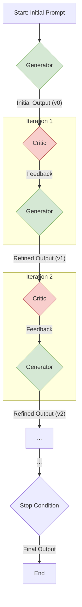

## §0. TL;DR（速覽）

- **一句話總結**：本堂課探討如何讓大型語言模型（LLM）跳脫「一次性生成」，透過迭代式的自我批判與修正，產出更高品質、更可靠的結果。
- **Key Takeaways**:
    1.  **Decoding 不是終點**：傳統上，我們專注於如何從模型中「解碼」出最好的單一答案。但真正的突破在於建立能「修正」答案的系統。
    2.  **自我修正的三層次**：我們可以從三個層次來實現 AI 的自我修正：(1) 在解碼（decoding）過程中直接優化、(2) 透過精心設計的工作流程（workflow）引導修正、(3) 賦予模型推理（reasoning）與反思（reflection）的能力。
    3.  **Workflow 的威力**：將複雜任務拆解成「生成」與「批判」兩個角色，讓 LLM 自己當自己的教練，是目前最實用且效果顯著的策略。
    4.  **從 Self-Refine 到 Reflexion**：業界與學界已提出多種自我修正框架。`Self-Refine` 專注於迭代式的精煉；`Reflexion` 則更進一步，讓 Agent 從過去的失敗經驗中學習，建立長期記憶。
    5.  **成本與效益的權衡**：自我修正並非沒有代價，它會顯著增加 API 的呼叫次數與運算時間。因此，必須在「品質提升」與「成本增加」之間找到最佳平衡點。

## §1. Motivation（為什麼要這堂課）

在前面的課程中，我們已經學會如何透過 `prompt engineering（提示工程）` 來引導大型語言模型（LLM）產出我們想要的結果。你可能會覺得，只要 `prompt` 下得夠好，LLM 就能像個無所不知的專家，一次就給出完美答案。然而，在真實世界的應用中，你會很快發現這是一個過於樂觀的假設。

不論模型多麼強大，它的一次性輸出（one-shot generation）經常充滿瑕疵。可能是事實性錯誤（hallucination）、邏輯不通、程式碼有 bug，或是不完全符合你複雜指令的所有要求。面對不完美的答案，最直覺的反應是什麼？我們可能會手動修改 `prompt`，加上更多限制，然後再試一次，這個過程就像在跟機器「喬」需求，非常耗時且結果不穩定。更糟的是，有時候我們自己也無法一眼看出答案錯在哪裡，特別是在處理我們不熟悉的領域知識時。

這就引出本堂課的核心問題：**我們能否建立一個系統，讓 AI 不再只是一個被動的「答案生成器」，而是能主動「自我修正」的智慧夥伴？**

想像一位外科醫師在撰寫複雜的手術紀錄。他不會期望第一稿就完美無缺。他會先寫下草稿，然後自己回頭審閱：這裡的用詞是否精確？劑量有沒有寫錯？手術流程的描述是否清晰？他扮演了兩個角色：一個是「作者」，另一個是「審稿者」。這種「草稿-審閱-修正」的迭代循環，正是人類高品質工作的基礎。

本堂課的目標，就是將這個強大的思維模式，系統性地導入 AI 的運作流程中。我們不再滿足於從 LLM 中「榨出」一個最好的答案，而是要設計一個框架（framework），讓 LLM 能夠：
1.  **生成初步答案（Generate）**
2.  **批判這個答案的好壞（Critique）**
3.  **根據批判提出具體修正方向（Provide Feedback）**
4.  **整合回饋以產生更好的新版本（Refine）**

這個自我修正的循環，不僅能大幅提升輸出的品質與可靠性，更是邁向更自主化、更強大 AI Agent 的關鍵一步。我們將從最底層的 `decoding` 策略開始，一路探索到複雜的 `workflow` 設計，以及模擬人類心智的 `reasoning` 與 `reflection` 機制。學完這堂課，你將有能力設計出不只會「說話」，更會「思考」和「改進」的 AI 系統。

## §2. 背景知識補完（Prerequisites）

在我們深入探討自我修正的機制之前，讓我們先確保你對以下幾個 LLM 的基礎運作原理有扎實的理解。這些概念是建構本堂課所有進階技術的基石。

1.  **Decoding Strategy（解碼策略）**
    - **嚴謹定義**: 在 LLM 生成文本的過程中，`decoding` 是指在每一步從模型預測的詞彙機率分佈中，選擇下一個 `token`（詞或字元）的演算法。
    - **白話版**: LLM 在產生答案時，並不是一口氣「想」好整句話再說出來。它其實是一個字一個字（或一個詞一個詞）往後接的。在每個時間點，模型都會計算出字典中所有字詞作為下一個字的可能性（機率）。`Decoding` 策略就是決定「如何從這些可能性中做選擇」的規則。
    - **為何本堂會用到**: 最常見的策略有 `Greedy Search`（每次都選機率最高的，最沒創意）、`Beam Search`（保留幾條最有可能的路徑一起考慮），以及 `Sampling`（帶有隨機性的抽樣，用 `temperature` 參數控制創意程度）。理解這些策略很重要，因為某些自我修正技術正是在 `decoding` 層次動手腳，例如在生成多個候選答案（candidates）時，就需要用到 `Sampling` 或 `Beam Search` 來增加多樣性，才有「選擇」與「評判」的空間。

2.  **Chain-of-Thought (CoT) Prompting（思維鏈提示）**
    - **嚴謹定義**: `CoT` 是一種 `prompt engineering` 技術，它引導 LLM 在給出最終答案之前，先一步步地展示其推理過程。
    - **白話版**: 你不直接問 LLM「答案是什麼？」，而是要求它「請一步一步想，然後告訴我答案」。例如，面對一個數學應用題，你會要求它先列出已知條件，再寫下計算步驟，最後才給出結果。這就像在考試時要求學生寫下計算過程，而不只是最終答案。
    - **為何本堂會用到**: `CoT` 是自我修正的催化劑。當模型的「思考過程」被明確地寫出來後，它自己（或另一個 LLM）就更容易檢查出其中的邏輯謬誤。如果只給一個最終答案，很難知道它錯在哪裡。但如果推理過程可見，我們就可以針對性地給出回饋，例如「你在第二步的計算中用錯了公式」。許多自我修正的 `workflow` 都會強制模型先產出 `CoT`，再對這個 `CoT` 進行批判和修正。

3.  **API (Application Programming Interface / 應用程式介面)**
    - **嚴謹定義**: API 是一組定義好的規則、協定和工具，允許不同的軟體元件之間進行互動和通訊。
    - **白話版**: API 就像是餐廳的菜單。你（客戶端）不需要知道廚房（伺服器端）如何運作，你只需要按照菜單上的格式點菜（發出請求），服務生（API）就會把你的請求轉達給廚房，並把做好的菜（回應）送回給你。在 LLM 的世界裡，我們就是透過 OpenAI 或 Google 提供的 API 來使用這些模型。
    - **為何本堂會用到**: 自我修正的 `workflow` 往往不是一次 API 呼叫就能完成。它可能包含多次對 LLM API 的呼叫：第一次生成草稿、第二次進行批判、第三次進行修正...等等。這個過程可能還會穿插對其他 API 的呼叫，例如用 Google Search API 查證事實，或用 Code Interpreter API 執行程式碼。因此，理解 API 的請求/回應模式是設計這些複雜系統的基礎。

4.  **State Management（狀態管理）**
    - **嚴謹定義**: 在一個計算系統中，`state` 是指在特定時間點上，系統所儲存的所有資訊。`State management` 則是對這些資訊進行追蹤、儲存和更新的過程。
    - **白話版**: 想像你在看診，病人的病歷就是 `state`。它記錄了病人過去的病史、用藥紀錄、過敏反應等。每一次回診，醫師都會根據這個 `state`（病歷）來決定新的治療方案，並更新病歷。如果沒有病歷，醫師每次都得從頭問起，無法做出連貫的治療。
    - **為何本堂會用到**: 迭代式的自我修正過程，本質上就是一個有狀態（stateful）的過程。系統必須「記得」前一輪的輸出是什麼、得到了什麼樣的回饋，才能在下一輪做出改進。如果每一輪修正都是無狀態（stateless）的，就很容易陷入無限迴圈（例如反覆犯同樣的錯）或無法取得進展。因此，如何設計一個好的資料結構來管理修正過程中的 `state` 至關重要。

## §3. 核心概念辭典（Core Concepts Glossary）

本堂課將圍繞著「自我修正」這一核心思想，展開一系列新技術與框架。以下是我們將會深入探討的關鍵術語。

1.  **Self-Correction（自我修正）**
    - **嚴謹定義**: 一個系統在沒有外部（人類）即時干預的情況下，自主識別並修正其自身輸出或行為中錯誤的能力。
    - **白話重述**: 就是 AI 自己「發現錯誤，然後改正」的能力。這是一個廣義的概念，涵蓋了從簡單的規則檢查到複雜的推理反思等所有能提升輸出品質的自動化內部流程。
    - **常見誤解**: 很多人以為 `self-correction` 是模型在「訓練」時學會的能力。雖然模型的內在知識有影響，但本堂課討論的 `self-correction` 更多是在「推論（inference）」階段，透過外部的 `workflow` 或 `prompting` 技巧來實現的系統級能力，而非模型本身的原生功能。

2.  **Generator（生成器）**
    - **嚴謹定義**: 在一個生成-批判（Generator-Critic）模型中，`Generator` 是負責根據給定輸入產生初始輸出的元件。
    - **白話重述**: 就是負責「產出草稿」的角色。在我們的自我修正迴圈中，`Generator` 就是第一次（或每一輪）被呼叫來寫答案的那個 LLM。它的目標是盡力完成任務，但不保證完美。
    - **相近概念區辨**: `Generator` 和 `Critic` 經常是由同一個 LLM 扮演，只是透過不同的 `prompt` 來賦予它們不同的「人設」。`Generator` 的 `prompt` 可能是「請寫一個 Python 函數來計算斐波那契數列」，而 `Critic` 的 `prompt` 則是「請檢查以下 Python 函數是否有錯誤」。

3.  **Critic（評論家 / 批判家）**
    - **嚴謹定義**: `Critic` 是負責評估 `Generator` 輸出的品質、識別其中缺陷，並提供回饋以指導後續修正的元件。
    - **白話重述**: 就是負責「找碴」和「給建議」的角色。它的任務不是自己重寫一遍，而是清楚地指出草稿的「問題在哪裡」以及「可以如何改進」。好的 `Critic` 必須具體，不能只給「寫得不好」這種模糊的評價。
    - **常見誤解**: `Critic` 不一定需要比 `Generator` 更強大或更聰明的模型。實驗證明，即使是同一個模型，只要給予明確的批判 `prompt`，它就能有效地檢查出自己剛剛犯下的錯誤。這就像我們寫完 email 後，再讀一遍往往能發現錯字一樣。

4.  **Self-Refine（自我精煉）**
    - **嚴謹定義**: 一個由 Madaan 等人（2023）提出的迭代式自我修正框架，它透過「生成-回饋-精煉」（Generate-Feedback-Refine）的循環，讓 LLM 在沒有監督式訓練資料或強化學習的情況下，持續改進其初始輸出。
    - **白話重述**: 這是一套具體的SOP，讓 LLM 自己跟自己開 `code review` 會議。首先，`Generator` 寫出第一版程式碼。然後，`Critic`（同一個 LLM，但換了個 `prompt`）審查程式碼並給出修改建議。最後，`Generator` 根據這些建議，寫出第二版。這個過程可以重複好幾次，直到 `Critic` 沒意見或者達到預設的修改次數上限為止。
    - **與 Self-Correction 的關係**: `Self-Refine` 是 `Self-Correction` 的一種具體實現方法。`Self-Correction` 是目標，`Self-Refine` 是達成目標的策略之一。

5.  **Reflexion（反思）**
    - **嚴謹定義**: 一個由 Shinn 等人（2023）提出的框架，旨在增強 `Agent` 的推理能力。它不僅修正單次的輸出，還會將失敗的經驗（例如，為什麼某個 API 呼叫會失敗）抽象化為文字記憶，儲存在一個「記憶暫存區」（memory buffer）中，並在未來的任務中參考這些記憶，以避免重蹈覆轍。
    - **白話重述**: 如果說 `Self-Refine` 是「當場修改錯誤」，那 `Reflexion` 就是「寫錯題本」。它不只修正當下的問題，還會讓 `Agent` 停下來想一想：「我剛才為什麼會錯？」，然後把這個教訓記下來（例如，「當呼叫天氣 API 時，城市名必須是英文」）。下次再遇到類似情況，它會先翻一下錯題本，避免再犯同樣的錯誤。
    - **與 Self-Refine 的區別**: `Self-Refine` 的記憶是短期的，僅限於當前的修正任務。而 `Reflexion` 建立了長期記憶，讓 `Agent` 能夠跨任務學習，實現真正的成長。`Reflexion` 更強調從「行為的後果」中學習，而 `Self-Refine` 更專注於「輸出的品質」。

6.  **LLM-based Workflow（基於 LLM 的工作流程）**
    - **嚴謹定義**: 一個將複雜任務分解為多個子步驟，並利用 LLM 作為核心處理單元來執行一個或多個步驟的自動化流程。
    - **白話重述**: 這就像是為 AI 設計一條「生產線」。傳統上，我們把所有指令都塞進一個 `prompt`，期望 LLM 一次搞定。而 `workflow` 的思想則是把任務拆開，例如「第一站：上網查資料」、「第二站：總結資料」、「第三站：根據總結寫成報告」、「第四站：檢查報告是否有錯字」。每一站都可能由一個或多個 LLM API 呼叫來完成。
    - **為何重要**: 自我修正就是一種典型的 `LLM-based Workflow`。它把原本單一的「生成」任務，拆解成了「生成」->「批判」->「修正」的多站流程。這種模組化的設計讓系統更可控、更可預測，也更容易除錯。

## §4. System / Paper Deep Dive: Self-Refine

要真正理解自我修正的運作方式，最好的方法就是深入剖析一個具體的框架。本節我們將以 `Self-Refine`（Madaan et al., 2023）為例，詳細拆解其架構、演算法與運作流程。`Self-Refine` 之所以經典，是因為它清晰地展示了如何在不需額外訓練的情況下，僅僅透過巧妙的 `prompt` 設計和迭代，就能讓 LLM 的能力大幅提升。

### 4.1 Architecture

`Self-Refine` 的核心架構是一個優雅的迭代迴圈。你可以將其想像成一個不斷自我雕琢的工匠。



**元件說明**:
- **Initial Prompt**: 使用者輸入的原始任務指令，例如「寫一首關於夏夜的詩」。
- **Generator (LLM)**: 負責生成內容的 LLM 實例。它接收 `prompt` 和上一輪的 `feedback`（第一輪沒有 `feedback`），然後產出內容。
- **Critic (LLM)**: 負責評估內容的 LLM 實例。它接收 `Generator` 的輸出，並根據預設的標準生成具體的、可操作的 `feedback`。**重要的是，`Generator` 和 `Critic` 通常是同一個 LLM 模型，只是被賦予了不同的 `prompt` 和角色。**
- **Feedback**: `Critic` 產出的文字，明確指出當前輸出的優缺點及改進方向。
- **Stop Condition**: 迴圈終止的條件，通常是以下兩者之一：
    1.  達到預設的最大迭代次數（例如，最多修正 3 次）。
    2.  `Critic` 產生的 `feedback` 為「沒有問題」或類似的肯定性評價。

### 4.2 關鍵演算法

`Self-Refine` 的演算法可以用以下一段偽程式碼來表示。這段程式碼清晰地展現了其迭代的本質。

```python
def self_refine(initial_prompt: str, max_iterations: int = 3) -> str:
    # Initialize with the user's request
    current_prompt = initial_prompt
    current_output = ""

    for i in range(max_iterations):
        print(f"--- Iteration {i+1} ---")

        # 1. GENERATE: Generate an initial or refined output
        # The prompt for refinement includes previous output and feedback
        current_output = call_llm(prompt=current_prompt, role="generator")

        # 2. FEEDBACK: Ask the critic for feedback on the generated output
        feedback_prompt = f"""
        Here is the original task: {initial_prompt}
        Here is the current output:
        ---
        {current_output}
        ---
        Please act as a critic. Provide specific feedback to improve the output.
        If the output is good enough, just say "STOP".
        """
        feedback = call_llm(prompt=feedback_prompt, role="critic")

        print(f"Critic Feedback: {feedback}")

        # 3. CHECK STOP CONDITION: Stop if the critic is satisfied
        if "STOP" in feedback:
            print("Stopping: Critic is satisfied.")
            return current_output

        # 4. REFINE: Create a new prompt for the next iteration
        # This prompt asks the generator to incorporate the feedback
        current_prompt = f"""
        Original task: {initial_prompt}
        Previous output:
        ---
        {current_output}
        ---
        A critic provided the following feedback:
        ---
        {feedback}
        ---
        Please generate a new, improved output that incorporates this feedback.
        """

    # Return the last generated output if max_iterations is reached
    print("Stopping: Max iterations reached.")
    return current_output

def call_llm(prompt: str, role: str) -> str:
    # A placeholder for the actual API call to an LLM like GPT-4
    # In a real implementation, 'role' might influence the system prompt
    # or other parameters of the API call.
    # For example:
    # system_prompt = "You are a helpful assistant." if role == "generator" else "You are a strict but fair critic."
    # response = openai.ChatCompletion.create(model="gpt-4", ...)
    pass
```

**中文旁白解釋**:
- 整個流程被包裹在一個 `for` 迴圈中，代表著迭代的次數。
- **第 1 步 (GENERATE)**：`Generator` 根據 `current_prompt` 生成輸出。在第一次迴圈時，`current_prompt` 就是使用者的原始指令；在後續迴圈中，它會包含先前的產出和 `Critic` 的回饋。
- **第 2 步 (FEEDBACK)**：我們動態組合一個新的 `prompt` 給 `Critic`。這個 `prompt` 包含了原始任務、目前的成品，並明確指示它扮演批判者的角色，給出具體建議。如果它覺得成品可以了，就回傳 "STOP"。
- **第 3 步 (CHECK STOP CONDITION)**：檢查 `Critic` 的回饋中是否包含停止信號。這是優雅地終止迴圈的方式。
- **第 4 步 (REFINE)**：如果還沒停止，就組合出下一輪要給 `Generator` 的 `prompt`。這個 `prompt` 是整個流程的精華，它把「原始目標」、「不完美的草稿」和「具體的修改建議」三者結合在一起，為 `Generator` 下一次的創作提供了極其豐富的 `context`。

### 4.3 關鍵 Data Structure

在 `Self-Refine` 流程中，每一輪迭代的狀態（state）都可以用一個簡單的資料結構來管理。這有助於追蹤整個修正歷史。

| 欄位 (Field) | 型別 (Type) | 說明 (Description) | 範例 (Example) |
|---|---|---|---|
| `iteration` | `int` | 目前的迭代次數，從 0 開始。 | `1` |
| `prompt` | `str` | 當前這一輪輸入給 `Generator` 的完整 `prompt`。 | `"請根據以下回饋修正這段程式碼..."` |
| `output` | `str` | `Generator` 在本輪產生的輸出。 | `def fib(n): ...` |
| `feedback` | `str` | `Critic` 針對本輪 `output` 產生的回饋。 | `"邊界條件 n=0 處理錯誤，應回傳 0。"` |
| `stop_signal` | `bool` | `Critic` 是否在本輪發出了停止信號。 | `False` |

一個完整的修正任務可以由一個包含以上結構的列表（List of Dictionaries）來記錄，便於事後分析與除錯。

### 4.4 Walkthrough

#### 情境一：正常修正流程 (程式碼除錯)

- **Initial Prompt**: "請寫一個 Python 函數，計算第 n 個費波那契數。"
- **Iteration 1**:
    - **Generator Output**:
      ```python
      def fibonacci(n):
        if n == 1 or n == 2:
          return 1
        return fibonacci(n-1) + fibonacci(n-2)
      ```
    - **Critic Feedback**: "這個遞迴實作在 n=0 或 n 為負數時沒有處理，會導致無限遞迴。而且效率很低，對於較大的 n 會非常慢。建議加入 n=0 的處理，並考慮改用迭代或帶有記憶的遞迴。"
- **Iteration 2**:
    - **Generator Output** (根據 feedback 修正):
      ```python
      def fibonacci(n):
        if n <= 0:
          return 0
        if n == 1:
          return 1
        a, b = 0, 1
        for _ in range(n - 1):
          a, b = b, a + b
        return b
      ```
    - **Critic Feedback**: "這個迭代版本正確處理了 n=0 的情況，並且效率很高。程式碼清晰易讀。STOP"
- **Final Output**: 流程終止，回傳第二輪的迭代版本程式碼。

#### 情境二：異常流程 (Critic 無法提供有效回饋)

- **Initial Prompt**: "請為一家名為『星塵咖啡』的虛構咖啡廳寫一段品牌故事，強調其對偏遠產區咖啡豆的公平貿易支持。"
- **Iteration 1**:
    - **Generator Output**: "星塵咖啡，誕生於對宇宙的遐想。我們的每一顆咖啡豆，都像一顆遙遠的星星，等待被發現。我們深入世界各個角落，尋找最獨特的風味..." (內容空泛，未提公平貿易)
    - **Critic Feedback**: "故事太空洞，沒有提到『公平貿易』這個關鍵詞。請加入具體細節，說明如何支持偏遠產區的農民。"
- **Iteration 2**:
    - **Generator Output**: "星塵咖啡，我們相信每一杯咖啡都應帶來公平。我們直接與偏遠產區的咖啡農合作，透過公平貿易，確保他們獲得應有的報酬。我們的咖啡豆來自..." (加入了關鍵詞，但仍缺乏故事性)
    - **Critic Feedback**: "內容有所改善，但讀起來更像公司報告，而不是品牌『故事』。可以試著描寫一位具體的農民，或是一段尋找咖啡豆的旅程嗎？"
- **Iteration 3**:
    - **Generator Output**: "在安地斯山脈深處，我們遇見了農夫胡安。他的家族世代種植著一種罕見的藝妓咖啡豆。透過公平貿易，我們幫助他改善了家庭生活...星塵咖啡..." (試圖加入故事，但可能與前文不連貫或又遺漏了其他要素)
    - **Critic Feedback**: (可能再次發現新的問題，或給出與上一輪類似的模糊回饋，例如 "還是不夠感人")
- **Final Output**: 在達到 `max_iterations` 後，流程被迫終止。最終的輸出雖然比第一版好，但可能仍未達到完美狀態。這凸顯了 `Self-Refine` 的一個限制：如果 `Critic` 無法提供越來越精準的 `feedback`，或者 `Generator` 無法理解並整合複雜的回饋，修正過程可能會停滯不前。

## §5. 真實類比 (Real-World Analogies)

這一節是本講義為醫學背景讀者客製化的核心價值。我們將影片中介紹的 AI Agent 核心概念，用三個臨床工作中最熟悉的場景來類比，幫助你建立牢固的直覺。

### 類比一：Agent 的 Self-Correction 如同醫院的「晨會報告」與「M&M Conference」

在臨床工作中，我們不只追求完成任務，更追求「做對」與「持續改進」。從住院醫師 (Resident) 的晨會 (morning meeting) 病人報告，到全科參與的併發症與死亡率討論會 (Morbidity & Mortality conference)，都內建了「自我修正」的機制。這與 AI Agent 的 self-correction 流程有驚人的相似之處。

**類比情境描述 (150+ 字):**
想像一位第一年住院醫師 (R1) 昨晚值班，收治了一位急性腹痛的病人。他在晨會上向總醫師 (Chief Resident) 和主治醫師 (Attending) 報告。他初步的診斷是急性腸胃炎，處置是給予靜脈輸液和症狀治療。然而，Attending 聽完報告後，根據幾個 R1 沒注意到的細節（例如輕微的反彈痛、白血球分類不尋常的左移），提出質疑：「你有沒有考慮過早期闌尾炎或憩室炎的可能性？」這個提問，就啟動了一個「修正循環」。R1 必須重新審視病歷、安排影像檢查（如腹部超音波或 CT），並根據新證據修正他的診斷與治療計畫。如果這個案例最初的處置有誤，導致了非預期的併發症，它還可能被拿到 M&M conference 上進行更深度的根本原因分析 (root cause analysis)，目的是為了改進未來處理類似病人的標準作業流程 (SOP)。

**對應關係表：**

| AI Agent 概念 | 臨床類比場景 |
| :--- | :--- |
| Initial LLM Output | R1 的初步診斷與治療計畫（急性腸胃炎） |
| Self-Critique / Reflection Prompt | Attending 的提問或 M&M conference 的議程 |
| External Feedback / Ground Truth | 病人後續的臨床變化、影像學報告、實驗室數據 |
| Refined Output | 修正後的診斷（早期闌尾炎）與新治療計畫（會診外科）|
| Iterative Refinement | R1 根據新證據反覆修正思考路徑的過程 |
| Updated Protocol | M&M 結論：未來腹痛病人需常規檢查某項指標 |

**✅ 吻合之處 (為何類比有效):**

- **迭代本質**：兩者都不是一次性的。臨床決策和 AI Agent 的答案都是透過一輪或多輪的回饋與修正，逐步逼近最佳解。
- **基於證據的修正**：Attending 的提問（相當於 critique prompt）迫使 R1 回頭尋找更多「客觀證據」（病人生命徵象、lab data），而不是憑感覺猜測。同樣地，好的 self-correction 機制也需要 agent 回頭檢視其輸出的事實基礎或邏輯鏈。
- **從錯誤中學習**：M&M conference 的核心精神不是究責，而是系統性的改進。一個設計良好的 self-correction 循環，其目標也是提昇模型未來生成類似內容的品質，而不僅僅是修補單一錯誤。
- **結構化反思**：成功的 M&M conference 有固定流程，引導大家思考「哪裡可以做得更好」。同樣，有效的 reflection prompt 也是結構化的，例如要求 LLM 檢查其回答是否滿足特定條件、是否有邏輯矛盾等。

**⚠️ 不吻合之處 (類比的邊界):**

- **回饋來源的差異**：臨床上的回饋來自真實世界（病人的反應）和經驗豐富的人類專家（Attending），其品質和可靠性極高。AI Agent 的「自我」修正，若沒有外部工具（如執行程式碼、搜尋網路）的輔佐，可能只是在自己的幻覺中打轉，產生「我認為我改好了」但其實錯得更離譜的狀況。
- **責任與後果**：臨床決策的錯誤會直接影響病人的健康甚至生命，其背後的責任是巨大的。AI Agent 的錯誤目前大多只造成任務失敗或資源浪費，兩者的嚴重性完全不在一個量級。
- **思考的本質**：Attending 的批判性思維來自數十年的臨床經驗、醫學知識和對人性的理解。LLM 的「反思」是基於其訓練資料中的模式，是一種統計上的最佳化，不涉及真正的理解或意識。

### 類比二：Agent 的 Tool Use 如同臨床醫師的「會診 (Consultation)」

沒有任何一位醫師能解決所有病人的問題。臨床工作的精髓在於「知道自己的極限，並知道何時該找誰幫忙」。這種跨專科的協作模式，完美地詮釋了 AI Agent 為何需要、以及如何使用「工具」。

**類比情境描述 (150+ 字):**
一位急診醫師正在處理一位因嚴重交通意外導致多重創傷 (multiple trauma) 的病人。病人生命徵象不穩，同時有氣胸、腹部內出血、和開放性骨折。急診醫師的首要任務是穩定病人 (stabilize)，但他不可能獨自完成所有專科治療。他必須立刻啟動創傷小組 (trauma team)，開立一系列會診單 (consultation sheet)：緊急會診胸腔外科處理氣胸、一般外科評估內出血是否需要手術、骨科處理骨折。他自己則專注於維持病人的呼吸、心跳、血壓。在這個過程中，這位急診醫師就像一個「總指揮官」，他判斷需要哪些「專家工具」，用標準化的格式（會診單）向他們發出請求，然後整合所有專家的回饋，形成最終的治療策略。

**對應關係表：**

| AI Agent 概念 | 臨床類比場景 |
| :--- | :--- |
| Orchestrator LLM (主控大腦) | 急診主治醫師 / 創傷小組隊長 |
| Task / User Prompt | 病人以多重創傷的狀態被送到急診 |
| Tool (e.g., Calculator, Search API) | 各個專科醫師（胸腔外科、一般外科、骨科） |
| Tool Inventory / API Spec | 醫院的會診系統介面，列出所有可會診的科別 |
| Tool Invocation (API Call) | 開立會診單，並寫明病人狀況與要問的問題 |
| Tool's Input Parameters | 會診單上的「病情摘要」與「會診目的」 |
| Tool's Output (API Response) | 專科醫師在 EMR 中回覆的會診建議 |
| Integrating Tool Output | 急診醫師綜合各科建議，安排手術優先順序 |

**✅ 吻合之處 (為何類比有效):**

- **任務分解與授權**：核心概念都是將一個複雜的大問題（治療多重創傷病人）分解成數個可以由專家獨立處理的子問題（處理氣胸、處理骨折）。主控者（急診醫師 / Orchestrator LLM）負責分解與整合，不親自執行每個細節。
- **標準化介面**：會診單有固定格式，規定了必須填寫的欄位，確保專科醫師能收到足夠的資訊來做判斷。這就如同 API 的規格 (specification)，定義了函式名稱、參數和回傳格式。
- **知道「問誰」和「問什麼」**：一位好的急診醫師，其價值不僅在於手動技能，更在於能準確判斷「這個問題該問哪一科」以及「如何精準地提問」。這正是現代 AI Agent 需要具備的「工具選擇」與「參數填充」能力。
- **同步與非同步**：有些會診需要立即回覆（STAT consult），如同同步的 API 呼叫。有些則可以稍後處理，如同非同步呼叫。

**⚠️ 不吻合之處 (類比的邊界):**

- **工具的可靠性**：API 工具通常是確定性的 (deterministic)，給定相同輸入，就會有相同輸出。但人類專家（專科醫師）的回覆充滿變數，可能因個人經驗、疲勞程度、甚至與你的私人關係而有所不同。他們也可能提供模稜兩可或需要進一步溝通的建議。
- **溝通的豐富度**：AI Agent 與工具的互動是基於僵化的 JSON 或 XML 格式。而醫師之間的會診，除了正式的書面記錄，還包含大量的口頭溝通、非語言線索和信任關係，這些是目前 AI 難以複製的。
- **成本模型**：API 呼叫的成本是可預測的（token 數、運算時間）。而臨床會診的「成本」則複雜得多，包含醫師的時間、醫院的資源分配、以及潛在的溝通成本。

### 類比三：Chain-of-Thought (CoT) 如同撰寫「病程紀錄 (Progress Note)」的思考過程

當我們在病歷中寫下每日的 progress note 時，我們不是只寫下結論，而是會遵循一個結構化的思維過程，最經典的就是 SOAP (Subjective, Objective, Assessment, Plan) 格式。這個過程，與 AI Agent 使用 Chain-of-Thought (CoT) 來「想清楚再回答」的原理如出一轍。

**類比情境描述 (150+ 字):**
一位內科住院醫師正在為一位住院第五天的肺炎病人寫 progress note。如果他只寫「Plan: Continue antibiotics」，這對接班的同事或查房的老師來說資訊量太低。一個好的 progress note 會是這樣：(S) 病人主訴咳嗽改善，但仍有些微胸悶。(O) 體溫 37.8°C，血氧 96%，聽診左下肺仍有囉音 (rales)，今日 CRP 從 10 降至 5。(A) 這是社區型肺炎，治療第五天，臨床症狀與發炎指數均有改善，但未完全緩解，目前抗生素應仍有效。(P) 1. 繼續使用目前抗生素。2. 明日追蹤胸部 X 光與 CRP。3. 鼓勵多做深呼吸咳痰。這個 SOAP 格式，迫使醫師將主觀資訊、客觀數據、綜合評估和未來計畫一步步拆解，讓整個臨床決策過程透明化。

**對應關係表：**

| AI Agent 概念 | 臨床類比場景 |
| :--- | :--- |
| User Prompt | 查房時 Attending 問：「這位肺炎病人今天狀況如何？」 |
| Naïve (Direct) Answer | 住院醫師只回答：「繼續用抗生素。」 |
| Chain-of-Thought Prompting | 在腦中或筆記上使用 SOAP 格式來組織思緒 |
| Intermediate Reasoning Steps | S, O, A 各部分的詳細內容 |
| Final Answer | P (Plan) 部分的結論與行動方案 |
| Improved Accuracy & Transparency | 一份清晰、邏輯完整的病程紀錄，讓所有人都能理解決策脈絡 |

**✅ 吻合之處 (為何類比有效):**

- **過程重於結果**：CoT 的核心是「生成思考步驟」，而不只是最終答案。SOAP note 的價值也在於完整呈現從數據到結論的思維鏈，而不僅僅是那個 Plan。
- **提高可除錯性 (Debuggability)**：如果 Plan 有問題，我們可以回溯去看是 Assessment 錯了、Objective 數據判讀有誤、還是 Subjective 主訴被忽略了。這和檢查 CoT 的中間步驟來找出 AI 的邏輯錯誤是一樣的道理。
- **引導複雜推理**：對於複雜的多重問題病人，直接跳到 Plan 是不可能的。SOAP 格式提供了一個鷹架 (scaffold)，引導醫師一步步處理複雜的資訊。同樣地，`"Let's think step by step"` 這個神奇的咒語，也是給 LLM 一個處理複雜問題的鷹架。
- **溝通與協作**：一份好的 progress note 是團隊溝通的基礎。CoT 讓 AI 的「思考」過程變得可讀，也方便人類監督和修正。

**⚠️ 不吻合之處 (類比的邊界):**

- **思考的內在 vs. 外在**：醫師的 SOAP Note 是將其內心已有的思考過程「書面化」的結果。而對於 LLM，CoT 的中間步驟是模型「為了」產生最終答案而即時生成的，它本身就是生成過程的一部分，而不是對一個獨立思考過程的紀錄。可以說，LLM 是「透過書寫來思考」。
- **框架的來源**：SOAP 是一個外部定義、經過百年驗證的醫學溝通框架，所有醫師都必須學習和遵守。而 CoT 的「步驟」是 LLM 自己根據 prompt 的引導從資料中學習到的模式，其結構和品質可能非常不穩定。
- **事實的基礎**：SOAP 中的 O (Objective) 必須基於真實的檢查數據。而 CoT 中的中間步驟可能包含 LLM 自己幻覺出的「事實」，如果不透過外部工具驗證，整個推理鏈可能建立在沙上。

---

## §6. 課堂 Q&A 精華

李宏毅教授的影片內容多為連貫的闡述，但其中針對許多關鍵觀念，教授特別停下來澄清了一些常見的誤解或迷思。我們將這些精華整理成問答形式，模擬讀者在學習時可能會產生的疑問。

**Q1：所謂的「自我修正 (Self-Correction)」聽起來很神奇，它是否意味著 AI 真的能像人類一樣「反省」自己的錯誤？**
**A：** 這是一個非常好的問題，也是最容易產生誤解的地方。教授強調，目前的 Self-Correction 機制，更準確地說是「迭代式精煉 (Iterative Refinement)」。它並非人類意義上的「反省」或「頓悟」。它的運作方式是：
1.  **第一次生成**：模型先產生一個初步答案。
2.  **觸發修正**：透過一個特殊的 prompt（例如：「請你扮演一位嚴格的評論家，檢查以上答案是否有事實錯誤、邏輯矛盾或不夠完整的地方」），讓模型對自己的輸出進行「批判」。
3.  **第二次生成**：將「原始問題 + 初步答案 + 批判」全部作為新的 context，讓模型再生成一次答案。
所以，AI 並沒有真的「意識」到自己錯了。它只是在一個更豐富的 context 下，去生成一個統計上更可能正確的答案。這個過程更像是一個左右手互搏的遊戲，而不是真正內省。

**Q2：如果讓模型一直自我修正，它會不會陷入一個無限迴圈，不斷地修改但永遠達不到完美？**
**A：** 這個情況完全可能發生，也是實作上的一大挑戰。教授提到，模型可能會進入幾種不良狀態：
1.  **修正震盪 (Correction Oscillation)**：模型在兩個或多個不完美的答案之間來回修改。例如，第一次說答案 A 好，第二次批判說 A 不好、B 才好，第三次又批判說 B 不好、A 才對。
2.  **品質衰退 (Quality Degradation)**：在某些情況下，修正後的版本甚至可能比原始版本更差，特別是當「批判」本身就是幻覺或錯誤的時候。
在實務上，工程師需要設定一個「停止條件」，例如：限制修正的次數（最多修正 3 次）、或者當修正前後的答案相似度高於一個閾值時就停止。這就像在臨床上，我們不會無止盡地做檢查，到某個點就必須做出決策。

**Q3：影片中提到了 Chain-of-Thought (CoT)、Tree of Thoughts (ToT) 等不同的 reasoning 方法，是否越複雜的方法，效果就一定越好？**
**A：** 答案是否定的。教授提醒，這是一個典型的「成本效益」權衡。
-   **Chain-of-Thought (CoT)**：最簡單、成本最低。它只生成一條線性的思考路徑。對於多數問題，這已經能帶來巨大提昇。
-   **Self-Consistency with CoT**：多次生成 CoT 路徑，然後投票選出多數答案。成本是 CoT 的 N 倍，但能有效過濾掉隨機的計算錯誤。
-   **Tree of Thoughts (ToT)**：允許模型在每個思考節點上探索多個分支，並對分支進行評估，形成一個樹狀的搜索。這在需要廣泛探索和前瞻規劃的任務（如下棋、寫作）上潛力巨大，但其 token 消耗和延遲也是指數級增長的。
選擇哪種方法，取決於你的應用場景、預算和對延遲的容忍度。就像治療感冒，你通常不會直接上葉克膜 (ECMO)；殺雞焉用牛刀，選擇「恰當」的複雜度才是關鍵。

**Q4：「Workflow」和我們之前聽到的「Prompt Chaining」有什麼不同？聽起來很像。**
**A：** 這是個很精準的問題。它們概念上相似，但「Workflow」通常涵蓋更廣的範圍。
-   **Prompt Chaining**：通常指將一個任務拆成一系列固定的、線性的 prompt，前一個的輸出作為後一個的輸入。例如：`Summarize -> Translate -> Reformat`。
-   **Workflow (或稱 Agentic Workflow)**：則更加動態和複雜。它可以包含條件分支（如果 A，則執行 B；否則執行 C）、迴圈（重複執行 D 直到滿足條件 E）、並行處理（同時執行 F 和 G），以及前面提到的工具使用和自我修正。
可以說，Prompt Chaining 是 Workflow 的一種最簡單的特例。一個真正的 Workflow 是一個由 LLM 驅動的、可以根據中間結果動態調整執行路徑的「程式」。

**Q5：影片中提到的 Agent (代理人)，聽起來就是一個會用工具的 LLM，這個理解正確嗎？**
**A：** 這個理解抓到了一半的重點，但不完全。一個 Agent 的核心組成確實是 LLM，但它不僅僅是「LLM + Tools」。一個完整的 Agent 系統通常包含四個核心元件：
1.  **大腦 (Brain)**：一個 LLM，負責做決策、推理和規劃。
2.  **工具箱 (Toolbox)**：一組可供呼叫的 API 或函式。
3.  **記憶 (Memory)**：用於儲存短期對話歷史 (short-term memory) 和長期知識 (long-term memory) 的機制。
4.  **規劃與執行循環 (Planning & Execution Cycle)**：這就是 Agent 的靈魂，也就是 REasoning-ACTing (ReAct) 的循環。Agent 觀察環境、思考下一步該做什麼（使用哪個工具、或直接回答）、採取行動、然後觀察行動的結果，再進入下一個循環。
所以，Agent = LLM + Tools + Memory + Planning。它是一個有目標導向、能自主循環決策的系統。

**Q6：讓模型自己批判自己，會不會強化它固有的偏見？例如，一個有性別偏見的模型，它的「批判」本身可能也帶有偏見。**
**A：** 這是一個非常深刻且重要的問題，答案是「會的」。這也是 Self-Correction 的根本限制之一。如果模型的訓練資料中存在系統性偏見，那麼無論是它的初始答案還是後續的「批判」，都很可能反映同樣的偏見。在最壞的情況下，它甚至可能「合理化」自己的偏見，生成看似有邏輯、但實際上充滿偏見的修正內容。這就是為什麼「外部回饋」和「人類監督」在 Agentic system 中至關重要。完全依賴「自我」修正是危險的，必須要有來自真實世界或人類價值的「錨點」來校準它，避免它在偏見的迴圈中越陷越深。

---

**最常見誤解 Top 3**

1.  **誤解 Self-Correction 是萬靈丹**：認為只要加上修正步驟，AI 就能解決所有問題。實際上，它的效果高度依賴 prompt 的設計，且可能引入新的錯誤。
2.  **混淆 Reasoning 與 Workflow**：認為 CoT/ToT 等 reasoning 技巧和 workflow 是同一件事。實際上，reasoning 是單一步驟內的「思考過程」，而 workflow 是組織多個步驟（可能包含不同的 reasoning 技巧和工具使用）的「執行流程」。
3.  **低估 Agent 系統的複雜性**：認為只要給 LLM 一個 API 文件，它就能自動變成一個能幹的 Agent。實際上，工具選擇、錯誤處理、記憶管理和動態規劃都是非常困難的工程挑戰。

---

## §7. 常見陷阱與考點 (What Engineers Actually Get Wrong)

在將影片中的概念付諸實踐時，有很多細節是課堂上強調、但在論文中可能一筆帶過，卻是工程師在實作中會反覆踩到的坑。

**陷阱 1：設計無效的「反思提示 (Reflection Prompt)」**
-   **為何會掉進去**：工程師常常使用過於模糊或通用的反思提示，例如「請檢查你的答案並修正錯誤」。這種提示對 LLM 來說，幾乎沒有提供任何可操作的指導。
-   **正確做法**：設計具體、結構化的反思提示。最好能將反思任務分解。例如，分開提問：「1. `事實檢查`：請確認答案中所有的數字、日期、人名是否準確。2. `邏輯檢查`：請檢查推理步驟之間是否有矛盾。3. `完整性檢查`：這個答案是否回答了原始問題的所有部分？」
-   **實例**：對於一個總結任務，壞的提示是「你的總結好嗎？」，好的提示是「這份總結是否包含了原文的核心論點、主要證據和最終結論？請逐一核對。」

**陷阱 2：陷入「幻覺式修正 (Hallucinated Correction)」的泥沼**
-   **為何會掉進去**：過度相信 LLM 的自我修正能力，而沒有提供外部資訊源進行事實核對。LLM 的「批判」和它的「答案」一樣，都可能來自幻覺。
-   **正確做法**：在修正循環中強制引入「接地 (Grounding)」步驟。在生成批判後，下一步不是直接生成新答案，而是讓 Agent 使用工具（如 Web Search API）來驗證批判中的斷言。
-   **實例**：Agent 初步回答「法國首都是柏林」，然後自我批判「不對，法國首都是羅馬」。這就是幻覺式修正。正確的 workflow 應該是，在批判後，Agent 呼叫 `search("capital of France")`，得到「巴黎」，然後再根據這個外部事實來生成最終答案。

**陷阱 3：對工具的輸出處理過於天真**
-   **為何會掉進去**：假設工具永遠會成功並回傳預期格式的資料。然而，API 可能會超時、回傳錯誤碼 (4xx/5xx)、或者回傳的 JSON 格式損壞。
-   **正確做法**：在 Agent 的程式碼中，對工具呼叫進行嚴格的 `try-catch` 處理。必須能夠解析各種 HTTP 狀態碼和 API 自定義的錯誤訊息，並將這些錯誤資訊反饋給 LLM 主腦，讓它決定下一步（例如：重試、換個工具、或向用戶報告失敗）。
-   **實例**：Agent 呼叫天氣 API，但網路不通導致 API 呼叫失敗。一個脆弱的 Agent 可能會崩潰或卡住。一個穩健的 Agent 應該能捕捉到這個異常，然後 LLM 主腦可能會決定：「天氣 API 壞了，我先回答問題的其他部分，並告知用戶天氣資訊暫時無法獲取。」

**陷阱 4：忽略 Agent Workflow 的成本與延遲**
-   **為何會掉進去**：在設計時只追求最酷炫的架構（例如，每個步驟都用 ToT、每個決策都自我反思三次），導致整個 workflow 跑一次需要幾分鐘，且 token 費用驚人。
-   **正確做法**：從最簡單的架構開始（例如，單一 CoT），然後根據評估結果，針對性地在最常出錯的環節增加複雜度（如加入 Self-Correction 或使用更強的工具）。永遠要監控 token 消耗和端到端延遲。
-   **實例**：開發一個回答問題的 Agent。先用一個 ReAct 迴圈實現。如果發現它在數學計算上頻頻出錯，再給它一個 `calculator` 工具，而不是一開始就給它全套的 Python 解譯器。

**陷阱 5：Agent 的「短期記憶」管理不善**
-   **為何會掉進去**：在多輪對話或多步驟任務中，簡單地將所有歷史紀錄塞進 context。這很快會導致 context window 爆炸，或者重要的早期資訊被淹沒在無關的細節中。
-   **正確做法**：設計一個明確的「記憶管理」模組。策略可以包括：
    1.  **滾動視窗 (Sliding Window)**：只保留最近的 K 輪對話。
    2.  **自動總結 (Summarization)**：定期讓一個輔助 LLM 將過去的對話總結成摘要。
    3.  **向量化檢索 (Vector-based Retrieval)**：將歷史紀錄儲存在向量資料庫中，在需要時檢索最相關的片段。
-   **實例**：一個規劃旅行的 Agent。在對話了 20 輪後，用戶問「記得我一開始說預算多少嗎？」。如果沒有記憶管理，這個資訊可能早已超出 context window。

**陷阱 6：忽略了「停止訊號」的重要性**
-   **為何會掉進去**：只專注於讓 Agent 不斷地思考和行動，但沒有明確定義「任務何時算完成」。這會導致 Agent 在已經找到答案後，仍然繼續執行不必要的步驟，浪費資源。
-   **正確做法**：在 Agent 的主循環中，每一步都要讓 LLM 判斷任務是否已經完成。這個判斷本身也可以是一個特殊的工具呼叫，例如 `finish(answer)`。當這個工具被呼叫時，整個 workflow 就終止，並將結果回傳給用戶。
-   **實例**：用戶要求「寫一首關於夏天的詩」。Agent 寫完詩後，又開始「思考」下一步，甚至去搜尋「夏天」的定義，這就是沒有正確停止。它應該在生成詩文後，就判斷任務完成並呼叫 `finish()`。

---

## §8. 自測題

這 10 道題目涵蓋了本堂課的核心概念，請試著回答，並對照詳解，檢驗自己是否已融會貫通。

**1. (概念題)** 在一個 AI Agent 系統中，「自我修正 (Self-Correction)」和「使用工具 (Tool Use)」最主要的協同作用是什麼？

<details><summary>展開答案</summary>

最主要的協同作用是**透過工具來「接地 (Grounding)」自我修正的過程**。

**解釋**：
-   單純的「自我修正」是 LLM 在沒有外部資訊的情況下，對自己的輸出進行反思和批判。這很容易陷入「幻覺式修正」，即用一個錯誤來糾正另一個錯誤。
-   當引入「工具使用」後，Agent 可以在「批判」階段後，使用工具（如網路搜尋、程式碼執行器、資料庫查詢）來驗證其批判的內容或初步答案的事實性。
-   **例如**：Agent 初步回答「愛因斯坦生於 1905 年」。在自我修正步驟，它可能會質疑「這個年份對嗎？」。此時，它不應直接猜測一個新年份，而是應該呼叫 `search("Albert Einstein birth year")` 這個工具。工具回傳「1879」這個客觀事實後，Agent 就能根據這個「接地」的資訊，產生一個真正正確的答案。這種結合，讓修正不再是閉門造車，而是基於外部證據的、可靠的精煉過程。

</details>

**2. (概念題)** 影片中提到的 Tree of Thoughts (ToT) 相較於 Chain-of-Thought (CoT)，其核心優勢和最大代價分別是什麼？

<details><summary>展開答案</summary>

-   **核心優勢**：**系統性的探索 (Systematic Exploration)**。ToT 不像 CoT 那樣只沿著一條思路走到底，而是在推理的每一步都考慮多種可能性（“thoughts”），並對這些可能性的優劣進行評估。這使得它在解決需要深思熟慮、規劃或創造力的複雜問題時，表現遠超 CoT。它能「看到」更多的可能性，並從中選擇最有希望的路徑，或者在發現一條路走不通時，能回溯到上一個節點，嘗試另一條路。

-   **最大代價**：**指數級增長的成本與延遲 (Exponential Cost & Latency)**。由於 ToT 在每個節點都會生成多個分支，並對每個分支進行評估，其計算量（token 消耗）和所需時間會隨著思考的深度呈指數級增長。如果樹的寬度（每個節點的分支數）為 `b`，深度為 `d`，其複雜度大致為 O(b^d)。這使得未經優化的 ToT 在實際應用中非常昂貴且緩慢。

</details>

**3. (概念題)** 為什麼在設計 Agent Workflow 時，一個明確的「停止訊號 (Stopping Signal)」至關重要？

<details><summary>展開答案</summary>

因為沒有明確的停止訊號，Agent 可能會陷入**無限循環**或執行**不必要的昂貴操作**，即使它已經完成了用戶的請求。

**解釋**：
-   Agent 的核心是一個循環（觀察 -> 思考 -> 行動）。這個循環需要一個出口條件。
-   **防止無限循環**：在某些情況下，Agent 可能會卡在一個狀態，例如，反覆呼叫同一個失敗的工具，或者在兩個不完美的答案之間來回修正。一個基於最大迭代次數或超時的停止訊號是最後的保險。
-   **避免資源浪費**：更常見的情況是，Agent 已經找到了正確答案，但由於沒有被告知「任務已完成」，它會繼續「思考」下一步該做什麼，從而觸發更多的 LLM 呼叫和工具使用，這直接轉化為金錢和時間的浪費。
-   一個好的 Agent 設計會讓 LLM 在每一步都評估當前狀態，判斷是否已經有足夠的資訊來回答最終問題。如果答案是肯定的，就應該觸發一個特殊的 `finish(final_answer)` 動作來終止 workflow。

</details>

**4. (情境題)** 你正在開發一個醫療問答 Agent，用於回答最新的臨床指引。用戶問：「對於第二型糖尿病，最新的 ADA 指引推薦的一線藥物是什麼？」Agent 卻回答了五年前的舊資訊。你該如何利用本堂課的知識來改進它？

<details><summary>展開答案</summary>

這個問題的核心是「資訊過時」，這是單靠 LLM 內部知識無法解決的。最佳的改進方案是**引入工具使用，特別是網路搜尋工具**。

**改進後的 Workflow 可以是：**
1.  **分解問題**：Agent 的 LLM 主腦首先識別出問題的關鍵字：「第二型糖尿病」、「最新 ADA 指引」、「一線藥物」。
2.  **工具選擇與呼叫**：Agent 判斷這個問題需要即時資訊，因此選擇 `web_search` 工具。它會生成一個搜尋查詢，例如 `"latest ADA guidelines type 2 diabetes first-line drug"`。
3.  **整合工具結果**：Agent 獲取搜尋結果的網頁摘要或內容。
4.  **生成答案**：LLM 將搜尋到的最新資訊（例如，Metformin 仍然是首選，但對於有特定共病症的患者，推薦 SGLT2i 或 GLP-1RA）整合起來，生成一個準確、有根據的最終答案。
5.  **(可選) 自我修正**：在引入工具前，也可以先嘗試自我修正，讓 prompt 引導 Agent 思考「我腦中的知識是否為最新？」，這可能會促使它主動建議去搜尋，但直接賦予它工具會更可靠。

</details>

**5. (情境題)** 你設計了一個兩步的 Agent Workflow：第一步是「作家 Agent」產生一篇文章，第二步是「評論家 Agent」對文章進行評分和提供修改建議。但你發現，「作家」經常忽略「評論家」的建議。這可能是什麼原因造成的？

<details><summary>展開答案</summary>

這個問題的核心在於**兩個 Agent 之間的狀態傳遞和指令整合**出了問題。最可能的原因是：

**在第二輪呼叫「作家 Agent」時，給它的 prompt 沒有有效地整合「評論家」的回饋。**

**解釋**：
-   一個常見的錯誤是，僅僅將評論家的建議附加到歷史紀錄中，而沒有在新的指令中明確要求作家根據這些建議進行修改。
-   **錯誤的 Prompt (第二輪)**：`原始問題: "寫一篇關於貓的文章"。歷史紀錄: [作家: "貓是可愛的..."] [評論家: "文章太短，多寫一些貓的習性。"]` -> 在這種情況下，作家可能會忽略歷史紀錄中的建議。
-   **正確的 Prompt (第二-輪)**：`原始問題: "寫一篇關於貓的文章"。這是你上次寫的版本: "貓是可愛的..."。這是一位評論家給你的修改建議: "文章太短，多寫一些貓的習性。"。**現在，請你根據評論家的建議，修改並擴充你的文章。**`
-   關鍵在於**將回饋轉化為明確、可執行的指令**，並將其作為新任務的核心部分，而不僅僅是背景資訊。

</details>

**6. (情境題)** 一個 Agent 在解決多步驟數學問題時，使用 CoT 推理。它的中間步驟計算完全正確，但最終給出的答案格式錯誤（例如，要求回答數字，它卻回答了「答案是 12」這個句子）。這反映了 Agent 系統的哪個部分最需要加強？

<details><summary>展開答案</summary>

這反映了**輸出解析與格式化 (Output Parsing and Formatting)** 的部分最需要加強。

**解釋**：
-   Agent 的 CoT 推理能力（即數學計算）是沒有問題的。問題出在最後一步，即如何將其內心「知道」的答案 `12`，按照用戶要求的格式呈現出來。
-   這通常是 prompt engineering 的問題。在 prompt 的最後，需要非常明確地指示輸出的格式。
-   **例如，可以這樣改進 Prompt**：`...完成計算後，你的最終答案必須只包含數字，不要包含任何額外的文字。例如，如果答案是 12，就只輸出 "12"。`
-   在更複雜的系統中，甚至可以讓 Agent 輸出一個 JSON 物件，例如 `{"reasoning": "...", "final_answer": 12}`，然後由外部的程式碼來解析這個 JSON，只提取 `final_answer` 欄位呈現給用戶。這使得輸出格式更可靠、更具機器可讀性。

</details>

**7. (除錯題)** 你的 Agent 在呼叫一個計算匯率的 API (`get_exchange_rate(from="USD", to="TWD")`) 時，程式碼卡住了，沒有任何回應。經過檢查，發現是該 API 伺服器已停機。為了讓 Agent 更穩健 (robust)，你應該在程式碼中加入什麼機制？

<details><summary>展開答案</summary>

你應該加入**帶有超時設定 (timeout) 的錯誤處理機制 (Error Handling)**。

**解釋**：
-   API 呼叫卡住，通常是因為程式碼在無限等待一個永遠不會到來的網路回應。
-   **具體作法**：
    1.  **設定 Timeout**：在你發起 API 請求的函式中，加入一個 `timeout` 參數（例如，`timeout=10` 表示最多等待 10 秒）。如果 10 秒內沒有收到回應，函式就會拋出一個 `TimeoutError`。
    2.  **Try-Catch 區塊**：將 API 呼叫的程式碼包裹在一個 `try...except` (或對應語言的) 區塊中。
    3.  **捕捉異常**：在 `except` 區塊中，捕捉 `TimeoutError` 以及其他可能的網路異常（如 `ConnectionError`）。
    4.  **向 LLM 回報**：一旦捕捉到異常，不要讓程式崩潰。而是應該將錯誤資訊格式化成一段清晰的文字（例如，“工具 'get_exchange_rate' 呼叫失敗，原因：超時。”），並將這段文字作為「觀察 (Observation)」回傳給 Agent 的 LLM 主腦，讓它來決定下一步該怎麼辦（例如，通知用戶、稍後重試或使用備用工具）。

</details>

**8. (除錯題)** 你實作了一個自我修正循環。Agent 的初始回答是錯的，然後它的自我批判也正確地指出了錯誤點（例如，「答案中的年份搞錯了」）。但在生成最終答案時，它又重複了一遍最初的錯誤答案。最可能的原因是什麼？

<details><summary>展開答案</summary>

最可能的原因是**傳遞給最終生成步驟的 Context (上下文) 不完整或結構不佳**。

**解釋**：
-   LLM 是無狀態的，它只能看到你當前 prompt 裡給它的所有東西。
-   這個問題的根源很可能是，在觸發「生成最終答案」這一步時，你給 LLM 的 prompt 中，**包含了「初始的錯誤答案」，但沒有足夠強調「自我批判的內容」**。
-   **例如，一個不好的最終 prompt 可能長這樣**：`原始問題: ... 初始答案: ... 批判: ... 現在請回答原始問題。` 在這種結構下，模型可能會因為「初始答案」的內容更具體、更顯眼，而再次被它「吸引」過去。
-   **一個更好的最終 prompt 結構應該是**：`你正在回答這個問題: [原始問題]。你之前的嘗試是 [初始答案]，但它被指出有以下問題: [批判]。現在，請你根據上述批判，生成一個修正後的、全新的答案。` 這裡，指令非常明確，要求模型「根據批判」來行動，而不是簡單地「再次回答」。

</details>

**9. (除錯題)** 你的 Agent 有一個 `run_python_code` 工具。你讓它計算 `1/0`。工具正確地執行了程式碼，並回傳了 Python 的 `ZeroDivisionError` 異常堆疊追蹤 (stack trace)。然而，Agent 的最終回答卻是「計算時發生了一個未知錯誤」。問題出在哪裡？

<details><summary>展開答案</summary>

問題出在**從工具的原始輸出到 LLM 可理解的「觀察 (Observation)」之間的轉譯**。

**解釋**：
-   工具 (`run_python_code`) 本身執行正確，它回傳了底層系統的真實錯誤訊息。
-   然而，一個又長又複雜的 `stack trace` 對於 LLM 來說，可能只是難以解析的噪音。如果你的 Agent 框架只是將這個 `stack trace` 原封不動地丟給 LLM，它可能無法準確理解錯誤的本質。
-   **正確的做法**是在 Agent 框架的程式碼中，對來自工具的錯誤輸出進行「預處理」。你的 `run_python_code` 工具的包裹器 (wrapper) 應該捕捉 Python 的異常，然後將其轉譯成一段簡潔、清晰的自然語言描述。
-   **例如，包裹器可以這樣處理**：
    ```python
    try:
        # execute code
    except ZeroDivisionError as e:
        return "Error: Code failed with ZeroDivisionError. Cannot divide by zero."
    except Exception as e:
        return f"Error: Code failed with an unhandled exception: {type(e).__name__}"
    ```
-   這樣，LLM 收到的 Observation 就不是一堆 `stack trace`，而是 `"Error: ... Cannot divide by zero."`，它就能理解到底發生了什麼，並給出更精確的回應（例如，「無法計算，因為除數為零」）。

</details>

**10. (除錯題)** 你實作了一個 ReAct (Reason-Act) 風格的 Agent，但發現它經常在第一步就直接嘗試回答問題（`Act: finish(answer)`），而不是先思考和使用工具。這使得它對需要外部知識的問題頻頻答錯。你應該如何修改你的 ReAct prompt 來解決這個問題？

<details><summary>展開答案</summary>

你應該在 ReAct prompt 中加入**「強制思考」或「Few-shot 範例」**來引導模型的行為模式。

**解釋**：
-   ReAct 的核心是 `Thought -> Action -> Observation` 的循環。如果模型跳過 `Thought` 和 `Action` 直接跳到 `finish()`，說明它認為自己「已經知道答案」，不需要工具。
-   **解決方案 1：在指令中強制思考**
    -   在你的主 prompt 中，加入類似這樣的指令：「... 你必須先在 `Thought` 中思考你的計畫，判斷是否需要工具。**除非你 100% 確定答案，否則不要直接回答。** 總是優先考慮使用工具來驗證資訊。」
-   **解決方案 2：提供 Few-shot 範例 (更有效)**
    -   在 prompt 中，給 Agent 一個或多個完整的、高質量的 ReAct 執行範例。這個範例應該展示一個它需要使用工具才能回答的問題。
    -   **範例**：
        `Question: What is the boiling point of water on Mount Everest?`
        `Thought: The user is asking for a physical property under specific conditions (altitude). This is not common knowledge and depends on pressure. I need to search for this. I will use the web_search tool.`
        `Action: web_search("boiling point of water on Mount Everest")`
        `(... 後續的 Observation 和最終答案 ...)`
    -   透過提供這樣的範例，你向 LLM 展示了「正確的工作流程」應該是什麼樣的。它會透過 In-context Learning 模仿這個模式，在面對新問題時，更有可能先去思考和使用工具，而不是魯莽地直接回答。

</details>

---

## §9. 延伸資源

-   **本堂對應 Paper (必讀)**
    -   **ReAct**: Yao, S., et al. (2022). *ReAct: Synergizing Reasoning and Acting in Language Models*. 這是結合 CoT (Reasoning) 和工具使用 (Acting) 的開創性工作，是現代 Agent 框架的基石。
    -   **Self-Refine**: Madaan, A., et al. (2023). *Self-Refine: Iterative Refinement with Self-Feedback*. 詳細闡述了如何透過「自我回饋」來迭代式地改善 LLM 輸出，是 Self-Correction 領域的核心論文之一。
    -   **Tree of Thoughts**: Yao, S., et al. (2023). *Tree of Thoughts: Deliberate Problem Solving with Large Language Models*. 介紹了 ToT 框架，展示了超越線性 CoT 的強大問題解決能力。

-   **官方 Lecture Notes 連結**
    -   李宏毅教授的官方課程網站通常會提供投影片，可以作為複習的視覺輔助：[ML Lecture 2023, Agent](https://speech.ee.ntu.edu.tw/~hylee/ml/2023-spring.php) (請尋找與 Agent 相關的講次)

-   **推薦延伸閱讀**
    -   **Blog: "LLM Powered Autonomous Agents" by Lilian Weng**: 這是一篇非常全面和深刻的部落格文章，系統性地梳理了 Agent 的架構（規劃、記憶、工具使用），並回顧了所有相關的重要研究。對於建立 Agent 領域的宏觀視野非常有幫助。
    -   **Paper: "Reflexion: Language Agents with Verbal Reinforcement Learning"**: Shinn, N., et al. (2023). 這篇論文提出了一種更進階的 self-correction 框架，它不只修正當前的輸出，還會將「反思」的經驗存入一個記憶區，用於在未來遇到類似任務時，避免犯同樣的錯誤，更接近人類的學習模式。

-   **下一堂預告**
    -   當單一 Agent 的能力達到極限時，我們該如何組織一個由多個專職 Agent 組成的「團隊」來解決更複雜的任務？下一堂課，我們將探索從單一 Agent 到 **Multi-Agent Systems (MAS)** 的演進，看看 AI 世界中的「團隊合作」與「社會行為」是如何湧現的。
